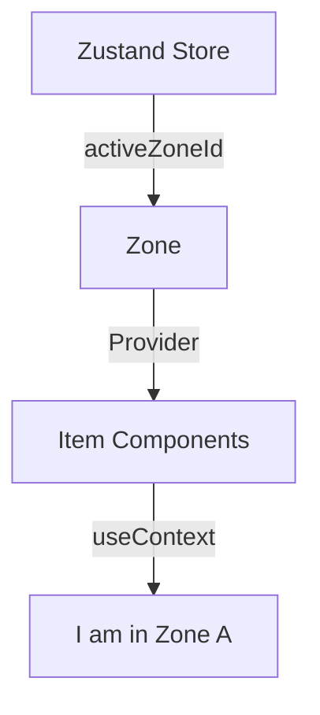

# Architecture Debate: Why Context for Zone?

> [!NOTE]
> The user asked: *"We standardized on Zustand, so why does Zone still use Context?"*

## The Short Answer
**Zustand is for State (Time). Context is for Hierarchy (Space).**

## Detailed Analysis

### 1. The Roles
-   **Zustand (`useFocusStore`)**: Manages **"Who is active right now?"**. This is global, mutable state.
-   **Context (`FocusContext`)**: Manages **"Where am I?"**. This is static, topological information.

### 2. Why `Zone` needs Context
Components like `Item` need to know *which Zone they belong to* to function correctly.

**Option A: Prop Drilling (Bad)**
```tsx
<Zone id="sidebar">
  <Item zoneId="sidebar" id="inbox" />
  <Item zoneId="sidebar" id="drafts" />
</Zone>
```
*Problem: Developer has to repeat `zoneId` manually.*

**Option B: Context (Current Solution)**
```tsx
// Zone.tsx
<FocusContext.Provider value={{ zoneId: 'sidebar' }}>
  {children}
</FocusContext.Provider>

// Item.tsx
const { zoneId } = useContext(FocusContext);
```
*Benefit: `Item` automatically "knows" its parent Zone without props.*

### 3. The "Hybrid" Pattern
Our `Zone` primitive is actually the **bridge** between these two worlds:

1.  **It reads Context** (to know if it's nested).
2.  **It provides Context** (for its children).
3.  **It talks to Zustand** (to register itself and claim focus).



## Conclusion
We are **not** using Context for state management (updates, re-renders). We are using strict **Dependency Injection** via Context to build the Component Hierarchy. All logic and state remain in Zustand/Immer.
