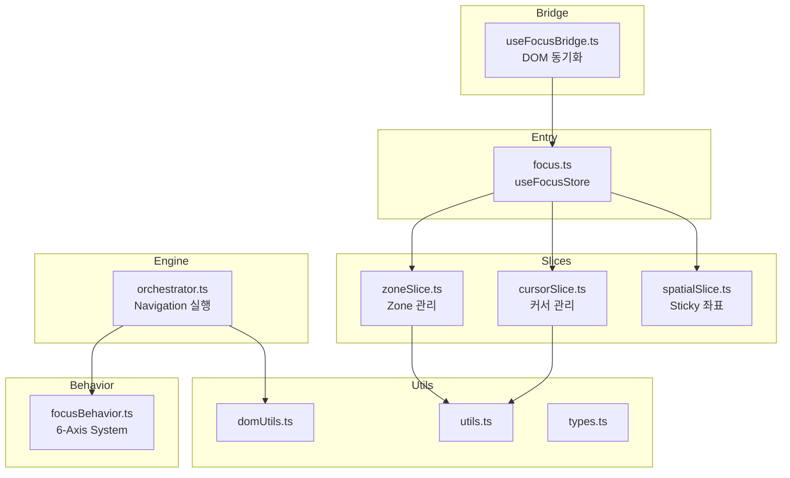

# OS Focus System 분석

## 1. 개요 (Overview)

`src/os/core/focus` 디렉토리에는 Interactive OS의 **포커스 관리 시스템**이 구현되어 있습니다. 이 시스템은 키보드 내비게이션, Zone 계층 관리, Spatial Memory 등을 담당하며, Zustand 기반의 상태 관리와 ARIA 호환 동작을 제공합니다.

---

## 2. 파일별 상세 분석

### 2.1 Entry Point

#### [focus.ts](file:///Users/user/Desktop/interactive-os/src/os/core/focus.ts)
| 역할 | Zustand Store 엔트리 포인트 |
|------|---------------------------|
| 라인 수 | 15 lines |

- 3개의 Slice를 조합하여 `useFocusStore` 생성
- 외부에서 사용할 타입들 re-export (`ZoneMetadata`, `FocusObject`, `FocusState`)

---

### 2.2 6-Axis Behavior System

#### [focusBehavior.ts](file:///Users/user/Desktop/interactive-os/src/os/core/focusBehavior.ts)
| 역할 | Focus 동작 정의 시스템 |
|------|---------------------|
| 라인 수 | 123 lines |

**6개의 Atomic Axes:**

| Axis | 타입 | 설명 |
|------|------|------|
| `direction` | `none` \| `v` \| `h` \| `grid` | 화살표 키 내비게이션 방향 |
| `edge` | `loop` \| `stop` | 경계에서의 동작 |
| `tab` | `loop` \| `escape` \| `flow` | Tab 키 동작 |
| `target` | `real` \| `virtual` | 포커스 대상 유형 |
| `entry` | `first` \| `restore` \| `selected` | Zone 진입 시 포커스 위치 |
| `restore` | `boolean` | Zone 탈출 시 원복 여부 |

**ARIA Role 기반 Presets:**
- `dialog`, `alertdialog`, `listbox`, `menu`, `menubar`, `tabs`, `toolbar`, `grid`, `tree`, `combobox`, `form`

**주요 함수:**
- `resolveBehavior(role?, overrides?)`: Base → Preset → Override 순으로 병합

---

### 2.3 Orchestrator (Navigation Engine)

#### [orchestrator.ts](file:///Users/user/Desktop/interactive-os/src/os/core/focus/orchestrator.ts)
| 역할 | 내비게이션 실행 로직 |
|------|-------------------|
| 라인 수 | 248 lines |

**핵심 함수:**

| 함수 | 역할 |
|------|------|
| `prepareStickyAnchor` | Spatial Memory 좌표 계산 (X/Y anchor) |
| `getBubblePath` | Active → Root 경로 구성 |
| `resolvePivot` | Zone 내 피벗 아이템 결정 |
| `resolveEntry` | Zone 진입 시 마지막 위치 복원 |
| `executeNavigation` | **메인 함수** - 전체 내비게이션 로직 |

**Navigation Flow:**
```
1. Prepare Spatial Memory
2. Traversal Loop (Bubble)
3. Direction Policy Guard
4. Resolve Pivot
5. Behavior Adapter
6. Navigation Engine Call
7. Zone Lookup for Entry Resolution
8. Resolve Entry
9. Behavior Trap Check
```

---

### 2.4 State Slices

#### [slices/zoneSlice.ts](file:///Users/user/Desktop/interactive-os/src/os/core/focus/slices/zoneSlice.ts)
| 역할 | Zone 등록/관리 |
|------|--------------|
| 라인 수 | 96 lines |

**State:**
- `activeZoneId`: 현재 활성 Zone
- `zoneRegistry`: 모든 Zone 메타데이터
- `focusPath`: Root → Leaf 경로
- `history`: Zone 이동 히스토리

**Actions:**
- `registerZone`, `unregisterZone`: Zone 등록/해제
- `setActiveZone`: 활성 Zone 변경
- `addItem`, `removeItem`: Zone 내 아이템 관리

---

#### [slices/cursorSlice.ts](file:///Users/user/Desktop/interactive-os/src/os/core/focus/slices/cursorSlice.ts)
| 역할 | 커서(포커스) 위치 관리 |
|------|---------------------|
| 라인 수 | 75 lines |

**State:**
- `focusedItemId`: 현재 포커스된 아이템 ID
- `activeObject`: 포커스된 아이템의 상세 정보

**Actions:**
- `setFocus(itemId, object?)`: 포커스 이동 + Zone 자동 활성화 + Sticky 좌표 계산
- `updatePayload`: activeObject 페이로드 업데이트

---

#### [slices/spatialSlice.ts](file:///Users/user/Desktop/interactive-os/src/os/core/focus/slices/spatialSlice.ts)
| 역할 | Spatial Memory 관리 |
|------|-------------------|
| 라인 수 | 11 lines |

**State:**
- `stickyIndex`: 가상 좌표 (Zone 간 이동 시 인덱스 유지)
- `stickyX`, `stickyY`: 물리적 앵커 좌표 (그리드 내비게이션용)

---

### 2.5 Browser-Focus Bridge

#### [useFocusBridge.ts](file:///Users/user/Desktop/interactive-os/src/os/core/focus/useFocusBridge.ts)
| 역할 | 브라우저 ↔ 가상 포커스 동기화 |
|------|---------------------------|
| 라인 수 | 76 lines |

**양방향 동기화:**

| 방향 | 동작 |
|------|------|
| Browser → Virtual | `focusin` 이벤트 감지 → `setFocus` 호출 |
| Virtual → Browser | `focusedItemId` 변경 → `el.focus()` 호출 |

**사용법:** App 루트에서 1회 호출

---

### 2.6 Utilities

#### [domUtils.ts](file:///Users/user/Desktop/interactive-os/src/os/core/focus/domUtils.ts)
| 역할 | DOM 읽기 유틸리티 |
|------|-----------------|
| 라인 수 | 39 lines |

- `collectItemRects(items)`: 아이템 ID 배열 → DOMRect 맵
- `getItemRect(id)`: 단일 아이템 rect 조회

---

#### [utils.ts](file:///Users/user/Desktop/interactive-os/src/os/core/focus/utils.ts)
| 역할 | 경로 계산 유틸리티 |
|------|------------------|
| 라인 수 | 15 lines |

- `computePath(leafId, registry)`: Leaf → Root 경로 계산

---

#### [types.ts](file:///Users/user/Desktop/interactive-os/src/os/core/focus/types.ts)
| 역할 | 타입 정의 |
|------|---------|
| 라인 수 | 70 lines |

**주요 타입:**
- `ZoneMetadata`: Zone 설정 (id, parentId, behavior, items, lastFocusedId)
- `FocusObject`: 포커스된 아이템 정보
- `ZoneSlice`, `CursorSlice`, `SpatialSlice`: Slice 인터페이스
- `FocusState`: 전체 상태 타입

---

## 3. 아키텍처 다이어그램



---

## 4. 결론 (Conclusion)

Focus 시스템은 **6-Axis Behavior Model**을 중심으로 ARIA 호환 키보드 내비게이션을 구현합니다:

1. **선언적 설정**: Role 기반 preset으로 복잡한 포커스 동작을 간단히 정의
2. **계층적 Zone**: Parent-Child 관계로 포커스 버블링 지원
3. **Spatial Memory**: 그리드/2D 레이아웃에서 스마트한 내비게이션
4. **양방향 동기화**: 브라우저 네이티브 포커스와 가상 포커스 상태 일치
