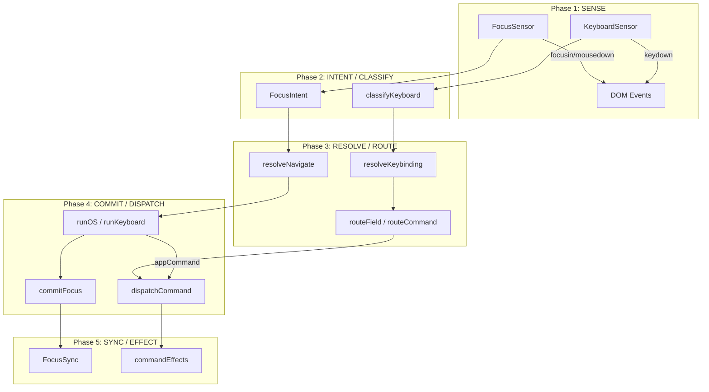

# 🔴🔵 Interactive OS 아키텍처 Red Team / Blue Team 감사 보고서

**날짜**: 2026-02-07  
**범위**: `src/os/` 전체 — Command System, Focus Pipeline, Keyboard Pipeline, Middleware, Persistence, Entities  

---

## 1. 개요 (Overview)

Antigravity OS의 핵심 아키텍처를 공격적(Red Team) 시각과 방어적(Blue Team) 시각에서 교차 감사합니다. 각 서브시스템별로 **위험 요소**, **현재 방어 수단**, **개선 권고**를 구조화했습니다.

---

## 2. 아키텍처 토폴로지



---

## 3. Red Team / Blue Team 감사 결과

### 3.1 Command System

#### 🔴 Red Team 발견사항

| # | 위험 등급 | 발견 | 파일 | 설명 |
|---|-----------|------|------|------|
| R1 | 🟠 중간 | **`dispatchCommand`의 "blind app dispatch"** | `dispatchCommand.ts:28-38` | `appDispatch`에 커맨드를 보낼 때 해당 앱이 실제로 그 커맨드를 처리할 수 있는지 확인하지 않음. 항상 `handlerType: "app"`으로 success 반환. |
| R2 | 🟡 낮음 | **`osRegistry` 타입 `any`** | `dispatchCommand.ts:13` | `DispatchContext.osRegistry`가 `any`로 선언되어 타입 안전성 부재. |
| R3 | 🟠 중간 | **`createCommandStore` 내부 `set()` 동기 디스패치** | `createCommandStore.tsx:47-110` | `set()` 내부에서 `cmd.run()`을 실행하므로, 명령이 재귀적으로 `dispatch()`를 호출하면 Zustand의 batching 내에서 중첩 `set()`이 발생. |
| R4 | 🟡 낮음 | **`EventBus` emit이 `set()` 내부에서 호출** | `createCommandStore.tsx:64` | `useCommandEventBus.getState().emit(action)`이 command 실행 전에 호출됨. 실행이 실패해도 이벤트는 이미 발행됨. |
| R5 | 🟠 중간 | **OS 커맨드의 No-op `run` 함수** | `osCommands.ts:9-52` | COPY, PASTE, CUT, DELETE 등 대부분의 OS 커맨드가 `run: (state) => state`로 정의. 앱이 Override하지 않으면 사용자에게 무음 실패. |
| R6 | 🟡 낮음 | **`(zone as any)[bindingKey]` 타입 우회** | `resolveKeybinding.ts:168` | `hasZoneBinding`에서 ZoneData를 `any`로 캐스팅하여 바인딩 존재 여부를 확인. 타입 안전성 없음. |

#### 🔵 Blue Team 방어 현황

| # | 방어 수단 | 평가 |
|---|-----------|------|
| B1 | **Hierarchical Command Lookup (Focus Bubble)** | ✅ 우수. `focusPath`를 역순으로 탐색하여 가장 구체적인 핸들러 우선. |
| B2 | **`when` 절 기반 조건부 실행** | ✅ 우수. `evalContext`가 컨텍스트 기반 가드를 제공. |
| B3 | **Telemetry 로깅** | ✅ 양호. `CommandTelemetryStore`가 모든 성공/실패를 기록. |
| B4 | **Unknown command 경고** | ✅ 양호. `createCommandStore.tsx:86`에서 미등록 커맨드에 대해 `logger.warn` 출력. |
| B5 | **OS 미들웨어 자동 적용** | ✅ 우수. `createEngine`이 navigationMiddleware, historyMiddleware를 자동 연결. |

---

### 3.2 Focus Pipeline (5-Phase)

#### 🔴 Red Team 발견사항

| # | 위험 등급 | 발견 | 파일 | 설명 |
|---|-----------|------|------|------|
| R7 | 🔴 **높음** | **`isProgrammaticFocus` — 전역 플래그 경합** | `FocusSync.tsx:15-18` + `osCommand.ts:276-278` | `let isProgrammaticFocus` 전역 변수를 `setTimeout(100ms)`으로 리셋. 빠른 연속 조작이나 타이머 겹침 시 경합 발생 가능. 두 군데(`FocusSync`, `osCommand`)에서 동일 변수를 독립적으로 조작하므로 상태 불일치 위험. |
| R8 | 🟠 중간 | **`FocusSensor`의 글로벌 singleton 패턴** | `FocusSensor.tsx:18` | `let isMounted = false`로 단일 인스턴스 보장하지만, StrictMode나 HMR에서 리마운트 시 이벤트 리스너가 등록되지 않는 엣지 케이스 가능. |
| R9 | 🟠 중간 | **`FocusData.getById` — DOM 의존** | `focusData.ts:74-78` | `document.getElementById`를 사용하여 Zone을 조회. Zone이 아직 렌더되지 않았거나, 동일 ID가 여러 곳에 존재하면 잘못된 데이터 반환. |
| R10 | 🟡 낮음 | **`buildContext`의 DOM 스냅샷 비용** | `osCommand.ts:106-121` | `collectItemRects`가 `querySelectorAll("[data-item-id]")`로 모든 아이템의 `getBoundingClientRect()`를 호출. 아이템이 수백 개인 Zone에서 성능 병목. |
| R11 | 🟠 중간 | **`runOS`의 동적 import로 App Command 디스패치** | `osCommand.ts:255-261` | `import(...)..then()`으로 비동기 디스패치. 디스패치 순서가 보장되지 않으며, 에러 핸들링 부재. |
| R12 | 🟡 낮음 | **`focusPath` 무한루프 가드가 100 depth** | `focusData.ts:170` | `path.length > 100`은 충분히 높은 임계값이나, 실제 OS 사용에서 100 depth는 비현실적. 10~20이 적절. |
| R13 | 🟠 중간 | **`popAndRestoreFocus`의 `setTimeout(50ms)`** | `focusData.ts:266-290` | 오버레이 언마운트를 기다리기 위한 하드코딩된 50ms 딜레이. 복잡한 전환 애니메이션에서는 부족할 수 있음. |

#### 🔵 Blue Team 방어 현황

| # | 방어 수단 | 평가 |
|---|-----------|------|
| B6 | **Re-entrance Guard (`_isRunning`)** | ✅ 우수. `runOS`에서 `_isRunning` 플래그로 `runOS → el.focus() → focusin → dispatch → runOS` 무한루프 방지. |
| B7 | **Self-Healing Focus (Recovery)** | ✅ 우수. 삭제된 아이템의 포커스를 자동으로 인접 아이템으로 복구. `recoveryTargetId` 사전 계산. |
| B8 | **WeakMap 기반 Zone 데이터** | ✅ 우수. GC 자동 정리로 메모리 누수 방지. |
| B9 | **Focus Stack (Modal 복원)** | ✅ 양호. Push/Pop 패턴으로 모달 닫기 후 이전 포커스 복원. |
| B10 | **Stale Focus Detection** | ✅ 양호. `FocusSync`에서 Element가 없으면 프로젝션 스킵, `FocusSensor`가 body focusin 감지하여 `OS_RECOVER` 발행. |

---

### 3.3 Keyboard Pipeline

#### 🔴 Red Team 발견사항

| # | 위험 등급 | 발견 | 파일 | 설명 |
|---|-----------|------|------|------|
| R14 | 🟡 낮음 | **`NATIVE_SHORTCUTS` 하드코딩** | `classifyKeyboard.ts:89-101` | `Meta-c`, `Ctrl-c` 등을 하드코딩. 새로운 OS 단축키(Ctrl+Z 등)가 추가되면 수동 업데이트 필요. |
| R15 | 🟠 중간 | **`classifyKeyboard`에서 `Ctrl-z`/`Ctrl-y` 미포함** | `classifyKeyboard.ts:89-101` | Undo/Redo(`Ctrl-z`, `Meta-z`)가 NATIVE_SHORTCUTS에 없으므로, 텍스트 필드 편집 중에도 COMMAND로 분류되어 OS의 Undo가 실행될 수 있음. |
| R16 | 🟡 낮음 | **`hasKeybinding`이 매 키 입력마다 전체 바인딩 스캔** | `classifyKeyboard.ts:116-121` | `getAllKeybindings()`가 매번 배열을 생성하고 `.some()`으로 탐색. 바인딩이 많으면 O(n) 비용. |
| R17 | 🟠 중간 | **`runKeyboard`의 동적 import 비동기 디스패치** | `keyboardCommand.ts:113-118` | `runOS`와 동일 패턴. 에러 핸들링 없이 비동기로 앱 커맨드 디스패치. |
| R18 | 🟡 낮음 | **중복 `KeyboardIntent` 타입 정의** | `keyboard/types.ts` vs `command/pipeline/1-intercept/interceptKeyboard.ts` | 두 곳에서 `KeyboardIntent`를 독립적으로 정의. 필드명이 다름(`isFromField` vs `isFromInput`). |

#### 🔵 Blue Team 방어 현황

| # | 방어 수단 | 평가 |
|---|-----------|------|
| B11 | **IME Composition 필터링** | ✅ 우수. `isComposing` 체크로 한국어/일본어 입력 시 중간 키 이벤트 무시. |
| B12 | **Field 편집 모드 인식** | ✅ 양호. `immediate`/`deferred` 모드 구분으로 필드 입력과 네비게이션 키 충돌 방지. |
| B13 | **Deferred Field → Non-input 변환** | ✅ 양호. `routeKeyboard.ts:28-36`에서 deferred 필드가 편집 중이 아닐 때 `isFromField: false`로 변환. |

---

### 3.4 Middleware & Persistence

#### 🔴 Red Team 발견사항

| # | 위험 등급 | 발견 | 파일 | 설명 |
|---|-----------|------|------|------|
| R19 | 🔴 **높음** | **`navigationMiddleware`의 직접 DOM 조작** | `navigationMiddleware.ts:40-80` | `document.getElementById`, `el.focus()`, `el.scrollIntoView()`를 미들웨어 내에서 직접 호출. "순수 미들웨어" 원칙 위반. 테스트 불가. |
| R20 | 🟠 중간 | **`hydrateState`의 얕은 병합** | `hydrateState.ts:24-39` | `data`와 `ui` 필드를 1-depth 병합. 3-depth 이상 중첩된 스키마 변경 시 데이터 손실 가능. |
| R21 | 🟠 중간 | **Persistence에 버전 관리 부재** | `hydrateState.ts` | 스키마 버전이 없어 앱 업데이트 시 `localStorage` 데이터가 새 스키마와 충돌할 수 있음(실제로 Kanban에서 `columnOrder` undefined 버그 발생 이력). |
| R22 | 🟡 낮음 | **`resolveFocusMiddleware`의 재귀 순회** | `resolveFocusMiddleware.ts:19-37` | `resolvePayload`가 재귀적으로 페이로드의 모든 중첩 객체를 순회. 순환 참조가 있는 페이로드에서 무한루프. |
| R23 | 🟡 낮음 | **`InspectorStore`의 `persist` 미들웨어** | `InspectorStore.ts:26-50` | 인스펙터 상태가 `localStorage`에 영속화됨. `isOpen: true` 상태가 저장되면 프로덕션에서도 인스펙터가 열린 채 시작될 수 있음. |

#### 🔵 Blue Team 방어 현황

| # | 방어 수단 | 평가 |
|---|-----------|------|
| B14 | **Effects Queue 패턴** | ✅ 양호. `navigationMiddleware`가 effects 배열을 처리 후 즉시 클리어. |
| B15 | **`resolveFocusMiddleware` 센티넬 패턴** | ✅ 우수. `OS.FOCUS` 예약어로 명시적 의도 전달. |
| B16 | **Debounced Persistence** | ✅ 양호. `createPersister`가 300ms 디바운스로 과도한 저장 방지. |

---

### 3.5 evalContext (Logic Evaluation)

#### 🔴 Red Team 발견사항

| # | 위험 등급 | 발견 | 파일 | 설명 |
|---|-----------|------|------|------|
| R24 | 🟠 중간 | **문자열 기반 조건 평가의 제한적 파서** | `evalContext.ts:5-26` | `&&`, `||`, `!`, `==` 연산자만 지원. 괄호 우선순위 미지원(`(a || b) && c` 불가). `||` 분할이 먼저 실행되므로 `a && b || c`가 `a && (b || c)`로 해석됨 — **연산자 우선순위가 역전**됨. |
| R25 | 🟡 낮음 | **글로벌 캐시 무제한 증가** | `evalContext.ts:3` | `cache = new Map()`이 캐시 크기를 제한하지 않음. 동적으로 생성되는 조건식이 많으면 메모리 증가. |

#### 🔵 Blue Team 방어 현황

| # | 방어 수단 | 평가 |
|---|-----------|------|
| B17 | **캐시 기반 컴파일** | ✅ 양호. 동일 표현식 재사용 시 재컴파일 없이 캐시 히트. |
| B18 | **함수형 LogicNode 지원** | ✅ 우수. `typeof expr === "function"` 분기로 타입 안전 조건도 지원. |

---

### 3.6 Jurisdiction & Registry

#### 🔴 Red Team 발견사항

| # | 위험 등급 | 발견 | 파일 | 설명 |
|---|-----------|------|------|------|
| R26 | 🟡 낮음 | **`GroupRegistry` — 등록 해제 API 부재** | `GroupRegistry.ts` | `register`만 존재하고 `unregister`가 없음. 앱이 언마운트되어도 커맨드가 레지스트리에 남음. |
| R27 | 🟡 낮음 | **`CommandRegistry.setKeymap` 중복 호출 시 누적** | `CommandRegistry.ts:62-77` | `setKeymap`이 기존 자동 등록된 커맨드를 정리하지 않아, HMR에서 반복 호출 시 로그만 증가. |

#### 🔵 Blue Team 방어 현황

| # | 방어 수단 | 평가 |
|---|-----------|------|
| B19 | **HMR 중복 방지** | ✅ 양호. `GroupRegistry.register`에서 `cmd.id` 기준 중복 체크. |
| B20 | **Auto-discovery** | ✅ 우수. `setKeymap`이 keymap에 포함된 Command Object를 자동으로 발견하여 등록. |

---

## 4. 위험도 요약 매트릭스

| 등급 | 건수 | 대표 항목 |
|------|------|-----------|
| 🔴 높음 | 2 | R7 (isProgrammaticFocus 경합), R19 (navigationMiddleware DOM 의존) |
| 🟠 중간 | 11 | R1, R3, R5, R8, R9, R11, R13, R15, R17, R20, R21, R24 |
| 🟡 낮음 | 10 | R2, R4, R6, R10, R12, R14, R16, R18, R22, R23, R25, R26, R27 |

---

## 5. 권고사항 (Recommendations)

### 🔴 즉시 조치 (Critical)

#### 5.1 `isProgrammaticFocus` → 카운터 기반 또는 토큰 기반으로 전환
```diff
- let isProgrammaticFocus = false;
+ let programmaticFocusCount = 0;
+ export const isProgrammaticFocus = () => programmaticFocusCount > 0;
+ export function setProgrammaticFocus(value: boolean) {
+   programmaticFocusCount += value ? 1 : -1;
+   if (programmaticFocusCount < 0) programmaticFocusCount = 0;
+ }
```
**근거**: 현재 두 곳(FocusSync, osCommand)에서 동시에 `setTimeout(100ms)`으로 리셋하므로, 한쪽이 먼저 리셋하면 다른 쪽의 포커스 이벤트가 재처리됨.

#### 5.2 `navigationMiddleware` → Effect 기반 리팩토링
```diff
- // DOM 직접 조작
- targetEl.focus({ preventScroll: false });
+ // Effect 발행만
+ return produce(nextState, (draft) => {
+   draft.effects.push({ type: "FOCUS_DOM", id: targetId });
+ });
```
별도의 React Effect 레이어에서 DOM 프로젝션 일괄 처리. 이미 `FocusSync`가 이 역할을 하므로 **중복 제거**도 가능.

### 🟠 단기 개선 (Short-term)

| # | 권고 | 영향 |
|---|------|------|
| 5.3 | `dispatchCommand`에서 앱 커맨드 존재 여부 사전 확인 | False positive 로그 방지 |
| 5.4 | `hydrateState`에 스키마 버전 필드 추가 | 버전 불일치 시 안전한 마이그레이션 또는 초기화 |
| 5.5 | `evalContext` 파서에 괄호 지원 및 연산자 우선순위 수정 | `&&`이 `||` 보다 높은 우선순위를 가지도록 |
| 5.6 | `runOS`/`runKeyboard`의 동적 import → 정적 import | Build-time 종속성 추적 가능 |
| 5.7 | 중복 `KeyboardIntent` 타입 통합 | 단일 정의로 `isFromField`/`isFromInput` 용어 통일 |
| 5.8 | `classifyKeyboard`의 `NATIVE_SHORTCUTS`에 Undo/Redo 추가 | 필드 편집 중 텍스트 Undo 보존 |

### 🟡 장기 개선 (Long-term)

| # | 권고 | 비고 |
|---|------|------|
| 5.9 | `GroupRegistry`에 `unregister` API 도입 | 앱 언마운트 시 정리 |
| 5.10 | `buildContext`의 Rect 수집을 지연(Lazy) 방식으로 전환 | 실제 Spatial 네비게이션 시에만 Rect 계산 |
| 5.11 | Focus Stack의 `setTimeout(50ms)` → 프레임 기반 대기 | `requestAnimationFrame` 또는 `MutationObserver` 활용 |
| 5.12 | `evalContext` 캐시에 LRU 또는 최대 크기 제한 추가 | 메모리 안전성 확보 |
| 5.13 | `InspectorStore` persist 대상에서 `isOpen` 제외 | 프로덕션 안전 |

---

## 6. 아키텍처 강점 (Positive Findings) 🏆

이 감사에서 Red Team 공격자로서 **무력화하기 어려웠던** 방어 메커니즘:

1. **Re-entrance Guard** (`osCommand.ts:195`): `_isRunning` 플래그가 focus 이벤트 재진입 루프를 완벽하게 차단. 실제 무한루프 버그를 방지한 검증된 패턴.

2. **WeakMap 기반 Zone 데이터**: DOM Element를 key로 사용하여 수동 cleanup 없이 GC에 위임. 메모리 누수 벡터 자체를 제거한 설계.

3. **Pure Command 패턴 (`OSCommand.run`)**: ctx를 먼저 수집하고, 순수함수로 결과를 계산한 후, 결과를 일괄 적용하는 3-phase 패턴. 테스트 가능성과 예측 가능성이 우수.

4. **Self-Healing Focus**: `recoveryTargetId` 사전 계산으로 삭제 후 포커스 복구가 O(1)에 가능. 사용자 경험을 크게 향상.

5. **OS.FOCUS Sentinel 패턴**: 암시적 의도 해결 대신 명시적 예약어로 "현재 포커스 사용"을 선언. 디버깅 가능성과 코드 가독성 모두 확보.

6. **5-Phase Pipeline 분리**: Sense → Intent → Resolve → Commit → Sync의 단방향 흐름이 관심사를 명확히 분리. 각 Phase를 독립적으로 테스트 가능.

---

## 7. 결론

Antigravity OS는 전체적으로 **잘 설계된 관심사 분리와 순수함수 기반 아키텍처**를 갖추고 있습니다. 특히 Re-entrance Guard, Self-Healing Focus, Sentinel 패턴 등은 실전에서 검증된 견고한 방어 수단입니다.

그러나 **`isProgrammaticFocus` 전역 플래그**와 **`navigationMiddleware`의 DOM 직접 의존**은 시스템의 예측 가능성과 테스트 가능성을 저해하는 가장 큰 취약점입니다. 이 두 가지의 해결이 아키텍처 안정성을 한 단계 올리는 핵심 과제입니다.

**전체 위험 수준**: 🟡 관리 가능 (Critical 2건은 기능 오류가 아닌 설계 부채)

---

*Antigravity Red/Blue Team Audit Report — 2026-02-07*
