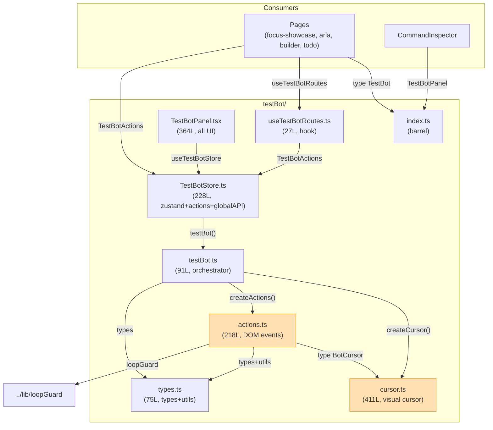

# TestBot 구조 리팩토링 — Red Team / Blue Team 분석

## 1. 개요 (Overview)

TestBot을 **UI / 구현 / 외부 API** 3개 레이어로 분리하는 구조적 리팩토링을 검토합니다.
특히 `cursor.ts`가 어디에 속하는가를 중심으로 Red Team(반대) / Blue Team(찬성) 토론을 수행합니다.

### 현재 의존성 그래프 (실제 코드 기반)



### 핵심 의존성 발견

```
actions.ts ──import type──→ cursor.ts  (BotCursor 인터페이스만)
testBot.ts ──import──→ cursor.ts       (createCursor 구현을 직접 사용)
testBot.ts ──import──→ actions.ts      (createActions 구현을 직접 사용)
```

**`actions.ts`는 `BotCursor` 인터페이스에만 의존** (이미 DI 패턴). 
하지만 **`testBot.ts`가 `createCursor()`를 직접 생성**하여 주입.

---

## 2. Red Team — 3-Layer에 반대하는 논거

### 🔴 R1. cursor.ts는 "core"가 아니다

`cursor.ts`는 411줄 중 **~170줄이 CSS**, **~15줄이 SVG**. 
실질적으로 **시각 표현(presentation)** 레이어다.
"core"라는 이름에 CSS/SVG/DOM 생성 코드가 있으면 의미가 퇴색된다.

```
core/cursor.ts  ← 170줄 CSS + SVG 에셋?  "core"가 맞나?
```

### 🔴 R2. core → visual 역방향 의존

clean layer 원칙: **상위 레이어(UI)가 하위(core)에 의존**해야 한다.
그런데 `core/actions.ts → cursor.ts(visual)` = core가 presentation에 의존.
이건 아키텍처 냄새(smell).

### 🔴 R3. 1,200줄에 11개+ 파일은 over-engineering

| 파일 | 줄 수 |
|------|------|
| cursor.ts | 411 |
| TestBotPanel.tsx | 364 |
| TestBotStore.ts | 228 |
| actions.ts | 218 |
| testBot.ts | 91 |
| types.ts | 75 |
| useTestBotRoutes.ts | 27 |
| index.ts | 5 |
| **합계** | **~1,420** |

1,420줄을 3개 폴더 + 11개 파일로 쪼개면 파일당 ~130줄.
**찾기(navigability)** 비용이 구조적 이점을 넘어설 수 있다.

### 🔴 R4. store 레이어가 잡탕

store에 들어가는 것: Zustand state, action methods, React hook, global API 등록.
이들의 변경 사유(reason to change)가 각각 다르다.
"store"라는 이름으로 묶는 게 오히려 혼란.

---

## 3. Blue Team — 3-Layer를 지지하는 논거

### 🔵 B1. 현재 TestBotStore.ts가 실제로 과밀

228줄에 **4가지 역할**이 혼재:
1. Zustand store 정의 (L31-37)
2. 헬퍼 함수 rebuildBot/swapBot (L43-67)
3. TestBotActions 객체 (L73-177) — register, runAll, runSuite, stop
4. window.__TESTBOT__ 글로벌 API (L183-228)

이건 SRP(단일 책임) 위반. 분리가 맞다.

### 🔵 B2. TestBotPanel.tsx도 과밀

364줄에 **5개 컴포넌트 + 1개 유틸** 혼재:
- TestBotPanel (200줄 메인), StepIcon, SuiteDetails, CopyLogButton, generateSuiteLog, FLASH_STYLE

React 컴포넌트를 파일 단위로 분리하는 건 표준 관행.

### 🔵 B3. 의존성 역전이 이미 존재

`actions.ts`는 `BotCursor` **인터페이스**에만 의존 (line 8: `import type`).
`testBot.ts`가 구현을 생성하여 주입. 
→ `BotCursor` 인터페이스를 `types.ts`로 옮기면 clean DI 완성.

### 🔵 B4. "visual test runner"에서 visual은 core의 일부

Cypress, Playwright 등 visual test runner에서 시각적 오버레이는 **테스트 실행 파이프라인의 핵심 기능**이지, 부가 UI가 아니다. 
TestBot이 "visual test runner"임을 명시적으로 선언하면 cursor가 core에 있는 것이 자연스럽다.

---

## 4. 결론 — 권장 구조

### 핵심 결정: cursor는 어디에?

| 옵션 | 장점 | 단점 |
|------|------|------|
| **A. core/cursor.ts** | engine과 같은 폴더, import 단순 | "core"에 CSS가 있는 의미적 불일치 |
| **B. visual/cursor.ts** (4번째 레이어) | 의미가 명확 | 1개 파일 위해 폴더 생성 = over-engineering |
| **C. core/cursor/ (하위 모듈)** | CSS/SVG를 core에서 격리 | 과도한 세분화 |

**권장: 옵션 A + `BotCursor` 인터페이스를 types.ts로 추출**

근거:
1. cursor는 test execution pipeline의 필수 구성요소 (visual test runner)
2. `BotCursor` interface를 `types.ts`로 옮기면 `actions.ts → cursor.ts` 직접 의존 제거
3. 실용적 — 1개 파일을 위해 4번째 레이어 불필요

### 3-Layer인가 2-Layer인가?

**3-Layer 유지 권장**, 단 레이어 이름과 경계 조정:

```
testBot/
├── index.ts              # Public API barrel
│
├── core/                 # 테스트 엔진 (순수 JS, React 없음)
│   ├── types.ts          # 타입 + BotCursor interface + 상수
│   ├── testBot.ts        # 오케스트레이터
│   ├── actions.ts        # DOM 인터랙션
│   └── cursor.ts         # 가상 커서 (visual driver)
│
├── store/                # 상태 관리 + 외부 API
│   ├── TestBotStore.ts   # Zustand state 정의
│   ├── TestBotActions.ts # 액션 메서드
│   ├── useTestBotRoutes.ts
│   └── globalApi.ts      # window.__TESTBOT__
│
└── ui/                   # React UI (Inspector 패널)
    ├── TestBotPanel.tsx
    ├── SuiteDetails.tsx
    └── CopyLogButton.tsx
```

### 핵심 변경 1개: BotCursor 인터페이스 이동

```diff
# types.ts
+ export interface BotCursor { ... }  // cursor.ts에서 이동
+ export type BubbleVariant = 'default' | 'click' | 'success' | 'error';

# actions.ts
- import type { BotCursor } from "./cursor";
+ import type { BotCursor } from "./types";  // core 내부 의존만

# cursor.ts
- export interface BotCursor { ... }
+ import type { BotCursor } from "./types";
```

이렇게 하면 의존성이 깔끔해진다:
```
actions.ts → types.ts ← cursor.ts   (둘 다 types에만 의존)
testBot.ts → cursor.ts (createCursor 구현)
testBot.ts → actions.ts (createActions 구현)
```

### 최종 판정

| 항목 | 결정 | 근거 |
|------|------|------|
| Layer 수 | **3 (core/store/ui)** | UI 이미 분리 필요, Store 과밀 해소 필요 |
| cursor 위치 | **core/** | visual test runner의 핵심 기능, 4번째 레이어는 불필요 |
| BotCursor interface | **types.ts로 이동** | DI 완성, core 내 순환 의존 제거 |
| Store 분리 | **4파일** | SRP: state / actions / hook / globalApi |
| UI 분리 | **3파일** | 표준 React 컴포넌트 분리 |
