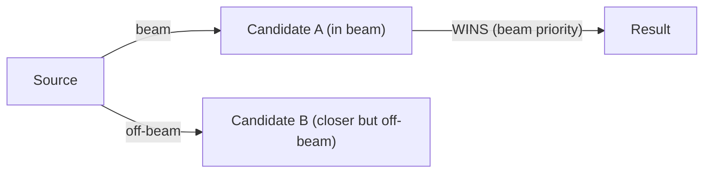
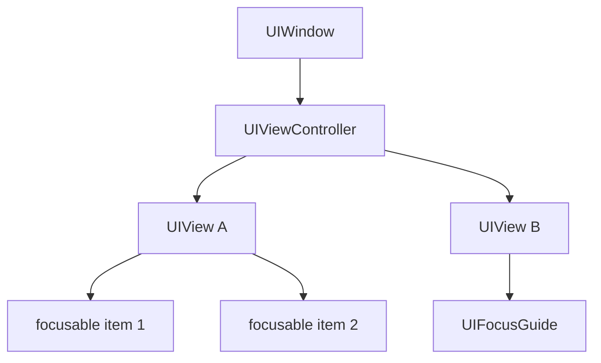

# Spatial Navigation 알고리즘 비교 분석

## 1. 개요
Spatial Navigation(방향 키 기반 2D 포커스 탐색)을 구현하는 3대 레퍼런스의 알고리즘을 비교 분석한다. 현재 interactive-os의 `resolveZoneSpatial`이 직면한 문제(strict boundary 비교로 인한 겹침 영역 무시, 계층 구조 탐색 한계)를 해결하기 위한 근거 자료이다.

---

## 2. Android FocusFinder

> 소스: `platform/frameworks/base/core/java/android/view/FocusFinder.java`

### 핵심 파이프라인
```
findNextFocus()
  → getEffectiveRoot()           // 탐색 경계(cluster) 결정
  → findNextUserSpecifiedFocus() // 명시적 nextFocus 지정 우선
  → addFocusables()              // 모든 후보 수집
  → findNextFocusInAbsoluteDirection()
      → isBetterCandidate()      // 핵심 비교 로직
```

### 2.1 isCandidate — 후보 자격 판정

```java
// FOCUS_DOWN 예시
return (srcRect.top < destRect.top || srcRect.bottom <= destRect.top)
    && srcRect.bottom < destRect.bottom;
```

> [!IMPORTANT]
> **partial overlap 허용**. `srcRect.top < destRect.top`이면 destRect가 srcRect 아래쪽에 걸쳐 있어도 후보로 인정. 우리의 `rect.top >= currentRect.bottom` (strict) 대비 핵심적 차이점.

### 2.2 beamBeats — 빔 기반 필터

```
beamsOverlap: 이동 방향의 수직축에서 source와 candidate가 겹치는지 확인
→ 빔 안에 있는 후보가 빔 밖 후보보다 항상 우선
→ 수평 이동 시 빔이 절대적 우선
→ 수직 이동 시 빔 우선이지만, 빔 밖 후보가 "완전히 더 가까우면" 뒤집힐 수 있음
```



### 2.3 getWeightedDistanceFor — 가중 거리 공식

```java
// "Fudge-factor... finely tuned, be sure to run all focus tests if you dare tweak it"
return 13 * majorAxisDistance * majorAxisDistance
     + minorAxisDistance * minorAxisDistance;
```

| 컴포넌트 | 의미 |
|---|---|
| `majorAxisDistance` | 이동 방향 축 거리 (source edge → dest edge) |
| `minorAxisDistance` | 수직 축 거리 (center-to-center) |
| `13 × major²` | 이동 방향 거리에 13배 가중치 → **방향성 강조** |
| `+ minor²` | 정렬 보정은 상대적으로 약화 |

> [!NOTE]
> 계수 `13`은 경험적으로 튜닝된 값. 이동 방향 거리가 조금만 멀어져도 급격히 불리해지는 효과.

### 2.4 계층 구조 처리

- `getEffectiveRoot()`: 현재 view에서 위로 올라가며 `keyboardNavigationCluster` + `touchscreenBlocksFocus`인 최상위 ViewGroup을 탐색 경계로 설정
- **클러스터 내부에서 먼저 탐색**, 경계 도달 시 다음 클러스터로 점프
- 별도 `findNextKeyboardNavigationCluster()`로 클러스터 간 이동

---

## 3. W3C CSS Spatial Navigation Level 1

> 스펙: [CSS Spatial Navigation Module Level 1](https://w3c.github.io/csswg-drafts/css-nav-1/)

### 핵심 파이프라인
```
spatialNavigationSteps(direction)
  → setSearchOrigin()
  → findFocusableAreas(container)     // 컨테이너 내 후보 수집
  → selectBestCandidate(candidates)   // 최적 후보 선택
  → 실패 시: 부모 컨테이너로 bubble-up
```

### 3.1 Spatial Navigation Container

스크롤 컨테이너 + `spatial-navigation-contain: contain`이 적용된 요소가 **container**가 된다.

```css
/* 테이블 내부를 하나의 navigation 단위로 묶음 */
table { spatial-navigation-contain: contain; }
```

- `contain`: 내부에 후보가 있으면 내부 우선, 없으면 외부로 빠져나감
- 스크롤 컨테이너는 자동으로 container

### 3.2 Best Candidate 선택 — insider/outsider 분리

```
1. candidates 수집
2. insiders 분리 (searchOrigin과 겹치는 후보들)
   → boundary box가 searchOrigin의 inside area와 overlap
   → 방향 조건 충족 (down이면 top edge가 searchOrigin top보다 아래)
3. insiders가 있으면:
   → closest subset (방향 기준 가장 가까운 edge) 선택
   → 동점이면 document order
4. insiders가 없으면 (outsiders):
   → "doesn't overlap AND strictly in direction" 필터
   → find shortest distance
   → 최소 거리 후보 반환
```

> [!IMPORTANT]
> **insider 우선 처리**가 핵심. 겹치는 영역의 후보를 별도로 처리하여, Android의 `isCandidate`가 partial overlap을 허용하는 것과 유사한 효과.

### 3.3 Container Bubble-up

```
현재 container 내 탐색 실패
  → 부모 container를 eventTarget으로 설정
  → 같은 알고리즘 반복 (재귀적)
  → 최상위까지 도달하면 종료
```

이것은 우리의 `handleSeamlessNavigation`의 bubble-up과 동일한 패턴.

### 3.4 Distance 함수

스펙에서 `find the shortest distance` 알고리즘은 명확하게는 제공되지 않으며 "euclidean"을 distance function으로 언급. 구현은 UA에 위임됨.

---

## 4. Apple tvOS Focus Engine

> 문서: [UIFocusEnvironment](https://developer.apple.com/documentation/uikit/uifocusenvironment)

### 핵심 구조



### 4.1 Focus Chain

```
UIWindow.preferredFocusEnvironments
  → UIViewController.preferredFocusEnvironments
    → UIView.preferredFocusEnvironments
      → 최종 focusable item
```

- 초기 포커스는 chain을 타고 내려가며 결정
- chain에 지정이 없으면 **top-left에 가장 가까운** focusable view 선택

### 4.2 이동 알고리즘

| 단계 | 내용 |
|---|---|
| 1 | Siri Remote 스와이프/D-pad 방향 감지 |
| 2 | 해당 방향으로 **bounding box** 투영 |
| 3 | 투영 영역 내 focusable view 탐색 |
| 4 | 여러 개면 **가장 가까운** 것 선택 |
| 5 | 없으면 포커스 유지 (이동 안 함) |

### 4.3 UIFocusGuide — 가상 포커스 영역

- 보이지 않는 focusable 영역을 레이아웃에 배치
- 해당 영역으로 포커스가 이동하면 **다른 view로 redirect**
- 비직관적 레이아웃에서 빈 공간을 채워 연속적 탐색 보장

```swift
let guide = UIFocusGuide()
view.addLayoutGuide(guide)
guide.preferredFocusEnvironments = [targetButton]
```

### 4.4 제어 메서드

| 메서드 | 역할 |
|---|---|
| `shouldUpdateFocus(in:)` | 포커스 이동 허용/거부 (veto) |
| `didUpdateFocus(in:with:)` | 포커스 이동 후 반응 (애니메이션 등) |
| `setNeedsFocusUpdate()` | 포커스 업데이트 요청 (비동기) |
| `updateFocusIfNeeded()` | 즉시 강제 업데이트 |

---

## 3. 비교 요약

| 특성 | Android FocusFinder | W3C CSS Spatial Nav | tvOS Focus Engine |
|---|---|---|---|
| **후보 필터** | `isCandidate` (partial overlap 허용) | insider/outsider 분리 | bounding box 투영 |
| **빔 (beam)** | ✅ `beamBeats` (수직축 겹침 우선) | 명시 없음 (UA 위임) | 투영 영역 내 탐색 |
| **거리 함수** | `13*major²+minor²` | euclidean (명시 약함) | nearest proximity |
| **계층 처리** | cluster 단위 격리 + 점프 | container bubble-up | UIFocusEnvironment chain |
| **겹침 영역** | `isCandidate`가 처리 | insider 전용 분기 | 자동 (투영 기반) |
| **탈출 메커니즘** | cluster 점프 | container 부모로 bubble-up | 포커스 유지 (이동 안 함) |
| **명시적 오버라이드** | `nextFocusDown/Up/Left/Right` XML | `navbeforefocus` event | `preferredFocusEnvironments` |
| **가상 영역** | 없음 | 없음 | UIFocusGuide |

---

## 4. 현재 구현과의 Gap 분석

### 우리의 현재 방식
```typescript
// resolveZoneSpatial의 isInDirection (strict boundary)
case "down": return rect.top >= currentRect.bottom;
```

### 문제점

1. **Strict boundary 비교** → 겹치는 영역의 후보 제외됨
   - Android: partial overlap 허용 (`srcRect.bottom <= destRect.top` **OR** `srcRect.top < destRect.top`)
   - W3C: insider/outsider로 분리 처리

2. **빔(beam) 없음** → 정렬된 후보 우대 없음
   - Android: `beamBeats`로 수직축 정렬 후보 강력 우대
   - 우리: `distance + alignment * 0.3`으로 약한 보정만

3. **거리 함수 미흡** → 방향 축 가중치 부족
   - Android: `13 × major² + minor²` (방향 13배 강조)
   - 우리: `distance + alignment * 0.3` (선형, 방향성 약함)

### 개선 방향 제안

| 우선순위 | 항목 | 참고 |
|---|---|---|
| **P0** | `isCandidate` partial overlap 도입 | Android 방식 채택 |
| **P1** | beam 기반 필터 추가 | `beamsOverlap` 구현 |
| **P1** | 거리 함수를 `α×major² + minor²`로 교체 | α=13 시작점 |
| **P2** | `spatial-navigation-contain` CSS 속성 | W3C 패턴 — data attribute로 구현 가능 |
| **P3** | FocusGuide 개념 | 가상 포커스 영역 — 복잡 레이아웃용 |
