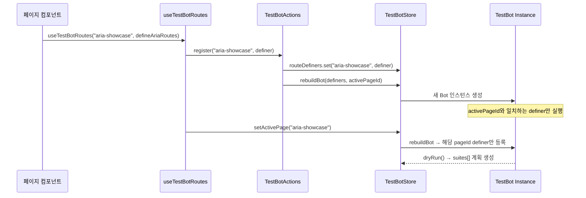

# TestBot Runner 매칭 아키텍처 분석

> **작성일**: 2026-02-08
> **대상**: `src/os/testBot/` — 디버그 패널 TestBot Runner
> **페이지**: `/aria-showcase`

---

## 1. 개요

TestBot Runner가 aria-showcase 페이지에서 매칭이 잘못되어 있다는 보고에 대한 아키텍처 분석.

---

## 2. 매칭 아키텍처

### 전체 흐름



### 핵심 파일

| 파일 | 역할 |
|:--|:--|
| [useTestBotRoutes.ts](file:///Users/user/Desktop/interactive-os/src/os/testBot/features/useTestBotRoutes.ts) | 페이지가 TestBot 라우트를 등록하는 Hook |
| [TestBotActions.ts](file:///Users/user/Desktop/interactive-os/src/os/testBot/features/TestBotActions.ts) | register/unregister/runAll 등 액션 |
| [TestBotStore.ts](file:///Users/user/Desktop/interactive-os/src/os/testBot/features/TestBotStore.ts) | Zustand 스토어, `rebuildBot()` 로직 |
| [testBot.ts](file:///Users/user/Desktop/interactive-os/src/os/testBot/features/testBot.ts) | Bot 인스턴스 팩토리 (`describe`, `runAll`) |

### 매칭 로직 (`rebuildBot`)

```typescript
// TestBotStore.ts:52-68
function rebuildBot(definers: Map<string, RouteDefiner>, pageId?: string | null): TestBot {
  const newBot = testBot({ speed: DEFAULT_SPEED });

  if (pageId) {
    // ✅ activePageId와 일치하는 definer만 실행
    const definer = definers.get(pageId);
    if (definer) definer(newBot);
  } else {
    // ⚠️ fallback: 모든 definer 실행 (다른 페이지 테스트도 포함)
    definers.forEach((fn) => fn(newBot));
  }

  return newBot;
}
```

### 등록된 페이지별 라우트

| pageId | 위치 | Suite 수 |
|:--|:--|:--|
| `"aria-showcase"` | `pages/aria-showcase/index.tsx` | 51 (14개 테스트 파일) |
| `"focus-showcase"` | `pages/focus-showcase/tests/FocusShowcaseBot.tsx` | 12 |
| `"builder-spatial"` | `pages/builder/SpatialTest.tsx` | ~10 |

### 생명주기

```
// Mount 시
useEffect → register(pageId) + setActivePage(pageId) → rebuildBot → dryRun

// Unmount 시  
cleanup → setActivePage(null) + unregister(pageId)
```

---

## 3. 현재 상태


- **"1 Routes Active"** 표시 — `activePageId = "aria-showcase"`
- **51개 Suite** 등록 — 14개 테스트 파일에서 등록한 모든 describe 블록
- 스크린샷에서 보이는 테스트들: Tabs, Menu, Listbox, Radiogroup, Toolbar, Grid, Tree 관련

---

## 3. 잠재적 문제 영역

### 타이밍 이슈
`register()`와 `setActivePage()`가 같은 useEffect 안에서 순차 호출되지만, `register()` 내부에서 `rebuildBot(next, activePageId)`를 호출할 때 `activePageId`가 아직 이전 값일 수 있음:

```typescript
// useTestBotRoutes.ts
useEffect(() => {
  TestBotActions.register(pageId, definer);  // ← 이 시점에서 activePageId = null (이전 값)
  setActivePage(pageId);                      // ← 이후에 갱신
}, [pageId]);
```

`register()` 내부:
```typescript
register(pageId, definer) {
  const { activePageId } = useTestBotStore.getState(); // ← null일 수 있음!
  const newBot = rebuildBot(next, activePageId);        // ← pageId=null → 모든 definer 실행!
}
```

### SPA 라우팅 시 Stale Registration
페이지 전환 시 이전 페이지의 `unregister`와 새 페이지의 `register`가 React 렌더 순서에 따라 교차될 수 있음.

---

## 4. 추가 확인 필요

> [!IMPORTANT]
> 사용자가 관찰한 구체적인 "매칭 잘못" 현상을 확인해야 합니다:
> - 다른 페이지(focus-showcase)의 테스트가 aria-showcase에 나타나는가?
> - 테스트가 잘못된 DOM 요소를 타겟하는가?
> - Suite 수가 예상보다 많거나 적은가?
