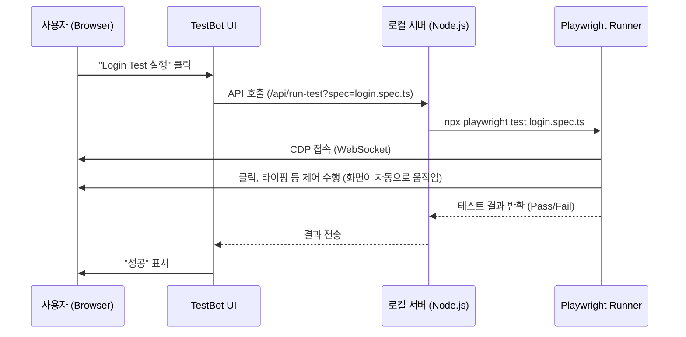

# TestBot 아키텍처 재설계: Playwright 생태계와의 완벽한 공존 (CDP 방식)

**작성일**: 2026-02-10
**버전**: v2 (사용자 피드백 반영)

---

## 1. 개요 (Overview)
사용자의 피드백("Playwright 생태계가 훨씬 견고하므로 내가 맞춰야 한다", "LLM이 만든 표준 테스트를 인간이 검증해야 한다")을 수용하여, 기존의 **In-browser Shim 방식**을 폐기하고 **Direct Automation (CDP 제어)** 방식을 제안합니다.

이 방식은 TestBot이 브라우저 내부에서 Playwright를 흉내내는 것이 아니라, **외부의 진짜 Playwright 프로세스가 사용자의 브라우저를 직접 제어**하는 구조입니다.

---

## 2. 핵심 아이디어: "브라우저 밖에서 안을 제어한다"

### 2.1 기존 방식의 문제 (Shim)
-   `.spec.ts`를 브라우저로 가져오려다 보니 번들링, 타입 에러, Node.js 의존성 문제 발생.
-   Playwright API를 브라우저용으로 재구현(Shim)해야 하므로 유지보수 비용 높음.
-   LLM이 작성한 코드를 수정해야 하거나 제약이 생김.

### 2.2 제안 방식 (CDP Connect)
1.  **TestBot UI**는 단지 "리모컨"일 뿐입니다.
2.  사용자가 "테스트 실행" 버튼을 누르면, **로컬 서버(Node.js)**에 요청을 보냅니다.
3.  서버는 **표준 Playwright (`npx playwright test`)**를 실행합니다.
4.  이때 Playwright는 `chromium.connectOverCDP`를 사용하여 **현재 사용자가 보고 있는 브라우저 탭**에 접속합니다.
5.  Playwright가 브라우저를 제어(클릭, 입력 등)하며, 사용자는 그 과정을 실시간으로 눈으로 확인(Verification)합니다.

---

## 3. 구조 (Architecture)



---

## 4. 장점 (Why this is elegant)

1.  **Zero Build Config**: `.spec.ts` 파일은 서버(Node.js)에만 존재하며, 브라우저 번들에 포함되지 않습니다. 따라서 **TypeScript 에러, 빌드 설정 문제가 원천적으로 사라집니다.**
2.  **100% Playwright 호환성**: Node.js 환경에서 진짜 Playwright가 실행되므로, 파일 시스템 접근, DB 조회, 네트워크 목킹 등 모든 기능을 제한 없이 사용할 수 있습니다. Shim을 만들 필요가 없습니다.
3.  **Human Verification**: 사용자는 자신의 브라우저에서 테스트가 실행되는 모습을 실시간으로 볼 수 있어, LLM이 짠 코드가 의도대로 동작하는지 검증할 수 있습니다.
4.  **LLM Friendly**: LLM에게 "표준 Playwright 코드를 짜줘"라고만 하면 됩니다. TestBot을 위한 별도의 가이드나 변환이 필요 없습니다.

---

## 5. 실행을 위한 요구사항

이 "마법" 같은 동작을 위해 단 하나의 제약 조건이 있습니다:
**브라우저가 원격 디버깅 모드로 실행되어야 합니다.**

```bash
# macOS 예시
/Applications/Google\ Chrome.app/Contents/MacOS/Google\ Chrome --remote-debugging-port=9222
```

개발 환경 설정(스크립트)에 이 옵션을 추가하면, 개발자는 평소처럼 `npm run dev`를 하고 브라우저를 열기만 하면 됩니다. 이후 모든 것은 자동입니다.

---

## 6. 결론

이 방식은 TestBot을 "Playwright의 대체재"가 아닌 **"Playwright의 GUI 컨트롤러"**로 재정의합니다. 이는 Playwright 생태계에 완벽히 맞추면서도, "인간의 검증"이라는 제품의 가치를 극대화하는 가장 우아한 해결책입니다.

승인해주시면, `docs/1-project/testbot-shift` 문서를 생성하고 다음 단계(POC: Node.js 실행기 구현)로 진행하겠습니다.
