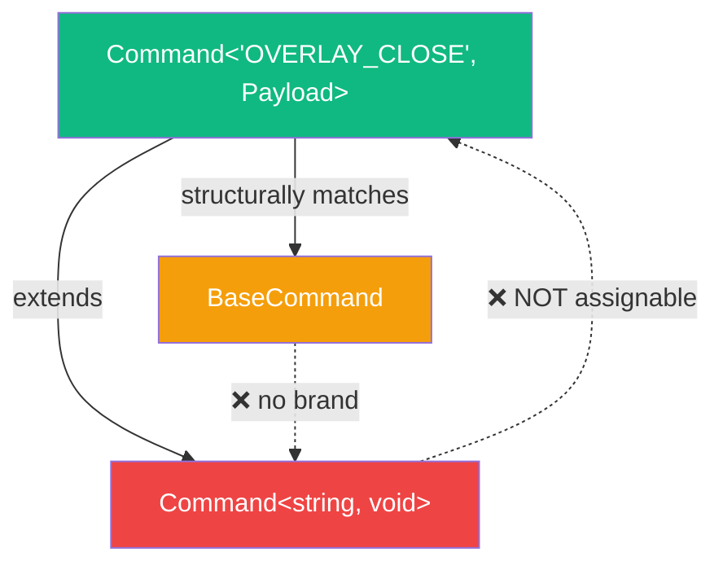
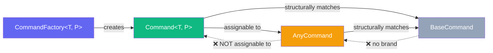

# AnyCommand 타입 신설 — 커맨드 타입 시스템의 구조적 문제와 해결

## 1. 개요 (Overview)

`onDismiss: () => void` → `AnyCommand` 리팩토링 과정에서, 커널의 **커맨드 타입 시스템**에 구조적 타입 호환성 문제가 발견되었다. 이를 해결하기 위해 `AnyCommand` 타입을 신설했다. 이 보고서는 이 타입이 **왜 필요했고**, **무엇이고**, **어디에 영향을 미치는지**를 상세히 기술한다.

---

## 2. 배경: 커맨드 타입 계층 구조

현재 프로젝트에는 **두 가지 커맨드 타입**이 공존한다:

### 2-1. `Command` (커널 패키지)

```typescript
// packages/kernel/src/core/tokens.ts
declare const __commandBrand: unique symbol;

type Command<Type extends string = string, Payload = void> = {
  readonly type: Type;
  readonly payload: Payload;
  readonly scope?: ScopeToken[];
  readonly [__commandBrand]: true;  // ← 브랜드 (런타임에 존재하지 않음)
};
```

- **위치**: `@kernel` 패키지
- **특징**: `unique symbol` 브랜드로 구조적 타입 호환 차단. 반드시 `CommandFactory`를 통해서만 생성 가능
- **기본값**: `Payload = void` — payload가 없는 커맨드가 기본

### 2-2. `BaseCommand` (앱 레이어)

```typescript
// src/os-new/schema/command/BaseCommand.ts
interface BaseCommand {
  type: string;
  payload?: any;
}
```

- **위치**: `src/os-new/schema/`
- **특징**: 브랜드 없음. 구조적으로 어떤 객체든 `{ type: string }` 이면 호환
- **용도**: Zone/FocusGroup의 `onAction`, `onSelect` 등의 prop 타입

### 2-3. 관계도



핵심 문제: **`Command`의 기본 Payload는 `void`**이다.

---

## 3. 문제 발생 (The Problem)

### 3-1. EffectMap의 dispatch 필드

커맨드 핸들러가 반환하는 `EffectMap`에는 `dispatch` 필드가 있다. 이 필드는 "이 커맨드 처리 후, 다른 커맨드를 연쇄 실행해라"는 뜻:

```typescript
// BEFORE
type TypedEffectMap<S, E> = {
  state?: S;
  dispatch?: Command | Command[];  // Command = Command<string, void>
};
```

**`Command`의 기본값이 `Command<string, void>`** 이므로, `dispatch` 필드는 **payload가 `void`인 커맨드만** 받을 수 있었다.

### 3-2. 실제 사용 시 타입 에러

`OVERLAY_CLOSE`의 타입은 `Command<"OS_OVERLAY_CLOSE", OverlayClosePayload>` 이다. 이걸 `dispatch`에 넣으면:

```typescript
// escape.ts — ESC 시 dismiss 커맨드를 연쇄 dispatch
return {
  state: newState,
  dispatch: OVERLAY_CLOSE({ id: overlayId }),
  //        ^^^^^^^^^^^^^^^^^^^^^^^^^^^^^^^^
  //        Type 'Command<"OS_OVERLAY_CLOSE", OverlayClosePayload>'
  //        is not assignable to type 'Command<string, void>'
  //        'OverlayClosePayload' is not assignable to 'void'
};
```

**`Payload = void`가 아닌 모든 커맨드가 `dispatch`에 들어갈 수 없었다.**

### 3-3. 기존 해결법: `as any`

이 때문에 프로젝트 전체에서 `dispatch: SOME_COMMAND(...) as any` 패턴이 반복되고 있었다:

| 파일 | 라인 | 코드 |
|---|---|---|
| `activate.ts` | 23 | `dispatch: EXPAND({ action: "toggle", itemId }) as any` |
| `select.ts` | 37 | `dispatch: EXPAND({ action: "toggle", itemId }) as any` |
| `navigate/index.ts` | 61 | `dispatch: EXPAND({ action: "expand", itemId }) as any` |
| `register.ts` | 26 | `dispatch: OVERLAY_CLOSE({ id }) as any` |

**`as any`가 4곳에서 반복** — Type-Strict 원칙 위반의 근본 원인이었다.

---

## 4. 해결: `AnyCommand` 타입

### 4-1. 정의

```typescript
// packages/kernel/src/core/tokens.ts
/** Any command regardless of payload type. For generic storage/dispatch. */
type AnyCommand = Command<string, any>;
```

- `Payload = any`로 설정하여 **어떤 payload 타입이든 호환**
- `__commandBrand`는 유지 — **브랜드 안전성은 보존**
- `any`를 사용하는 것은 **타입 레벨 와일드카드**이지, 안전성 구멍이 아님

### 4-2. 왜 `unknown`이 아닌 `any`인가?

```typescript
// unknown을 쓰면:
type AnyCommand = Command<string, unknown>;

// Command<"ESCAPE", void>가 AnyCommand에 할당 불가!
// void ⊄ unknown (exactOptionalPropertyTypes 모드에서)
```

`exactOptionalPropertyTypes: true` 설정 때문에, `void`와 `unknown`은 호환되지 않는다. `any`만이 모든 payload 타입을 수용할 수 있다.

### 4-3. `BaseCommand`와의 차이

| | `BaseCommand` | `AnyCommand` | `Command` |
|---|---|---|---|
| **위치** | `src/os-new/schema/` | `@kernel` | `@kernel` |
| **브랜드** | ❌ 없음 | ✅ `__commandBrand` | ✅ `__commandBrand` |
| **Payload** | `any` (optional) | `any` | `void` (default) |
| **생성 제약** | 아무 객체나 가능 | `CommandFactory` 필수 | `CommandFactory` 필수 |
| **용도** | Zone prop 타입 (외부 API) | 커널 내부 저장/전달 | 특정 커맨드의 구체 타입 |



### 4-4. 적용 범위

`AnyCommand` 도입으로 변경된 곳:

| 대상 | Before | After |
|---|---|---|
| `TypedEffectMap.dispatch` | `Command \| Command[]` | `AnyCommand \| AnyCommand[]` |
| `ZoneEntry.onDismiss` | — (없었음) | `AnyCommand` |
| `FocusGroupProps.onDismiss` | `() => void` | `AnyCommand` |
| `ZoneProps.onDismiss` | `() => void` | `AnyCommand` |

---

## 5. 영향 분석

### 5-1. 즉시 해결된 것

- `escape.ts`에서 `dispatch: dismissCommand`를 **캐스트 없이** 반환 가능
- `onDismiss`에 `OVERLAY_CLOSE({ id })` 를 **캐스트 없이** 전달 가능

### 5-2. 후속 개선 가능한 것

`AnyCommand` 도입으로 인해 다음 `as any` 캐스트들도 **제거 가능**:

```typescript
// activate.ts:23 — BEFORE
dispatch: EXPAND({ action: "toggle", itemId }) as any,
// AFTER (AnyCommand이므로 캐스트 불필요)
dispatch: EXPAND({ action: "toggle", itemId }),
```

  총 **4건의 `as any`** (activate.ts, select.ts, navigate/index.ts ×2)가 추가 수정 없이 제거 가능하다. 검증이 필요하지만, `TypedEffectMap.dispatch`가 `AnyCommand`로 변경되었으므로 이론적으로 호환된다.

### 5-3. 주의 사항

> [!CAUTION]
> `AnyCommand`는 **저장/전달 전용**이다. 커맨드를 **생성**할 때는 반드시 `CommandFactory`를 통해야 하며, 핸들러에서 커맨드를 **소비**할 때는 구체적 `Command<Type, Payload>` 타입을 사용해야 한다.

**올바른 사용**:
```typescript
// 저장 (OK)
onDismiss?: AnyCommand;

// 전달 (OK)  
dispatch: OVERLAY_CLOSE({ id }),

// 꺼내서 dispatch (OK — 런타임에서 type으로 라우팅)
kernel.dispatch(zoneEntry.onDismiss);
```

**잘못된 사용**:
```typescript
// ❌ 커맨드를 직접 구성하면서 AnyCommand 타입 선언
const cmd: AnyCommand = { type: "FAKE", payload: {} };
// → 브랜드가 없어서 컴파일 에러 (의도대로 차단됨)
```

---

## 6. 결론

### `BaseCommand`와 `AnyCommand`의 역할 분담

| 역할 | 타입 | 이유 |
|---|---|---|
| **Zone/Component prop** (외부 API) | `BaseCommand` | 컴포넌트 계층은 커널 의존 없이 동작해야 함 |
| **커널 내부 저장/전달** (ZoneRegistry, EffectMap) | `AnyCommand` | 브랜드 안전성 유지 + payload 유연성 |
| **구체적 커맨드 핸들러** | `Command<T, P>` | 정확한 타입 추론 |

### 후속 작업 제안

1. **`as any` 정리**: `dispatch: EXPAND(...) as any` → `dispatch: EXPAND(...)` (4곳) — 빌드 검증 후 제거
2. **`BaseCommand` → `AnyCommand` 통합 검토**: Zone의 `onAction`, `onSelect` 등도 `AnyCommand`로 변경하면 `BaseCommand`를 완전히 제거할 수 있는지 평가
3. **`BaseCommand` 존속 여부**: 커널 의존 없이 동작해야 하는 외부 패키지/라이브러리가 있다면 유지, 없다면 `AnyCommand`로 통합
