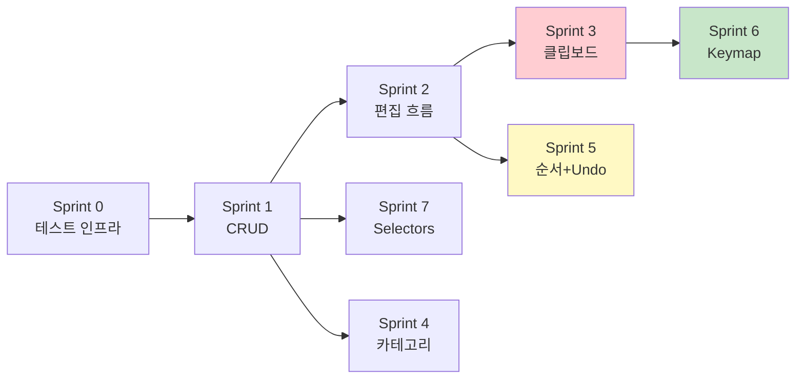

# TDD-First 개밥먹기 실행 계획 — Todo Headless → 커널/OS 적응

| 항목 | 내용 |
| :--- | :--- |
| **원문** | TDD 방식으로 e2e 테스트를 작성하면서 우리 커널과 OS 방식으로 이상적으로 먼저 구현이 되었다고 상상해서 모든 구현을 먼저 다 한다면 그에 맞게 커널과 OS를 대응하는 식으로 전형적으로 고객요구사항을 맞춰가는 식의 방식으로 나머지 OS의 Productivity를 높이는 전략으로 갈거야. 실행 plan을 작성해 |
| **내(AI)가 추정한 의도** | Todo 앱을 "고객"으로, 커널/OS를 "플랫폼"으로 놓고 — 고객이 원하는 이상적 API를 먼저 테스트로 정의한 뒤 플랫폼을 맞춰가는 Outside-In TDD로 커널/OS의 생산성을 끌어올리려는 것 |
| **날짜** | 2026-02-12 |
| **상태** | Draft |

---

## 1. 개요 (Overview)

### 전략 요약: Outside-In TDD

```
┌─────────────────────────────────────────────────────────────────┐
│  1. RED — 이상적 API를 상상하여 테스트를 작성                      │
│     "이 API가 있었으면 좋겠다" → 컴파일 에러 OK                    │
│                                                                   │
│  2. GREEN — 테스트를 통과시키기 위해 커널/OS를 구현                 │
│     커널에 없는 기능이면? → 커널에 추가                             │
│     OS에 없는 프리미티브면? → OS에 추가                            │
│                                                                   │
│  3. REFACTOR — 패턴이 보이면 추상화                                │
│     "이건 Todo만의 문제가 아니라 모든 앱에 필요하다"                 │
│     → OS/커널 공통 프리미티브로 승격                                │
└─────────────────────────────────────────────────────────────────┘
```

**핵심**: Todo 앱이 **요구사항 발생기**. 커널/OS가 **요구사항 수용자**. 이것이 전통적 플랫폼 개발의 "고객 주도(Customer-Driven)" 방식.

### 테스트 레벨 전략

| 레벨 | 도구 | 목적 | 뷰 의존 |
| :--- | :--- | :--- | :--- |
| **L1. 순수 로직 테스트** | `kernel.dispatch` + assertion | 커맨드 핸들러 순수성 검증 | ❌ |
| **L2. 통합 테스트** | `kernel.dispatch` + state 검사 | 커맨드 체인, 미들웨어, 이펙트 연동 | ❌ |
| **L3. E2E 테스트** | TestBot (in-browser) | 사용자 시나리오 end-to-end | ✅ |

> L1, L2는 **headless 전용** — DOM 없이 `kernel.dispatch` → `kernel.getState()` 패턴.
> L3는 기존 TodoBot과 동일 패턴 — View 연결 후.

---

## 2. 실행 계획 (Execution Sprints)

### Sprint 0: 테스트 인프라 준비

> **목표**: headless 테스트를 실행할 환경 구축

| # | 작업 | 상세 |
| :--- | :--- | :--- |
| 0-1 | **headless 테스트 러너 확인** | `kernel.dispatch` → `kernel.getState()` 패턴이 TestBot 없이 단독 실행 가능한지 확인. 가능하면 별도 러너 불필요 |
| 0-2 | **테스트 헬퍼 모듈** | `test/helpers.ts` — `createTestKernel()`, `snapshot()`, `restore()`, `dispatchAndAssert()` 유틸리티 |
| 0-3 | **테스트 파일 컨벤션** | `__tests__/` 디렉토리에 `*.headless.test.ts` 명명 |

---

### Sprint 1: Model + CRUD 커맨드 (순수 로직)

> **목표**: 가장 기본적인 상태와 커맨드를 이상적 API로 작성

#### 1-1. RED — 이상적 API로 테스트 작성

```typescript
// __tests__/todo-crud.headless.test.ts

test("ADD_TODO: draft 텍스트로 todo 생성", () => {
  // 이상적: dispatch만으로 상태 변경 완료
  const { dispatch, getState } = createTodoKernel()
  
  dispatch(SyncDraft({ text: "Buy milk" }))
  dispatch(AddTodo())
  
  const todos = selectVisibleTodos(getState())
  expect(todos).toHaveLength(1)
  expect(todos[0].text).toBe("Buy milk")
  expect(getState().ui.draft).toBe("")  // draft 초기화됨
})

test("DELETE_TODO: 삭제 후 todoOrder에서도 제거", () => {
  const { dispatch, getState } = createTodoKernel()
  
  dispatch(AddTodo({ text: "Delete me" }))
  const id = selectVisibleTodos(getState())[0].id
  
  dispatch(DeleteTodo({ id }))
  expect(selectVisibleTodos(getState())).toHaveLength(0)
})

test("TOGGLE_TODO: completed 토글", () => {
  const { dispatch, getState } = createTodoKernel()
  
  dispatch(AddTodo({ text: "Toggle me" }))
  const id = selectVisibleTodos(getState())[0].id
  
  dispatch(ToggleTodo({ id }))
  expect(getState().data.todos[id].completed).toBe(true)
  
  dispatch(ToggleTodo({ id }))
  expect(getState().data.todos[id].completed).toBe(false)
})
```

#### 1-2. GREEN — 커핵/구현 대응

| 테스트 요구사항 | 현재 상태 | 필요 작업 |
| :--- | :--- | :--- |
| `createTodoKernel()` | ❌ 없음 | 테스트 전용 커널 팩토리 작성 |
| `selectVisibleTodos()` | ❌ View에 흩어져 있음 | `selectors.ts`로 통합 |
| `AddTodo`, `DeleteTodo`, `ToggleTodo` | ✅ 존재 | payload 타입 수정 (id: number → string) |
| `SyncDraft` | ✅ 존재 | 그대로 사용 |

#### 1-3. REFACTOR

- ID를 `string`으로 통일 (현재 `number`/`string` 혼재)
- Selector 모듈 추출

---

### Sprint 2: 편집 흐름 (상태 머신)

> **목표**: StartEdit → SyncEditDraft → CommitEdit/CancelEdit 상태 전이 검증

#### 2-1. RED

```typescript
test("편집 흐름: Enter → 수정 → Enter (저장)", () => {
  const { dispatch, getState } = createTodoKernel()
  
  dispatch(AddTodo({ text: "Original" }))
  const id = selectVisibleTodos(getState())[0].id
  
  // 편집 시작
  dispatch(StartEdit({ id }))
  expect(getState().ui.editingId).toBe(id)
  expect(getState().ui.editDraft).toBe("Original")
  
  // 수정
  dispatch(SyncEditDraft({ text: "Modified" }))
  expect(getState().ui.editDraft).toBe("Modified")
  
  // 저장
  dispatch(CommitEdit())
  expect(getState().data.todos[id].text).toBe("Modified")
  expect(getState().ui.editingId).toBeNull()
})

test("편집 취소: Escape하면 원본 유지", () => {
  const { dispatch, getState } = createTodoKernel()
  
  dispatch(AddTodo({ text: "Keep Me" }))
  const id = selectVisibleTodos(getState())[0].id
  
  dispatch(StartEdit({ id }))
  dispatch(SyncEditDraft({ text: "Changed" }))
  dispatch(CancelEdit())
  
  expect(getState().data.todos[id].text).toBe("Keep Me")
  expect(getState().ui.editingId).toBeNull()
})
```

#### 2-2. GREEN

| 요구사항 | 현재 | 작업 |
| :--- | :--- | :--- |
| `CommitEdit` | ❌ `UpdateTodoText`가 이 역할이지만 payload에 text를 받음 | `CommitEdit`로 리네임 + editDraft 자동 사용 |

---

### Sprint 3: 클립보드 (이펙트 시스템 도전)

> **목표**: 클립보드를 순수 커맨드 + 이펙트로 분리. **커널 이펙트 시스템 검증의 핵심 스프린트**

#### 3-1. RED — 이상적 순수 커맨드

```typescript
test("COPY_TODO: 앱 클립보드에 복사 (순수, 사이드이펙트 없음)", () => {
  const { dispatch, getState } = createTodoKernel()
  
  dispatch(AddTodo({ text: "Copy me" }))
  const id = selectVisibleTodos(getState())[0].id
  
  dispatch(CopyTodo({ id }))
  
  // 앱 클립보드 상태에 저장됨
  expect(getState().clipboard.todo?.text).toBe("Copy me")
  expect(getState().clipboard.isCut).toBe(false)
})

test("CUT_TODO: 복사 + 원본 삭제", () => {
  const { dispatch, getState } = createTodoKernel()
  
  dispatch(AddTodo({ text: "Cut me" }))
  const id = selectVisibleTodos(getState())[0].id
  
  dispatch(CutTodo({ id }))
  
  expect(getState().clipboard.todo?.text).toBe("Cut me")
  expect(getState().clipboard.isCut).toBe(true)
  expect(selectVisibleTodos(getState())).toHaveLength(0)
})

test("PASTE_TODO: 클립보드에서 새 아이템 생성", () => {
  const { dispatch, getState } = createTodoKernel()
  
  dispatch(AddTodo({ text: "Source" }))
  const id = selectVisibleTodos(getState())[0].id
  
  dispatch(CopyTodo({ id }))
  dispatch(PasteTodo())
  
  const todos = selectVisibleTodos(getState())
  expect(todos).toHaveLength(2)
  expect(todos[1].text).toBe("Source")
})
```

#### 3-2. GREEN — 커널/OS 대응

| 요구사항 | 현재 | 작업 |
| :--- | :--- | :--- |
| `AppState.clipboard` | ❌ 모듈 글로벌 변수 | `ClipboardState`를 AppState에 추가 |
| `navigator.clipboard` 호출 | ⚠️ 커맨드 내 직접 호출 | **커널 이펙트로 분리** |
| 이펙트 선언 반환 | ❌ 커널 `defineEffect` API 검증 필요 | 이펙트 시스템 구현/확인 |

> [!IMPORTANT]
> 이 스프린트가 **커널 이펙트 시스템의 첫 실전 적용**. 
> `navigator.clipboard` 호출이 커맨드 밖으로 나가야 하므로, `defineEffect("clipboardWrite", ...)` 패턴이 동작해야 함.
> 만약 커널에 이 기능이 없으면 → **커널 확장 필요** (Outside-In의 핵심 순간)

---

### Sprint 4: 카테고리 CRUD (신규 비즈니스 로직)

> **목표**: 현재 하드코딩된 카테고리에 CRUD 추가

#### 4-1. RED

```typescript
test("ADD_CATEGORY: 새 카테고리 추가", () => {
  const { dispatch, getState } = createTodoKernel()
  
  dispatch(AddCategory({ text: "Fitness" }))
  
  const cats = selectCategories(getState())
  expect(cats.some(c => c.text === "Fitness")).toBe(true)
})

test("DELETE_CATEGORY: 소속 todo → 미분류 이동", () => {
  const { dispatch, getState } = createTodoKernel()
  
  dispatch(AddCategory({ text: "Temp" }))
  const catId = selectCategories(getState()).find(c => c.text === "Temp")!.id
  
  dispatch(SelectCategory({ id: catId }))
  dispatch(AddTodo({ text: "Orphan" }))
  
  dispatch(DeleteCategory({ id: catId }))
  
  // 소속 todo가 Inbox로 이동
  dispatch(SelectCategory({ id: "inbox" }))
  const todos = selectVisibleTodos(getState())
  expect(todos.some(t => t.text === "Orphan")).toBe(true)
})
```

#### 4-2. GREEN

| 요구사항 | 현재 | 작업 |
| :--- | :--- | :--- |
| `AddCategory` | ❌ 없음 | 신규 커맨드 작성 |
| `DeleteCategory` | ❌ 없음 | 신규 + 소속 todo 재배치 로직 |
| `RenameCategory` | ❌ 없음 | 신규 커맨드 |

---

### Sprint 5: 순서 변경 + Undo/Redo (미들웨어 검증)

> **목표**: 아이템/카테고리 순서 변경과 history 미들웨어 검증

#### 5-1. RED

```typescript
test("MOVE_ITEM_UP: 첫 번째 아이템은 이동 불가", () => {
  const { dispatch, getState } = createTodoKernel()
  
  dispatch(AddTodo({ text: "First" }))
  dispatch(AddTodo({ text: "Second" }))
  const firstId = selectVisibleTodos(getState())[0].id
  
  dispatch(MoveItemUp({ id: firstId }))
  expect(selectVisibleTodos(getState())[0].id).toBe(firstId) // 변화 없음
})

test("UNDO: 삭제 되돌리기", () => {
  const { dispatch, getState } = createTodoKernel()
  
  dispatch(AddTodo({ text: "Undoable" }))
  const id = selectVisibleTodos(getState())[0].id
  
  dispatch(DeleteTodo({ id }))
  expect(selectVisibleTodos(getState())).toHaveLength(0)
  
  dispatch(UndoCommand())
  expect(selectVisibleTodos(getState())).toHaveLength(1)
  expect(selectVisibleTodos(getState())[0].text).toBe("Undoable")
})
```

#### 5-2. GREEN

| 요구사항 | 현재 | 작업 |
| :--- | :--- | :--- |
| `UndoCommand` | ✅ 수동 구현 (`history.ts`) | 커널 `history: true` 미들웨어와 통합 or 유지 결정 |
| 커널 history MW | ✅ 존재 (transaction recording) | 실전 검증 — snapshot 방식 확인 |

> [!WARNING]
> Undo/Redo 테스트가 **커널 history 미들웨어 vs. 수동 구현** 중 어느 것에 의존하는지 결정하는 분기점.
> 미들웨어가 충분하면 수동 `history.ts` 삭제 가능.

---

### Sprint 6: Keymap + Logic Context (선언적 인텐트)

> **목표**: 키맵이 올바른 커맨드로 라우팅되는지 검증

#### 6-1. RED

```typescript
test("Enter on Draft → ADD_TODO", () => {
  const context: TodoContext = {
    activeZone: "listView",
    isDraftFocused: true,
    isEditing: false,
    hasSelection: false,
    clipboardHasItem: false,
  }
  
  const resolved = resolveKeymap(TODO_KEYMAP, "Enter", context)
  expect(resolved?.command).toBe(AddTodo)
})

test("Enter on Item (not editing) → START_EDIT", () => {
  const context: TodoContext = {
    activeZone: "listView",
    isDraftFocused: false,
    isEditing: false,
    hasSelection: false,
    clipboardHasItem: false,
  }
  
  const resolved = resolveKeymap(TODO_KEYMAP, "Enter", context)
  expect(resolved?.command).toBe(StartEdit)
})
```

#### 6-2. GREEN

| 요구사항 | 현재 | 작업 |
| :--- | :--- | :--- |
| `resolveKeymap()` | ❌ 테스트용 유틸리티 없음 | 키맵 해석 로직을 순수 함수로 추출 |
| `TodoContext` 확장 | ⚠️ `hasSelection`, `clipboardHasItem` 없음 | 타입 확장 + Bridge 매핑 업데이트 |

> 키맵 resolution을 순수 함수로 추출하면, DOM/React 없이 키바인딩 규칙을 완전히 테스트 가능

---

### Sprint 7: Selectors (파생 데이터)

> **목표**: 모든 파생 데이터를 순수 selector 함수로 추출하고 테스트

#### 7-1. RED

```typescript
test("selectVisibleTodos: 선택된 카테고리만 필터", () => {
  const state = createStateWith({
    todos: {
      "1": { id: "1", text: "A", categoryId: "work", completed: false },
      "2": { id: "2", text: "B", categoryId: "personal", completed: false },
    },
    selectedCategoryId: "work",
  })
  
  expect(selectVisibleTodos(state)).toHaveLength(1)
  expect(selectVisibleTodos(state)[0].text).toBe("A")
})

test("selectStats: 완료/미완료 카운트", () => {
  const state = createStateWith({
    todos: {
      "1": { id: "1", completed: true },
      "2": { id: "2", completed: false },
      "3": { id: "3", completed: true },
    },
  })
  
  expect(selectStats(state)).toEqual({ total: 3, completed: 2, active: 1 })
})

test("selectTodosByCategory: 보드뷰용 그룹핑", () => {
  const state = createStateWith({ /* multiple categories */ })
  
  const grouped = selectTodosByCategory(state)
  expect(grouped.get("work")).toHaveLength(2)
  expect(grouped.get("personal")).toHaveLength(1)
})
```

#### 7-2. GREEN — 순수 함수이므로 커널 의존 없음

---

## 3. 스프린트 순서 및 커널/OS 영향 매트릭스



| Sprint | Todo 앱 변경 | 커널 변경 | OS 변경 | 난이도 |
| :--- | :--- | :--- | :--- | :--- |
| **S0** 테스트 인프라 | `test/helpers.ts` | — | — | 🟢 |
| **S1** CRUD | 리팩토링 (ID 통일, selector 추출) | — | — | 🟢 |
| **S2** 편집 흐름 | `CommitEdit` 리네임 | — | — | 🟢 |
| **S3** 클립보드 | `clipboard` 상태 통합, 순수 커맨드 | **이펙트 시스템 실전 검증** | — | 🔴 |
| **S4** 카테고리 | 신규 3개 커맨드 | — | — | 🟢 |
| **S5** 순서+Undo | 테스트 추가 | **history MW 실전 검증** | — | 🟡 |
| **S6** Keymap | Context 확장 | — | `resolveKeymap` 순수 추출 | 🟡 |
| **S7** Selectors | `selectors.ts` 신규 | — | — | 🟢 |

---

## 4. 커널/OS 생산성 향상 포인트 (Outside-In 발견 목록)

이 과정에서 발견될 것으로 **예상되는** 커널/OS 개선사항:

| # | 발견 예상 시점 | 개선사항 | 영향 범위 |
| :--- | :--- | :--- | :--- |
| 1 | S0 | `createTestKernel()` — 앱별 테스트 커널 팩토리 필요 | 커널 |
| 2 | S1 | `dispatch` 반환값으로 결과 상태 접근 패턴 필요? | 커널 |
| 3 | S3 | `defineEffect` → 커맨드가 이펙트를 **선언적으로 반환**하는 패턴 | 커널 (핵심) |
| 4 | S5 | history MW의 스냅샷 전략 검증 → `history: true`가 실전에서 작동하는지 | 커널 |
| 5 | S6 | 키맵 resolution을 순수 함수로 추출 → 테스트 가능한 OS 유틸리티 | OS |
| 6 | 전체 | `AppSliceHandle`에 `dispatch` 숏컷이 있으면 편할 수 있음 | 커널 DX |

---

## 5. 결론 및 제안

### 즉시 시작 가능한 순서

1. **S0 + S1 동시 착수** — 테스트 인프라 + CRUD는 기존 코드 위에서 바로 시작 가능
2. **S7 (Selectors) 병렬** — 순수 함수라서 의존성 없이 바로 작성 가능
3. **S3 (클립보드)**를 핵심 마일스톤으로 — 커널 이펙트 시스템의 첫 실전 투입

### 전략의 리스크

| 리스크 | 완화 |
| :--- | :--- |
| 커널 이펙트 API가 기대와 다를 수 있음 | S3 전에 `defineEffect` 현재 구현 확인 |
| history MW가 수동 Undo를 대체하지 못할 수 있음 | S5에서 두 방식 비교 테스트 |
| headless 테스트 실행 환경이 없을 수 있음 | S0에서 Vitest or TestBot 확장으로 해결 |

---

## 6. 해법 유형 (Solution Landscape)

🟢 **Known** — Outside-In TDD는 확립된 방법론(London School TDD, ATDD). 커널 "고객" 주도 개발은 마이크로소프트(dogfooding), Stripe(API-first) 등에서 검증된 전략.

---

## 7. 인식 한계 (Epistemic Status)

- Vitest가 프로젝트에 설정되어 있는지 확인 안 됨. 순수 단위 테스트 러너가 없으면 TestBot 프레임워크를 확장하거나 Vitest를 도입해야 함
- `defineEffect`의 현재 구현 수준(선언적 반환 지원 여부)을 런타임으로 확인하지 못함
- 각 Sprint의 소요 시간은 추정이며, 커널 변경이 필요한 S3/S5는 변동 가능성 높음

---

## 8. 열린 질문 (Open Questions)

1. **테스트 러너**: Vitest 도입 vs. 기존 TestBot 확장 vs. 단순 `assert` 기반 스크립트?
2. **Sprint 우선순위**: S3(클립보드 이펙트) vs. S5(Undo/Redo MW) 중 커널 검증 우선순위는?
3. **ID 마이그레이션 타이밍**: `number` → `string` 전환 시 기존 데이터 마이그레이션 전략은?
4. **테스트 위치**: `src/apps/todo/__tests__/` vs. `tests/` 루트?

---

**한줄요약**: Todo 앱의 이상적 API를 테스트로 먼저 정의하고(RED), 커널/OS가 이를 충족하도록 맞춰가는(GREEN) Outside-In TDD 7개 스프린트 계획이며, 클립보드(S3)와 Undo(S5)가 커널 이펙트/히스토리 시스템의 실전 검증 핵심 마일스톤이다.
