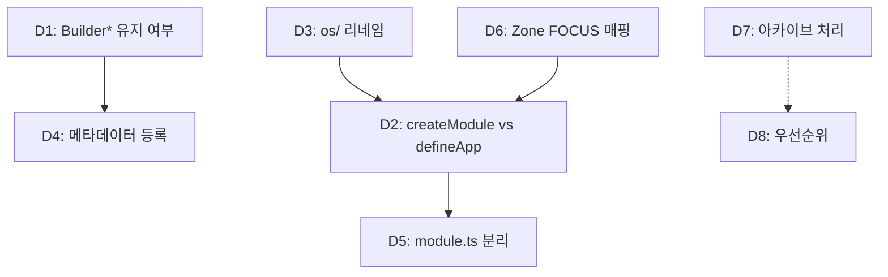

# 의사 결정 대기 목록

| 항목 | 내용 |
|------|------|
| **원문** | 의사 결정이 필요한거 알려줘 |
| **내(AI)가 추정한 의도** | 프로젝트 전반에 걸쳐 사용자의 명시적 판단이 필요한 미결 사안을 한 곳에 모아 우선순위를 정하려 한다 |
| **날짜** | 2026-02-13 |

---

## 1. 개요

TODO, 프로젝트 문서, 최근 대화 20건, builder 개밥먹기 결과를 크로스 체크하여 **사용자의 의사결정이 필요한 항목**만 추출했다. 자명한 해법(Known)은 제외하고 🟡 Constrained / 🔴 Open 항목만 수록.

---

## 2. 의사 결정 목록

### 🔴 아키텍처 의사결정 (프로젝트 방향에 영향)

| # | 결정 사항 | 맥락 | 영향 범위 |
|---|----------|------|----------|
| **D1** | **`Builder.*` 프리미티브 유지 vs 전환** | `Builder.Section/Group/Item/Badge/Button/Icon/Link`가 OS 프리미티브와 별도로 존재. `os-core-refactoring`의 Trigger/Label/Root 전환과 충돌. 삭제하면 builder 전용 타입 어노테이션 소실 | os-core-refactoring, builder 전체 |
| **D2** | **`createModule` vs `defineApp` 통합** | `createModule` proposal이 `defineApp`과 거의 동일한 API를 제안. 둘을 별도로 유지할지, `defineApp`을 확장하여 통합할지 | create-module 프로젝트, todo-app |
| **D3** | **`os/` → 리네임 시점과 전략** | 교차 import ~47곳. 한 번에 할지, 점진적으로 할지. Zustand 완전 제거와 연동 여부 | os-core-refactoring 전체 |

### 🟡 설계 의사결정 (구현 방식 선택)

| # | 결정 사항 | 선택지 | 추천 |
|---|----------|--------|------|
| **D4** | **Builder 메타데이터 등록 방식** | A) `data-builder-type` DOM 조회 유지 B) app state에 `metadata` 맵 추가 C) `Builder.*` 프리미티브가 마운트 시 자동 등록 | B가 테스트 가능하지만, D1 결정에 의존 |
| **D5** | **module.ts 500줄 관리** | A) 커맨드별 파일 분리 + re-export B) 단일 파일 유지 C) 카테고리별 파일 분리 (list/clipboard/sidebar) | C가 균형적이나 취향 의존 |
| **D6** | **`Widget.Zone` FOCUS 매핑 범용화** | 현재 `{ id: OS.FOCUS }` 고정 주입. `{ focusId: OS.FOCUS }` 등 다른 키가 필요한 커맨드 존재 | 컨벤션 통일 필요 |

### 🟠 프로젝트 관리 의사결정 (즉시 실행 가능)

| # | 결정 사항 | 상태 | 추천 |
|---|----------|------|------|
| **D7** | **아카이브 대상 3건 처리** | `remapping`(완료), `focus-showcase`(비활성), `runner-architecture`(전제 소멸) | 3건 모두 아카이브 |
| **D8** | **다음 프로젝트 우선순위** | Now에 6건 적체: Todo 붙여넣기, E2E 3건, clipboard 분리, Inspector 확인, 아카이브 처리 | Now 중 의존도순 정렬 필요 |

---

## 3. 의존 관계

> [!IMPORTANT]
> **D1 (Builder* 유지 여부)과 D2 (createModule vs defineApp 통합)가 가장 영향 범위가 크다.** 이 두 결정이 나머지 설계 결정(D4, D5, D6)의 전제조건이다.

---

## 4. 해법 유형

🔴 **Open** — 프로젝트 고유의 설계 철학과 향후 방향에 따라 답이 달라지는 의사결정들이다. 업계 best practice가 존재하지 않는 내부 아키텍처 선택.

## 5. 인식 한계

- 최근 대화 20건의 요약 기반으로 추출. 대화 내부 디테일은 확인하지 못함.
- `os-core-refactoring` STATUS 문서의 진행률(65%)은 자기 평가 기준. 실제 코드와 차이 가능.
- D3(리네임)의 "~47곳"은 이전 분석 시점. 현재 수치와 다를 수 있음.

## 6. 열린 질문

1. **D1**: `Builder.*`를 유지하고 OS 프리미티브로 점진 전환할까, 일괄 삭제할까?
2. **D2**: `createModule`을 별도 API로 만들까, `defineApp`을 확장하여 흡수할까?
3. **D3**: `os/` 리네임을 지금 할까, Zustand 제거 후로 미룰까?
4. **D7**: 아카이브 3건을 지금 바로 처리할까?
5. **D8**: Now 6건의 우선순위를 어떻게 정할까?

---

**한줄요약**: 아키텍처 결정 3건(Builder* 유지, createModule 통합, os/ 리네임), 설계 결정 3건(메타데이터 등록, 파일 분리, Zone 매핑), 관리 결정 2건(아카이브, 우선순위) — 총 8건의 미결 의사결정이 있으며, D1과 D2가 나머지의 전제조건.
