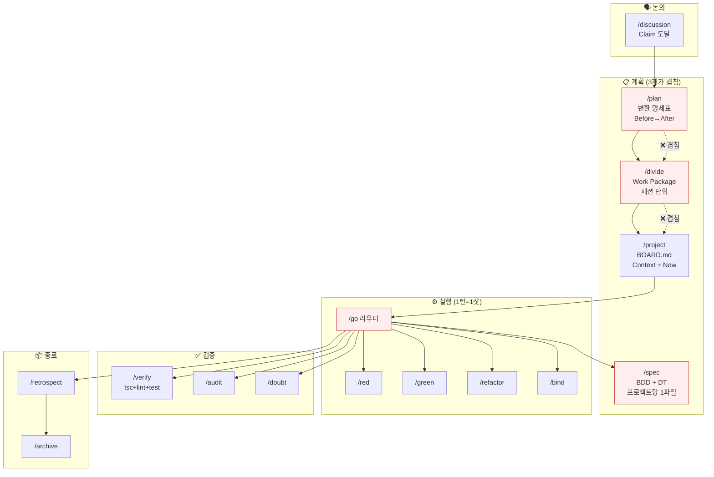
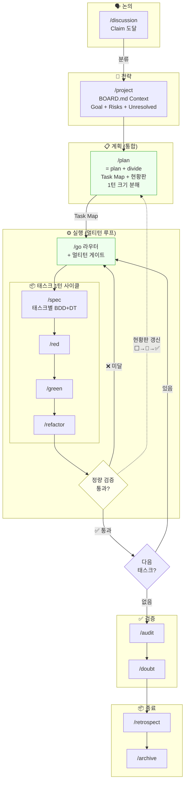
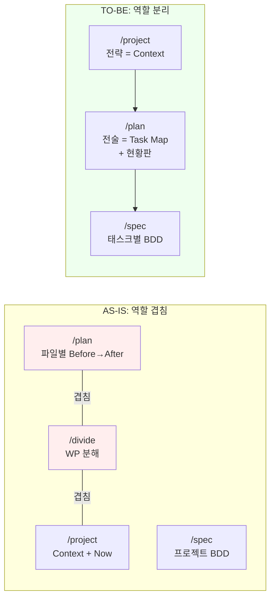
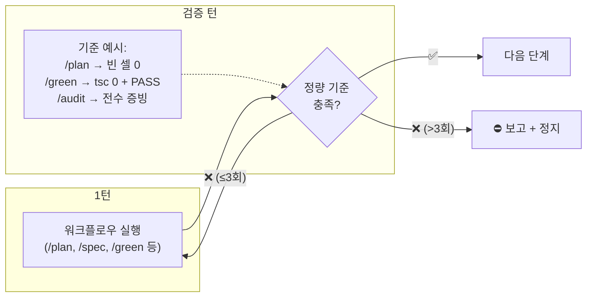

# 파이프라인 재설계 다이어그램

> 작성일: 2026-03-09
> 출처: /discussion — 과설계 논의 → 파이프라인 재구성

## 1. 현재 파이프라인 (AS-IS)

### 문제점
- `/plan`, `/divide` 역할 중복 (둘 다 "뭘 해야 하나")
- `/project`가 전략(Context) + 전술(Now) 혼재
- `/spec`이 프로젝트 단위라 태스크별 분리 불가
- `/go`가 1턴=1샷 — 검증 후 재진입 없음
- `/blueprint` §7도 실행 계획을 만듦 (또 겹침)

---

## 2. 제안 파이프라인 (TO-BE)

### 해소된 충돌

| # | 충돌 | 해소 |
|---|------|------|
| C1 | /blueprint §7 vs /plan | /blueprint §7 제거. /blueprint는 §1~§6(분석)만 담당, 실행 계획은 /plan으로 위임 |
| C2 | /solve → /divide 참조 | /solve의 Complex 위임 대상을 /divide → /plan으로 교체 |
| C3 | /go 전면 재구성 | 멀티턴 게이트 추가. 정량 검증 실패 시 같은 단계 재진입 |
| C4 | spec 단위 | 프로젝트당 1파일 → 태스크별 섹션 (spec.md 안에 태스크 헤딩) |
| C5 | Meta 예외 | Meta → /plan 스킵. /project가 Now에 직접 태스크 배치 (현행 유지) |

---

## 3. 역할 비교

---

## 4. 멀티턴 게이트 상세

