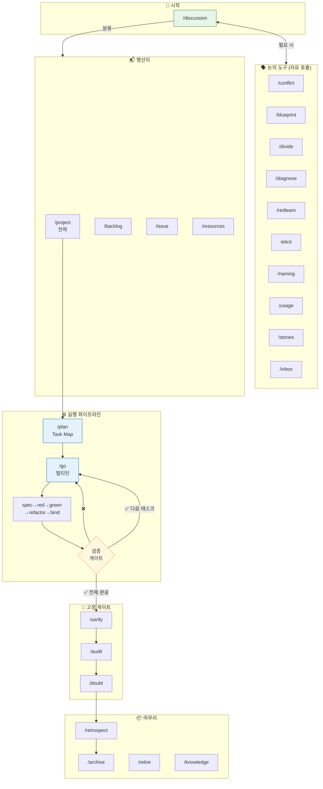

# 스킬 체계 (Skill Taxonomy)

> 작성일: 2026-03-09
> 출처: /discussion — 과설계 논의 → 스킬 범주화
> 상태: 합의 완료, 구현 전

## 설계 원칙

1. **유일한 시작점 = `/discussion`**. 모든 일은 논의에서 시작한다.
2. **워크플로우 2층**: 논의 도구(순서 없음) + 실행 파이프라인(순서 있음).
3. **삭제 3개**: `/rework`, `/design`, `/routes` — 사용 실적 없음.
4. **나머지 44개는 의도가 있으나, 의도와 현재 구현(.md) 사이에 갭이 있다.**

---

## 9범주 분류

### 🚪 시작 — 유일한 입구

| 스킬 | 역할 |
|------|------|
| `/discussion` | Toulmin 논증으로 Claim 도달. 모든 일의 시작점 |

### 🗣️ 논의 도구 — discussion 안에서 자유 호출, 순서 없음

| 스킬 | 역할 |
|------|------|
| `/conflict` | 충돌 진단 (Evaporating Cloud) |
| `/blueprint` | TOC 분석 §1~§6 (실행 계획 제외) |
| `/divide` | 복잡한 문제를 이해하기 위해 분해 |
| `/diagnose` | 실패 원인 분석 (코드 수정 없이) |
| `/redteam` | 외부 전문가 관점 설계 검증 |
| `/elicit` | 전문가(사용자)의 암묵지 추출 |
| `/naming` | 이름 설계 (convention/structure 성격, 개편 예정) |
| `/usage` | Design Spike — 이상적 Usage 코드로 컨셉 검증 |
| `/stories` | User Story 발견·정리 |
| `/inbox` | 요청을 정형화된 보고서로 구조화 |

### 📬 행선지 — discussion 결과를 보내는 곳

| 스킬 | 역할 |
|------|------|
| `/project` | 전략 컨테이너 (Context, Goal, Risks, Unresolved, Scaffold) |
| `/backlog` | 나중에 할 아이디어 보관 |
| `/issue` | 긴급 수정 자율 처리 |
| `/resources` | 참고 자료 수집·생성 |

### ⚙️ 실행 파이프라인 — 순서대로 흐름

```
/plan → /go → [/spec → /red → /green → /refactor → /bind]× (태스크별 반복)
```

| 스킬 | 역할 |
|------|------|
| `/plan` | Task Map + 현황판 + 1턴 크기 분해 (구 /plan + /divide 전술 통합) |
| `/go` | 라우터 + 멀티턴 게이트. 상태 복원 후 올바른 단계 재개 |
| `/spec` | 태스크별 BDD Scenarios + Decision Table |
| `/red` | 실패하는 테스트 작성 |
| `/green` | 테스트 통과하는 최소 구현 |
| `/refactor` | 패턴 전환 리팩토링 |
| `/bind` | headless 로직 → UI 연결 |

### 🚧 고정 게이트 — 파이프라인 내 필수 통과 지점

| 스킬 | 역할 |
|------|------|
| `/verify` | tsc + lint + test 기계적 검증 |
| `/audit` | OS 계약 위반 전수 검사 |
| `/doubt` | 과잉 산출물 점검 ("줄일 수 있나?") |

### 🔄 환기 — 막혔을 때, 아무 시점에서 호출

| 스킬 | 역할 |
|------|------|
| `/why` | 근본 원인 찾기. LLM 잘못된 컨텍스트 탈출 |
| `/reflect` | 방향 점검. 의도와 결과 일치 확인 |
| `/solve` | Complex 항목 자율 해결 (RCA → 옵션 → 통합) |
| `/review` | 코드 리뷰. 철학 준수 + 네이밍 일관성 |
| `/fix` | 에러 즉시 수정 ("고쳐라") |
| `/ban` | 최후 탈출. 잘못된 컨텍스트 즉시 중단 |
| `/perf` | 성능 근본 원인 해결 |

### 📦 마무리 — 프로젝트/세션 종료 시

| 스킬 | 역할 |
|------|------|
| `/retrospect` | KPT 회고 (개발·협업·워크플로우) |
| `/archive` | 프로젝트 매장 + 지식 환류 |
| `/retire` | superseded 문서 제거 |
| `/knowledge` | 새 지식 영구 반영 |

### 🏗️ 인프라 — 시스템 운영

| 스킬 | 역할 |
|------|------|
| `/auto` | /go 자율 실행 (Stop Hook) |
| `/ready` | 개발 환경 확인·복구 |
| `/status` | STATUS.md 대시보드 갱신 |
| `/rules` | rules.md 규칙 추가/수정 |
| `/workflow` | 워크플로우 생성/수정 |
| `/_middleware` | 자동 지식 축적 미들웨어 |

### 🎯 도메인 특화 — 이 프로젝트 전용

| 스킬 | 역할 |
|------|------|
| `/apg` | W3C APG 패턴 구현·검증 |
| `/coverage` | Unit 커버리지 측정 + 갭 분석 |

---

## 삭제 대상

| 스킬 | 사유 |
|------|------|
| `/rework` | 사용 실적 없음 |
| `/design` | 사용 실적 없음 |
| `/routes` | 사용 실적 없음 |

---

## 전체 흐름



> **🔄 환기** (`/why`, `/reflect`, `/solve`, `/review`, `/fix`, `/ban`, `/perf`)는 위 흐름의 **어디서든** 호출 가능.
> **🏗️ 인프라** (`/auto`, `/ready`, `/status`, `/rules`, `/workflow`, `/_middleware`)는 시스템 운영.
> **🎯 도메인** (`/apg`, `/coverage`)은 프로젝트 특화.

---

## 주요 변경 (AS-IS → TO-BE)

| 변경 | 내용 |
|------|------|
| `/plan` 역할 확대 | 변환 명세표 → Task Map + 현황판 + 1턴 크기 분해 |
| `/divide` 역할 축소 | 실행 계획 → 논의 도구(이해를 위한 분해만) |
| `/project` 역할 축소 | Context + Now → Context만 (전략 컨테이너) |
| `/spec` 단위 변경 | 프로젝트당 1파일 → 태스크별 |
| `/go` 기능 추가 | 라우터 → 라우터 + 멀티턴 게이트 |
| `/blueprint` §7 제거 | Execution Plan → /plan으로 위임 |
| `/inbox` 범주 이동 | 인프라 → 논의 도구 |
| 삭제 3개 | /rework, /design, /routes |

---

## 다음 단계

이 체계를 실제 .md 파일에 반영하는 작업이 필요하다:
1. 각 스킬의 의도-구현 갭 매핑
2. .md 파일 개편 (역할 재정의, 범주 태그 추가)
3. /go 라우팅 테이블 재구성
4. 삭제 대상 3개 제거
