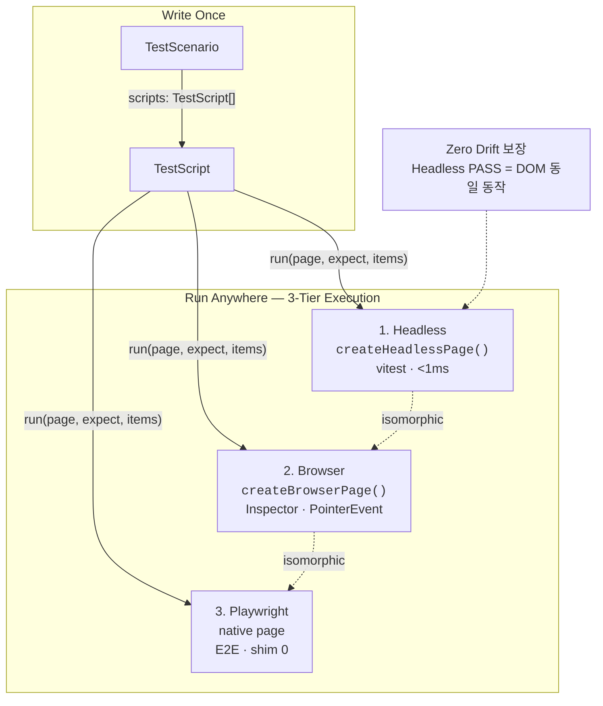
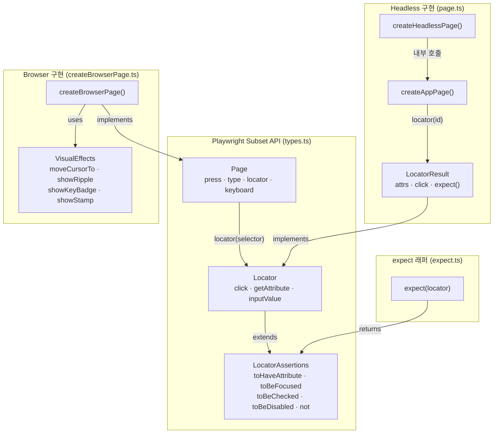
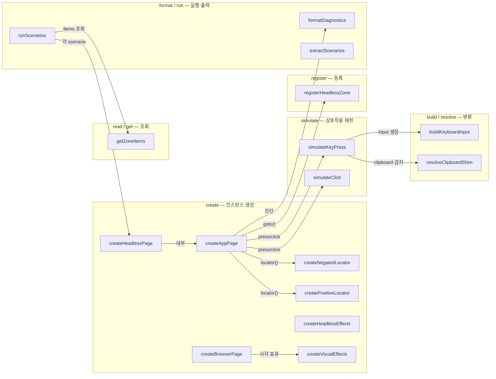
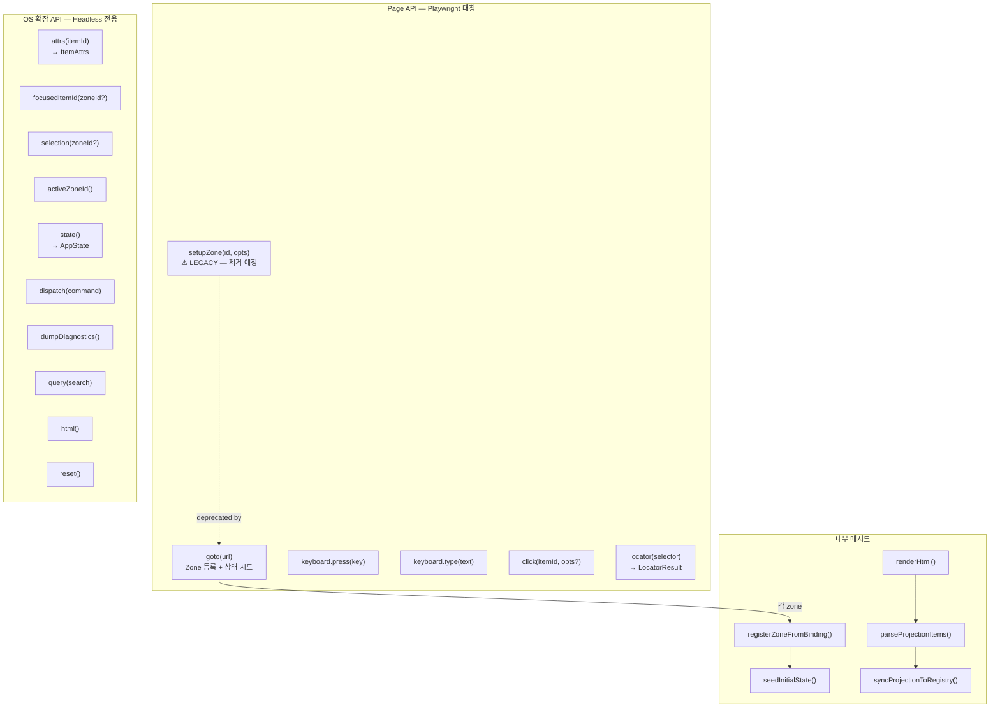
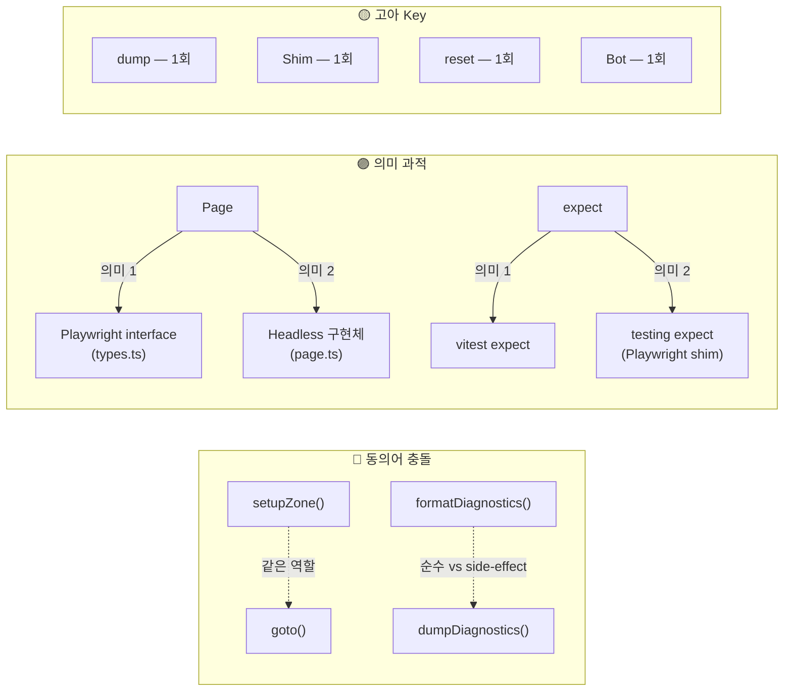

# Headless Test — 이름 관계도

| 항목 | 내용 |
|------|------|
| **원문** | 이름을 중심으로 관계도를 머메이드로 그려줄래? |
| **내(AI)가 추정한 의도** | **경위**: headless test 개념 확립 과정에서 naming Key Pool이 텍스트 표로만 존재. **표면**: Mermaid 다이어그램으로 이름 간 관계를 시각화하라. **의도**: 흩어진 식별자들의 구조적 관계를 한눈에 보고, 개념의 계층과 빈 자리를 직관적으로 파악하고 싶다. |
| **날짜** | 2026-03-10 |
| **선행 문서** | [headless-test-concept.md](../0-inbox/2026-0310-1105-[analysis]-headless-test-concept.md) |

---

## 1. 3-Tier 실행 모델

---

## 2. Type 계층 — 인터페이스와 구현

---

## 3. 동사 × 대상 — 함수 관계 맵

---

## 4. Page API 메서드 — Playwright 대칭 맵

---

## 5. TestScript 생태계 — 스크립트 분류

```mermaid
graph TD
    subgraph "Generic Scripts (scripts.ts)"
        listbox["listboxScript"]
        toolbar["toolbarScript"]
        grid["gridScript"]
        radiogroup["radiogroupScript"]
        accordion["accordionScript"]
    end

    subgraph "APG Scripts (scripts/apg/)"
        apgAcc["apgAccordionScript"]
        apgBtn["apgButtonScript"]
        apgCar["apgCarouselScript"]
        apgChk["apgCheckboxScript"]
        apgDis["apgDisclosureScript"]
        apgFeed["apgFeedScript"]
        apgGrid["apgGridScript"]
        apgLBM["apgListboxMultiScript"]
        apgLBS["apgListboxSingleScript"]
        apgMenu["apgMenuScript"]
        apgMB["apgMenuButtonScript"]
        apgMeter["apgMeterScript"]
        apgRadio["apgRadiogroupScript"]
        apgSlider["apgSliderScript"]
        apgSliderM["apgSliderMultiThumbScript"]
        apgSpin["apgSpinbuttonScript"]
        apgSwitch["apgSwitchScript"]
        apgTabs["apgTabsAutoScript"]
        apgTB["apgToolbarScript"]
        apgTooltip["apgTooltipScript"]
        apgTree["apgTreeScript"]
        apgTG["apgTreegridScript"]
        apgWS["apgWindowSplitterScript"]
    end

    subgraph "Runners"
        runS["runScenarios()"]
        TBR["TestBotRegistry"]
    end

    TS2["TestScenario<br/>zone + role + config + scripts"]
    TS2 --> runS
    TS2 --> TBR
    runS -->|"vitest<br/>describe/it"| listbox
    TBR -->|"Browser<br/>Inspector"| apgAcc
```

---

## 6. 이상 패턴 시각화

---

## 4. Cynefin 도메인 판정

🟢 **Clear** — Key Pool 데이터가 이미 수집되어 있고, Mermaid 문법으로 시각화하는 작업은 자명한 변환.

---

## 5. 인식 한계

- Mermaid 렌더러에 따라 `<code>`, ` ` 태그가 다르게 해석될 수 있다. GitHub/VS Code에서는 정상 렌더링 확인.
- `scripts/apg/` 23개 스크립트의 개별 내부 호출 관계는 생략. 모두 동일한 `TestScript` 인터페이스를 따른다.

---

## 6. 열린 질문

(없음 — Clear 도메인)

---

> **3줄 요약**
> Headless Test 시스템의 모든 식별자를 6개 Mermaid 다이어그램으로 시각화: 3-Tier 실행 모델, Type 계층, 동사×대상 함수 맵, Page API 대칭도, TestScript 생태계, 이상 패턴.
> 핵심 구조: TestScript → Page(interface) → 3개 구현(Headless/Browser/Playwright). Locator가 assertion과 요소 접근을 합친 Playwright 호환 API.
> 이상 패턴 3건(setupZone↔goto, format↔dump, Page 의미 과적)이 다이어그램에서 시각적으로 확인됨.
