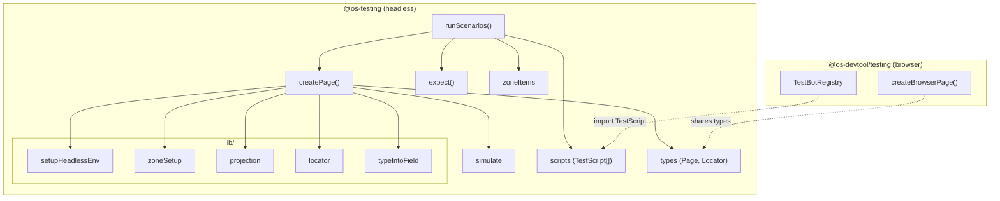
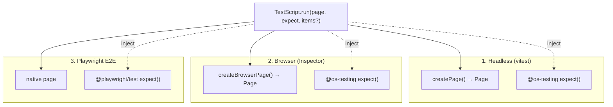
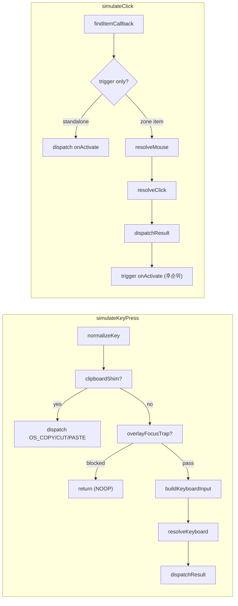
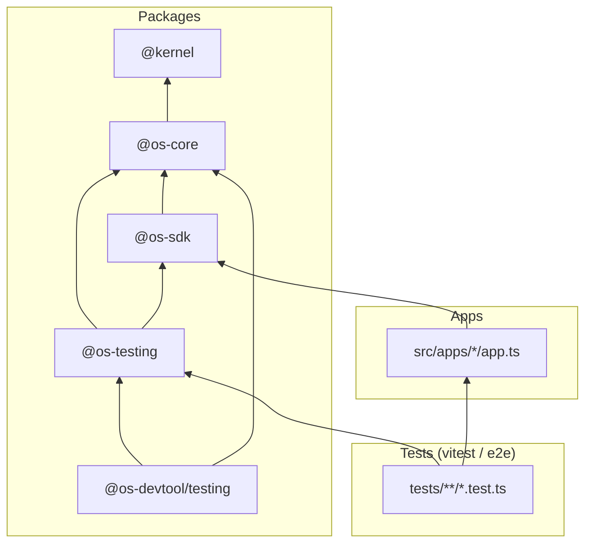

# os-testing 아키텍처 다이어그램

> 작성일: 2026-03-11
> 목적: `os-devtool → os-testing` 분리 후 테스팅 패키지의 모듈 관계와 데이터 흐름을 시각화

## 1. 패키지 분리 구조

두 패키지의 책임 경계를 보여준다. `@os-testing`은 headless(순수 함수), `@os-devtool/testing`은 browser-only.



## 2. createPage 내부 흐름

테스트의 유일한 API인 `page`가 어떻게 조립되는지 보여준다.

```mermaid
flowchart LR
  subgraph "createPage(app, Component?)"
    direction TB
    A["setupHeadlessEnv(keybindings)"] --> B["registerZones(bindings)"]
    B --> C["seedInitialState(zones)"]
    C --> D["createProjection(Component)"]
    D --> E["Page 객체 조립"]
  end

  subgraph "Page API"
    direction TB
    goto["goto(url)"]
    click["click(selector)"]
    press["keyboard.press(key)"]
    type["keyboard.type(text)"]
    loc["locator(selector)"]
    content["content()"]
  end

  E --> goto
  E --> click
  E --> press
  E --> type
  E --> loc
  E --> content

  click -->|"simulateClick"| SIM["simulate.ts"]
  press -->|"simulateKeyPress"| SIM
  loc -->|"createLocator"| LOC["locator.ts"]
  type -->|"typeIntoField"| TIF["typeIntoField.ts"]
  content -->|"render()"| PROJ["projection.ts"]
```

## 3. Isomorphism — 3환경 동일 스크립트

`TestScript.run(page, expect)` 하나로 3개 환경에서 동일하게 실행된다.



## 4. simulate.ts — OS Pipeline 진입점

headless에서 사용자 입력이 OS 커맨드로 변환되는 경로.



## 5. 의존성 계층

패키지 간 import 방향. 화살표 = import 방향.



## 범례

| 기호 | 의미 |
|------|------|
| `→` 실선 | 직접 import / 호출 |
| `-.->` 점선 | 타입 공유 / 런타임 주입 |
| subgraph | 패키지 또는 모듈 경계 |
| `?` 분기 | 조건부 경로 |
