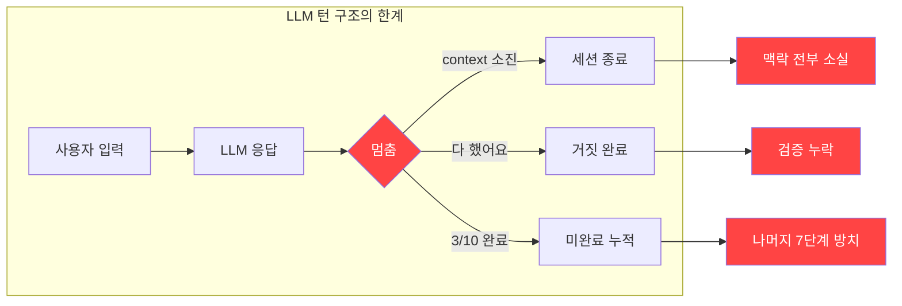
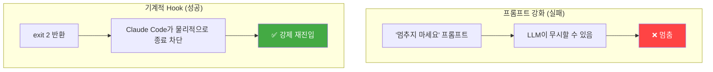
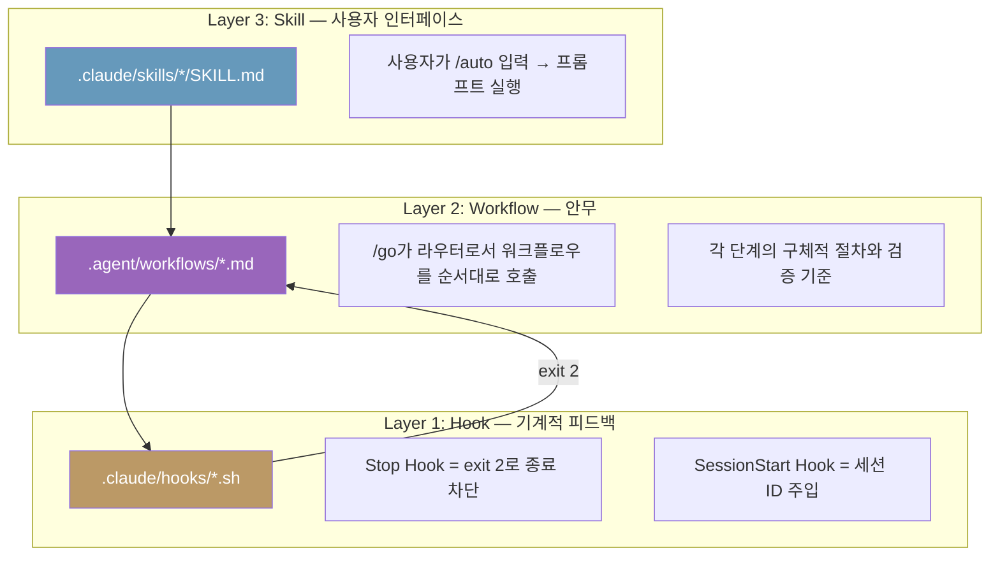
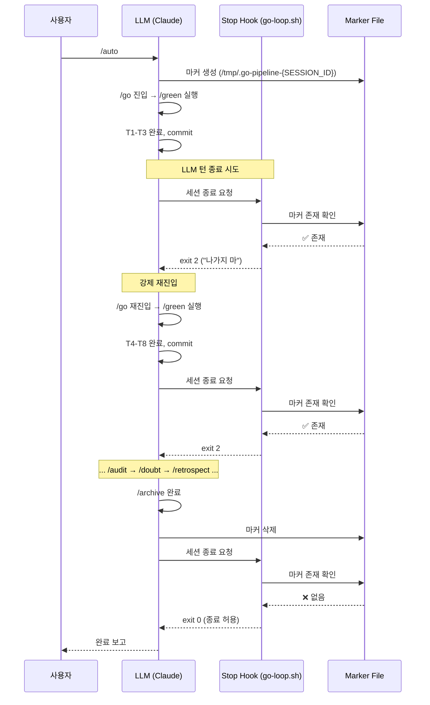
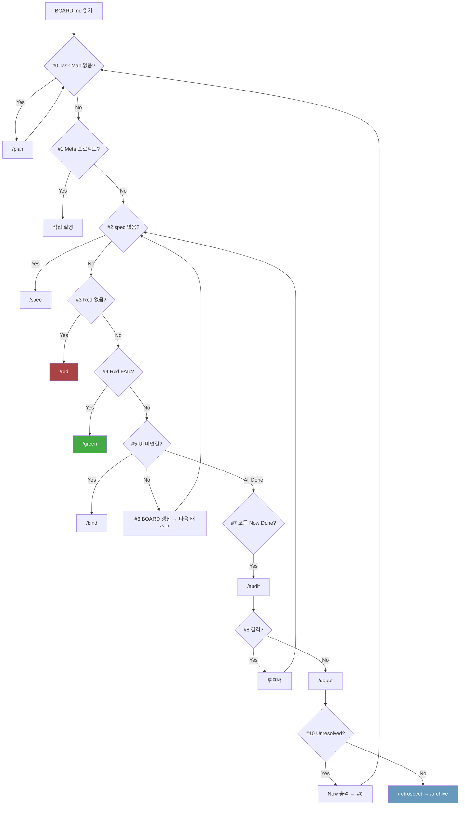
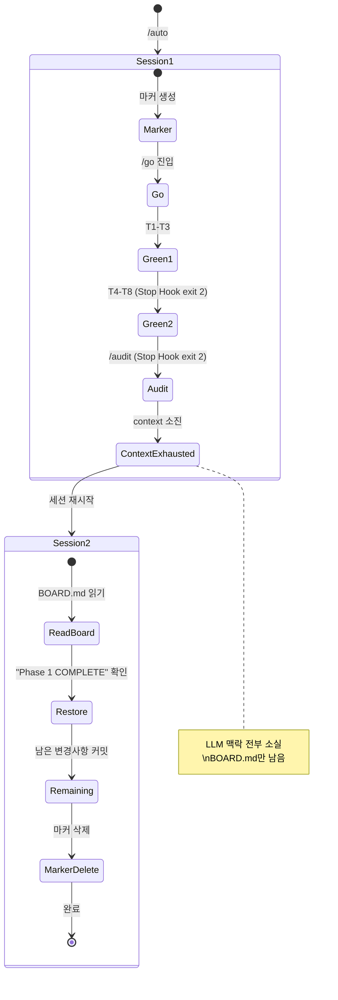
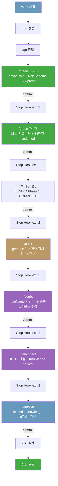
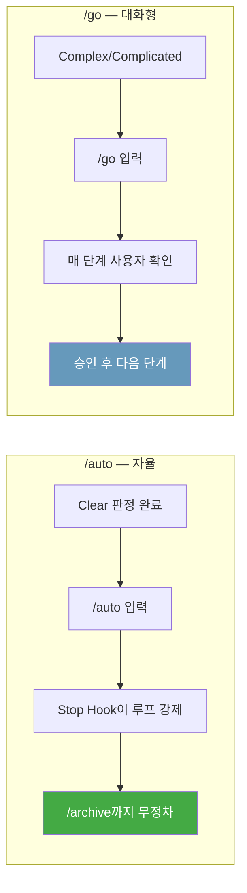
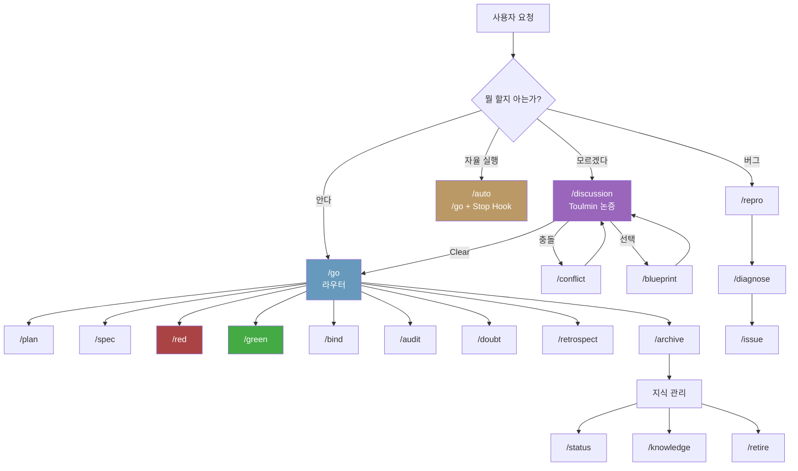
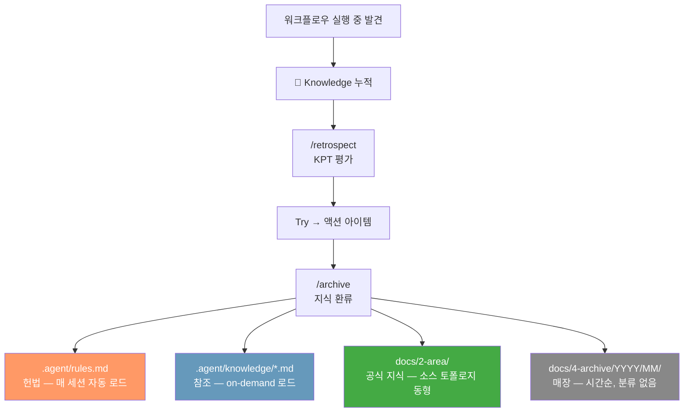

# /auto Pipeline — 자율 실행 파이프라인 해설

> 작성일: 2026-03-11
> 맥락: sdk-role-factory Phase 1 완료 직후, `/auto`가 실제로 돌아간 첫 번째 완전 사이클을 기반으로 작성

---

## Why — 이 시스템이 존재하는 이유

### 문제: LLM은 세션이 끊기면 잊는다

LLM 에이전트의 근본적 한계는 **context window = 작업 기억**이라는 점이다. 세션이 끊기면 이전에 뭘 하고 있었는지, 어디까지 했는지, 왜 이 방향을 선택했는지 전부 사라진다.

이건 단순한 불편함이 아니라 **품질 문제**다:

- 같은 문제를 매 세션 다른 방식으로 풀게 된다 (일관성 붕괴)
- "다 했어요"라고 선언했는데 실제로는 검증을 안 했다 (거짓 완료)
- 10단계 중 3단계에서 멈추면 나머지 7단계는 영원히 안 한다 (미완료 누적)



### 해결: 기계적 루프로 LLM의 턴 구조를 우회한다

LLM은 **한 번 응답하면 멈춘다**. 프롬프트로 "멈추지 마"라고 아무리 강조해도 소용없다. LLM의 행동은 프롬프트가 아니라 아키텍처가 결정한다.

해법은 프롬프트가 아니라 **셸 스크립트**다. Claude Code의 Stop Hook이 세션 종료 시점에 끼어들어, "아직 할 일이 남았으면 나가지 마"라고 **기계적으로** 차단한다.



### 배경: Compiler Self-hosting과의 동형

이 프로젝트(Interactive OS)는 프레임워크를 **프레임워크로** 개발하는 부트스트래핑 프로젝트다. OS의 주 사용자가 LLM이므로, 개발 도구 자체도 LLM이 자율적으로 사용할 수 있어야 한다.

Phase 1(현재): 인간이 커맨드를 입력하고, LLM이 실행한다.
Phase 2(목표): LLM이 스스로 판단하고 실행한다. `/auto`는 Phase 2의 첫 번째 프로토타입이다.

---

## How — 어떻게 동작하는가

### 3계층 아키텍처



| 계층 | 역할 | 실행 주체 |
|------|------|----------|
| **Skill** | 사용자가 `/auto` 입력 시 프롬프트로 LLM에 주입 | LLM |
| **Workflow** | 각 단계의 절차 + 검증 기준 | LLM |
| **Hook** | 셸 스크립트. exit code로 세션 흐름 제어 | OS (Claude Code) |

### 핵심 메커니즘: Stop Hook의 exit 2 루프



**핵심 코드** (31줄):

```bash
# .claude/hooks/go-loop.sh
MARKER="/tmp/.go-pipeline-${SESSION_ID}"

if [ "$HOOK_ACTIVE" = "true" ]; then  # 무한루프 방지
  rm -f "$MARKER"
  exit 0      # 종료 허용
fi

if [ -f "$MARKER" ]; then             # 마커 존재 = 파이프라인 진행 중
  echo "/auto 파이프라인 진행 중..."
  exit 2      # ← 이것이 핵심. 종료 차단.
fi

exit 0        # 마커 없음 = 일반 대화. 정상 종료.
```

### 세션 격리: Ghost in the Machine

```bash
# .claude/hooks/session-start.sh (12줄)
SESSION_ID=$(echo "$INPUT" | jq -r '.session_id // empty')
echo "export CLAUDE_SESSION_ID='$SESSION_ID'" >> "$CLAUDE_ENV_FILE"
```

Claude Code는 세션마다 고유 ID를 부여한다. SessionStart Hook이 이 ID를 환경변수로 주입하면, `/auto`가 세션별 마커 파일(`/tmp/.go-pipeline-{SESSION_ID}`)을 생성한다. 여러 터미널에서 동시에 Claude Code를 열어도 서로의 `/auto`를 간섭하지 않는다.

### /go — 라우터 + 멀티턴 게이트

`/auto`는 `/go`의 자율 실행 버전이다. `/go`가 실제 두뇌다.



**멀티턴 게이트**: 각 단계가 끝나면 정량 검증을 수행한다. LLM의 "다 했어요"를 신뢰하지 않는다.

| 단계 | 검증 기준 | 측정 방법 |
|------|----------|----------|
| /green | `tsc 0` + `lint 0` + `vitest PASS` | `npm run typecheck && biome check && vitest run` |
| /audit | grep 전수 검사 로그 존재 | 출력 확인 |
| /doubt | 전체 항목 🟢 판정 | 재귀 라운드 수렴 |

검증 실패 시 같은 단계를 **3회까지 재시도**한다. 4회 초과 시 멈추고 사용자에게 보고한다.

### BOARD.md — 세션 간 상태의 진짜 원천

Stop Hook 마커는 단일 세션 내에서만 유효하다. Context window가 소진되면 세션이 끊기고, LLM은 모든 맥락을 잊는다.



**마커는 편의, BOARD가 본질.**

새 세션에서 `/go`를 호출하면:
1. BOARD.md를 읽는다
2. Status가 ✅가 아닌 첫 번째 태스크를 찾는다
3. 해당 태스크의 상태에 따라 판별표를 매칭한다
4. 적절한 워크플로우로 라우팅한다

---

## What — 실제로 무슨 일이 일어났는가 (sdk-role-factory Phase 1)

### 프로젝트 목표

`bind({ role: "listbox", ...config })` → `bind("listbox", config)` 시그니처 변경.
role을 첫 번째 인자로 분리하여, role별 전용 config 타입을 tsc가 강제하도록 한다.

### 자율 실행 경로

사용자가 `/auto`를 입력한 후 `continue` 한 번만 입력했다. 나머지는 전부 자율 실행.



### 정량 결과

| 지표 | 값 |
|------|---|
| Tasks | T1-T9 전부 ✅ |
| tsc errors | 0 |
| lint errors (new) | 0 |
| 테스트 추가 | +6 |
| 테스트 실패 (new) | 0 |
| 마이그레이션 파일 수 | 54 (Node.js codemod) |
| Role objects 생성 | 27개 preset |
| 복잡도 개선 | resolveRole 21→5 (mergePreset 추출) |

### context window 소진 → 재개

실제로 이 세션은 한 번 context가 소진되어 끊겼다. `/archive`의 Step 5(/status) 실행 중이었다.

재개 시:
1. 이전 대화 요약이 자동으로 주입됨
2. BOARD.md를 읽어 "Phase 1 COMPLETE" 확인
3. 남은 unstaged 변경사항 확인
4. 커밋 + 마커 삭제로 마무리

**BOARD.md가 세션 간 브릿지로 동작한 실증 사례.**

---

## If — 만약에 / 앞으로

### /auto를 쓰려면

1. **전제: Clear 상태여야 한다.** `/discussion`으로 방향을 잡고, BOARD.md에 Task Map이 있어야 한다.
2. `/auto` 입력 → 끝. 사용자 개입 없이 `/archive`까지 간다.
3. **중단**: `Ctrl+C`로 언제든 가능. `rm /tmp/.go-pipeline-*`로 마커 수동 삭제도 가능.
4. **재개**: 세션이 끊기면 `/go`를 다시 입력. BOARD.md가 상태를 복원한다.

### /auto vs /go



| | /auto | /go |
|---|---|---|
| 자율 실행 | 사용자 개입 0 | 매 단계 사용자 확인 |
| 적합한 상황 | Clear 판정 후, 루틴 실행 | Complex/Complicated, 대화형 |
| 안전장치 | Stop Hook + 비가역 게이트 | 매 턴 사용자 승인 |
| 세션 간 | BOARD.md로 복원 | 동일 |

### 제약과 한계

- **단일 context window 한계**: `/auto`는 context가 소진되면 끊긴다. 마커는 살아있지만 LLM 맥락은 사라진다. 재개 시 수동 `/go`가 필요하다.
- **비가역 게이트**: 설계 변경이나 API 수정이 필요하면 `/auto`도 멈추고 사용자에게 묻는다. 완전 자율은 아니다.
- **4회 재시도 한계**: 같은 단계를 4번 실패하면 멈춘다. 무한 삽질 방지.

### 워크플로우 생태계 전체 지도



### Hook 인프라 요약

| Hook | 트리거 | 역할 | 파일 |
|------|--------|------|------|
| **SessionStart** | 세션 시작 | `CLAUDE_SESSION_ID`를 환경변수로 주입 | `session-start.sh` (12줄) |
| **Stop** | 세션 종료 시도 | 마커 확인 → exit 2로 종료 차단 | `go-loop.sh` (31줄) |
| **PostToolUse** | 도구 호출 후 | JSONL 감사 로그 기록 | `audit-log.sh` (34줄) |

### 지식 흐름



---

## 부록: 이번 /auto에서 실제로 발생한 문제와 해결

| 문제 | 원인 | 해결 |
|------|------|------|
| tsc `noPropertyAccessFromIndexSignature` | 테스트에서 `Record<string, unknown>` 캐스트 후 `.listboxRole` 접근 | 직접 import로 재작성 |
| biome complexity 21 > 15 | resolveRole에 Role 분기 추가로 복잡도 초과 | `mergePreset()` helper 추출 |
| 54파일 수동 마이그레이션 불가능 | bind 호출처가 너무 많음 | Node.js regex codemod 스크립트 작성 |
| context window 소진으로 세션 끊김 | /archive Step 5 실행 중 | BOARD.md 기반 상태 복원 후 재개 |
| `roleName` 추출 과잉 엔지니어링 | typeof/null/brand 체크 3중 방어 | `/doubt`에서 `typeof === "string" ? : .name`으로 단순화 |
