# Design Tension Report: packages/os-core/src/1-listen

> 생성일: 2026-03-12 (fresh context)
> Agent: /design-review
> 범위: packages/os-core/src/1-listen/
> 파일 수: 9개, 총 LOC: 1308

---

## Executive Summary

| Gate | Findings | Red | Yellow | Green |
|------|----------|-----|--------|-------|
| 1. Folder Structure | 네이밍 불일치 1건 | 0 | 1 | 5 |
| 2. LOC Analysis | God File 후보 1건, Hotspot 1건 | 0 | 2 | 0 |
| 3. Naming | 동의어 충돌 1건, 의미 과적 1건, 고아 Key 2건 | 0 | 2 | 2 |
| 4. Dependencies | 역방향 의존 1건 | 0 | 1 | 3 |
| 5. Design Tensions | Tension 2건 | 0 | 2 | 0 |
| **Total** | | **0** | **8** | **10** |

**최종 판정**: PASS (Red 0건. Yellow 8건은 모니터링/중기 과제)

---

## Gate 1: Folder Structure

### 1.1 디렉토리 트리 (전문)

```
packages/os-core/src/1-listen/
├── _shared/
│   ├── domQuery.ts
│   └── senseMouse.ts
├── clipboard/
│   └── resolveClipboard.ts
├── keyboard/
│   ├── resolveKeyboard.ts
│   └── senseKeyboard.ts
├── mouse/
│   ├── resolveClick.ts
│   ├── resolveMouse.ts
│   └── resolveTriggerClick.ts
└── pointer/
    └── resolvePointer.ts
```

### 1.2 검사 항목별 점검

| 검사 항목 | 결과 | 근거 |
|-----------|------|------|
| 빈 디렉토리 | 없음 | 5개 디렉토리 모두 파일 1개 이상 |
| 깊이 과잉 (>5) | 없음 | 최대 depth = 4 (`os-core/src/1-listen/keyboard/resolveKeyboard.ts`) |
| 고아 파일 | 없음 | `pointer/`와 `clipboard/`에 각 1파일이지만, W3C 이벤트 모듈 분류상 정당한 단일 파일 |
| 네이밍 불일치 | 발견 | `_shared/senseMouse.ts`에 mouse sense + drop sense + clickTarget sense가 혼재. 파일명이 `senseMouse`인데 mouse 이외의 관심사(drop, clickTarget)를 포함 |
| barrel export | 없음 | index.ts 파일 0개 |
| 순환 참조 후보 | 없음 | 내부 import는 `_shared` → 없음, `mouse` → `_shared`, `keyboard` → 없음. 단방향 |

### 1.3 Findings

**F1** (Yellow): `_shared/senseMouse.ts` 파일명 불일치 — 파일명은 `senseMouse`이지만, 내부에 `extractDropPosition`, `getDropPosition`, `senseClickTarget`, `ClickTarget` 등 mouse가 아닌 pointer/click 관심사가 포함되어 있다. `_shared/sensePointerDom.ts` 혹은 관심사별 분리가 더 정확한 네이밍이 될 것이다.

---

## Gate 2: LOC Analysis

### 2.1 파일별 LOC 전수 목록

| # | File | LOC | Classification | 비고 |
|---|------|-----|----------------|------|
| 1 | `_shared/senseMouse.ts` | 334 | God File 후보 | 5개 export 함수 + 3개 타입/인터페이스. Mouse sense, Extract, Drop sense, ClickTarget sense 4가지 관심사 |
| 2 | `keyboard/resolveKeyboard.ts` | 281 | Hotspot | 11회 변경(3개월). 3-layer chain + helper. 단일 관심사(keyboard resolve)이므로 God File은 아님 |
| 3 | `pointer/resolvePointer.ts` | 213 | Balanced (상한) | 순수 상태머신. 관심사: gesture FSM + slider value. 2개 관심사가 존재 |
| 4 | `mouse/resolveMouse.ts` | 144 | Balanced | 순수 resolve. 단일 관심사 |
| 5 | `keyboard/senseKeyboard.ts` | 112 | Balanced | DOM sense. 단일 관심사 |
| 6 | `mouse/resolveTriggerClick.ts` | 71 | Balanced | 순수 resolve. 단일 관심사 |
| 7 | `_shared/domQuery.ts` | 61 | Balanced | 공유 유틸 + re-entrance guard |
| 8 | `mouse/resolveClick.ts` | 52 | Balanced | 순수 resolve. 단일 관심사 |
| 9 | `clipboard/resolveClipboard.ts` | 40 | Balanced | 순수 resolve. 단일 관심사 |

### 2.2 모듈별 집계

| Module (폴더) | Files | Total LOC | Avg LOC | Max LOC (file) |
|---------------|-------|-----------|---------|----------------|
| `_shared/` | 2 | 395 | 198 | 334 (`senseMouse.ts`) |
| `keyboard/` | 2 | 393 | 197 | 281 (`resolveKeyboard.ts`) |
| `mouse/` | 3 | 267 | 89 | 144 (`resolveMouse.ts`) |
| `pointer/` | 1 | 213 | 213 | 213 (`resolvePointer.ts`) |
| `clipboard/` | 1 | 40 | 40 | 40 (`resolveClipboard.ts`) |
| **합계** | **9** | **1308** | **145** | **334** |

### 2.3 git 변경 빈도 (Hotspot 판정용)

3개월간 총 커밋 수: **19**

파일별 변경 빈도 상위:
```
11 packages/os-core/src/1-listen/keyboard/senseKeyboard.ts
11 packages/os-core/src/1-listen/keyboard/resolveKeyboard.ts
 9 packages/os-core/src/1-listen/_shared/senseMouse.ts
 3 packages/os-core/src/1-listen/mouse/resolveClick.ts
 2 packages/os-core/src/1-listen/pointer/resolvePointer.ts
 2 packages/os-core/src/1-listen/mouse/resolveTriggerClick.ts
 2 packages/os-core/src/1-listen/_shared/domQuery.ts
 1 packages/os-core/src/1-listen/mouse/resolveMouse.ts
 1 packages/os-core/src/1-listen/clipboard/resolveClipboard.ts
```

### 2.4 Findings

**L1** (Yellow): `_shared/senseMouse.ts` — 334 LOC, God File 경계. 4가지 관심사 혼재:
1. **MouseDown sense** (`senseMouseDown`, `extractMouseInput`, `MouseDownSense`) — mousedown 이벤트의 DOM 읽기 + 데이터 추출
2. **Drop sense** (`getDropPosition`, `extractDropPosition`, `DropSenseInput`) — 드래그 드롭 위치 계산
3. **ClickTarget sense** (`senseClickTarget`, `ClickTarget`) — pointerup 클릭 대상 분류
4. **공통 의존성**: `os`, `ZoneRegistry`, `TriggerOverlayRegistry` — sense 함수 3개가 공유

관심사 1과 3은 같은 레지스트리(`ZoneRegistry`, `TriggerOverlayRegistry`)를 읽지만, 입력 이벤트가 다르다(mousedown vs pointerup). 관심사 2(drop)는 완전히 별개.

**L2** (Yellow): `keyboard/resolveKeyboard.ts` — 281 LOC + 변경 빈도 11회 = Hotspot. 단일 관심사(keyboard resolve)이지만, 3-layer chain 구현이 복잡. `triggerItemLayer` 함수가 단독 80줄로 내부 분기가 많다(trigger keymap + inputmap + chain fallback).

---

## Gate 3: Naming Consistency

### 3.1 Export 식별자 전수 목록

| # | Identifier | File | Type |
|---|-----------|------|------|
| 1 | `ResolveResult` | `_shared/domQuery.ts:10` | interface |
| 2 | `findFocusableItem` | `_shared/domQuery.ts:21` | const (arrow fn) |
| 3 | `FocusTargetInfo` | `_shared/domQuery.ts:24` | interface |
| 4 | `resolveFocusTarget` | `_shared/domQuery.ts:29` | fn |
| 5 | `setDispatching` | `_shared/domQuery.ts:55` | fn |
| 6 | `isDispatching` | `_shared/domQuery.ts:59` | fn |
| 7 | `MouseDownSense` | `_shared/senseMouse.ts:20` | interface |
| 8 | `extractMouseInput` | `_shared/senseMouse.ts:48` | fn |
| 9 | `senseMouseDown` | `_shared/senseMouse.ts:111` | fn |
| 10 | `DropSenseInput` | `_shared/senseMouse.ts:206` | interface |
| 11 | `extractDropPosition` | `_shared/senseMouse.ts:215` | fn |
| 12 | `getDropPosition` | `_shared/senseMouse.ts:234` | fn |
| 13 | `ClickTarget` | `_shared/senseMouse.ts:256` | type |
| 14 | `senseClickTarget` | `_shared/senseMouse.ts:278` | fn |
| 15 | `ClipboardInput` | `clipboard/resolveClipboard.ts:14` | interface |
| 16 | `ClipboardResult` | `clipboard/resolveClipboard.ts:20` | type |
| 17 | `resolveClipboard` | `clipboard/resolveClipboard.ts:28` | fn |
| 18 | `KeyboardInput` | `keyboard/resolveKeyboard.ts:35` | interface |
| 19 | `resolveKeyboard` | `keyboard/resolveKeyboard.ts:95` | fn |
| 20 | `senseKeyboard` | `keyboard/senseKeyboard.ts:19` | fn |
| 21 | `ClickInput` | `mouse/resolveClick.ts:15` | interface |
| 22 | `resolveClick` | `mouse/resolveClick.ts:32` | fn |
| 23 | `MouseInput` | `mouse/resolveMouse.ts:18` | interface |
| 24 | `SelectMode` | `mouse/resolveMouse.ts:40` | type |
| 25 | `resolveSelectMode` | `mouse/resolveMouse.ts:46` | fn |
| 26 | `isClickExpandable` | `mouse/resolveMouse.ts:58` | fn |
| 27 | `resolveMouse` | `mouse/resolveMouse.ts:71` | fn |
| 28 | `TriggerClickInput` | `mouse/resolveTriggerClick.ts:24` | interface |
| 29 | `resolveTriggerClick` | `mouse/resolveTriggerClick.ts:45` | fn |
| 30 | `PointerInput` | `pointer/resolvePointer.ts:24` | interface |
| 31 | `PointerMoveInput` | `pointer/resolvePointer.ts:37` | interface |
| 32 | `GesturePhase` | `pointer/resolvePointer.ts:42` | type |
| 33 | `GestureState` | `pointer/resolvePointer.ts:44` | interface |
| 34 | `GestureResult` | `pointer/resolvePointer.ts:53` | type |
| 35 | `createIdleState` | `pointer/resolvePointer.ts:70` | fn |
| 36 | `resolvePointerDown` | `pointer/resolvePointer.ts:78` | fn |
| 37 | `resolvePointerMove` | `pointer/resolvePointer.ts:113` | fn |
| 38 | `resolvePointerUp` | `pointer/resolvePointer.ts:144` | fn |
| 39 | `SliderValueInput` | `pointer/resolvePointer.ts:178` | interface |
| 40 | `resolveSliderValue` | `pointer/resolvePointer.ts:188` | fn |

### 3.2 형태소 분해

| Identifier | Keys | 분해 |
|-----------|------|------|
| `ResolveResult` | Resolve + Result | 동사 + 접미사 |
| `findFocusableItem` | find + Focusable + Item | 동사 + 형용사 + 명사 |
| `FocusTargetInfo` | Focus + Target + Info | 명사 + 명사 + 접미사 |
| `resolveFocusTarget` | resolve + Focus + Target | 동사 + 명사 + 명사 |
| `setDispatching` | set + Dispatching | 동사 + 동명사 |
| `isDispatching` | is + Dispatching | 동사(query) + 동명사 |
| `MouseDownSense` | Mouse + Down + Sense | 명사 + 방향 + 접미사 |
| `extractMouseInput` | extract + Mouse + Input | 동사 + 명사 + 접미사 |
| `senseMouseDown` | sense + Mouse + Down | 동사 + 명사 + 방향 |
| `DropSenseInput` | Drop + Sense + Input | 명사 + 접미사 + 접미사 |
| `extractDropPosition` | extract + Drop + Position | 동사 + 명사 + 명사 |
| `getDropPosition` | get + Drop + Position | 동사 + 명사 + 명사 |
| `ClickTarget` | Click + Target | 명사 + 명사 |
| `senseClickTarget` | sense + Click + Target | 동사 + 명사 + 명사 |
| `ClipboardInput` | Clipboard + Input | 명사 + 접미사 |
| `ClipboardResult` | Clipboard + Result | 명사 + 접미사 |
| `resolveClipboard` | resolve + Clipboard | 동사 + 명사 |
| `KeyboardInput` | Keyboard + Input | 명사 + 접미사 |
| `resolveKeyboard` | resolve + Keyboard | 동사 + 명사 |
| `senseKeyboard` | sense + Keyboard | 동사 + 명사 |
| `ClickInput` | Click + Input | 명사 + 접미사 |
| `resolveClick` | resolve + Click | 동사 + 명사 |
| `MouseInput` | Mouse + Input | 명사 + 접미사 |
| `SelectMode` | Select + Mode | 동사 + 명사 |
| `resolveSelectMode` | resolve + Select + Mode | 동사 + 동사 + 명사 |
| `isClickExpandable` | is + Click + Expandable | 동사(query) + 명사 + 형용사 |
| `resolveMouse` | resolve + Mouse | 동사 + 명사 |
| `TriggerClickInput` | Trigger + Click + Input | 명사 + 명사 + 접미사 |
| `resolveTriggerClick` | resolve + Trigger + Click | 동사 + 명사 + 명사 |
| `PointerInput` | Pointer + Input | 명사 + 접미사 |
| `PointerMoveInput` | Pointer + Move + Input | 명사 + 동사 + 접미사 |
| `GesturePhase` | Gesture + Phase | 명사 + 명사 |
| `GestureState` | Gesture + State | 명사 + 접미사 |
| `GestureResult` | Gesture + Result | 명사 + 접미사 |
| `createIdleState` | create + Idle + State | 동사 + 형용사 + 접미사 |
| `resolvePointerDown` | resolve + Pointer + Down | 동사 + 명사 + 방향 |
| `resolvePointerMove` | resolve + Pointer + Move | 동사 + 명사 + 동사 |
| `resolvePointerUp` | resolve + Pointer + Up | 동사 + 명사 + 방향 |
| `SliderValueInput` | Slider + Value + Input | 명사 + 명사 + 접미사 |
| `resolveSliderValue` | resolve + Slider + Value | 동사 + 명사 + 명사 |

### 3.3 Key Pool 표

| Category | Key | Meaning | Count | Appears In |
|----------|-----|---------|-------|------------|
| Verb | `resolve` | 입력 데이터 → 커맨드/결정 | 14 | domQuery, resolveKeyboard, resolveClipboard, resolveClick, resolveMouse, resolveTriggerClick, resolvePointer (x5) |
| Verb | `sense` | DOM → 원시 데이터 추출 | 3 | senseMouseDown, senseKeyboard, senseClickTarget |
| Verb | `extract` | 구조화 데이터 → 타입 변환 | 2 | extractMouseInput, extractDropPosition |
| Verb | `find` | 조건 탐색 (없으면 null) | 1 | findFocusableItem |
| Verb | `get` | 저장소에서 꺼냄 | 1 | getDropPosition |
| Verb | `set` | 값 직접 설정 | 1 | setDispatching |
| Verb | `is` | boolean 질의 | 2 | isDispatching, isClickExpandable |
| Verb | `create` | 새 인스턴스 생성 | 1 | createIdleState |
| Noun | `Mouse` | 마우스 이벤트 도메인 | 6 | MouseDownSense, extractMouseInput, senseMouseDown, MouseInput, resolveMouse, resolveSelectMode |
| Noun | `Keyboard` | 키보드 이벤트 도메인 | 3 | KeyboardInput, resolveKeyboard, senseKeyboard |
| Noun | `Click` | 클릭 이벤트 | 5 | ClickTarget, senseClickTarget, ClickInput, resolveClick, isClickExpandable |
| Noun | `Pointer` | 포인터 이벤트 (제스처) | 5 | PointerInput, PointerMoveInput, resolvePointerDown/Move/Up |
| Noun | `Trigger` | ZIFT 트리거 | 2 | TriggerClickInput, resolveTriggerClick |
| Noun | `Clipboard` | 클립보드 이벤트 | 3 | ClipboardInput, ClipboardResult, resolveClipboard |
| Noun | `Drop` | 드롭 타겟 계산 | 2 | DropSenseInput, extractDropPosition, getDropPosition |
| Noun | `Gesture` | 포인터 제스처 FSM | 3 | GesturePhase, GestureState, GestureResult |
| Noun | `Slider` | 슬라이더 위젯 | 2 | SliderValueInput, resolveSliderValue |
| Noun | `Focus` | 포커스 대상 | 3 | findFocusableItem, FocusTargetInfo, resolveFocusTarget |
| Suffix | `Input` | resolve 함수 입력 | 8 | MouseInput, KeyboardInput, ClickInput, ClipboardInput, PointerInput, PointerMoveInput, TriggerClickInput, SliderValueInput |
| Suffix | `Result` | 함수 반환값 | 3 | ResolveResult, ClipboardResult, GestureResult |
| Suffix | `State` | 시간에 따라 변하는 상태 | 1 | GestureState |
| Suffix | `Info` | 탐색 결과 보조 데이터 | 1 | FocusTargetInfo |
| Suffix | `Sense` | DOM 읽기 결과 | 2 | MouseDownSense, DropSenseInput (Sense가 접미사이자 접두사로 혼용) |
| Suffix | `Mode` | 열거 분류 | 1 | SelectMode |
| Suffix | `Phase` | FSM 상태 열거 | 1 | GesturePhase |
| Suffix | `Target` | 대상 식별 | 2 | FocusTargetInfo, ClickTarget |

### 3.4 이상 패턴 분석

**동의어 충돌**: `sense` vs `extract` vs `get` — 이 세 동사가 "DOM에서 데이터를 읽어 구조화한다"는 유사한 의미로 사용된다.
- `senseMouseDown`: DOM → MouseInput (DOM 읽기 + 추출 합산)
- `extractMouseInput`: MouseDownSense → MouseInput (순수 변환)
- `getDropPosition`: DOM → drop position (DOM 읽기 + 추출 합산)

naming.md 기준: `sense` = DOM 읽기(비순수), `extract` = 원시→구조화(순수), `get` = 저장소에서 꺼냄. `getDropPosition`은 실제로 DOM을 읽고 있으므로 `sense`가 더 정확하다. 다만 naming.md가 `sense + extract` 병합을 허용하므로 `senseMouseDown`의 병합 자체는 규칙 내.

**고아 Key**:
- `Slider`: `resolveSliderValue` + `SliderValueInput`에서만 등장. pointer 모듈 안에 slider 관심사가 있는 것은 slider가 pointer gesture의 일종이기 때문이므로 정당하지만, 범위 내에서 `Slider`가 2회뿐이다.
- `Gesture`: pointer 모듈 전용. 3회 등장. 범위 내에서만 사용되므로 정당.

**의미 과적**: `resolve`가 두 가지 다른 의미로 사용된다.
1. **입력 → 커맨드 결정** (의사결정): `resolveKeyboard`, `resolveMouse`, `resolveClipboard`, `resolveClick`, `resolveTriggerClick` — 외부 이벤트를 분석해 OS 커맨드를 결정
2. **상태 전이 계산** (FSM): `resolvePointerDown`, `resolvePointerMove`, `resolvePointerUp` — 제스처 상태머신의 상태 전이를 계산
3. **DOM 탐색 결과** (탐색): `resolveFocusTarget` — DOM에서 포커스 대상을 찾아 반환

의미 1은 naming.md의 `resolve` 정의("입력을 분석하여 결과를 결정한다")에 정확히 부합. 의미 2는 state machine transition이므로 엄밀히는 `resolve`보다 `compute`에 가깝다(입력이 "현재 상태"이므로). 의미 3은 `find`에 가깝다(조건을 만족하는 항목 탐색). 그러나 3가지 모두 "판단/결정"의 확장된 의미로 해석 가능하므로, 심각한 과적은 아니다.

**2-tier 위반**: 없음. 범위 내에 OS 커맨드 정의가 없고, import만 있다(`OS_ACTIVATE`, `OS_FOCUS`, `OS_SELECT`, `OS_OVERLAY_OPEN`, `OS_OVERLAY_CLOSE` — 모두 SCREAMING_CASE).

### 3.5 Findings

**N1** (Yellow): `getDropPosition`의 동사 선택 — 실제 DOM을 읽는 비순수 함수인데 `get`을 사용. naming.md 기준으로 DOM 읽기 = `sense`. `senseDropPosition`이 더 정확하다.

**N2** (Yellow): `resolveFocusTarget`의 동사 선택 — DOM에서 `[data-item]` → `[data-zone]`을 탐색하여 `FocusTargetInfo`를 반환. naming.md 기준으로 DOM 탐색 = `sense`. 또는 조건 탐색이므로 `find`에 해당한다. `resolve`는 "입력→결정"에 예약된 동사인데, 이 함수는 의사결정을 하지 않는다.

**N3** (Green): `Sense` 접미사 혼용 — `MouseDownSense` (접미사), `DropSenseInput` (중간 위치). 접미사 Dictionary에 `Sense`가 없다. 현재 2건뿐이므로 모니터링.

**N4** (Green): `resolve` 의미 과적 — pointer FSM의 `resolvePointerDown/Move/Up`이 "상태 전이 계산"의 의미로 사용. naming.md 기준 `compute`에 가깝지만, pointer 모듈이 단일 파일이고 내부적으로 일관되므로 현재 수준에서는 혼란 없음. 모니터링.

---

## Gate 4: Dependencies

### 4.1 Import 문 전수 수집

#### `_shared/domQuery.ts`
```
import type { BaseCommand } from "@kernel/core/tokens";
```

#### `_shared/senseMouse.ts`
```
import { os } from "@os-core/engine/kernel";
import { TriggerOverlayRegistry } from "@os-core/engine/registries/triggerRegistry";
import { ZoneRegistry } from "@os-core/engine/registries/zoneRegistry";
import { findFocusableItem, resolveFocusTarget } from "../_shared/domQuery";
import type { MouseInput } from "../mouse/resolveMouse";
```

#### `clipboard/resolveClipboard.ts`
```
(no imports)
```

#### `keyboard/resolveKeyboard.ts`
```
import type { BaseCommand } from "@kernel/core/tokens";
import { type Keymap, NOOP, resolveChain } from "@os-core/2-resolve/chainResolver";
import { Keybindings } from "@os-core/2-resolve/keybindings";
import { resolveFieldKey, resolveFieldKeyByType } from "@os-core/2-resolve/resolveFieldKey";
import type { FieldType } from "@os-core/engine/registries/fieldRegistry";
import { buildTriggerKeymap, resolveTriggerRole } from "@os-core/engine/registries/triggerRegistry";
import type { ZoneCursor } from "@os-core/engine/registries/zoneRegistry";
import type { InputMap } from "@os-core/schema/types/focus/config/FocusGroupConfig";
import type { ResolveResult } from "../_shared/domQuery";
```

#### `keyboard/senseKeyboard.ts`
```
import { isEditingElement, resolveIsEditingForKey } from "@os-core/2-resolve/fieldKeyOwnership";
import { getCanonicalKey } from "@os-core/2-resolve/getCanonicalKey";
import { ROLE_FIELD_TYPE_MAP } from "@os-core/2-resolve/resolveFieldKey";
import { os } from "@os-core/engine/kernel";
import { TriggerOverlayRegistry } from "@os-core/engine/registries/triggerRegistry";
import { ZoneRegistry } from "@os-core/engine/registries/zoneRegistry";
import type { KeyboardInput } from "./resolveKeyboard";
```

#### `mouse/resolveClick.ts`
```
import type { BaseCommand } from "@kernel/core/tokens";
import { OS_ACTIVATE } from "@os-core/4-command";
import type { ResolveResult } from "../_shared/domQuery";
```

#### `mouse/resolveMouse.ts`
```
import type { BaseCommand } from "@kernel/core/tokens";
import { OS_ACTIVATE, OS_FOCUS, OS_SELECT } from "@os-core/4-command";
import type { ResolveResult } from "../_shared/domQuery";
```

#### `mouse/resolveTriggerClick.ts`
```
import type { BaseCommand } from "@kernel";
import { OS_OVERLAY_CLOSE, OS_OVERLAY_OPEN } from "@os-core/4-command";
import { resolveTriggerRole } from "@os-core/engine/registries/triggerRegistry";
```

#### `pointer/resolvePointer.ts`
```
(no imports)
```

### 4.2 의존성 매트릭스

| From \ To | `@kernel` | `2-resolve` | `4-command` | `engine/kernel` | `engine/registries` | `schema` | `_shared` (내부) | `mouse` (내부) |
|-----------|-----------|-------------|-------------|-----------------|---------------------|----------|------------------|----------------|
| `_shared/domQuery.ts` | type | | | | | | | |
| `_shared/senseMouse.ts` | | | | value | value | | value | type |
| `clipboard/resolveClipboard.ts` | | | | | | | | |
| `keyboard/resolveKeyboard.ts` | type | value | | | type+value | type | type | |
| `keyboard/senseKeyboard.ts` | | value | | value | value | | | |
| `mouse/resolveClick.ts` | type | | value | | | | type | |
| `mouse/resolveMouse.ts` | type | | value | | | | type | |
| `mouse/resolveTriggerClick.ts` | type | | value | | value | | | |
| `pointer/resolvePointer.ts` | | | | | | | | |

### 4.3 Mermaid 의존성 다이어그램

```mermaid
graph TD
    subgraph "1-listen (scope)"
        DQ["_shared/domQuery"]
        SM["_shared/senseMouse"]
        RC["clipboard/resolveClipboard"]
        RK["keyboard/resolveKeyboard"]
        SK["keyboard/senseKeyboard"]
        RCL["mouse/resolveClick"]
        RM["mouse/resolveMouse"]
        RTC["mouse/resolveTriggerClick"]
        RP["pointer/resolvePointer"]
    end

    subgraph "External (os-core)"
        KER["engine/kernel (os)"]
        TR["engine/registries/triggerRegistry"]
        ZR["engine/registries/zoneRegistry"]
        FR["engine/registries/fieldRegistry"]
        SCH["schema/types"]
        CHAIN["2-resolve/chainResolver"]
        KB["2-resolve/keybindings"]
        FK["2-resolve/resolveFieldKey"]
        FKO["2-resolve/fieldKeyOwnership"]
        GCK["2-resolve/getCanonicalKey"]
        CMD["4-command"]
    end

    subgraph "External (kernel)"
        KERN["@kernel/core/tokens"]
    end

    %% Internal edges
    SM --> DQ
    SM -.-> RM
    RK --> DQ
    SK -.-> RK

    %% External edges
    DQ --> KERN
    SM --> KER
    SM --> TR
    SM --> ZR
    RK --> KERN
    RK --> CHAIN
    RK --> KB
    RK --> FK
    RK --> FR
    RK --> TR
    RK --> ZR
    RK --> SCH
    SK --> FKO
    SK --> GCK
    SK --> FK
    SK --> KER
    SK --> TR
    SK --> ZR
    RCL --> KERN
    RCL --> CMD
    RM --> KERN
    RM --> CMD
    RTC --> KERN
    RTC --> CMD
    RTC --> TR

    %% Reverse dependency (1-listen → 2-resolve)
    linkStyle 12 stroke:red
    linkStyle 13 stroke:red
    linkStyle 14 stroke:red
    linkStyle 18 stroke:red
    linkStyle 19 stroke:red
    linkStyle 20 stroke:red
```



주: 빨간 엣지는 `1-listen` → `2-resolve` 의존. 파이프라인 번호상 1이 2보다 앞이므로 정방향이 아닌 **동일 레이어 또는 역방향** 참조.

### 4.4 이상 패턴 점검

| 패턴 | 결과 | 근거 |
|------|------|------|
| 순환 의존 | 없음 | 내부: `senseMouse → domQuery`, `senseMouse → resolveMouse(type only)`, `senseKeyboard → resolveKeyboard(type only)`. 모두 단방향 |
| 역방향 의존 | 발견 | `1-listen/keyboard/resolveKeyboard.ts` → `@os-core/2-resolve/` (chainResolver, keybindings, resolveFieldKey). `1-listen/keyboard/senseKeyboard.ts` → `@os-core/2-resolve/` (fieldKeyOwnership, getCanonicalKey, resolveFieldKey). 파이프라인 1단계가 2단계에 의존 |
| 허브 노드 (>=10) | 없음 | 최다 피의존: `_shared/domQuery`(4개 파일에서 import). `@os-core/engine/registries/triggerRegistry`(4개 파일에서 import) |
| 고립 노드 | 없음 | 모든 export가 `os-react/1-listen/` 또는 `os-testing/simulate.ts`에서 소비됨 |

### 4.5 Findings

**D1** (Yellow): `1-listen` → `2-resolve` 역방향 의존 — 파이프라인 설계상 `1-listen`(이벤트 캡처)이 `2-resolve`(입력→커맨드 변환)보다 앞 단계다. 그러나 `resolveKeyboard.ts`가 `2-resolve`의 `chainResolver`, `keybindings`, `resolveFieldKey`를 직접 import한다. `senseKeyboard.ts`도 `2-resolve`의 `fieldKeyOwnership`, `getCanonicalKey`, `resolveFieldKey`를 import한다.

구체적 import 문:
- `resolveKeyboard.ts:12-16`: `import { resolveChain } from "@os-core/2-resolve/chainResolver"`, `import { Keybindings } from "@os-core/2-resolve/keybindings"`, `import { resolveFieldKey, resolveFieldKeyByType } from "@os-core/2-resolve/resolveFieldKey"`
- `senseKeyboard.ts:8-13`: `import { isEditingElement, resolveIsEditingForKey } from "@os-core/2-resolve/fieldKeyOwnership"`, `import { getCanonicalKey } from "@os-core/2-resolve/getCanonicalKey"`, `import { ROLE_FIELD_TYPE_MAP } from "@os-core/2-resolve/resolveFieldKey"`

이는 `1-listen`이 단순히 "이벤트를 캡처"하는 것이 아니라, 키보드 이벤트의 경우 "이벤트 캡처 + 입력 해석 + 커맨드 결정"까지 한 번에 수행하기 때문이다. 반면 mouse/pointer/clipboard는 `2-resolve`에 의존하지 않아 일관성이 없다.

---

## Gate 5: Design Tensions

### 5.1 Gate 1~4 발견 종합

| Finding | Gate | Severity | 관련 Tension |
|---------|------|----------|-------------|
| F1 | 1 | Yellow | T1 |
| L1 | 2 | Yellow | T1 |
| L2 | 2 | Yellow | T2 |
| N1 | 3 | Yellow | T1 |
| N2 | 3 | Yellow | - |
| N3 | 3 | Green | - |
| N4 | 3 | Green | T2 |
| D1 | 4 | Yellow | T2 |

### 5.2 코드 냄새 탐색

```bash
grep -rn "TODO\|FIXME\|HACK\|XXX" packages/os-core/src/1-listen/
```
결과: 없음.

```bash
grep -rn "eslint-disable\|as any\|as unknown as\|@ts-ignore\|@ts-expect-error" packages/os-core/src/1-listen/
```
결과: 없음.

코드 냄새 0건. 우회 코드가 전혀 없다.

### 5.3 Tension 진단

#### T1: senseMouse.ts의 관심사 팽창 vs 공유 의존성 집약

**유형**: Boundary Tension

**충돌 선언**: "DOM sense 함수들이 같은 레지스트리(`os`, `ZoneRegistry`, `TriggerOverlayRegistry`)를 공유하므로 한 파일에 모아야 한다. 동시에 각 sense 함수는 서로 다른 이벤트(mousedown, pointerup, drag)를 처리하므로 별도 파일이어야 한다. 이 두 요구가 양립 불가능해 보인다."

**Thesis (A) Steel-man — 한 파일 유지**:
- 주장: sense 함수 3개(`senseMouseDown`, `senseClickTarget`, `getDropPosition`)가 같은 레지스트리와 DOM 쿼리 유틸(`findFocusableItem`, `resolveFocusTarget`)을 공유한다. 분리하면 import 목록이 중복된다.
- 근거: `senseMouse.ts:10-13`에서 `os`, `TriggerOverlayRegistry`, `ZoneRegistry`, `findFocusableItem`, `resolveFocusTarget`을 import. `senseMouseDown`(L111-199)과 `senseClickTarget`(L278-334) 모두 이 5개를 사용.
- 전제: DOM sense 함수의 수가 지금처럼 3개 수준에서 안정될 것
- 대가 (A 포기 시): 3개 파일로 분리하면 import 중복 3회 + 공유 타입(`MouseDownSense`, `ClickTarget`) 위치 문제

**Antithesis (B) Steel-man — 관심사별 분리**:
- 주장: 334 LOC에 4가지 관심사(mousedown sense, mouse extract, drop sense, click target sense)가 혼재. 파일명 `senseMouse`가 실제 내용을 반영하지 못한다. 새 관심사 추가 시 God File로 성장할 것이다.
- 근거: `senseMouseDown`(L111-199, 89줄), `extractMouseInput`(L48-105, 57줄), `getDropPosition`(L234-250, 16줄), `senseClickTarget`(L278-334, 57줄) — 네 함수가 서로 다른 이벤트 경로를 처리
- 전제: 이벤트 경로별 변경은 독립적이다. mousedown 로직 변경이 click target 로직에 영향을 주지 않는다
- 대가 (B 포기 시): 파일이 계속 팽창하면 변경 빈도 9회(이미 높음)가 더 올라가고, 변경 충돌 위험 증가

**충돌 지점**: `_shared/senseMouse.ts` — 현재 334 LOC로 God File 경계(300). 공유 의존성(레지스트리 3개)이 응집력을 제공하지만, 이벤트 종류별 관심사가 분산력을 행사한다.

---

#### T2: 1-listen의 keyboard 경로가 2-resolve를 흡수 vs 파이프라인 단계 분리

**유형**: Direction Tension

**충돌 선언**: "파이프라인의 명확한 단계 분리를 위해 1-listen은 이벤트 캡처만, 2-resolve는 입력 해석만 담당해야 한다. 동시에 키보드 이벤트는 복잡한 responder chain(Field→Trigger→Item→Zone)이 있어 sense와 resolve를 분리하면 데이터 전달 오버헤드가 크다. 이 두 요구가 양립 불가능해 보인다."

**Thesis (A) Steel-man — 현재 구조 유지 (keyboard resolve가 1-listen에 위치)**:
- 주장: `resolveKeyboard`는 `KeyboardInput`(22개 필드)이라는 거대한 입력 구조체를 받는다. 이 데이터를 `senseKeyboard`에서 조립하고 바로 `resolveKeyboard`에 전달하는 것이 자연스럽다. 두 함수를 같은 폴더에 두면 입력 타입 공유가 용이하다.
- 근거: `senseKeyboard.ts:17`에서 `import type { KeyboardInput } from "./resolveKeyboard"` — 같은 폴더의 형제 import. `resolveKeyboard.ts`의 `KeyboardInput`(L35-64)이 30줄짜리 인터페이스로, `senseKeyboard`의 유일한 소비자
- 전제: keyboard resolve는 사실상 sense의 연장이다. 별도 단계로 분리하면 오히려 인지적 부담이 증가한다
- 대가 (A 포기 시): keyboard resolve를 2-resolve로 옮기면, `KeyboardInput` 타입을 공유하기 위해 별도 파일이 필요. `senseKeyboard`와 `resolveKeyboard`를 이해하려면 두 폴더를 왔다갔다 해야 한다

**Antithesis (B) Steel-man — 파이프라인 단계 일관성**:
- 주장: mouse/pointer/clipboard는 `1-listen`에 sense만, resolve도 이미 `1-listen` 안에 있지만 `2-resolve`의 코드를 import하지 않는다. 반면 keyboard만 `2-resolve`의 `chainResolver`, `keybindings`, `resolveFieldKey` 등 6개 모듈을 직접 import한다. 이는 keyboard 경로가 다른 경로와 구조적으로 비대칭임을 의미한다.
- 근거: `resolveKeyboard.ts:12-28`에서 `@os-core/2-resolve/` 경로 import 6건. 반면 `resolveClick.ts`, `resolveMouse.ts`, `resolveTriggerClick.ts`는 `2-resolve` import 0건. `resolvePointer.ts`는 외부 import 0건(완전 순수).
- 전제: 파이프라인 단계 번호(1, 2, 3, 4)는 의존 방향을 함의한다. 1이 2에 의존하면 단계 분리의 의미가 희석된다
- 대가 (B 포기 시): keyboard의 복잡한 layer chain을 `2-resolve`로 옮기면 `1-listen/keyboard/`가 `senseKeyboard`만 남아 빈약해진다. 그리고 `2-resolve`가 이미 여러 모듈을 포함하고 있어 추가 팽창

**충돌 지점**: `1-listen/keyboard/resolveKeyboard.ts` — 파이프라인 1단계에 위치하면서 2단계(`2-resolve`)의 6개 모듈에 의존. 다른 이벤트 경로(mouse, pointer, clipboard)는 이런 역방향 의존이 없어 keyboard만 예외적 구조.

---

## Recommendations

### Red (즉시 해소)

없음.

### Yellow (중기 — 다음 프로젝트에서)

1. **[F1, L1, N1 -> T1]** `_shared/senseMouse.ts` 관심사 분리 검토 — `senseMouseDown` + `extractMouseInput`(mousedown 경로), `senseClickTarget`(pointerup 경로), `getDropPosition`→`senseDropPosition`(drag 경로)으로 3분할. 공유 의존성은 `_shared/domQuery.ts`에 이미 있으므로 추가 공유 모듈 불필요. 334 LOC → 약 150 + 80 + 50 LOC.

2. **[L2, D1, N4 -> T2]** keyboard 경로의 `1-listen` vs `2-resolve` 경계 재검토 — 현재 `resolveKeyboard`가 `2-resolve`의 인프라(chainResolver, keybindings, resolveFieldKey)에 강하게 의존. 두 가지 방향 가능: (a) `resolveKeyboard`를 `2-resolve`로 이동하여 파이프라인 일관성 확보, (b) 현재 위치 유지하되 `2-resolve` 의존을 facade로 줄임. 어느 쪽이든 D1의 역방향 의존이 해소된다.

3. **[N2]** `resolveFocusTarget` 동사 교정 — 이 함수는 DOM을 탐색하여 `FocusTargetInfo`를 반환하는 `sense` 또는 `find` 동사가 적절. `resolve`는 "입력→결정"에 예약.

### Green (모니터링)

1. **[N3]** `Sense` 접미사 — `MouseDownSense`, `DropSenseInput`에서 접미사 Dictionary에 없는 `Sense`가 사용 중. 현재 2건이므로 추가 발생 시 접미사 Dictionary에 공식 등록하거나 `Result`/`Input`으로 통일.

2. **[N4]** pointer FSM의 `resolve` 동사 — `resolvePointerDown/Move/Up`이 "상태 전이 계산" 의미로 `resolve`를 사용. naming.md 기준 `compute`에 더 가깝지만, pointer 모듈이 자기완결적(외부 import 0)이고 내부 일관성이 있으므로 현재 수준에서는 혼란 없음. 다른 모듈에서 FSM에 `resolve`를 쓰기 시작하면 재검토.
