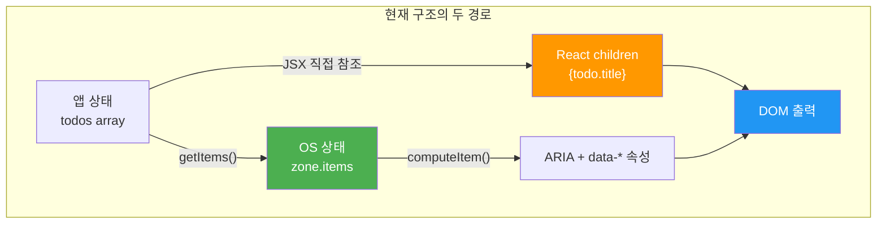
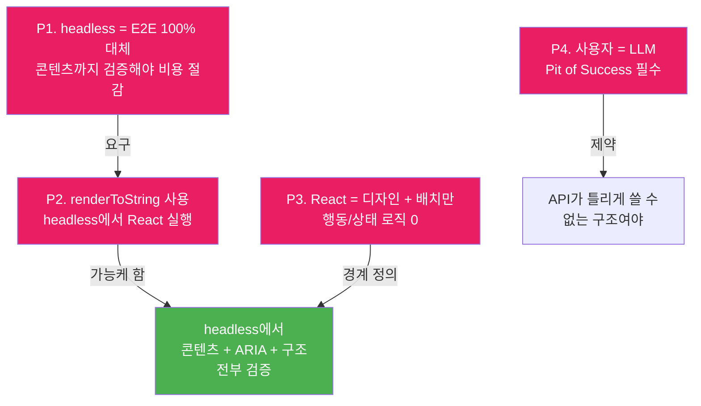
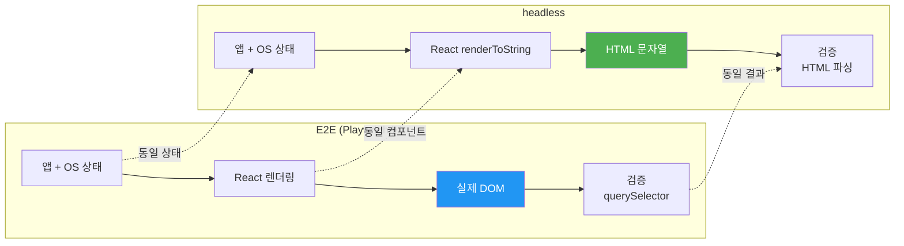
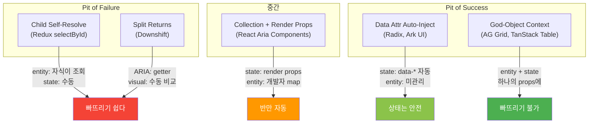
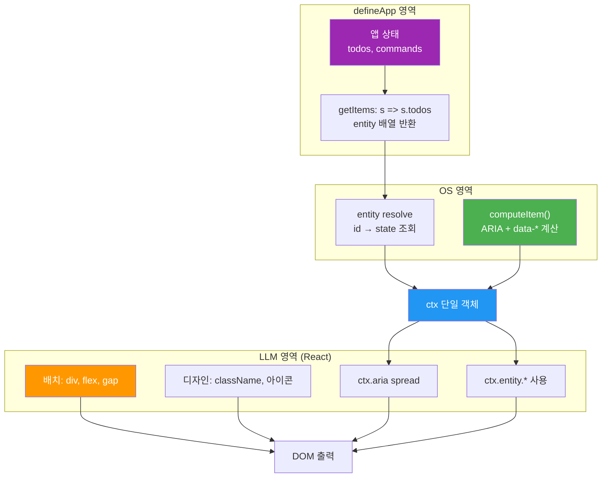
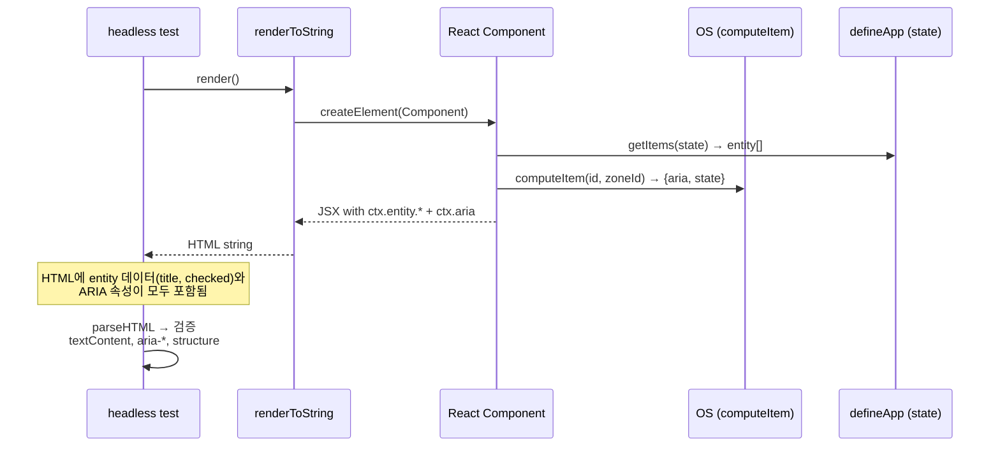

# Projection Pit of Success — headless 동형 투영 설계 논의

> 작성일: 2026-03-12
> 맥락: ARIA 책임 소재, headless test의 가치, LLM 사용자를 위한 projection API 설계에 대한 /discussion 결과 정리

---

## Why — headless test는 E2E 비용을 절감하기 위해 존재한다

### 문제 정의

Interactive OS의 headless test는 DOM 없이 E2E와 동일한 검증을 수행하여 테스트 비용을 절감하는 것이 목적이다. 그런데 현재 구조에서 **앱 데이터(콘텐츠)가 OS에 도달하지 않는 경로**가 존재한다. OS가 모르는 정보는 headless에서 검증할 수 없고, 검증할 수 없으면 E2E가 여전히 필요하다.



| 경로 | 예시 | headless 검증 | 문제 |
|------|------|-------------|------|
| **OS 경로** | `aria-selected`, `aria-checked`, `tabIndex` | 가능 (`computeItem()`) | 없음 |
| **React 경로** | `{todo.title}`, `checked={todo.completed}` | 불가능 (OS가 모름) | **E2E 필요** |

### 핵심 긴장

이 이중 경로는 두 가지 문제를 일으킨다:

1. **E2E 비용 미절감**: 콘텐츠 검증을 위해 여전히 브라우저 테스트가 필요
2. **Drift 위험**: `todo.completed`가 React에서는 `<Checkbox checked={true}>`이고, OS에서는 `zone.items[id]["aria-checked"] = false`일 수 있음. 두 경로의 동기화는 LLM(앱 개발자)의 책임

---

## How — 변하지 않는 전제에서 설계를 역추적한다

### 불변 전제 4개

논의를 통해 확립된, 어떤 구현을 선택하든 변하지 않는 전제:



| 전제 | 의미 | 왜 변하지 않는가 |
|------|------|----------------|
| **P1** | headless가 E2E를 100% 대체 | headless 존재 이유. 90% 대체면 경계 판단이 필요하고, 판단 = pit of failure |
| **P2** | headless에서 `renderToString` 사용 | 합의된 메커니즘. React 컴포넌트가 headless에서 실행됨 |
| **P3** | React = 디자인과 배치만 | OS의 근본 철학. 행동은 Kernel, 상태는 Command |
| **P4** | 프레임워크 소비자 = LLM | LLM의 실패 모드(pre-trained habit, 환각)에 맞춘 API 필요 |

### P2가 여는 길

`renderToString`이 headless에 있다는 것은 게임 체인저다:



**같은 React 컴포넌트가 실행되므로**, 콘텐츠(`{todo.title}`)도, ARIA 속성도, 구조도 전부 HTML에 나온다. headless는 이 HTML을 파싱하여 E2E와 동일한 검증이 가능하다.

현재 `projection.ts`가 이미 이 메커니즘의 일부를 구현하고 있다:

```typescript
// packages/os-testing/src/lib/projection.ts
function render(): string {
  htmlCache = renderToString(createElement(Component));
  return htmlCache;
}
```

### LLM 사용자의 실패 모드

P4에서 사용자가 LLM이라는 것은 API 설계의 제약을 근본적으로 바꾼다:

| 실패 유형 | 인간 개발자 | LLM |
|----------|------------|-----|
| ARIA 속성 환각 | 거의 없음 | **주범**. `aria-selected={...}`를 JSX에 직접 작성 |
| 패턴 혼합 | 드물다 | React + testing-library + 일반 웹 패턴을 무의식적으로 혼합 |
| OS API 무시 | 의도적 우회 | **OS API를 모르고** 직접 구현 |
| 데이터 동기화 누락 | 알면서 빠뜨림 | `todo.completed`와 `aria-checked` 연결을 **생각하지 않음** |

핵심 원칙: **LLM에게 판단을 요구하는 API = pit of failure.** "이건 OS에 맡기고 저건 직접 써야지"라는 판단 자체가 환각의 시작점이다.

---

## What — 기존 프레임워크의 projection 전략 비교

### 5가지 전략

업계 레퍼런스를 조사하여 "state → UI projection"의 전략을 5가지로 분류했다:



### 상세 비교

| 전략 | 대표 | entity 해석 | 상호작용 상태 주입 | 빠뜨리기 가능? |
|------|------|------------|-----------------|-------------|
| **Child self-resolve** | Redux `useSelector(selectById)` | 자식이 selector로 직접 조회 | 프레임워크 도움 없음, 완전 수동 | **Yes** — 최악 |
| **Prop getter split** | Downshift `getItemProps()` | 개발자가 items.map() | ARIA는 `getItemProps()`, visual은 `highlightedIndex === index` 수동 비교 | **Yes** — 이중 경로 |
| **Collection + render props** | React Aria Components | 프레임워크가 collection iterate | `({isSelected, isFocused, ...})` render props로 자동 전달 | **Hard** — 상태는 자동, entity는 수동 |
| **Data-attr auto-inject** | Radix, Ark UI | 개발자가 value prop 제공 | `data-state`, `data-highlighted` 등 DOM에 자동 주입 | **No** — 상태 빠뜨리기 불가 |
| **God-object context** | AG Grid `ICellRendererParams` | `props.data` = 전체 entity | `props.node.isSelected()` = 상호작용 상태 | **No** — 전부 하나의 context에 |

### 핵심 발견

**entity + interaction state가 하나의 context에 있으면 빠뜨리기가 구조적으로 불가능하다.** AG Grid의 `props.data`(entity) + `props.node`(state)가 대표적이다. 개발자(LLM)는 받은 것에서 골라 쓸 뿐이다.

**이중 경로(Redux, Downshift)가 drift의 근본 원인이다.** entity data와 interaction state가 서로 다른 채널에서 오면, 개발자가 수동으로 합류시켜야 하고, 합류를 잊으면 drift가 발생한다.

---

## What — Emerging Claim: 단일 context 모델

### defineApp이 이미 알고 있다

OS 프레임워크는 `todo.title`을 모르지만, **defineApp은 앱 상태와 커맨드를 소유한다.** `Item id={todoId}`가 있으면, defineApp의 state에서 해당 entity를 resolve할 수 있다. 별도 매핑 선언이 필요 없다.

```typescript
// defineApp은 안다:
const app = defineApp("todo", {
  todos: [
    { id: "1", title: "우유 사기", completed: false },
  ],
});

// - 전체 state
// - 모든 command handler
// - zone별 getItems() → id 목록
// - id → entity 역참조 가능
```

### 수렴 중인 API 모델

AG Grid의 god-object + React Aria의 render props + Radix의 auto-inject를 합치면:

```tsx
// 1. defineApp — 상태와 커맨드 선언 (변화 없음)
const app = defineApp("todo", initialState);

// 2. bind — role + 행동 + getItems가 entity 반환
const { Zone, Item } = todoZone.bind("listbox", {
  getItems: (s) => s.todos,  // id 목록이 아니라 entity 배열 직접 반환
  onAction: (cursor) => toggleTodo({ id: cursor.focusId }),
});

// 3. JSX — LLM은 배치와 디자인만 결정
<Zone>
  {(items) => items.map(item => (
    <Item key={item.id} item={item}>
      {(ctx) => (
        // ctx.entity = defineApp state에서 id로 resolve한 객체
        // ctx.isFocused, ctx.isSelected = OS 상호작용 상태
        // ctx.aria = 자동 계산된 ARIA 속성 (spread용)
        <div {...ctx.aria} className={cx(ctx.isFocused && "ring")}>
          <Checkbox checked={ctx.entity.completed} />
          <span>{ctx.entity.title}</span>
        </div>
      )}
    </Item>
  ))}
</Zone>
```

### 책임 분리



| 주체 | 결정하는 것 | 예시 |
|------|-----------|------|
| **defineApp** | entity의 shape, 데이터 소스 | `{ id, title, completed }` |
| **OS** | ARIA 속성, focus, selection, navigation | `aria-selected`, `tabIndex`, `data-focused` |
| **LLM (React)** | 레이아웃, 스타일, 아이콘, 컴포넌트 선택 | `div`, `flex gap-2`, `Checkbox` vs `Switch` |

### headless 검증 경로

이 모델에서 headless 검증이 100% 가능한 이유:



1. `renderToString` 실행 → React 컴포넌트가 `ctx.entity.*`와 `ctx.aria`를 사용하여 HTML 생성
2. HTML에 entity 데이터(title, checked)와 ARIA 속성이 모두 포함
3. headless test가 HTML을 파싱하여 콘텐츠 + 접근성 + 구조를 전부 검증
4. **E2E 불필요**

---

## If — 남은 설계 질문과 방향

### 확정된 것

| 항목 | 결론 |
|------|------|
| headless 목표 | E2E 100% 대체 |
| renderToString | 변하지 않는 전제 |
| React의 역할 | 디자인 + 배치만 (터미널) |
| ARIA 소유권 | OS (`computeItem()`) |
| entity resolve | defineApp의 state + id로 조회 (별도 매핑 불필요) |
| API 모델 방향 | 단일 context (`ctx`) = entity + interaction state + aria |

### 미해결 질문

| 질문 | 선택지 | 상태 |
|------|-------|------|
| `getItems()`가 entity를 반환하는 구체적 메커니즘 | (A) entity 배열 직접 반환 vs (B) NormalizedCollection의 `entities[id]` 활용 | 미정 |
| `ctx` 객체의 정확한 shape | `{ entity, aria, isFocused, isSelected, ... }` vs `{ entity, ...aria, ...state }` | 미정 |
| Item 컴포넌트의 출처 | `bind()`가 생성하는 앱 전용 vs OS 공용 + context injection | `bind()`가 생성 (방향 수렴) |
| 렌더링 자유도 vs pit of success | Field type별 차등? 전부 자유? 전부 제약? | 미정 |
| React 외 렌더러 가능성 | 현재 React 전제. 다른 선택지는? | 열려 있음 |

### 다음 단계

이 논의는 Complicated 단계에 진입했다. 방향은 수렴되었고, 구체적 API 설계를 위한 분해(`/divide`)가 필요하다:

1. **`getItems()` → entity resolve 경로** 확정
2. **`ctx` 객체 shape** 타입 설계
3. **기존 `bind()` → 새 모델** 마이그레이션 경로
4. **headless locator** 확장 (HTML 파싱 기반 콘텐츠 검증 추가)

---

## 부록 A: 현재 코드 구조

### computeItem() — ARIA Single Source of Truth

`packages/os-core/src/3-inject/compute.ts:45-173`

```typescript
export function computeItem(
  kernel: HeadlessKernel,
  itemId: string,
  zoneId: string,
  overrides?: ItemOverrides,
): ItemResult {
  // → { attrs: ItemAttrs, state: ItemState }
  // attrs: id, role, tabIndex, aria-selected, aria-expanded,
  //        aria-checked, aria-pressed, data-focused, data-item, ...
  // state: isFocused, isActiveFocused, isAnchor, isSelected, isExpanded
}
```

headless의 `resolveElement()`와 React의 `<Item>`이 **동일한 함수**를 호출한다. Zero Drift의 기반.

### projection.ts — renderToString 메커니즘

`packages/os-testing/src/lib/projection.ts:19-88`

```typescript
export function createProjection(Component: FC): Projection {
  function render(): string {
    htmlCache = renderToString(createElement(Component));
    return htmlCache;
  }

  function parseItems(): Map<string, string[]> {
    // HTML 파싱 → [data-zone] → [data-item] → id 추출
    // Zone별 item id 목록 반환
  }
}
```

현재는 item id 추출에만 사용. 콘텐츠 검증으로 확장 가능.

### bind.ts — 현재 BoundComponents

`packages/os-sdk/src/app/defineApp/bind.ts:41-265`

현재 `bind()`가 생성하는 것: `{ Zone, Item, Field, When }`. Item은 OS 공용 `<Item>`의 래퍼. entity 주입 기능 없음.

## 부록 B: 프레임워크 레퍼런스 상세

### Redux — Child Self-Resolve (Pit of Failure)

```tsx
// Parent: id 목록만 렌더
const PostsList = () => {
  const ids = useAppSelector(selectPostIds)
  return ids.map(id => <PostExcerpt key={id} postId={id} />)
}

// Child: 자기 entity를 직접 조회
function PostExcerpt({ postId }) {
  const post = useAppSelector(s => selectPostById(s, postId))
  return <div>{post.title}</div>
  // interaction state(selected, focused)는 완전 수동
}
```

### React Aria Components — Render Props (중간)

```tsx
<ListBoxItem>
  {({isSelected, isFocused, isDisabled}) => (
    <>
      {isSelected && <Check />}
      <Text slot="label">{children}</Text>
    </>
  )}
</ListBoxItem>
```

interaction state는 자동 전달. entity data는 개발자 책임.

### AG Grid — God-Object (Pit of Success)

```typescript
interface ICellRendererParams<TData, TValue> {
  value: TValue;              // cell value (accessor resolved)
  data: TData;                // full row entity
  node: IRowNode;             // isSelected(), isExpanded(), ...
  api: GridApi;               // global grid state
}
```

entity + interaction state + API가 **하나의 props**에. 빠뜨리기 불가.

### Radix — Data-Attr Auto-Inject (Pit of Success)

```tsx
<Select.Item value="france">
  <Select.ItemText>France</Select.ItemText>
</Select.Item>
// DOM output:
// <div data-state="checked" data-highlighted role="option" aria-selected="true">
```

interaction state가 data-* 속성으로 자동 주입. 개발자 개입 0.

### SwiftUI — Compiler-Enforced (Pit of Success)

```swift
List($users) { $user in
  Text(user.name)
  Toggle("Contacted", isOn: $user.isContacted)
}
// Framework iterates, provides binding, auto-manages selection
```

프레임워크가 iterate + binding 제공. `$` 없이 쓰면 컴파일 에러.
