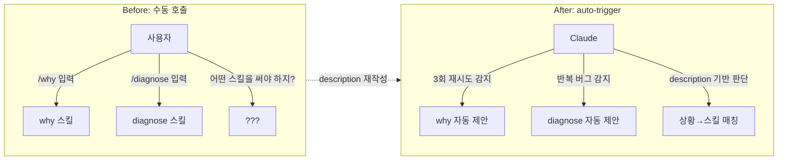
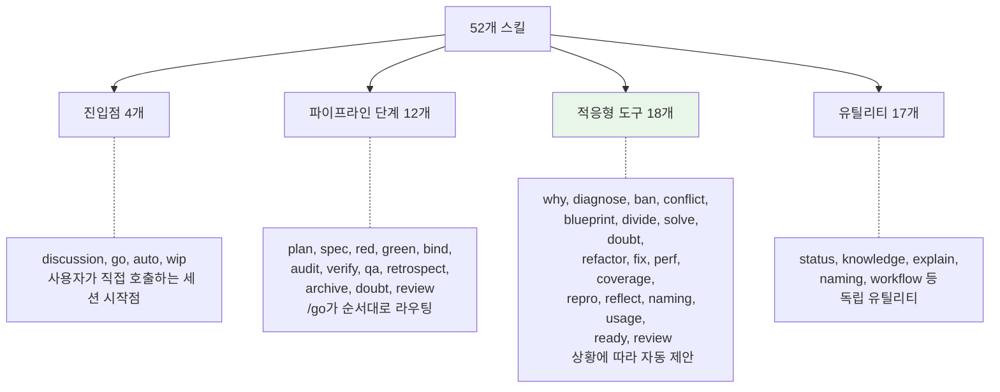
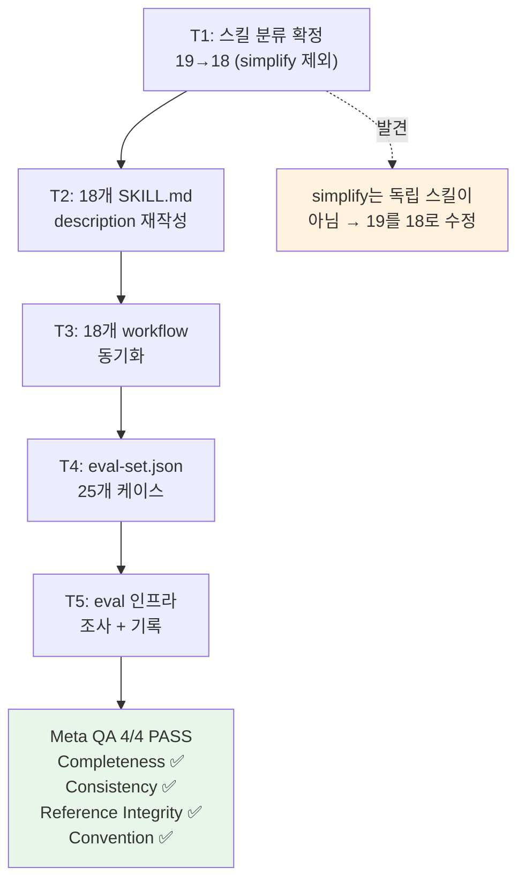

# skill-description-eval — 적응형 18개 스킬을 auto-trigger 가능하게 만든 과정

> 작성일: 2026-03-12
> 맥락: Interactive OS의 52개 스킬 중 18개 "적응형 도구"의 description을 Claude Code Skills 2.0 auto-trigger에 맞게 재작성하고, eval 인프라를 구축한 Meta 프로젝트.

---

## Why — 52개 스킬이 전부 수동 호출이었다

Interactive OS는 52개의 Claude Code 스킬을 가지고 있다. 사용자가 `/why`, `/diagnose`, `/conflict` 같은 명령어를 직접 입력해야만 해당 스킬이 실행된다. Claude Code Skills 2.0은 `description:` frontmatter를 기반으로 LLM이 상황에 맞는 스킬을 **자동 제안**하는 기능(auto-trigger)을 제공하지만, 기존 description은 "이 스킬이 뭘 하는가"를 설명하는 UI 표시용 텍스트였다. LLM이 "언제 이 스킬을 써야 하는가"를 판단하기에는 부적합했다.



| 구분 | 설명 |
|------|------|
| 점선 화살표 | 이 프로젝트가 수행한 전환 |
| Before | 사용자가 스킬 이름을 알아야 함 |
| After | Claude가 상황을 읽고 스킬을 제안 |

핵심 문제는 두 가지였다:

1. **description이 트리거 조건을 기술하지 않았다.** 예를 들어 `/why`의 description은 "막혔을 때 멈추고, 근본 원인을 찾아 공유한다"였다. LLM이 "지금 막혔나?"를 판단할 구체적 기준(3회 재시도, 루프)이 없었다.
2. **52개 스킬 중 auto-trigger가 의미 있는 것과 아닌 것이 섞여 있었다.** `/go`(파이프라인 라우터)나 `/archive`(종료 처리)는 자동 제안의 대상이 아니다. 어떤 스킬이 auto-trigger 후보인지 분류가 필요했다.

---

## How — 4종 분류 + description 재작성 + eval 인프라

### 스킬 4종 분류

52개 스킬을 역할 기준으로 4종으로 나눴다.



| 구분 | 설명 |
|------|------|
| 녹색(적응형) | auto-trigger 대상. 이 프로젝트의 작업 범위 |
| 나머지 | auto-trigger 불필요 (호출 시점이 구조적으로 결정됨) |

**적응형 도구 18개**만이 auto-trigger의 대상이다. 파이프라인 단계는 `/go`가 상태 기반으로 라우팅하고, 진입점은 사용자가 명시적으로 호출하므로, description을 아무리 잘 써도 auto-trigger가 의미 없다.

### description 재작성 원칙

기존 description은 "이 스킬이 뭘 하는가"(기능 설명)였다. 새 description은 "언제 이 스킬을 써야 하는가"(트리거 조건)를 기술한다.

재작성 패턴:
- **트리거 상황**을 구체적으로 기술 ("~할 때 사용")
- **행동 제약**을 명시 (예: "코드를 수정하지 않고", "형식만 수정하고 로직은 절대 변경하지 않는다")
- 한국어 1-2문장

Before/After 비교:

| 스킬 | Before (기능 설명) | After (트리거 조건) |
|------|-------------------|-------------------|
| why | 막혔을 때 멈추고, 근본 원인을 찾아 공유한다 | 에이전트가 같은 문제를 3회+ 재시도하거나 진전 없이 루프에 빠졌을 때 사용. 코드를 수정하지 않고 근본 원인 리포트를 작성한다 |
| diagnose | 테스트 실패 시 코드를 수정하지 않고 원인을 분석 | 코드가 동작하지만 구조가 의심스럽거나, 같은 종류의 버그가 반복될 때 사용. git history와 docs를 읽기 전용으로 탐색하여 설계 부채의 원인을 추적한다 |
| doubt | 모든 것을 의심한다. 쓸모가 있나? | 구현 완료 후 정리 단계, 또는 새 개념 도입 전(Occam Gate)에 사용. 존재/적합/분량/효율의 4단 필터로 불필요한 것을 재귀적으로 제거한다 |
| fix | LLM 산출물의 well-formedness를 보장 | 코드가 컴파일되지 않는 형식 오류(누락 import, 깨진 경로, 미정의 참조, 주석 stub)일 때 사용. 형식만 수정하고 로직은 절대 변경하지 않는다 |

핵심 차이: Before는 "뭘 하는가"만 알려준다. After는 "어떤 상황에서 쓰는가" + "어떤 제약이 있는가"를 모두 담는다. LLM이 현재 상황과 description을 매칭하여 "여기서 `/why`를 쓸까요?"라고 제안할 수 있게 된다.

### Dual-File 동기화

이 프로젝트에서는 스킬 파일이 두 곳에 존재한다:
- `.claude/skills/{name}/SKILL.md` — Claude Code가 읽는 원본
- `.agent/workflows/{name}.md` — Antigravity 등 외부 도구가 읽는 사본

두 파일의 `description:` 필드를 동일하게 유지해야 한다. 18개 스킬 x 2파일 = 36개 파일을 갱신했다.

### eval 인프라

description의 품질을 측정하려면 eval이 필요하다. `anthropics/skills` repo가 이미 eval 도구를 제공하고 있었다:

```
# 정확도 측정
run_eval.py --eval-set eval-set.json --skill-path .claude/skills/{name} --runs-per-query 3

# 자동 최적화 (description을 자동 개선)
run_loop.py --holdout 0.4 --max-iterations 5
```

25개 테스트 케이스를 작성했다. 각 케이스는 사용자 발화(query)와 기대 스킬(expected_skill)의 쌍이다:

```json
{
  "id": "TC02",
  "query": "같은 테스트를 4번째 돌리는데 계속 실패한다. 뭔가 근본적으로 잘못된 것 같다",
  "expected_skill": "why",
  "should_trigger": true,
  "category": "stuck"
}
```

18개 스킬 전부를 커버하되, 경계가 모호한 스킬(why vs diagnose, conflict vs blueprint)은 2개 케이스를 배치하여 구분력을 테스트할 수 있게 했다.

---

## What — T1-T5 완료, Meta QA 4/4 PASS



| 구분 | 설명 |
|------|------|
| 녹색 | 최종 검증 통과 |
| 주황 | 실행 중 발견된 전제 수정 |

### 실행 경로

| Task | 내용 | 증빙 |
|------|------|------|
| T1 | 적응형 스킬 19개 → 18개 확정. simplify가 독립 스킬이 아님을 발견 | BOARD + README + memory 갱신 |
| T2 | 18개 SKILL.md의 `description:` 재작성 | commit `8eb36e39` |
| T3 | 18개 workflow 파일 동기화 | commit `08bd2ee4` |
| T4 | eval-set.json 25개 케이스 작성 | 프로젝트 폴더에 저장 |
| T5 | anthropics/skills repo의 eval 도구 확인 | BOARD U2에 명령어 기록 |

### Unresolved 처분

| # | 질문 | 처분 | 이유 |
|---|------|------|------|
| U1 | 한국어 vs 영어 description 정확도 | **Kill** | 사용자가 읽고 수정 방향을 지시할 수 있어야 함. 한국어 유지 |
| U2 | eval 인프라 | **해소** | anthropics/skills repo 발견 |
| U3 | Phase 2 (/go 모호함 프로토콜 개방) | **보류** | eval 실행 후 판단 |

### 세션 중 파생된 부수 작업

- `/discussion`에서 아카이브 시스템 재설계 논의 → `5-backlog/archive-system-redesign.md`에 등록
- `/retrospect`에서 QA 리포트 자동 저장 미비 발견 → `/go` 워크플로우에 리포트 저장 단계 추가

---

## If — eval 실행이 다음 단계

### 현재 상태

프로젝트는 **QA PASS, 아카이브 대기(Hold)** 상태다. 아카이브 방식 자체를 재설계 중이므로 보류.

### 다음 단계: eval 실행

description 재작성은 완료했지만, 실제 트리거 정확도는 미검증이다. 다음 세션에서:

1. `anthropics/skills` repo를 clone한다
2. `run_eval.py`로 25개 케이스의 정확도를 측정한다
3. 정확도가 낮은 스킬의 description을 개선한다
4. `run_loop.py`로 자동 최적화를 시도한다

### 제약

- **한국어 description**: 사용자 방침으로 한국어를 유지한다. eval 정확도가 영어보다 낮을 수 있지만, 사용자가 직접 읽고 수정 방향을 지시할 수 있는 것이 우선이다.
- **Phase 2 미착수**: `/go` 파이프라인의 모호함 프로토콜(conflict → blueprint → divide 3개 하드코딩)을 auto-trigger 기반으로 개방하는 것은 Phase 1 eval 결과 후 판단한다.
- **경계 모호 스킬**: why vs diagnose vs ban, conflict vs blueprint — description만으로 LLM이 구분 가능한지는 eval로 확인해야 한다.

### 프로젝트 산출물 요약

| 산출물 | 위치 |
|--------|------|
| BOARD.md | `docs/1-project/harness/skill/skill-description-eval/BOARD.md` |
| eval-set.json (25 cases) | `docs/1-project/harness/skill/skill-description-eval/eval-set.json` |
| QA Report | `docs/1-project/harness/skill/skill-description-eval/qa-report-2026-0312-2330.md` |
| Retrospective | `docs/1-project/harness/skill/skill-description-eval/discussions/retrospective.md` |
| 18개 SKILL.md | `.claude/skills/{why,diagnose,...,ready}/SKILL.md` |
| 18개 workflow | `.agent/workflows/{why,diagnose,...,ready}.md` |
