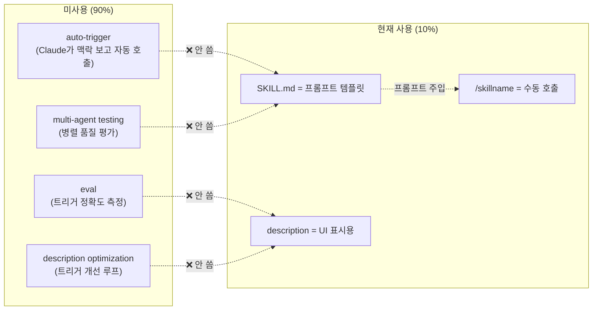
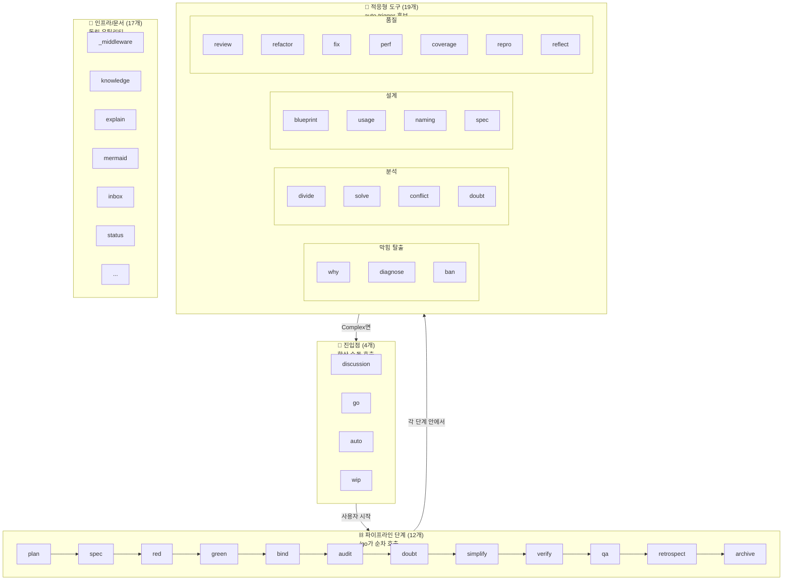
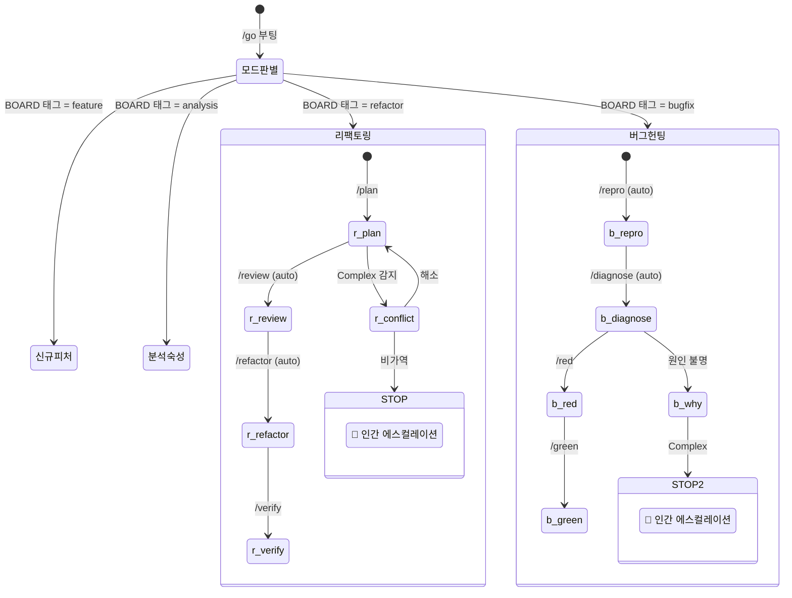
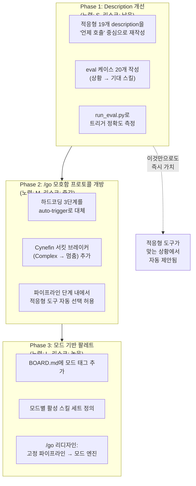

# 스킬 시스템 × Skills 2.0 갭 분석 — 52개 스킬이 놓치고 있는 것

> 작성일: 2026-03-12
> 맥락: `/auto /wip` 3사이클 후 "스킬 평가 가능하냐?" 질문에서 시작된 /discussion에서 도출. 현재 52개 스킬이 Claude Code Skills 2.0의 핵심 기능(auto-trigger, eval, description optimization)을 사용하지 않는다는 진단.

---

## Why — 왜 이 분석이 필요한가

### 문제: 52개 스킬이 Skills 인프라의 10%만 사용 중

현재 Interactive OS의 스킬 시스템은 **프롬프트 전달 수단**으로만 Skills를 사용한다. Claude Code Skills 2.0이 제공하는 자동 라우팅, 평가, 최적화 기능은 전혀 활용되지 않는다.



### 결과: 모든 라우팅이 수동 또는 고정 파이프라인

| 라우팅 방식 | 메커니즘 | 한계 |
|-----------|---------|------|
| 사용자 수동 | `/discussion` → 사용자가 판단 → `/skillname` 입력 | 사용자가 52개 스킬 중 맞는 것을 알아야 함 |
| /discussion 추천 | 🚀 Next 필드로 다음 스킬 제안 | LLM이 매턴 판단하지만, 실행은 수동 |
| /go 고정 파이프라인 | plan → red → green → verify → archive | 모든 과제가 동일 파이프 통과. 적응 없음 |
| /auto stop hook | /go 완료 시 자동 재개 | 파이프라인 순서 자체는 고정 |

---

## How — Skills 2.0 기능이 이 시스템에 어떻게 적용되는가

### 1. 52개 스킬의 3종 분류

52개 스킬은 **트리거 방식**에 따라 세 종류로 나뉜다. 각 종류에 Skills 2.0 적용 전략이 다르다.



| 분류 | 개수 | Skills 2.0 적용 | 이유 |
|------|------|----------------|------|
| **진입점** | 4 | ❌ 수동 유지 | 인간 의도가 시작점. 자동화 부적합 |
| **파이프라인 단계** | 12 | ❌ /go가 관리 | 순서가 정해져 있음. auto-trigger 불필요 |
| **적응형 도구** | 19 | ✅ auto-trigger | 상황 인식이 필요. Skills 2.0의 핵심 타겟 |
| **인프라/문서** | 17 | △ 일부 가능 | `/ready`, `/fix` 등은 auto-trigger 후보 |

### 2. 적응형 도구의 auto-trigger가 작동하는 시나리오

현재 `/go` 파이프라인의 `§모호함 프로토콜`은 이미 적응형 도구를 호출한다:

```
1. /conflict → /blueprint → /divide (전부 수행, 자율적으로)
2. 해소됨 → Task Map 갱신 → 원래 단계 복귀
3. 여전히 모호 → 백로그에 넣고 사용자에게 보고
```

하지만 이것은 **하드코딩된 3단계**다. Skills 2.0 auto-trigger를 쓰면:

| 상황 | 현재 (하드코딩) | Skills 2.0 (적응형) |
|------|---------------|-------------------|
| 모호함 발생 | conflict → blueprint → divide (고정) | Claude가 상황 보고 /conflict 또는 /solve 또는 /why 중 선택 |
| 테스트 실패 | retry ≤ 3 → 재실행 (무조건) | Claude가 실패 원인 보고 /diagnose 또는 /repro 자동 선택 |
| 코드 품질 의심 | /simplify (파이프라인 순서) | /review, /refactor, /perf 중 맞는 것 자동 선택 |
| 이름 짓기 어려움 | 개발자가 판단 | /naming 자동 제안 |

### 3. 모드 기반 스킬 팔레트 (Discussion에서 도출된 구상)

과제의 성격에 따라 **활성화되는 적응형 도구 세트**가 달라진다:



| 모드 | 적응형 팔레트 | Cynefin 서킷 브레이커 |
|------|-------------|---------------------|
| **리팩토링** | /review, /refactor, /conflict, /blueprint, /naming | 설계 변경 필요 → 멈춤 |
| **버그 헌팅** | /repro, /diagnose, /why, /solve | 원인 불명 → 멈춤 |
| **신규 피처** | /spec, /usage, /blueprint, /naming, /divide | API 결정 → 멈춤 |
| **분석/숙성** | /divide, /solve, /conflict, /doubt, /research | 인간 지식 필요 → 멈춤 |

### 4. Eval 시스템의 실제 적용 지점

Skills 2.0 Eval은 **트리거 정확도 최적화**를 위한 것. 이 프로젝트에서 적용 가능한 곳:

| Eval 대상 | 기대 효과 |
|----------|----------|
| 적응형 도구 19개의 description | "테스트 실패" 상황에서 /diagnose vs /why vs /repro 중 맞는 것이 트리거되도록 최적화 |
| 모드 판별 description | "리팩토링 과제"를 보고 리팩토링 모드가 활성화되도록 최적화 |
| 진입점/파이프라인 | ❌ 적용 불필요 (수동 호출 / 고정 순서) |

Eval 케이스 예시:

```json
[
  { "query": "테스트가 3번 연속 실패하는데 원인을 모르겠어",
    "should_trigger": "diagnose", "note": "반복 실패 → 원인 분석" },
  { "query": "이 함수 이름이 뭔가 어색한데",
    "should_trigger": "naming", "note": "네이밍 고민 → naming" },
  { "query": "두 가지 방향이 다 말이 되는데 뭘 골라야 할지",
    "should_trigger": "conflict", "note": "트레이드오프 → conflict" },
  { "query": "왜 이게 안 되지? 아까까지 됐는데",
    "should_trigger": "why", "note": "막힘 → why" }
]
```

---

## What — 현재 상태의 정량 분석

### 52개 스킬의 auto-trigger 적합성 분류

| 분류 | 스킬 목록 | 개수 |
|------|---------|------|
| **✅ auto-trigger 즉시 가능** | why, diagnose, conflict, blueprint, divide, solve, review, refactor, fix, perf, coverage, repro, reflect, naming, usage, ready | 16 |
| **△ 조건부 가능** | doubt (파이프라인 + 적응형 겸용), spec (파이프라인이지만 독립 사용도 가능), ban | 3 |
| **❌ 수동/고정 유지** | discussion, go, auto, wip, plan, red, green, bind, audit, simplify, verify, qa, retrospect, archive | 14 |
| **🔧 유틸리티 (독립)** | _middleware, knowledge, explain, mermaid, inbox, status, backlog, project, stories, resources, research, redteam, design-review, elicit, rules, workflow, retire, reframe | 19 |

### description 품질 현황

현재 description은 **한국어 1줄 요약**이다. Skills 2.0 auto-trigger에는 부적합:

```
# 현재
diagnose|테스트 실패 시 코드를 수정하지 않고 원인을 분석하여 삽질 일지를 작성한다.

# auto-trigger 최적화 후 (예상)
diagnose|테스트가 반복 실패하거나, 에러 원인이 불명확하거나, 같은 수정을 3회 이상 시도한 상황에서 자동 호출. 코드를 수정하지 않고 원인만 분석.
```

현재 description은 "무엇을 하는가"만 기술. auto-trigger에는 **"언제 호출되어야 하는가"**가 필요.

### /go 파이프라인의 적응 부재

현재 `/go`의 모호함 프로토콜:

```
conflict → blueprint → divide (하드코딩 3단계)
```

이것이 19개 적응형 도구 중 3개만 사용하는 이유: **auto-trigger 없이는 "어떤 도구를 쓸지"를 하드코딩할 수밖에 없다.**

---

## If — 개선 경로와 제약

### 개선 경로 3단계



### Phase별 상세

| Phase | 범위 | 변경 대상 | 위험 | 즉시 가치 |
|-------|------|----------|------|----------|
| **1** | 19개 description 재작성 + eval | SKILL.md frontmatter만 | 낮음 (코드 변경 없음) | Claude가 "여기서 /why 쓸까요?" 자동 제안 |
| **2** | /go 모호함 프로토콜 개방 | go/SKILL.md | 중간 (파이프라인 동작 변경) | 테스트 실패 시 자동으로 /diagnose 선택 |
| **3** | 모드 기반 /go 리디자인 | go/SKILL.md + BOARD.md 스키마 | 높음 (아키텍처 변경) | 과제별 최적 프로세스 자동 적용 |

### 제약 사항

1. **auto-trigger는 description 품질에 의존**: description이 나쁘면 잘못된 스킬이 호출됨. eval로 검증 필수
2. **한국어 description**: Skills 2.0 eval이 한국어를 잘 처리하는지 미검증. 영어 description이 트리거 정확도가 높을 수 있음
3. **적응형 도구 간 경계 모호**: /why vs /diagnose vs /ban — 언제 어떤 것? Description만으로 LLM이 구분 가능한가?
4. **Phase 3은 /go 리디자인**: 현재 /go의 14단계 파이프라인을 근본적으로 바꿔야 함. 점진적 마이그레이션 필요

### 즉시 실행 가능한 것 (Phase 1)

1. 적응형 19개 스킬의 description을 **"언제 호출" 중심**으로 재작성
2. eval-set.json 20개 케이스 작성 (상황 설명 → 기대 스킬)
3. `run_eval.py`로 현재 트리거 정확도 baseline 측정
4. `run_loop.py`로 description 최적화 (5회 반복)
5. 최적화 전후 pass rate 비교

---

## 부록: 52개 스킬 전수 분류표

| # | 스킬 | 분류 | auto-trigger | description 개선 필요 |
|---|------|------|-------------|---------------------|
| 1 | _middleware | 인프라 | ❌ | - |
| 2 | apg | 도메인 | ❌ | - |
| 3 | archive | 파이프라인 | ❌ | - |
| 4 | audit | 파이프라인 | ❌ | - |
| 5 | auto | 진입점 | ❌ | - |
| 6 | backlog | 유틸리티 | ❌ | - |
| 7 | ban | 적응형 | ✅ | ✅ "에이전트가 3회 이상 같은 실수 반복 시" |
| 8 | bind | 파이프라인 | ❌ | - |
| 9 | blueprint | 적응형 | ✅ | ✅ "구현 전 설계가 필요하지만 방향은 잡힌 상황" |
| 10 | conflict | 적응형 | ✅ | ✅ "두 가지 이상 방향이 충돌하는 상황" |
| 11 | coverage | 적응형 | ✅ | ✅ "테스트 커버리지 부족이 의심될 때" |
| 12 | design-review | 유틸리티 | ❌ | - |
| 13 | diagnose | 적응형 | ✅ | ✅ "테스트가 반복 실패하고 원인이 불명확할 때" |
| 14 | discussion | 진입점 | ❌ | - |
| 15 | divide | 적응형 | ✅ | ✅ "문제가 크거나 구조가 불명확할 때" |
| 16 | doubt | 적응형 | ✅ | ✅ "과잉 구현이 의심되거나 불필요한 작업일 수 있을 때" |
| 17 | elicit | 유틸리티 | ❌ | - |
| 18 | explain | 유틸리티 | ❌ | - |
| 19 | fix | 적응형 | ✅ | ✅ "LLM 산출물의 형식 오류 발견 시" |
| 20 | go | 진입점 | ❌ | - |
| 21 | green | 파이프라인 | ❌ | - |
| 22 | inbox | 유틸리티 | ❌ | - |
| 23 | issue | 유틸리티 | ❌ | - |
| 24 | knowledge | 유틸리티 | ❌ | - |
| 25 | mermaid | 유틸리티 | ❌ | - |
| 26 | naming | 적응형 | ✅ | ✅ "새 변수/함수/모듈 이름을 지어야 할 때" |
| 27 | perf | 적응형 | ✅ | ✅ "성능 저하가 관찰되거나 의심될 때" |
| 28 | plan | 파이프라인 | ❌ | - |
| 29 | project | 유틸리티 | ❌ | - |
| 30 | qa | 파이프라인 | ❌ | - |
| 31 | ready | 적응형 | ✅ | ✅ "dev server 오류, 빌드 실패 등 환경 문제 시" |
| 32 | red | 파이프라인 | ❌ | - |
| 33 | redteam | 유틸리티 | ❌ | - |
| 34 | refactor | 적응형 | ✅ | ✅ "코드 패턴 전환이 필요할 때" |
| 35 | reflect | 적응형 | ✅ | ✅ "의도와 결과가 불일치하거나 방향 점검이 필요할 때" |
| 36 | reframe | 유틸리티 | ❌ | - |
| 37 | repro | 적응형 | ✅ | ✅ "관찰된 버그를 재현 테스트로 전환할 때" |
| 38 | research | 유틸리티 | ❌ | - |
| 39 | resources | 유틸리티 | ❌ | - |
| 40 | retire | 유틸리티 | ❌ | - |
| 41 | retrospect | 파이프라인 | ❌ | - |
| 42 | review | 적응형 | ✅ | ✅ "코드 품질/일관성 의심 시" |
| 43 | rules | 유틸리티 | ❌ | - |
| 44 | simplify | 파이프라인 | ❌ | - |
| 45 | solve | 적응형 | ✅ | ✅ "독립적 추론이 필요한 기술적 질문" |
| 46 | spec | 파이프라인 | ❌ | - |
| 47 | status | 유틸리티 | ❌ | - |
| 48 | stories | 유틸리티 | ❌ | - |
| 49 | usage | 적응형 | ✅ | ✅ "API/인터페이스 설계 전 이상적 사용 코드가 필요할 때" |
| 50 | verify | 파이프라인 | ❌ | - |
| 51 | why | 적응형 | ✅ | ✅ "진행이 막히고 근본 원인을 모를 때" |
| 52 | wip | 진입점 | ❌ | - |
| | | **auto-trigger 대상** | **19개** | **19개** |
