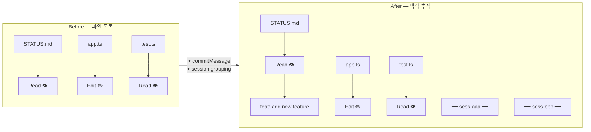
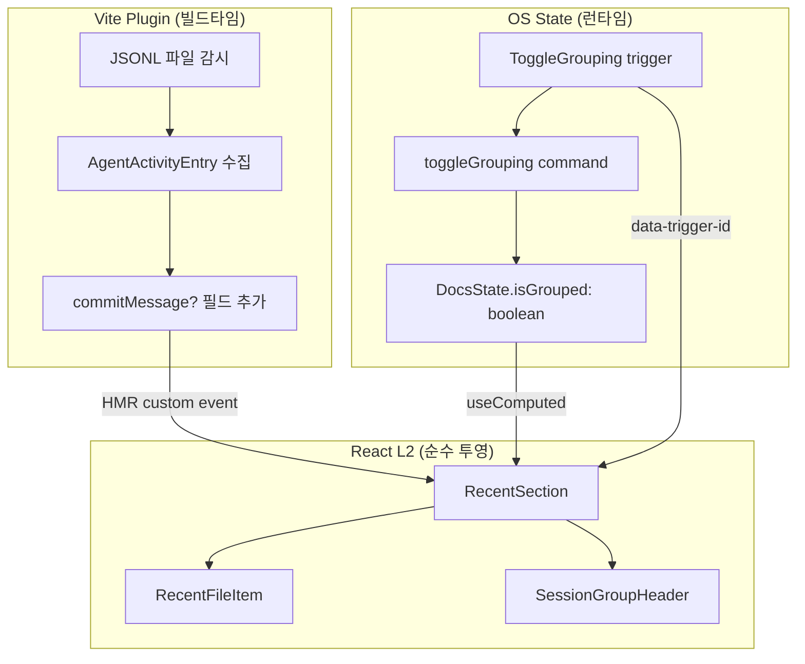
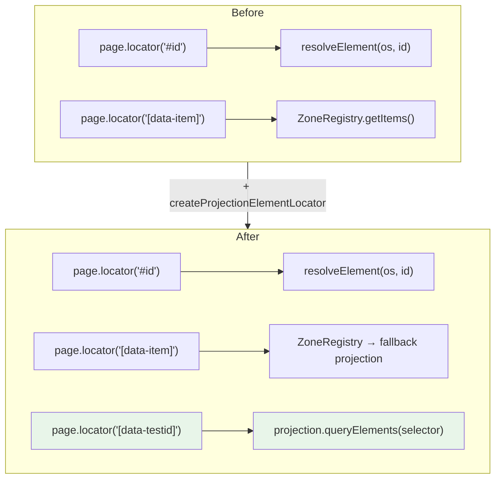

# recsection-enhance — RecentSection에 커밋 맥락 + 세션 그루핑 추가

> 작성일: 2026-03-12
> 맥락: DocsViewer의 Agent Activity 피드를 "파일 목록"에서 "작업 맥락 추적 도구"로 진화시킨 Light 프로젝트 해설

---

## Why — 파일명만으로는 "왜 이 파일이 만들어졌는지" 알 수 없다

DocsViewer의 RecentSection은 Agent Activity를 실시간으로 보여주는 피드다. Vite HMR plugin이 JSONL 로그를 감시하고, 파일 변경이 감지되면 브라우저에 push한다.

문제는 정보의 밀도였다. 파일명 + Read/Edit 아이콘만으로는 두 가지를 알 수 없었다:

1. **맥락**: "이 파일이 왜 만들어졌는가?" → 커밋 메시지가 없으면 파일을 열어봐야 안다
2. **경계**: "어떤 세션이 뭘 했는가?" → 세션 구분이 없으면 15개 항목이 뒤섞여 보인다



| 변경 전 | 변경 후 |
|---------|---------|
| 파일명 + ToolBadge | + 커밋 메시지 1줄 (있을 때만) |
| flat list | flat/grouped 토글 (세션별 접이식) |
| .md 파일 판별 없음 | `isProjectMarkdown()` 라우팅 준비 |

---

## How — OS 패턴 준수: 상태는 OS, 뷰는 투영

### 데이터 흐름



### 핵심 설계 결정

**1. `isGrouped`는 OS 상태, `isOpen`은 React 상태**

```ts
// OS 상태 — 앱 전역, 커맨드로만 변경
export interface DocsState {
  activePath: string | null;
  favVersion: number;
  isGrouped: boolean;  // NEW
}

// React 상태 — 순수 UI 관심사 (섹션 접기)
const [isOpen, setIsOpen] = useState(true);
```

그루핑 모드는 앱의 의미 있는 상태이므로 OS에 둔다. 섹션 접기는 순수 UI 관심사이므로 React에 둔다.

**2. Trigger 패턴으로 토글 구현**

```ts
// app.ts — trigger 등록
export const DocsRecentUI = recentZone.bind("listbox", {
  triggers: {
    ToggleGrouping: () => toggleGrouping(),
  },
});

// DocsSidebar.tsx — prop-getter로 바인딩
<button {...DocsRecentUI.triggers.ToggleGrouping()}>
  {isGrouped ? "Flat" : "Group"}
</button>
```

`onClick` 직접 사용 금지 (OS 계약). `triggers.ToggleGrouping()`은 `{ "data-trigger-id": "ToggleGrouping" }`을 반환하고, OS의 click pipeline이 이를 감지하여 커맨드를 dispatch한다.

**3. commitMessage 전파 경로**

```
AgentActivityEntry.commitMessage? (vite-plugin-agent-activity.ts)
  → getAgentRecentFiles() 전파 (docsUtils.ts)
    → AgentRecentFile.commitMessage?
      → RecentFileItem 조건부 렌더링 (DocsSidebar.tsx)
```

`commitMessage`가 `undefined`이면 해당 줄을 렌더링하지 않는다. 기존 동작 100% 보존.

---

## What — 인프라 확장: Projection Locator

### 테스트 결과

| 테스트 그룹 | 수량 | 결과 |
|------------|------|------|
| §5 세션 그루핑 (DT1-DT5) | 5 | PASS |
| §6 커밋 메시지 (T2) | 2 | PASS |
| T1 unit (commitMessage 전파) | 3 | PASS |
| T4 unit (isProjectMarkdown) | 3 | PASS |
| 기존 §1-§4 regression | 14 | PASS |
| **합계** | **27** | **ALL PASS** |

전체 테스트 스위트: 781 passed, 0 failed.

### Projection Locator — 이번 프로젝트의 핵심 인프라 기여

기존 headless locator는 두 가지만 지원했다:
- `#id` → OS state에서 resolve
- `[data-item]` → ZoneRegistry에서 resolve

세션 그루핑 테스트(`§5a`)는 `[data-session-group]`이나 `[data-testid="commit-message"]` 같은 **임의 CSS selector**가 필요했다. 이것은 OS item이 아니라 React가 렌더링한 HTML 요소다.



해결: `createProjectionElementLocator` 추가.

```ts
// projection.ts — 항상 fresh HTML로 렌더링
function queryElements(selector: string): ProjectionElement[] {
  htmlCache = null; itemsCache = null;  // 캐시 무효화
  const html = render();
  const container = document.createElement("div");
  container.innerHTML = html;
  return Array.from(container.querySelectorAll(selector)).map(el => ({
    id: el.id || null,
    getAttribute: (name) => el.getAttribute(name),
  }));
}
```

```ts
// locator.ts — click은 data-trigger-id를 통해 OS pipeline으로 dispatch
click() {
  const el = getElement();
  const triggerId = el.getAttribute("data-trigger-id");
  const clickId = triggerId ?? el.id;
  if (clickId) simulateClick(os, clickId);
}
```

이 패턴으로 headless 테스트에서 **OS item이 아닌 HTML 요소도** 관찰하고 상호작용할 수 있게 되었다.

### biome `--unsafe` 충돌

pre-commit hook의 `biome check --write --unsafe`가 non-null assertion(`!`)을 optional chaining(`?.`)으로 자동 변환하여 tsc 에러를 유발했다. 해결: `match && match[1] && match[2]` 형태의 type narrowing guard로 교체하여 `!`를 제거.

---

## If — 남은 과제와 확장 가능성

### 이 프로젝트에서 하지 않은 것

- **git-log 실제 파싱**: T1의 `collectAgentActivity()`에서 `execSync('git log')` 호출은 vite plugin 레벨에서 구현 예정. 현재는 인터페이스(`commitMessage?` 필드)만 준비됨
- **MarkdownRenderer 라우팅**: T4의 `isProjectMarkdown()`은 판별 함수만 구현. 실제 라우팅 분기는 DocsViewer.tsx에서 별도 작업 필요
- **그루핑 상태 persist**: 새로고침 시 flat으로 리셋 (의도적 scope out)

### Projection Locator의 범용성

이번에 추가된 `queryElements` + `createProjectionElementLocator`는 recsection-enhance 전용이 아니다. 향후 headless 테스트에서:

- `[data-testid="..."]` 요소 관찰
- `[role="..."]` 요소 검증
- trigger가 붙은 임의 HTML 요소 클릭

등에 범용적으로 사용 가능하다. `createMultiLocator`의 fallback chain이 OS items → projection elements 순서로 해결하므로 기존 테스트와 100% 호환된다.

### 파일 변경 요약

| 파일 | 변경 |
|------|------|
| `src/docs-viewer/app.ts` | +`isGrouped` state, +`toggleGrouping` command, +`ToggleGrouping` trigger |
| `src/docs-viewer/DocsSidebar.tsx` | `RecentFileItem`, `SessionGroupHeader` 추출, 그루핑 토글 UI |
| `src/docs-viewer/docsUtils.ts` | `AgentRecentFile.commitMessage/session`, `isProjectMarkdown()` |
| `src/docs-viewer/vite-plugin-agent-activity.ts` | `AgentActivityEntry.commitMessage?` |
| `packages/os-testing/src/lib/projection.ts` | `queryElements()`, `ProjectionElement` interface |
| `packages/os-testing/src/lib/locator.ts` | `createProjectionElementLocator`, multi-locator fallback |
