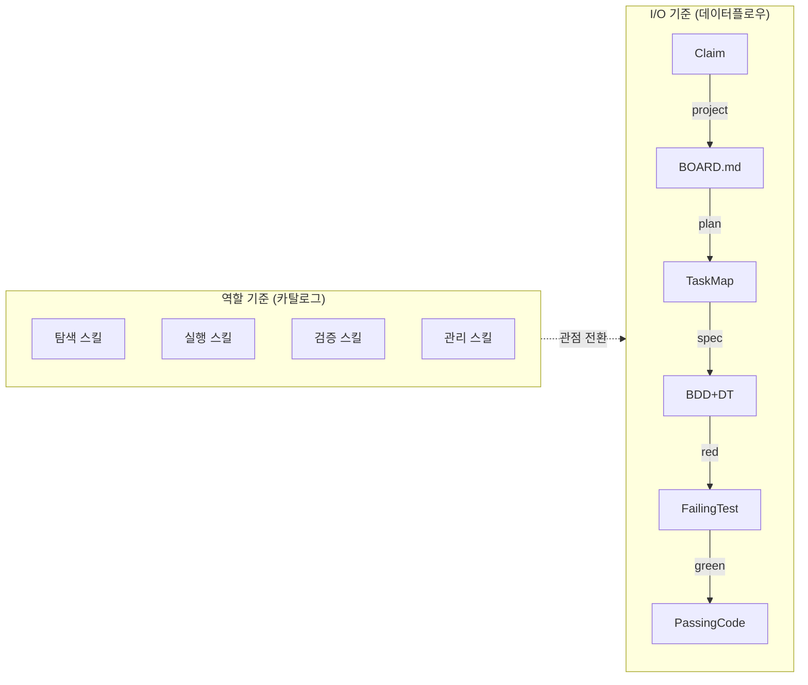
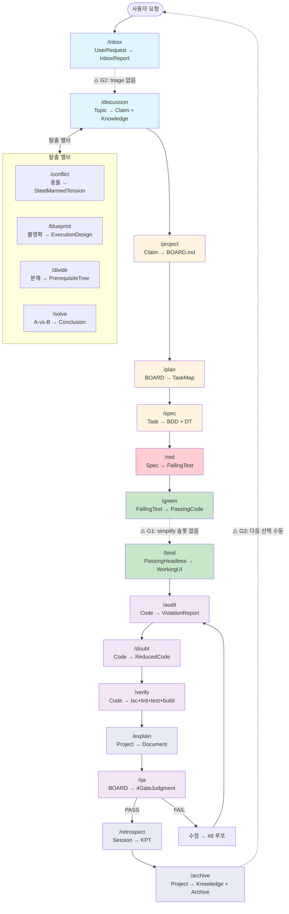
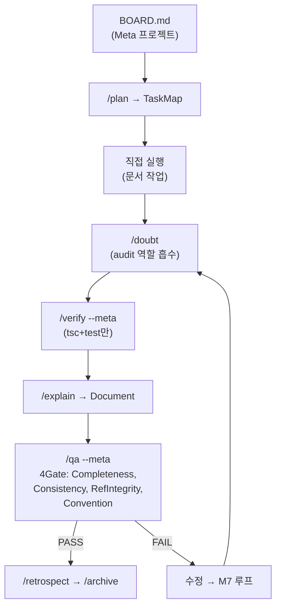
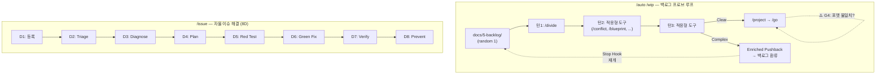

# Skill & Pipeline I/O Map — 48개 스킬의 함수 매핑과 빈칸 분석

> 작성일: 2026-03-12
> 맥락: 48개 스킬이 개별 SKILL.md로 흩어져 있어 전체 데이터플로우를 조감할 수 없었다. 스킬을 `f(input) → output`으로 정의하고, 의존 그래프에서 빈칸을 예측한다.

---

## Why — 왜 스킬을 함수로 봐야 하는가

48개 스킬은 각각 독립된 SKILL.md를 가지고 있다. `/go` 파이프라인이 이들의 실행 순서를 정의하지만, **각 스킬이 무엇을 받아서 무엇을 내놓는지**(I/O 타입)는 어디에도 명시되어 있지 않다.

역할(role) 기준으로 분류하면 카탈로그에 불과하다. **I/O 기준으로 보면 의존 그래프**가 된다. 그래프에서 체인이 끊기는 곳 = 빈칸. 멘델레예프가 주기율표에서 원소의 성질 주기성이 깨지는 곳에 미발견 원소를 예측했듯이, I/O 체인이 끊기는 곳에 아직 만들지 않은 스킬(또는 명시적 변환)이 있어야 한다.



| 관점 | 질문 | 답 |
|------|------|----|
| 역할 기준 | "이 스킬은 뭘 하는가?" | 카탈로그 — 정적 설명 |
| I/O 기준 | "이 스킬의 output이 어디로 가는가?" | 데이터플로우 — 의존 관계 + 빈칸 예측 |

---

## How — 스킬 I/O 사전과 흐름도

### Part 1: I/O 사전

모든 스킬을 `f(input) → output` 형태로 정의한다. output의 타입명이 다음 스킬의 input과 일치하면 의존 간선이다.

#### 주 경로 (Main Pipeline — `/go`가 오케스트레이션)

| # | 스킬 | Input | Output | 비고 |
|---|------|-------|--------|------|
| 0 | `/inbox` | UserRequest (자연어) | **InboxReport** (`docs/0-inbox/`) | 정형화된 분석 보고서 |
| 1 | `/discussion` | Topic | **Claim + Knowledge[] + RoutingDecision** | Toulmin 논증. Cynefin 판정 |
| 2 | `/project` | Claim + Knowledge | **BOARD.md** (Context, no tasks) | 전략 컨테이너. Scaffold |
| 3 | `/plan` | BOARD.md | **TaskMap** (sized, ordered) | 1턴 크기로 분해 |
| 4 | `/spec` | Task | **BDD Scenarios + DecisionTable** | spec.md |
| 5 | `/red` | Spec (BDD+DT) | **FailingTestScript** | 🔴 FAIL만 산출 |
| 6 | `/green` | FailingTests | **PassingCode** | 🟢 PASS하는 최소 구현 |
| 7 | `/bind` | PassingHeadless | **WorkingUI** | headless → React 연결 |
| 8 | `/audit` | CompletedCode | **ViolationReport** | OS 계약 grep. LLM실수/OS갭/예외 분류 |
| 9 | `/doubt` | CompletedCode | **ReducedCode** | 4단 필터: 존재·적합·분량·효율 |
| 10 | `/verify` | Code | **VerificationResult** (tsc0+lint0+testPASS+buildOK) | 기계적 게이트 |
| 11 | `/explain` | Project | **ExplainDocument** (Why/How/What/If + Mermaid) | 해설 문서 |
| 12 | `/qa` | BOARD.md | **4GateJudgment** (spec-drift, code-review, contract, simplicity) | fresh context worktree agent |
| 13 | `/retrospect` | Session | **KPT + ImmediateActions** | 개발·협업·워크플로우 3관점 |
| 14 | `/archive` | Project | **ArchivedKnowledge** (→2-area/rules) + **ArchivedArtifacts** (→4-archive/) | 종료 |

#### 탈출 밸브 (Discussion 내부 또는 /go 모호함 프로토콜)

| 스킬 | Input | Output | 트리거 |
|------|-------|--------|--------|
| `/conflict` | TwoPrinciples (충돌하는 설계 방향) | **SteelMannedTension** (양쪽 구조화) | 논의 교착 |
| `/blueprint` | UnclearPath (경쟁 접근법) | **TOC ExecutionDesign** (Goal→Why→Challenge→Ideal→Gap) | 구현 경로 불명 |
| `/divide` | ClearGoal + UnclearDecomposition | **PrerequisiteTree** (✅/🔨 leaf) | 분해 필요 |
| `/solve` | A-vs-B Loop | **Constraint→Option→Conclusion** | 반복 질문 루프 |

#### 코드 변경 (보조 — 필요 시 호출)

| 스킬 | Input | Output | 트리거 |
|------|-------|--------|--------|
| `/fix` | BrokenCompile (형식 오류) | **CompilingCode** | 누락 import, 깨진 경로 |
| `/refactor` | GreenCode + CodeSmell | **ImprovedShape** (행동 불변) | 중복, 네이밍 |
| `/simplify` | GreenCode | **ReviewedCode** (reuse, quality, efficiency) | green 직후 |
| `/perf` | SlowInteraction | **MeasuredOptimization** (Before/After) | 체감 느림 |
| `/coverage` | LogicFiles (low coverage) | **≥80% CoveragePerFile** | 커버리지 부족 |
| `/repro` | ObservedBug (브라우저) | **FailingTestScript** (올바른 이유) | 재현 필요 |
| `/apg` | W3C APG Spec | **ImplementedPattern** + VerifiedTests | APG 구현 |

#### 분석/추출 (코드 변경 없음)

| 스킬 | Input | Output | 트리거 |
|------|-------|--------|--------|
| `/elicit` | WrongDecision | **ExplicitTacitKnowledge** | 암묵지 추출 |
| `/stories` | ProductContext | **stories.md** (living document) | 유저 스토리 발견 |
| `/naming` | NewAPISurface | **KeyPoolTable** (형태소 분해) | 새 식별자 설계 |
| `/usage` | NewFeatureConcept | **IdealAPICode + 18ConceptMap** | API 설계 초기 |
| `/diagnose` | SuspiciousCode | **DesignDebtTrace** | 반복 버그 |
| `/why` | StuckLoop (3회+ 재시도) | **RootCauseReport** | 루프 탈출 |
| `/redteam` | Design | **ExpertVerificationAnalysis** | 외부 관점 검증 |
| `/design-review` | Architecture | **5GateRedTeamReport** (folder, LOC, naming, deps, tensions) | 아키텍처 진단 |

#### 오케스트레이션 (스킬을 조합·반복)

| 스킬 | Input | Output | 메커니즘 |
|------|-------|--------|----------|
| `/go` | BOARD.md state | **RoutedSkillExecution + VerificationLoop** | 15단계 Code / 13단계 Meta 파이프라인 |
| `/auto` | `/go` or `/wip` target | **ContinuousExecution** (Stop Hook) | 마커 기반, /archive에서 종료 |
| `/wip` | Backlog (random 1) | **Clear→/project→/go** OR **EnrichedPushback** | ≤3턴 프로브 |
| `/issue` | Issue | **Resolved+Prevented** (8D pipeline) | 자율: diagnose→plan→red→green→verify |
| `/review` | Code | **AuditReport + ReducedCode** | `/audit` → `/doubt` 순차 합성 |

#### 메타/관리 (시스템 유지)

| 스킬 | Input | Output | 트리거 |
|------|-------|--------|--------|
| `/ready` | SessionStart / BrokenEnv | **VerifiedEnv** (server+tsc+render) | 세션 시작 |
| `/status` | ProjectState | **Updated STATUS.md** | 대시보드 갱신 |
| `/backlog` | Idea / Gap / Debt | **FormattedBacklogEntry** (`5-backlog/`) | 아이디어 등록 |
| `/knowledge` | Knowledge[] | **PersistedKnowledge** (rules/knowledge/2-area) | 지식 영속화 |
| `/resources` | ProjectContext | **References + BestPractices** (`3-resource/`) | 레퍼런스 수집 |
| `/rules` | NewRule / Standard | **Updated rules.md** | 규칙 추가 |
| `/retire` | SupersededDocs | **RemovedFromContext** (git archive 보존) | 문서 정리 |
| `/reframe` | InformalTerms | **StandardFrameworkTerms** | 용어 표준화 |
| `/workflow` | WorkflowNeed | **New/Modified SKILL.md** | 스킬 저작 |
| `/ban` | UnrecoverableContext | **FailureLog + Handoff + Exit** | 세션 포기 |
| `/reflect` | BetweenSteps | **IntentVsResultCheck** | 방향 점검 |
| `/mermaid` | DiagramNeed | **MermaidFile** | 다이어그램 전용 턴 |

#### 크로스커팅

| 스킬 | Input | Output | 적용 범위 |
|------|-------|--------|----------|
| `_middleware` | (암묵적 — 모든 워크플로우) | **AccumulatedKnowledge** (📝 세션 메모) | 전 스킬에 적용 |

---

### Part 2: 의존 흐름도

#### 2-1. 주 경로 — `/go` Code Pipeline



| 색상 | 의미 |
|------|------|
| 파란색 | 이해 (Explore) |
| 주황색 | 설계 (Design) |
| 빨간/초록 | 구현 (Build) |
| 보라색 | 검증 (Verify) |
| 남색 | 귀환 (Return) |
| 점선 | 빈칸 (Gap) |

#### 2-2. Meta Pipeline (`/go` #1 분기)



#### 2-3. 병렬 파이프라인



---

## What — 빈칸 분석 (주기율표의 미발견 원소)

I/O 체인을 따라가면 다음 지점에서 체인이 끊기거나 변환이 암묵적이다.

### 🔲 G1. `/green` → `/bind` 사이 — "Make It Right" 슬롯 부재

| 항목 | 내용 |
|------|------|
| **위치** | `/go` #6(green PASS) → #7(bind) 사이 |
| **관찰** | `/simplify`는 시스템 프롬프트에 "Review changed code for reuse, quality, and efficiency"로 정의되어 있지만, SKILL.md 파일이 존재하지 않고, `/go` 파이프라인에 명시적 슬롯도 없다 |
| **영향** | "make it work"(green) → 바로 "connect to UI"(bind)로 넘어가며, "make it right" 단계가 생략된다 |
| **현재 커버** | `/doubt`(감산 필터)가 #9에서 실행되지만, 이는 bind 이후. `/refactor`는 수동 호출만 가능 |
| **빈칸 가설** | `/green` → **`[simplify/refactor]`** → `/bind` 순서가 자연스럽다. 또는 `/doubt`를 bind 전으로 이동 |

### 🔲 G2. `/inbox` → `/discussion` 사이 — Triage 부재

| 항목 | 내용 |
|------|------|
| **위치** | `/inbox` output(InboxReport) → `/discussion` input(Topic) |
| **관찰** | `/inbox`는 정형화된 보고서를 생산하지만, `/discussion`은 비정형 "Topic"을 받는다. 여러 inbox 보고서 중 어떤 것을 먼저 논의할지 판단하는 우선순위 메커니즘이 없다 |
| **영향** | 사용자가 수동으로 토픽을 선택한다. 이것은 현재 작동하지만, 자율 실행(/auto)에서는 판단 근거가 없다 |
| **빈칸 가설** | **`[triage]`**: InboxReport[] → PrioritizedTopic. 또는 `/wip`의 "랜덤 선택"을 inbox에도 적용 |

### 🔲 G3. `/archive` 이후 — 자동 다음 선택 부재

| 항목 | 내용 |
|------|------|
| **위치** | `/archive` output(ArchivedKnowledge) → ??? |
| **관찰** | 아카이브 후 파이프라인이 종료된다. 다음 프로젝트는 사용자가 `/discussion`이나 `/wip`을 수동 호출해야 시작 |
| **영향** | `/auto`가 `/archive`에서 마커를 삭제하고 종료. 연속 실행이 여기서 끊긴다 |
| **빈칸 가설** | **`[next]`**: ArchivedKnowledge + STATUS.md → NextPriority. 또는 `/auto`가 archive 후 자동으로 `/wip`을 실행하는 루프 |

### ⚠️ G4. `/wip` → `/project` — 포맷 불일치 의심

| 항목 | 내용 |
|------|------|
| **위치** | `/wip` Step 3A에서 `/project` 호출 |
| **관찰** | `/project`는 Discussion의 Toulmin 구조(Claim, Warrant, Rebuttal)를 BOARD.md Context로 변환한다. `/wip`은 `/divide`, `/conflict` 등 분석 도구만 사용하며 Toulmin 구조를 생산하지 않는다 |
| **영향** | `/wip` → `/project` 시 BOARD.md의 Context 테이블(Claim, Before, After, Risk)이 불완전할 수 있다 |
| **빈칸 가설** | `/wip`이 Clear 도달 시 분석 결과를 Toulmin 형식으로 변환하는 단계가 필요하거나, `/project`가 Toulmin 외의 입력도 수용하도록 확장 |

### ⚠️ G6. 지식 흐름 3경로 — 경계 암묵적

| 항목 | 내용 |
|------|------|
| **위치** | `_middleware` ↔ `/knowledge` ↔ `/archive` |
| **관찰** | 지식이 3곳에서 축적된다: (1) `_middleware`가 세션 중 📝 메모 누적, (2) `/knowledge`가 명시적으로 rules/knowledge/2-area에 영속화, (3) `/archive`가 프로젝트 종료 시 환류 |
| **영향** | 3경로가 겹칠 때 누가 우선인지 불명확. 예: `/archive`에서 환류하려는 지식이 이미 `_middleware` → `/knowledge`로 저장되었을 때 |
| **빈칸 가설** | 3경로는 계층이다: `_middleware`(수집) → `/knowledge`(영속화) → `/archive`(프로젝트 단위 정리). 이 계층을 명문화하면 충분할 수 있다 |

### ✅ G5. `/bind` 직후 시각 검증 — Zero Drift가 커버

Zero Drift 원칙: headless 테스트 통과 = DOM 동일 동작. 아키텍처 보장이므로 별도 시각 검증 스킬은 불필요. TestBot/Inspector가 인간용 보조 도구로 존재.

### ✅ G7. `/spec` → `/red` — 별도 "테스트 설계" 불필요

`/red`의 input이 Spec(BDD+DT)이고, `/red`의 책임이 "DT 행을 테스트 케이스로 변환"이다. 이 변환이 `/red` 내부에서 일어나므로 별도 단계 불필요.

---

## If — 향후 방향과 제약

### 빈칸 우선순위

| 빈칸 | 영향도 | 긴급도 | 제안 |
|------|--------|--------|------|
| **G1** (simplify 슬롯) | 높음 — 코드 품질 루프 | 중간 | `/simplify` SKILL.md 작성 + `/go` #6.5에 슬롯 추가 |
| **G2** (triage) | 중간 — 수동 선택이 작동 | 낮음 | `/auto` 자율 모드에서만 필요. 수동 모드에서는 사용자가 triage |
| **G3** (post-archive next) | 중간 — 연속 실행 단절 | 낮음 | `/auto`에 archive 후 `/wip` 자동 재진입 옵션 |
| **G4** (wip→project 포맷) | 낮음 — 실사례 검증 필요 | 낮음 | `/wip` Clear 사례 축적 후 재평가 |
| **G6** (지식 3경로) | 낮음 — 실질 충돌 미발생 | 낮음 | `_middleware` SKILL.md에 계층 명문화 |

### 이 문서의 한계

1. **정적 스냅샷**: 이 문서는 2026-03-12 시점의 매핑이다. 스킬이 추가/변경되면 갱신 필요
2. **I/O 타입은 비공식**: 여기서 정의한 타입명(InboxReport, Claim, TaskMap 등)은 코드의 실제 타입이 아니라 설명용 라벨이다
3. **크로스커팅 미포함**: `_middleware`, `/reflect`는 어떤 단계 사이에든 삽입 가능하여 흐름도에 표현하기 어렵다

### 전체 스킬 수 정리

| 분류 | 스킬 수 | 스킬 목록 |
|------|---------|----------|
| 주 경로 | 14 | inbox, discussion, project, plan, spec, red, green, bind, audit, doubt, verify, explain, qa, archive |
| 주 경로 보조 | 1 | retrospect |
| 탈출 밸브 | 4 | conflict, blueprint, divide, solve |
| 코드 변경 (보조) | 7 | fix, refactor, simplify, perf, coverage, repro, apg |
| 분석/추출 | 8 | elicit, stories, naming, usage, diagnose, why, redteam, design-review |
| 오케스트레이션 | 5 | go, auto, wip, issue, review |
| 메타/관리 | 11 | ready, status, backlog, knowledge, resources, rules, retire, reframe, workflow, ban, mermaid |
| 크로스커팅 | 2 | _middleware, reflect |
| **합계** | **52** | (48 SKILL.md + simplify(파일 없음) + 시스템 내장 3개) |

---

## 부록: 완전 I/O 체인 (선형 읽기용)

```
UserRequest
  │
  ▼ /inbox
InboxReport
  │
  ▼ /discussion (+ /conflict, /blueprint, /divide, /solve)
Claim + Knowledge[] + RoutingDecision
  │
  ▼ /project
BOARD.md (Context)
  │
  ▼ /plan
TaskMap (sized, ordered)
  │
  ▼ /spec          ←── 태스크별 반복 시작
BDD Scenarios + DecisionTable
  │
  ▼ /red
FailingTestScript
  │
  ▼ /green
PassingCode
  │
  ▼ [G1: simplify?]  ←── 빈칸
  │
  ▼ /bind
WorkingUI
  │                 ←── 태스크별 반복 종료
  ▼ /audit
ViolationReport
  │
  ▼ /doubt
ReducedCode
  │
  ▼ /verify
VerificationResult (tsc0 + lint0 + testPASS + buildOK)
  │
  ▼ /explain
ExplainDocument
  │
  ▼ /qa (fresh context, worktree)
4GateJudgment
  │
  ├──FAIL──→ 수정 → /audit 루프
  │
  ▼ PASS
  │
  ▼ /retrospect
KPT + ImmediateActions
  │
  ▼ /archive
ArchivedKnowledge (→ 2-area, rules)
  │
  ▼ [G3: next?]  ←── 빈칸
  │
  (종료 또는 수동 재시작)
```
