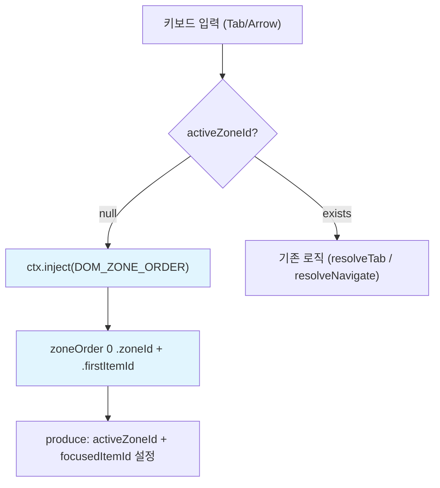

# auto-zone-entry — activeZoneId null 시 Tab/Arrow 자동 진입

> 작성일: 2026-03-12
> 맥락: eb2f8b2a에서 Zone mount OS_FOCUS 제거 후 발생한 keyboard navigation regression 수정

---

## Why — 클릭 없이는 키보드가 먹통이었다

commit `eb2f8b2a`(2026-03-05)에서 설계 원칙 #32("useLayoutEffect는 DOM API 호출 전용, OS→OS init dispatch 금지")를 적용하여 Zone mount 시 `OS_FOCUS` dispatch를 제거했다. 이후 `4ce474b6`에서 `autoFocus` zone(dialog/overlay)만 부분 복구했으나, **일반 zone은 클릭 전까지 `activeZoneId === null`** 상태로 남게 되었다.

`OS_TAB`과 `OS_NAVIGATE` 모두 첫 줄에서 `if (!activeZoneId) return;`으로 조기 종료하므로, **페이지 로드 후 키보드만으로는 앱을 전혀 조작할 수 없는 regression**이 발생했다.

```mermaid
stateDiagram-v2
    [*] --> NullZone: 페이지 로드
    NullZone --> NullZone: Tab/Arrow (silent reject)
    NullZone --> ActiveZone: 클릭 (유일한 진입점)
    ActiveZone --> ActiveZone: Tab/Arrow (정상 동작)

    note right of NullZone: regression: 키보드 무반응
```

---

## How — 3-inject DOM_ZONE_ORDER[0]로 자동 진입

mount-time dispatch 대신 **기존 3-inject 파이프라인**을 활용했다. `DOM_ZONE_ORDER`는 이미 모든 zone을 DOM 순서대로 정렬하고 각 zone의 `firstItemId`를 계산하는 inject provider다.

`OS_TAB`과 `OS_NAVIGATE`의 null guard를 수정: `activeZoneId === null`일 때 `DOM_ZONE_ORDER[0]`의 첫 zone/item으로 자동 진입한다.



핵심 코드 (tab.ts, navigate/index.ts 동일 패턴):

```ts
if (!activeZoneId) {
  const zoneOrder = ctx.inject(DOM_ZONE_ORDER);
  const first = zoneOrder[0];
  if (!first?.firstItemId) return;
  return {
    state: produce(ctx.state, (draft) => {
      draft.os.focus.activeZoneId = first.zoneId;
      const z = ensureZone(draft.os, first.zoneId);
      z.focusedItemId = first.firstItemId;
      z.lastFocusedId = first.firstItemId;
    }) as typeof ctx.state,
  };
}
```

설계 원칙 **#32-a**로 공식화: "activeZoneId null → 3-inject의 DOM_ZONE_ORDER[0]로 주입."

---

## What — 결과

| 지표 | 값 |
|------|-----|
| 수정 파일 | `tab.ts`, `navigate/index.ts` (각 +12줄) |
| 새 테스트 | `cross-zone.test.ts` +4 (Tab auto-entry, Arrow auto-entry, correct zone/item, subsequent Tab) |
| 전체 테스트 | 801 passed, 0 failures |
| 새 개념 | 0 (기존 DOM_ZONE_ORDER inject 재사용) |
| 커밋 | `7b5e97c4` |

---

## If — 제약과 향후

- **Zone 0개 상태**: `zoneOrder[0]`이 없거나 `firstItemId`가 null이면 조용히 무시 (기존 동작 유지)
- **autoFocus zone과 공존**: autoFocus(dialog/overlay)는 별도 경로(`OS_FOCUS` dispatch)로 처리. 이 수정은 일반 zone만 대상
- **headless 호환**: jsdom/happy-dom에서 동일하게 동작 (DOM_ZONE_ORDER는 ZoneRegistry 기반)
- **향후 확장**: 특정 zone을 우선 포커스 대상으로 지정하는 `autofocus priority` 기능은 범위 밖 (필요 시 별도 프로젝트)
