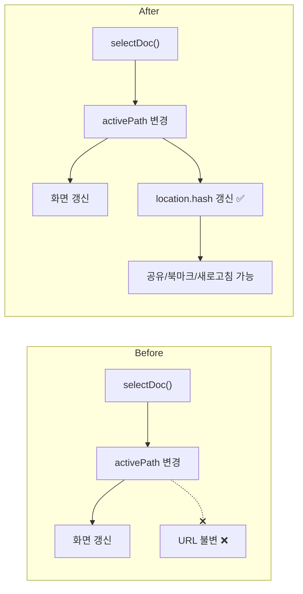
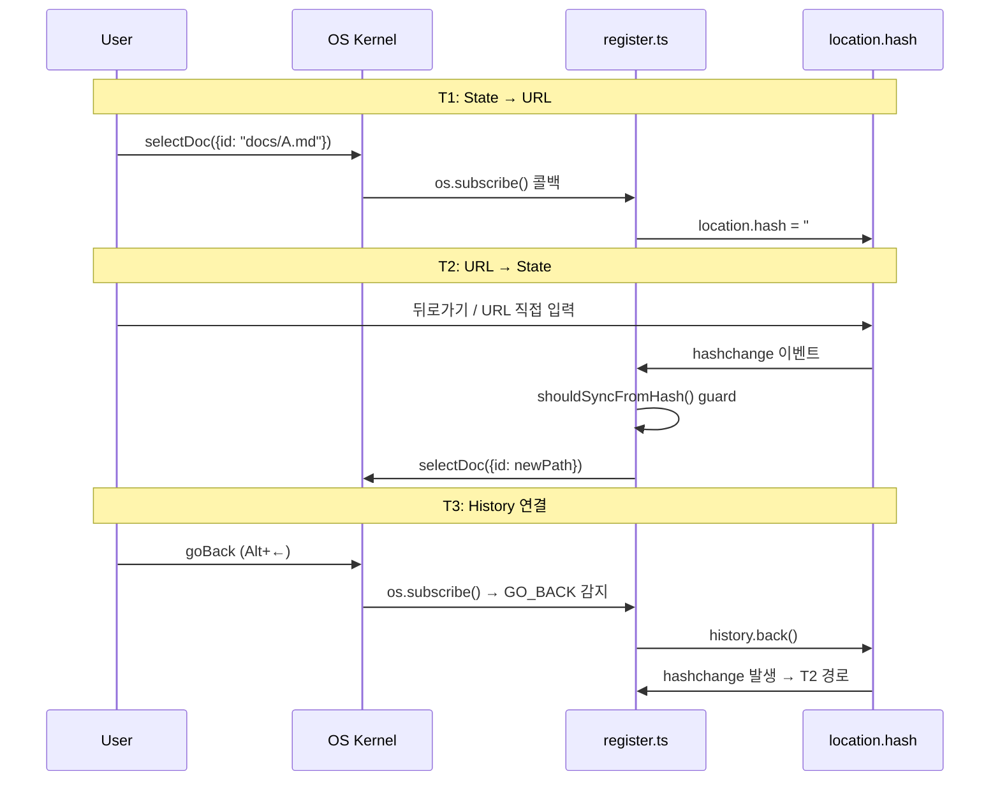

# url-routing — DocsViewer hash 기반 양방향 URL 동기화

> 작성일: 2026-03-12
> 맥락: DocsViewer의 activePath를 location.hash와 양방향 동기화하여 문서 공유/북마크/새로고침 복원을 지원한다.

---

## Why — 왜 URL 동기화가 필요했는가

DocsViewer는 OS 앱 상태(`activePath`)로 현재 문서를 관리한다. 그러나 이 상태는 브라우저 URL과 연결되지 않아 세 가지 문제가 있었다:

1. **공유 불가**: 특정 문서를 열어도 URL이 변하지 않아 링크를 줄 수 없음
2. **북마크 불가**: 브라우저 즐겨찾기에 저장해도 항상 초기 상태로 로드
3. **새로고침 소실**: F5를 누르면 현재 문서 위치를 잃음

기존 코드에는 `parseHashToPath()`와 `getInitialPath()`가 있어 **초기 로드 시 hash→state 단방향 읽기**는 가능했다. 부족한 것은 **state→URL 쓰기**와 **실시간 URL→state 동기화**였다.

---

## How — 어떤 구조로 해결했는가

3개 태스크를 `register.ts`(side-effect 등록 파일)에 구현했다. 모두 `os.subscribe()`와 `window.addEventListener`를 사용하는 리스너 패턴이다.

### 무한루프 방지

T1(state→URL)과 T2(URL→state)가 동시에 동작하면 무한루프 위험이 있다. 두 겹의 guard로 차단한다:

1. **T1 guard**: `lastSyncedPath` 변수로 같은 path에 대한 중복 hash 쓰기 방지
2. **T2 guard**: `shouldSyncFromHash(currentPath, hash)`가 현재 activePath와 hash에서 파싱된 path가 같으면 `false` 반환

### 순수 함수 (`app.ts`)

| 함수 | 역할 | 예시 |
|------|------|------|
| `pathToHash(path)` | state→URL 변환 | `"docs/A.md"` → `"#/docs/A.md"` |
| `shouldSyncFromHash(current, hash)` | 루프 guard | 같은 path면 `false` |
| `parseHashToPath(hash)` | URL→state 변환 (기존) | `"#/docs/A.md"` → `"docs/A.md"` |

---

## What — 구현 결과

| 항목 | 수치 |
|------|------|
| 변경 파일 | 3개 (`app.ts`, `register.ts`, `DocsViewer.tsx`) |
| 새 테스트 | 10개 (순수 함수 단위 테스트) |
| 총 테스트 | 797 passed |
| tsc errors | 0 |
| build | OK |

`register.ts`에 추가된 코드는 약 35줄이다. `app.ts`에 순수 함수 2개(`pathToHash`, `shouldSyncFromHash`)를 export하고, `DocsViewer.tsx`의 주석만 갱신했다.

---

## If — 제약과 향후 방향

**제약사항**:
- `ext:` prefix(외부 폴더 모드)는 hash 동기화 대상에서 제외된다 (`parseHashToPath`가 `null` 반환)
- 쿼리 파라미터는 지원하지 않는다 (Out of Scope)
- SSR 환경에서는 `typeof window !== "undefined"` guard로 안전하게 스킵

**향후 확장 가능성**:
- TanStack Router 통합이 필요해지면, `register.ts`의 hash 로직을 router 모듈로 교체 가능
- 현재는 hash 기반이므로 서버 설정 없이 동작한다
