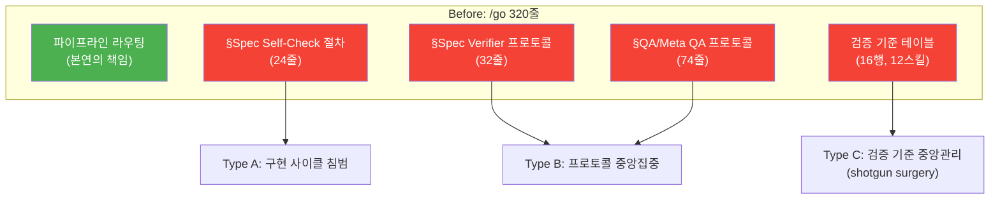
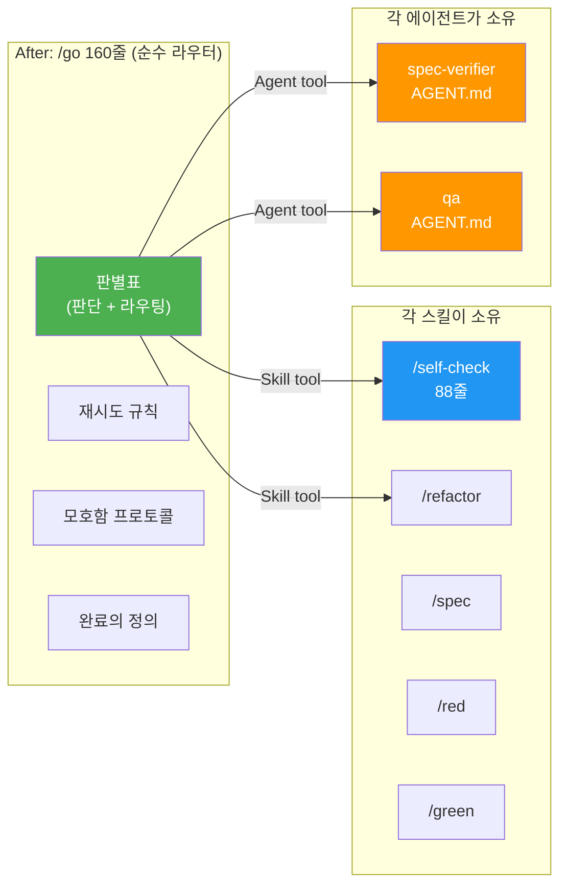

# go-srp — /go 파이프라인 SRP 리팩토링 해설

> 작성일: 2026-03-12
> 맥락: /go가 순수 라우터 역할을 넘어 절차·프로토콜·검증 기준을 중앙 관리하는 SRP 위반을 해소한 프로젝트

---

## Why — /go는 왜 비대해졌는가?

url-routing 프로젝트에서 `register.ts`에 코드가 존재했지만 `main.tsx`에서 import하지 않아 기능이 동작하지 않는 사건이 발생했다. spec-verifier가 FAIL을 보고했으나 개발 세션이 이를 무시하고 진행했다.

이 사건의 근본 원인을 추적하면서 /go의 구조적 문제가 드러났다:

| 위반 유형 | 증상 | 영향 |
|-----------|------|------|
| **A: 구현 사이클 침범** | TDD 내부 단계(simplify, spec self-check)를 /go가 관리 | 스킬 추가마다 /go 수정 필요 |
| **B: 프로토콜 중앙집중** | spec-verifier, QA, Meta QA 호출 방법을 /go가 80줄 넘게 기술 | AGENT.md와 /go가 이중 관리 |
| **C: 검증 기준 중앙관리** | 12개 스킬의 정량 기준을 /go 테이블이 관리 | 스킬 기준 변경마다 /go도 수정 (shotgun surgery) |

/go의 본연의 역할은 **판단 + 라우팅**이다. 절차, 프로토콜, 검증 기준은 각 스킬/에이전트가 소유해야 한다.

---

## How — 어떻게 분리했는가?

3가지 전략으로 SRP를 복원했다:

1. **추출**: §Spec Self-Check 절차 → 독립 스킬 `/self-check`로 추출
2. **위임**: 에이전트 프로토콜 → "AGENT.md를 따른다" 1줄 참조로 대체
3. **분산**: 검증 기준 테이블 → 각 스킬의 Exit Criteria로 분산

파이프라인 순서도 Kent Beck TDD(Red-Green-Refactor) 사이클에 맞게 재배치했다:

**Before**: `red → green → simplify → reflect → bind`
**After**: `red → green → self-check → refactor → bind`

핵심 변경: self-check FAIL 시 `/red`로 루프백. "코드가 존재하는가?"(필요조건)와 "코드가 실행되는가?"(충분조건, import chain 추적)를 분리하여 url-routing 사건의 재발을 구조적으로 방지한다.

---

## What — 정량 결과

| 지표 | Before | After | 변화 |
|------|--------|-------|------|
| /go 줄 수 | 320 | 160 | **-50%** |
| 절차/프로토콜 줄 수 (in /go) | ~130 | 0 | **-100%** |
| 검증 기준 테이블 행 수 (in /go) | 16 | 0 | **-100%** |
| 에이전트 참조 | 상세 프로토콜 | "AGENT.md를 따른다" 1줄 | 이중 관리 해소 |
| 신규 스킬 | — | `/self-check` (88줄) | 독립 책임 |
| /plan Step 0 | — | `/divide` 전제 확인 (+12줄) | 누락 방지 |
| 전체 diff | — | -426 +293 | **순 -133줄** |

3개 태스크 전부 완료:
- **T1**: `/self-check` SKILL.md + workflows 생성
- **T2**: `/go` SKILL.md + workflows 재작성
- **T3**: `/plan` SKILL.md + workflows에 Step 0 추가

/doubt에서 dual-file sync 누락(`workflows/self-check.md`)과 pre-existing tsc error를 추가 발견하여 수정.

---

## If — 향후 영향과 제약

**새 스킬 추가 시**: /go 수정 불필요. 판별표에 1행 추가하고, 스킬 자체가 Exit Criteria를 소유하면 된다.

**Exit Criteria 형식 통일 위험** (BOARD Risk): 각 스킬의 Exit Criteria 형식이 다르면 /go가 "통과 여부"를 기계적으로 판단하기 어려울 수 있다. 현재는 스킬이 PASS/FAIL을 명시적으로 보고하는 방식으로 해소.

**self-check의 한계**: import chain 추적은 LLM의 코드 읽기 능력에 의존한다. 복잡한 dynamic import, lazy loading, side-effect chain에서는 false negative 가능. 그러나 url-routing 수준의 단순 누락은 확실히 잡는다.

---

## 부록: 파일 변경 목록

| 파일 | 변경 |
|------|------|
| `.claude/skills/self-check/SKILL.md` | 신규 생성 (88줄) |
| `.agent/workflows/self-check.md` | 신규 생성 (dual-file) |
| `.claude/skills/go/SKILL.md` | 재작성 (320→160줄) |
| `.agent/workflows/go.md` | 재작성 (dual-file sync) |
| `.claude/skills/plan/SKILL.md` | Step 0 추가 (+12줄) |
| `.agent/workflows/plan.md` | Step 0 추가 (dual-file sync) |
