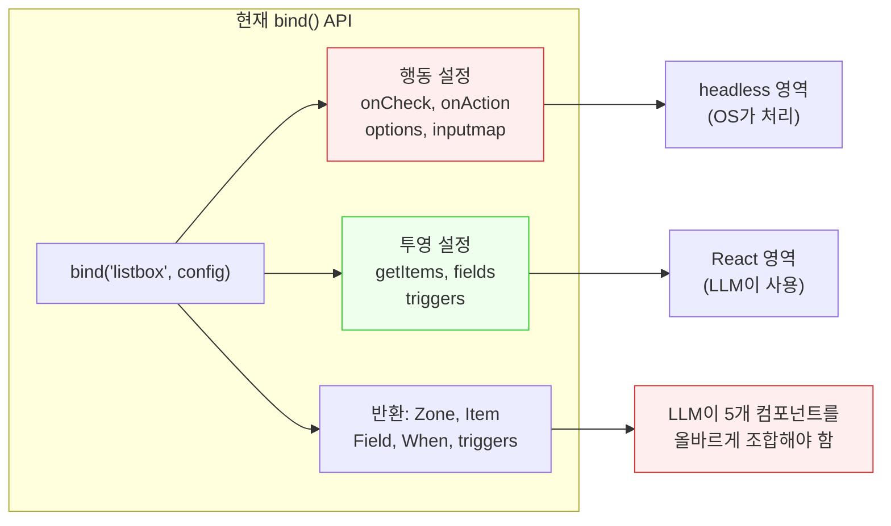
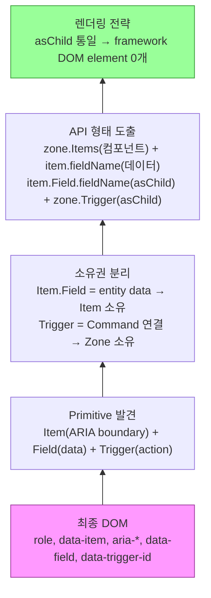
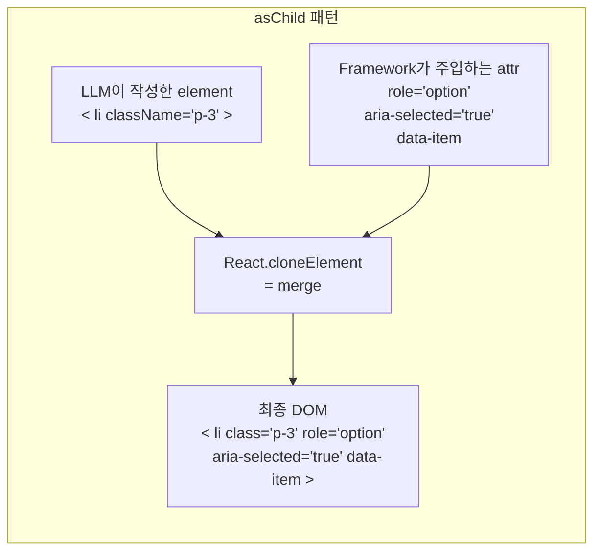
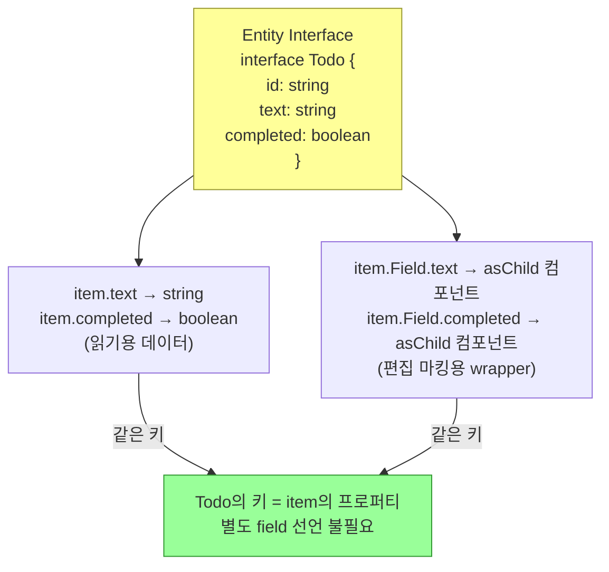

# Projection Next API v2 — asChild + Entity-driven Zone API

> 작성일: 2026-03-13
> 맥락: /discussion에서 합의된 React 투영 레이어의 전면 재설계. Phase 1 spike(createZone, bind2)를 폐기하고, "React가 받아야 하는 최소 계약"에서 역추적하여 도출한 새 API.

---

## Why — 현재 API는 왜 재설계가 필요한가

### 근본 전제: 코드 작성자 = LLM

이 프로젝트의 모든 코드는 LLM이 작성한다. 따라서 API 설계의 기준은 "인간 DX"가 아니라 **"LLM이 환각 없이 정확하게 생성할 확률"**이다.

### 현재 API의 문제

현재 `bind()` API는 두 가지 관심사가 혼재한다:



| 문제 | 설명 |
|------|------|
| **혼재된 관심사** | 행동(headless)과 투영(React)이 하나의 `bind()` config에 섞여 있음 |
| **넓은 API 표면** | `bind()` 반환값이 `{ Zone, Item, Field, When, triggers }` — LLM이 5개를 조합 |
| **ARIA 수동 관리** | `<Item>` 사용 시 LLM이 ARIA 속성을 인지해야 함 |
| **Entity 직접 참조** | `useComputed(s => s.data.todos[id])` — raw entity 접근이 열려있어 환각 경로 다수 |

### Phase 1 spike 실패 교훈

Phase 1에서 createZone spike가 usage-spec을 무시하고 독자 구현하여, API 일치율 0%로 실패했다. 근본 원인: **역추적 없이 구현부터 시작**. Phase 2는 "최종 DOM → 필요한 primitive → API 형태" 순서로 역추적한다.

---

## How — 새 API의 설계 원리

### 설계 방법: 끝에서 시작 (DOM → Primitive → API)



### 핵심 원리 1: React = 순수 투영

headless(defineApp + os-core)가 **모든 행동**을 처리한다:

| 계층 | 처리하는 것 | React가 아는가? |
|------|-----------|----------------|
| **1-listen** | 이벤트 캡처 | X |
| **2-resolve** | 키보드 → Command 변환 (inputmap, keybinding) | X |
| **3-inject** | 포커스, 선택, 확장 상태 계산 | X |
| **4-command** | 상태 변경 (CRUD, undo/redo, clipboard) | X |
| **5-effect** | DOM focus 이동, scroll | X |
| **React** | **ARIA attr + 콘텐츠를 DOM에 찍기** | **이것만** |

따라서 React에게 전달할 최소 계약은:
1. **Item 목록** — 어떤 entity를 렌더할지
2. **Item별 ARIA 상태** — `aria-selected`, `aria-checked`, `aria-expanded` 등
3. **Item별 콘텐츠** — entity 데이터 (Field)
4. **Trigger** — 포인터 액션의 `data-trigger-id` 속성

### 핵심 원리 2: asChild 통일

Framework가 만드는 DOM element = **0개**. 모든 컴포넌트(Zone, Items, Field)가 asChild 패턴으로, LLM/디자이너가 제공한 element에 ARIA 속성을 merge한다.



**asChild 성능**: `React.cloneElement`는 wrapper div 대비 DOM 노드·React fiber 모두 적다. Radix UI 전체가 이 패턴으로 운영되며 성능 문제 보고 없음.

### 핵심 원리 3: Entity interface = SSOT



Todo interface의 키가 곧 `item.fieldName`과 `item.Field.fieldName`의 shape를 결정한다. TS mapped type으로 추론.

### 핵심 원리 4: 소유권 분리 (Item vs Zone)

| 소유자 | 가지는 것 | 이유 |
|--------|----------|------|
| **Item** | `item.fieldName` (데이터) | entity 속성 |
| **Item** | `item.Field.fieldName` (asChild wrapper) | entity 속성의 편집 마킹 |
| **Zone** | `zone.Trigger` (asChild) | Command 연결은 Zone 레벨 |
| **Zone** | `zone.Items` (컴포넌트) | collection iteration + ARIA wrapping |

**Item = 순수 데이터 객체.** Trigger가 Item에 없으므로, Item은 행동을 모른다.
**Zone = 행동의 소유자.** Command 등록도 Zone에서 이루어진다.

---

## What — 최종 API 형태

### 선언 (headless)

```typescript
interface Todo {
  id: string;
  text: string;
  completed: boolean;
  dueDate: string;
}

const deleteTodo = TodoApp.command("deleteTodo", (ctx) => { /* ... */ });
const toggleTodo = TodoApp.command("toggleTodo", (ctx) => { /* ... */ });

const TodoList = TodoApp.createZone("list", {
  role: "listbox",
  entity: Todo,                              // entity interface → item shape 결정
  commands: { deleteTodo, toggleTodo },      // Zone에서 사용할 command 등록
  // + headless 행동 (callbacks, options 등)
});
```

- `bind()` 없음. `createZone` 단일 API.
- `role`은 Zone config에 직접 지정. Zone = role.
- `commands`는 Zone별 등록. `cmd` 객체에는 여기 등록된 것만 노출.

### 투영 (React)

```tsx
<ul className="divide-y max-w-md">
  {/* Zone — asChild: ul에 role="listbox" data-zone tabindex merge */}
  <TodoList.Zone>
    {(zone) => (
      /* Items — 컴포넌트: iteration + 각 item ARIA wrapping */
      <zone.Items>
        {(item) => (
          /* Items callback root — asChild: li에 role="option" aria-selected data-item merge */
          <li className="flex items-center gap-2 p-3 hover:bg-gray-50">

            {/* Field wrapper (편집 가능) — asChild: input에 data-field merge */}
            <item.Field.completed>
              <input type="checkbox" checked={item.completed} />
            </item.Field.completed>

            {/* Field wrapper (편집 가능) — asChild: span에 data-field merge */}
            <item.Field.text>
              <span className="flex-1">{item.text}</span>
              {/* item.text = "장보기" (순수 데이터) */}
            </item.Field.text>

            {/* 읽기 전용 — 순수 데이터, wrapper 불필요 */}
            <span className="text-sm text-gray-400">{item.dueDate}</span>

            {/* Trigger — Zone 소유, asChild */}
            <zone.Trigger onPress={cmd => cmd.toggleTodo(item.id)}>
              <button className="p-1">✓</button>
            </zone.Trigger>

            <zone.Trigger onPress={cmd => cmd.deleteTodo(item.id)}>
              <button className="p-1 text-red-500">×</button>
            </zone.Trigger>

          </li>
        )}
      </zone.Items>
    )}
  </TodoList.Zone>
</ul>
```

### 렌더링 결과 (DOM)

```html
<ul class="divide-y max-w-md"
    role="listbox"
    data-zone="list"
    aria-label="Todo List"
    tabindex="0">

  <li class="flex items-center gap-2 p-3 hover:bg-gray-50"
      role="option"
      id="todo-1"
      data-item
      aria-selected="false"
      aria-checked="true">

    <input type="checkbox" checked
           data-field="completed"
           aria-checked="true"
           readonly />

    <span class="flex-1"
          data-field="text">장보기</span>

    <span class="text-sm text-gray-400">2026-03-15</span>

    <button class="p-1"
            data-trigger-id="toggleTodo"
            data-trigger-payload="todo-1">✓</button>

    <button class="p-1 text-red-500"
            data-trigger-id="deleteTodo"
            data-trigger-payload="todo-1">×</button>
  </li>
</ul>
```

**Framework가 만든 DOM element: 0개.** 모든 element는 LLM이 작성한 것. ARIA만 자동 주입.

### Primitive 전체 목록

| Primitive | 형태 | asChild | 소유자 | 역할 |
|-----------|------|---------|--------|------|
| `TodoList.Zone` | 컴포넌트 (render prop) | O | App | Zone 컨테이너, role + data-zone 주입 |
| `zone.Items` | 컴포넌트 (render prop) | O | Zone | iteration + Item ARIA wrapper |
| `item.fieldName` | 데이터 값 | — | Item | entity 속성 읽기 |
| `item.Field.fieldName` | asChild 컴포넌트 | O | Item | entity 속성 편집 마킹 (`data-field`) |
| `zone.Trigger` | asChild 컴포넌트 | O | Zone | 포인터 액션 (`data-trigger-id`) |
| `item.Children` | 컴포넌트 (render prop) | O | Item | Tree 재귀 (tree 계열만) |

### Tree 재귀 — 가장 복잡한 케이스

Treegrid(2D + 중첩)에서도 같은 primitive 모델이 성립한다:

```tsx
<div className="file-tree">
  <FileTree.Zone>
    {(zone) => (
      <zone.Items>
        {(item) => (
          <div className="flex items-center gap-2 pl-4">
            {item.name}
            {item.size}

            <zone.Trigger onPress={cmd => cmd.deleteFile(item.id)}>
              <button>×</button>
            </zone.Trigger>

            {/* Children — 같은 시그니처로 재귀 */}
            <item.Children>
              {(child) => (
                <div className="flex items-center gap-2 pl-8">
                  {child.name}
                  {child.size}

                  <zone.Trigger onPress={cmd => cmd.deleteFile(child.id)}>
                    <button>×</button>
                  </zone.Trigger>

                  {/* 더 깊은 재귀 — 실제로는 재귀 컴포넌트로 추출 */}
                  <child.Children>
                    {/* ... */}
                  </child.Children>
                </div>
              )}
            </item.Children>
          </div>
        )}
      </zone.Items>
    )}
  </FileTree.Zone>
</div>
```

**Item 내부 = `Field* + Trigger* + Children?`** — 자유 배치, 순서 제약 없음. 이 공식이 listbox~treegrid 4패턴을 커버한다:

| 패턴 | Item 구성 |
|------|----------|
| **Listbox** (1D flat) | Field + Trigger |
| **Grid** (2D flat) | Field(gridcell) + Trigger(gridcell) |
| **Tree** (1D nested) | Field + Trigger + Children |
| **Treegrid** (2D nested) | Field(gridcell) + Trigger(gridcell) + Children |

---

## If — 제약, 미결 사항, 향후 방향

### LLM이 하는 것 / 안 하는 것

| LLM이 하는 것 | LLM이 안 하는 것 |
|--------------|----------------|
| `className` 지정 | `aria-*` 속성 |
| layout 구조 (`div`, `li`, `flex`, `grid`) | `role` 속성 |
| element 선택 (`<li>`, `<div>`, `<span>`) | `tabIndex` |
| 아이콘 배치 | `data-trigger-id` |
| 조건부 렌더링 | entity 직접 참조 (`todo.text`) |
| `item.Field`로 편집 가능 여부 결정 | ARIA 상태 동기화 |

### asChild 제약

- callback의 root는 **실제 element**여야 한다. `<>Fragment</>`에는 attr merge 불가.
- 구현은 `React.cloneElement` 기반 (Radix UI `Slot` 패턴과 동일).

### 미결 사항

| # | 질문 | 영향 | 상태 |
|---|------|------|------|
| 1 | TS 제네릭: entity interface → `item.Field.fieldName` mapped type 실현 가능한가? | 핵심 DX | **→ /stub에서 검증 예정** |
| 2 | `zone.Trigger`의 `cmd` 파라미터가 등록된 commands만 노출하는 TS 추론 | Pit of Success | → /stub에서 검증 예정 |
| 3 | `item.Children` 재귀의 타입 일관성 | Tree 지원 | → /stub에서 검증 예정 |
| 4 | Zone 경계와 cross-zone 키보드: `linkZones()` vs combobox | UX | 별도 논의 필요 |
| 5 | inline edit (`item.Field.text` 편집 모드) 시 OS가 DOM target을 어떻게 식별하는가 | Field 편집 | `data-field` attr로 해결 (asChild가 주입) |
| 6 | `createZone` config에서 headless 행동(callbacks, options)의 상세 shape | 선언 API | 별도 설계 필요 |

### Phase 1 → Phase 2 변경 요약

| 항목 | Phase 1 (폐기) | Phase 2 (현재) |
|------|---------------|---------------|
| 렌더링 전략 | `item.field("text")` → unstyled element 반환 | `item.text`(데이터) + `<item.Field.text>`(asChild) |
| Trigger 소유 | Item (`item.trigger("Delete")`) | **Zone** (`<zone.Trigger onPress={cmd => ...}>`) |
| ARIA 주입 | framework가 wrapper div 생성 | **asChild** — framework DOM element 0개 |
| API 체인 | `createZone().bind(role, config)` | **`createZone(name, config)`** 단일 |
| Field 선언 | `fields: { text: (todo) => todo.text }` 별도 선언 | **entity interface에서 자동 파생** |
| Command 범위 | App 전체 공유 | **Zone별 등록** — `cmd`에 등록된 것만 노출 |

### 다음 단계

1. **`/stub`** — TS interface + stub 생성. mapped type 실현 가능성 검증
2. **`/red`** — interface 기반 실패 테스트 작성
3. **`/green`** — 구현
4. **showcase 마이그레이션** — 25+ 패턴 적용
