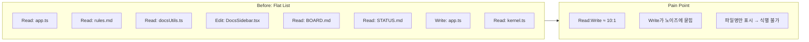
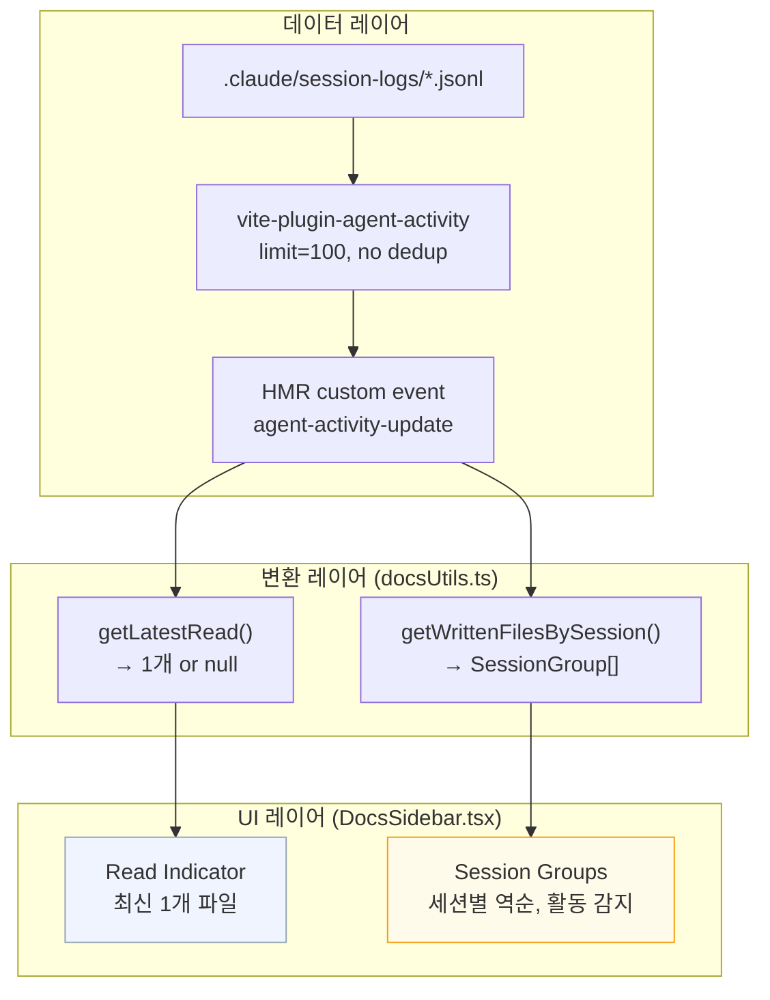

# Activity Usability — Write-first Agent Activity UI

> 작성일: 2026-03-13
> 맥락: Agent Activity 사이드바 섹션의 Signal-to-Noise 문제를 해결하기 위한 UI 재구성

---

## Why — Read 노이즈가 Write 신호를 묻고 있었다

에이전트(Claude Code)의 파일 활동을 사이드바에 표시하는 Agent Activity 섹션이 있었으나, Read와 Write가 동등하게 flat list로 나열되어 있었다.

| 문제 | 영향 |
|------|------|
| Read:Write 비율 ~10:1 | Write(수정된 파일)가 목록에서 찾기 어려움 |
| flat/grouped 토글만 존재 | 매번 수동 전환 필요 |
| 파일명만 표시 | 같은 이름 다른 위치 파일 구분 불가 (app.ts가 여러 곳) |
| 세션 구분 없음 (flat 기본) | 여러 터미널에서 동시 실행 시 활동 뒤섞임 |

---

## How — Read 인디케이터 + Write 세션 그룹 분리

핵심 설계: 사용자의 관심도에 따라 Read와 Write를 **비대칭 표시**.

| 결정 | 근거 |
|------|------|
| Read는 1개만 | "지금 뭘 보고 있나" = 최신 1개로 충분 |
| Write는 세션별 그룹 | 세션 = 작업 단위. 멀티 터미널 구분 |
| 최신 세션 상단 | 관심사 우선순위 = 시간 역순 |
| 활동 감지 2분 | 에이전트 작업 중 Read/Edit 간격 < 2분 |
| 활동 중 = 자동 펼침 | 감시 대상이므로 기본 노출 |
| 파일명 + 디렉토리 2단 | 파일명이 1순위 정보, 디렉토리는 보조 |

### 변경된 데이터 흐름

1. **Plugin**: `collectAgentActivity()`에서 per-detail dedup 제거 (Read와 Write 모두 보존), limit 30→100
2. **docsUtils**: `getLatestRead()` — Read 엔트리 중 최신 1개 반환. `getWrittenFilesBySession()` — Edit/Write만 필터, 세션별 그룹, `isActive` 플래그(2분 heuristic)
3. **UI**: `AgentActivitySection` — Read 인디케이터 + Write 세션 그룹 렌더링

### 삭제된 것

- `DocsState.isGrouped` — 항상 세션 그룹이므로 토글 불필요
- `TOGGLE_GROUPING` 커맨드 + trigger — 위와 동일
- `ToolBadge` 컴포넌트 — Write-first에서 Read/Write 아이콘 구분 불필요
- `RecentSection` — `AgentActivitySection`으로 대체
- TestBot §5 (세션 토글 5개), §6 (커밋 메시지 2개) — 7개 시나리오 삭제, 1개 신규

---

## What — 정량 결과

| 지표 | Before | After |
|------|--------|-------|
| 변경 파일 | — | 8 files, +349/-209 lines |
| tsc errors | 0 | 0 |
| 전체 테스트 | 762 pass | 756 pass (6 obsolete 삭제) |
| docs-viewer 테스트 | 51 (5 fail) | 46 (0 fail) |
| build | OK | OK |
| dev smoke | 2/2 | 2/2 |
| 커밋 | — | 8e12db94, 5260aa0e |

---

## If — 제약과 향후 방향

### 현재 제약

- **세션 내 subagent 분리 불가** (U1): Agent tool로 병렬 실행된 subagent의 활동은 같은 session UUID로 기록됨. 분리하려면 JSONL 로그 포맷에 agent_id 필드 추가 필요 → scope out
- **2분 heuristic 미검증**: 실사용에서 적절한지 피드백 필요. 너무 짧으면 작업 중인데 접히고, 너무 길면 끝난 세션이 열려 있음

### 향후 방향

- `dashboard` epic: 세션별 통계 (파일 수, 커밋 수, 소요 시간)
- `activity-feed` epic: 시계열 활동 스트림 (Read/Write/Bash 전체)
- 파일 클릭 시 diff 뷰 연동 가능성
