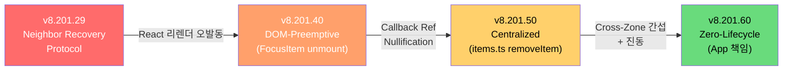

# 포커스 복구 전략 실패 회고록

## 1. 개요

Interaction OS는 **4세대에 걸쳐** OS 레벨 포커스 복구를 시도했고, 매번 실패하여 결국 앱 레벨로 책임을 전가했다. 이 문서는 각 세대의 접근 방식, 실패 원인, 그리고 어떤 교훈을 남겼는지를 기록한다.

---

## 2. 진화 타임라인



---

## 3. 세대별 분석

### 3.1 1세대: Neighbor Recovery Protocol (v8.201.29)

**접근 방식**: 아이템이 제거되면 인접 아이템으로 포커스를 자동 이동

**구현 위치**: `FocusItem`의 unmount 핸들러

```typescript
// FocusItem.tsx (당시 구현)
useEffect(() => {
  return () => {
    // unmount 시 인접 아이템으로 포커스 이동
    const items = store.getState().items;
    const idx = items.indexOf(id);
    const nextId = items[idx + 1] ?? items[idx - 1];
    if (nextId) store.setFocus(nextId);
  };
}, []);
```

**실패 원인: React 리렌더 오발동**
- React는 **컴포넌트를 재사용하지만 ref를 nullify**한다
- HMR(Hot Module Replacement) 때 컴포넌트가 일시적으로 unmount → remount
- 결과: 실제 삭제가 아닌데도 Recovery가 트리거되어 **포커스가 엉뚱한 곳으로 점프**

> [!CAUTION]
> **핵심 교훈**: React의 컴포넌트 lifecycle ≠ DOM element lifecycle. useEffect cleanup은 "삭제"만 감지하는 것이 아니라 "React의 내부 최적화"에도 반응한다.

**관련 위험**: Hazard 2.14 (Ref-nullification Recovery Trap)

---

### 3.2 2세대: DOM-Preemptive Recovery (v8.201.40)

**접근 방식**: `callback ref`를 사용하여 DOM 노드가 null이 되는 시점에 즉시 인접 아이템으로 포커스 이동

**구현 위치**: `FocusItem`의 callback ref

```typescript
// FocusItem.tsx (당시 구현)
const callbackRef = (node: HTMLElement | null) => {
  if (node === null) {
    // DOM에서 제거될 때 즉시 복구
    removeItem(id); // 내부에서 neighbor recovery 수행
  }
};
```

**실패 원인: Callback Ref Nullification**
- React는 **매 리렌더마다** callback ref를 `null`로 호출한 후 새 DOM으로 재호출
- 즉, `ref(null) → ref(newElement)` 사이클이 매 렌더마다 발생
- 결과: **삭제가 아닌 일반 리렌더에서도 Recovery 트리거** → 진동(oscillation)

> [!CAUTION]
> **핵심 교훈**: Callback ref는 "DOM 존재 여부"를 판단하는 신뢰할 수 있는 수단이 아니다. React의 reconciliation 과정에서 거짓 양성이 발생한다.

**관련 커밋**: `c21e7fe` ("fix: focus oscillation bug - remove aggressive focus recovery")

---

### 3.3 3세대: Centralized Recovery in Store (v8.201.50)

**접근 방식**: `FocusItem`에서 Recovery 로직을 제거하고, Store의 `removeItem` 함수에서 중앙 집중 처리

**구현 위치**: `store/slices/items.ts`의 `removeItem`

```typescript
// items.ts (당시 구현)
removeItem: (id) => {
  set((state) => {
    const items = state.items.filter(i => i !== id);
    let focusedItemId = state.focusedItemId;
    
    // 포커스된 아이템이 제거되면 인접 아이템으로 복구
    if (focusedItemId === id) {
      const idx = state.items.indexOf(id);
      focusedItemId = state.items[idx + 1] ?? state.items[idx - 1] ?? null;
    }
    
    return { items, focusedItemId };
  });
}
```

**실패 원인 2가지:**

#### (A) Cross-Zone 간섭
- **시나리오**: 사용자가 Sidebar에서 ListView로 클릭하여 Zone 전환
- Zone 전환 시 이전 Zone의 아이템들이 DOM에서 사라짐 (조건부 렌더링)
- `removeItem`이 트리거되어 **이전 Zone 내에서 Recovery 시도**
- 결과: 이미 떠난 Zone에서 포커스를 강탈해오는 현상

**관련 커밋**: `61d71f0` ("Focus recovery was interfering with cross-zone focus transitions")

#### (B) Focus Oscillation (진동)
- `removeItem` → `setFocus(nextId)` → FocusSync가 DOM focus → `focusin` 이벤트 →
  FocusSensor가 다시 `FOCUS` 커맨드 dispatch → 무한 루프까지는 아니지만 **2-3회 진동**
- 결과: 포커스가 "흔들리는" 느낌, 성능 저하

> [!CAUTION]
> **핵심 교훈**: OS는 `removeItem`이 "의도적 삭제"인지 "React 최적화로 인한 일시적 제거"인지 **구분할 수 없다.** 이것이 OS 레벨 Recovery의 근본적 한계다.

---

### 3.4 4세대: Zero-Lifecycle / App 책임 (v8.201.60) — 현재

**접근 방식**: FocusItem에서 모든 lifecycle을 제거. Recovery는 앱의 Command Handler에서 처리.

**구현 위치**: 앱의 `DeleteTodo` 커맨드 + `navigationMiddleware`

```typescript
// DeleteTodo (앱 레벨)
produce(state, (draft) => {
    const nextId = visibleIds[currentIdx + 1] ?? visibleIds[currentIdx - 1];
    delete draft.data.todos[targetId];
    if (nextId) draft.effects.push({ type: 'FOCUS_ID', id: nextId });
});
```

**장점**: 삭제 의도가 명확. 오발동 없음.
**단점**: 모든 앱이 이 로직을 직접 구현해야 함.

---

## 4. 실패 패턴 종합

| 세대 | 위치 | 트리거 시점 | 근본 실패 원인 |
|------|------|------------|---------------|
| 1세대 | FocusItem `useEffect` | unmount | React 리렌더 ≠ 실제 삭제 |
| 2세대 | FocusItem `callback ref` | ref null | ref nullification 매 렌더마다 발생 |
| 3세대 | Store `removeItem` | store 호출 | Cross-zone 전환도 removeItem 호출 |
| 4세대 | App command handler | 명시적 삭제 | ✅ 오발동 없음 (현재) |

### 근본 원인: OS는 "삭제 의도"를 모른다

```
React 리렌더       →  DOM 노드 재생성  →  ref(null) + ref(new)
조건부 렌더링 해제  →  DOM 노드 제거    →  ref(null)
실제 데이터 삭제    →  DOM 노드 제거    →  ref(null)
```

세 가지 경우 모두 **동일한 시그널**(ref null / unmount)을 발생시킨다. OS는 이것을 구분할 방법이 없다.

---

## 5. 결론 / 제안

### 앱에 책임을 넘긴 건 올바른 결정이었다

**의도적 삭제**와 **비의도적 DOM 변경**을 구분할 수 있는 건 앱뿐이다. OS가 아무리 정교한 heuristic을 만들어도, React의 reconciliation은 항상 false positive를 발생시킨다.

### 그러나 OS가 할 수 있는 일이 남아있다

OS가 "삭제를 감지하고 복구"하는 대신, **"삭제 후 남겨진 고아 상태를 정리"**하는 Safety Net은 가능하다:

```
[삭제 의도] → [앱이 정밀 복구] → ✅ 여기서 끝 (이상적)
     ↓ (앱이 복구를 안 했다면)
[React 렌더 완료] → [FocusSync가 focusedItemId 검증]
     ↓ (DOM에 없음)
[resolveRecovery로 최선의 추측 복구] → Safety Net ✅
```

이 접근은 **이전 실패들과 다르다**:
- **시점**: unmount가 아니라 **렌더 완료 후** (false positive 없음)
- **트리거**: `removeItem`이 아니라 **FocusSync의 검증 루프** (cross-zone 간섭 없음)
- **우선순위**: 앱이 이미 복구했으면 **NO-OP** (충돌 없음)

---
*Focus Recovery Strategy Retrospective (2026-02-07)*
