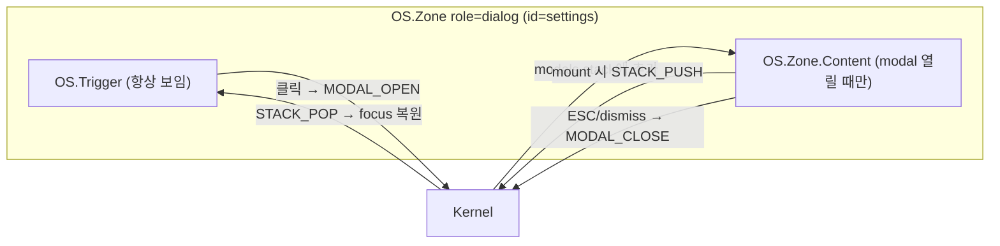

# 선언적 Modal 설계 — OS Compound Component 패턴

> **Date**: 2026-02-11  
> **Topic**: Radix Dialog 스타일 API를 OS primitive(Zone, Trigger)로 구현하는 방법

---

## 1. 개요 (Overview)

### Radix Dialog의 구조

```tsx
<DialogRoot>          {/* Context: open state 관리 */}
  <DialogTrigger />   {/* open 토글 버튼 */}
  <DialogPortal>      {/* top-layer 렌더링 */}
    <DialogOverlay /> {/* ::backdrop */}
    <DialogContent>   {/* 실제 dialog box */}
      <DialogTitle />
      <DialogDescription />
      <DialogClose />
    </DialogContent>
  </DialogPortal>
</DialogRoot>
```

### 우리 OS의 기존 빌딩 블록

| Radix 개념 | OS 대응물 | 상태 |
|---|---|---|
| open/close state | **커널 state** (`os.modals.stack`) | 🔴 없음 |
| DialogTrigger | **OS.Trigger** (`onPress` → dispatch) | ✅ 있음 |
| DialogPortal | **OS.Modal** (native `<dialog>`) | ✅ 있음 |
| DialogOverlay | `<dialog>::backdrop` (native) | ✅ 있음 |
| DialogContent | **OS.Zone** `role="dialog"` | ✅ 있음 |
| DialogTitle | **OS.Label** / semantic `<h2>` | ✅ 있음 |
| DialogClose | **OS.Item** + dismiss action | ✅ 있음 |
| Focus trap | `tab.behavior = "trap"` (dialog preset) | ✅ 있음 |
| autoFocus | `project.autoFocus = true` (dialog preset) | ✅ 있음 |
| ESC close | `dismiss.escape = "close"` (dialog preset) | ✅ 있음 |
| Focus 복원 | `STACK_PUSH` / `STACK_POP` | ✅ 있음 |

> [!IMPORTANT]
> **유일하게 빠진 것**: 여러 primitive를 **하나의 선언 단위**로 묶어 open state를 공유하는 접착 계층.

---

## 2. 제안 — Compound Component 매핑

### 2.1 목표 API

```tsx
<OS.Zone role="dialog" id="settings-dialog">
  {/* Trigger: dialog Zone 바깥의 trigger. 자동으로 modal open */}
  <OS.Trigger id="open-btn">Open Settings</OS.Trigger>

  {/* Content: role="dialog"인 Zone이 자동으로 <dialog> portal 생성 */}
  <OS.Zone.Content title="Settings" description="Configure your app">
    <OS.Item id="theme">Theme</OS.Item>
    <OS.Item id="lang">Language</OS.Item>
    <OS.Item id="close" dismiss>Close</OS.Item>
  </OS.Zone.Content>
</OS.Zone>
```

### 2.2 Radix → OS 매핑 테이블

| Radix | OS Equivalent | 설명 |
|---|---|---|
| `<DialogRoot>` | `<OS.Zone role="dialog">` | open state를 커널이 관리 |
| `<DialogTrigger>` | `<OS.Trigger>` | Zone의 direct child일 때 자동으로 modal open dispatch |
| `<DialogPortal>` | 자동 | `role="dialog"` → `<dialog>` wrapping 자동 |
| `<DialogOverlay>` | 자동 | `<dialog>::backdrop` (native CSS) |
| `<DialogContent>` | `<OS.Zone.Content>` | dialog body 영역, title/description prop |
| `<DialogTitle>` | `title` prop | `aria-labelledby` 자동 연결 |
| `<DialogDescription>` | `description` prop | `aria-describedby` 자동 연결 |
| `<DialogClose>` | `<OS.Item dismiss>` | dismiss prop → `MODAL_CLOSE` dispatch |

### 2.3 Trigger ↔ Content 분리 원리



핵심: **Zone의 children 중 Trigger는 항상 렌더링, Content는 커널 state에 의해 조건부 렌더링**.

---

## 3. 구현 전략

### 3.1 커널 상태 확장

```ts
// OSState 확장
interface OSState {
  focus: { ... };
  modals: {
    stack: string[];  // 열려있는 dialog zone ID 스택
  };
}
```

### 3.2 새 커맨드

```ts
// OS_MODAL_OPEN → modals.stack에 push + STACK_PUSH
const MODAL_OPEN = kernel.defineCommand("OS_MODAL_OPEN",
  (ctx) => (zoneId: string) => ({
    state: produce(ctx.state, draft => {
      draft.os.modals.stack.push(zoneId);
    }),
    dispatch: STACK_PUSH({ triggeredBy: zoneId }),
  })
);

// OS_MODAL_CLOSE → modals.stack에서 제거 + STACK_POP
const MODAL_CLOSE = kernel.defineCommand("OS_MODAL_CLOSE",
  (ctx) => (zoneId: string) => ({
    state: produce(ctx.state, draft => {
      draft.os.modals.stack = draft.os.modals.stack
        .filter(id => id !== zoneId);
    }),
    dispatch: STACK_POP(),
  })
);
```

### 3.3 Zone role="dialog" 동작 변경

`Zone.kernel.tsx`에서 `role === "dialog"` 감지 시:

```tsx
// pseudo-code
function Zone({ role, children, ...props }) {
  const isDialog = role === "dialog" || role === "alertdialog";
  const isOpen = kernel.useComputed(s =>
    s.os.modals.stack.includes(zoneId)
  );

  if (isDialog) {
    // children을 Trigger와 Content로 분리
    const triggers = children.filter(c => c.type === Trigger);
    const content = children.filter(c => c.type === ZoneContent);

    return (
      <>
        {/* Trigger는 항상 렌더링 */}
        {triggers}

        {/* Content는 커널 state에 따라 <dialog>로 렌더링 */}
        {isOpen && (
          <dialog open>
            <ZoneContext.Provider value={...}>
              {content}
            </ZoneContext.Provider>
          </dialog>
        )}
      </>
    );
  }

  // 일반 Zone은 기존처럼 동작
  return <div>{children}</div>;
}
```

### 3.4 OS.Item `dismiss` prop

```tsx
// dismiss prop이 있으면 클릭 시 MODAL_CLOSE dispatch
<OS.Item id="close" dismiss>Close</OS.Item>

// 내부 구현
if (props.dismiss) {
  onActivate = () => kernel.dispatch(MODAL_CLOSE(zoneId));
}
```

---

## 4. 대안: 더 명시적인 API

Zone 내부에서 자동 분리하는 대신, 명시적 sub-component를 사용:

```tsx
// Option B: 더 명시적
<OS.Dialog id="settings">
  <OS.Dialog.Trigger id="open-btn">Open</OS.Dialog.Trigger>
  <OS.Dialog.Content title="Settings">
    <OS.Item id="ok">OK</OS.Item>
    <OS.Item id="close" dismiss>Close</OS.Item>
  </OS.Dialog.Content>
</OS.Dialog>
```

| 기준 | Zone 확장 방식 | Dialog 별도 컴포넌트 |
|---|---|---|
| **일관성** | ★★★★★ 모든 것이 Zone | ★★★ 새 namespace |
| **명시성** | ★★★ 암묵적 children 분리 | ★★★★★ 의도 명확 |
| **학습 비용** | ★★★★ role만 바꾸면 됨 | ★★★ 새 API 학습 |
| **구현 난이도** | ★★★ children 분리 로직 | ★★★★ 단순 compound |

---

## 5. 결론

### 추천: `OS.Dialog` 별도 compound component

**이유**: Radix 패턴과 1:1 대응이 명확하고, Zone의 children 분리 로직 없이 깔끔하게 구현 가능.

```tsx
// 최종 권장 API
<OS.Dialog id="delete-confirm">
  <OS.Dialog.Trigger id="delete-btn">삭제</OS.Dialog.Trigger>
  <OS.Dialog.Content title="삭제 확인" description="이 파일을 삭제할까요?">
    <OS.Item id="yes" onAction={handleDelete}>예</OS.Item>
    <OS.Item id="no" dismiss>아니오</OS.Item>
  </OS.Dialog.Content>
</OS.Dialog>
```

내부적으로:
- `OS.Dialog` = Context provider + 커널 `modals.stack` 연동
- `OS.Dialog.Trigger` = `OS.Trigger` + `MODAL_OPEN` 자동 바인딩
- `OS.Dialog.Content` = `OS.Modal`(`<dialog>`) + `OS.Zone role="dialog"` 합체
- `OS.Item dismiss` = `MODAL_CLOSE` + `STACK_POP` 자동 바인딩

> [!TIP]
> 이렇게 하면 **앱 코드에 `useState` 없이** 완전 선언적 Modal이 완성된다.
> 커널이 open state를 소유하므로 Inspector에서 modal stack 확인 + time-travel도 가능.

---

> **Next Action**: `OS.Dialog` compound component 구현 계획을 `1-project`로 승격할지 결정 필요.
