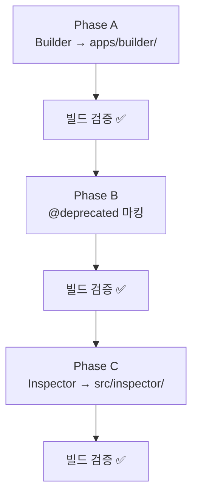

# OS-New 리팩토링: 3대 의사결정 실행 계획

> **날짜:** 2026-02-10  
> **태그:** refactoring, os-new, architecture, builder, zustand, inspector  
> **상태:** 실행 중

---

## 1. 개요 (Overview)

OS-New 마이그레이션 과정에서 3가지 핵심 의사결정을 확정하고, 각각에 대한 실행 계획을 수립한다.

| # | 결정 | 방향 |
|---|------|------|
| A | Builder* 컴포넌트 | OS 위의 **응용 레이어**로 분리 (`src/apps/builder/`) |
| B | Zustand Store | 제거 원칙 확정, **점진적 완전 제거** |
| C | Inspector / TestBot | OS와 **대등한 독립 프로젝트**로 분리 (`src/inspector/`) |

---

## 2. 분석 (Analysis)

### Phase A: Builder → App Layer 분리

Builder는 NCP 데모 페이지를 위한 **응용 레이어** 컴포넌트(7개 파일)이며, OS 내부에 위치할 이유가 없다.

**대상 파일 (7개):**
- `Builder.tsx`, `BuilderBadge.tsx`, `BuilderButton.tsx`
- `BuilderDivider.tsx`, `BuilderIcon.tsx`, `BuilderImage.tsx`, `BuilderLink.tsx`

**현재 위치:** `src/os/app/export/primitives/`  
**이동 대상:** `src/apps/builder/primitives/`

**Consumer (7곳):**
- `pages/BuilderPage.tsx`, `pages/builder/NCP*.tsx` (4개), `pages/builder/PropertiesPanel.tsx`
- `apps/todo/widgets/GlobalNav.tsx`

### Phase B: Zustand Store 점진적 제거

Zustand per-zone store → Kernel 단일 State로 전환.

**제거 대상:**
- `os-new/store/focusGroupStore.ts` + `slices/` (4파일)
- `os-new/store/FieldRegistry.ts`
- `os-new/primitives/FocusGroup.tsx`, `FocusItem.tsx`

**의존 관계:** `primitives/FocusGroup.tsx` → `store/focusGroupStore.ts` (유일한 참조)

**전략:** `@deprecated` 마킹 → Consumer(focus-showcase 등)를 Zone/Item으로 전환 → store/ 및 primitives/ 삭제 (별도 PR)

### Phase C: Inspector / TestBot → OS 대등 분리

Inspector를 `src/os/` 하위가 아닌 `src/inspector/`로 독립시킨다.

**이동 대상:**

| 현재 | 이동 후 | 파일 수 |
|------|---------|---------|
| `os/inspector/` | `inspector/stores/` | 5 |
| `os/app/debug/inspector/` | `inspector/panels/` | 11 |
| `os/app/debug/` (shell) | `inspector/shell/` | 5 |
| `os/testBot/` | `inspector/testbot/` | 33 |

---

## 3. 실행 순서

---

## 4. 결론 (Conclusion)

- **Phase A**는 파일 이동 + import 경로 변경만으로 완결 → **즉시 실행**
- **Phase B**는 이번에 `@deprecated` 마킹, 실제 제거는 Zone/Item 전환 완료 후 별도 PR
- **Phase C**는 파일 이동 + import 경로 변경으로 완결 → **즉시 실행**

> [!NOTE]
> Phase B의 실제 Zustand 제거(store/ 삭제)는 focus-showcase 테스트의 Zone/Item 전환이 선행되어야 하므로 별도 PR로 분리한다.
