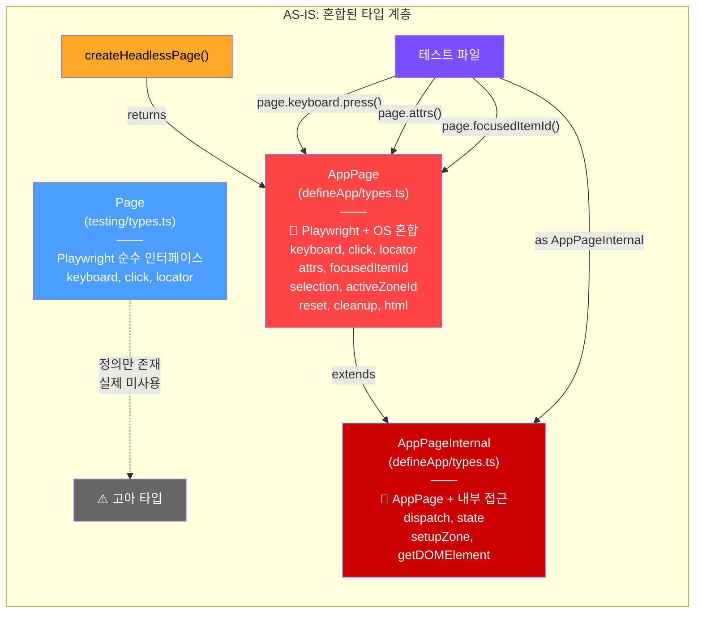
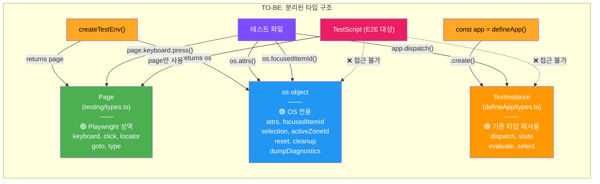
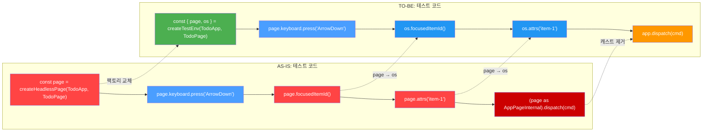

# AS-IS → TO-BE: AppPage 제거 — 타입 구조 변환

> Discussion에서 도출된 Page 분리 설계를 시각화한다.
> 핵심: AppPage(혼합) → Page(Playwright) + os(OS 전용) 분리

---

## 1. 타입 계층 — AS-IS

현재 `AppPage`가 Playwright 메서드와 OS 메서드를 하나의 인터페이스에 섞고 있다.
`AppPageInternal`이 이를 더 확장하여 `dispatch`/`state`까지 추가한다.

### 문제

- `Page` 인터페이스는 정의만 있고 실제 사용되지 않는 **고아 타입**
- `AppPage`가 모든 것을 삼킨 **God Interface** (15개 메서드)
- `AppPageInternal extends AppPage`가 **Page에 OS를 붙인 안티패턴**
- E2E(Playwright)에서 `page.attrs()` 같은 메서드를 부르면 → **런타임 에러**

---

## 2. 타입 계층 — TO-BE

`AppPage`를 삭제하고, `Page`(Playwright 성역) + `os`(OS 전용)로 분리한다.

### 원칙

- **Script는 `page`만 안다** → E2E 동형 보장
- **Unit test는 `page` + `os` + `app` 모두 사용 가능**
- **새 타입 발명 없음** — `Page`(기존), `TestInstance`(기존) 재사용

---

## 3. 테스트 코드 변환 — Before / After

---

## 4. 삭제 대상 / 잔류 대상 요약

| 타입 | AS-IS | TO-BE | 이유 |
|------|-------|-------|------|
| `Page` | 고아 (미사용) | **🟢 주인공** | Playwright 성역 |
| `AppPage` | God Interface | **🔴 삭제** | Playwright + OS 혼합 |
| `AppPageInternal` | AppPage 확장 | **🔴 삭제** | dispatch/state는 TestInstance로 |
| `AppLocatorAssertions` | AppPage 전용 | **🔴 삭제** | LocatorAssertions로 통합 |
| `TestInstance` | app.create() 반환값 | **🟢 유지** | dispatch, state 이미 보유 |
| `createHeadlessPage()` | AppPage 반환 | **🟡 교체** → `createTestEnv()` | `{ page, os }` 반환 |

---

## 범례

- 🔴 빨간색 = 삭제 대상 (안티패턴)
- 🟢 초록색 = Playwright 성역 / 깨끗한 타입
- 🔵 파란색 = OS 전용 (분리된 표면)
- 🟠 주황색 = App 계층 (TestInstance)
- 🟣 보라색 = 테스트 파일 (소비자)
- 🔗 점선 = 접근 불가 또는 미사용
