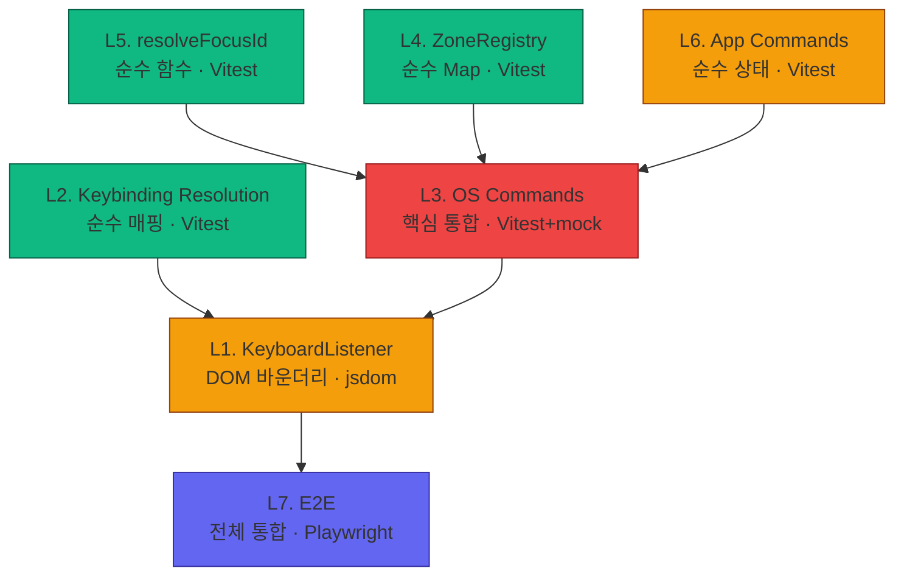

# OS 커맨드 디스패치 레이어 분석 및 테스트 전략

| 항목 | 내용 |
|------|------|
| **원문** | 우리 레이어를 분석해서 어떤 레이어들을 만들어가며 확인해서 올라가야 하는지 보고서를 작성해봐 |
| **내(AI)가 추정한 의도** | E2E 디버깅 삽질을 반복하지 않기 위해, OS 커맨드 파이프라인을 레이어별로 격리 테스트할 수 있는 bottom-up 전략이 필요하다. |
| **날짜** | 2026-02-12 |
| **상태** | 🟡 분석 완료, 실행 대기 |

---

## 1. 개요

사용자가 키보드를 누르면 화면이 바뀌기까지 **7개 레이어**를 거친다.
현재 이 파이프라인은 E2E(Playwright)로만 검증되어, 실패 시 "어딘가 고장남" 수준의 정보만 얻을 수 있다.

각 레이어를 격리 테스트하면 **실패 지점을 즉시 특정**할 수 있고,
새 기능 추가(onSort, onGroup 등) 시에도 **파이프라인 전체를 의심하지 않아도** 된다.

---

## 2. 분석 — 7-Layer Command Pipeline

```
┌─────────────────────────────────────────────────────────────────┐
│  User presses Space on a focused Todo item                      │
└──────────────────────┬──────────────────────────────────────────┘
                       ▼
┌──────────────────────────────────────────────────────────────────┐
│  L1. KeyboardListener              (1-listeners)                │
│  ─────────────────────────────────────────────────               │
│  KeyboardEvent → isEditing 판단 → canonical key 생성             │
│  Input:  KeyboardEvent                                          │
│  Output: { canonicalKey: "Space", isEditing: false }            │
│  의존성: DOM (document.activeElement)                            │
└──────────────────────┬──────────────────────────────────────────┘
                       ▼
┌──────────────────────────────────────────────────────────────────┐
│  L2. Keybinding Resolution         (keymaps/)                   │
│  ─────────────────────────────────────────────────               │
│  canonical key + context → Command 매핑                          │
│  Input:  "Space" + { isEditing: false }                         │
│  Output: { command: SELECT, args: [{ mode: "toggle" }] }       │
│  의존성: 없음 (순수 데이터 조회)                                   │
└──────────────────────┬──────────────────────────────────────────┘
                       ▼
┌──────────────────────────────────────────────────────────────────┐
│  L3. OS Command Handler            (3-commands/)                │
│  ─────────────────────────────────────────────────               │
│  kernel state + payload → effect 결정                            │
│  Input:  state.os.focus + SELECT({ mode: "toggle" })            │
│  Output: { dispatch: ToggleTodo({ id: "1" }) }                  │
│  의존성: kernel state, ZoneRegistry (L4), resolveFocusId (L5)   │
└──────────────────────┬──────────────────────────────────────────┘
                       ▼
┌──────────────────────────────────────────────────────────────────┐
│  L4. ZoneRegistry                  (2-contexts/)                │
│  ─────────────────────────────────────────────────               │
│  Zone ID → 등록된 콜백 조회                                       │
│  Input:  "listView"                                             │
│  Output: { onToggle: ToggleTodo({ id: "OS.FOCUS" }), ... }     │
│  의존성: 없음 (순수 Map 저장소)                                   │
└──────────────────────┬──────────────────────────────────────────┘
                       ▼
┌──────────────────────────────────────────────────────────────────┐
│  L5. resolveFocusId                (3-commands/utils/)           │
│  ─────────────────────────────────────────────────               │
│  "OS.FOCUS" 플레이스홀더 → 실제 ID 치환                            │
│  Input:  ToggleTodo({ id: "OS.FOCUS" }) + "1"                   │
│  Output: ToggleTodo({ id: "1" })                                │
│  의존성: 없음 (순수 함수)                                         │
└──────────────────────┬──────────────────────────────────────────┘
                       ▼
┌──────────────────────────────────────────────────────────────────┐
│  L6. App Command Handler           (apps/todo/commands/)        │
│  ─────────────────────────────────────────────────               │
│  app state + payload → new state                                │
│  Input:  AppState + ToggleTodo({ id: "1" })                     │
│  Output: { state: { ...draft, todos[1].completed: true } }     │
│  의존성: 없음 (순수 함수 + immer)                                 │
└──────────────────────┬──────────────────────────────────────────┘
                       ▼
┌──────────────────────────────────────────────────────────────────┐
│  L7. React Rendering + DOM Effects  (6-components + 4-effects)  │
│  ─────────────────────────────────────────────────               │
│  new state → DOM 업데이트                                        │
│  Input:  state.todos[1].completed === true                      │
│  Output: <span class="line-through">...</span>                  │
│  의존성: React, DOM                                              │
└──────────────────────────────────────────────────────────────────┘
```

---

## 3. 레이어별 테스트 전략 (Bottom-Up)

> **원칙: 아래 레이어가 검증되어야 위 레이어를 신뢰할 수 있다.**

### L5. `resolveFocusId` — 순수 함수 ⭐

| 항목 | 내용 |
|------|------|
| **파일** | `3-commands/utils/resolveFocusId.ts` |
| **테스트 방식** | Vitest 단위 테스트 |
| **DOM 필요** | ❌ |
| **검증 포인트** | placeholder 치환, payload 없는 경우, 다중 필드 치환, 중첩 객체 |

```typescript
// resolveFocusId.test.ts
test("replaces OS.FOCUS with actual ID", () => {
  const cmd = ToggleTodo({ id: "OS.FOCUS" });
  const result = resolveFocusId(cmd, "42");
  expect(result.payload.id).toBe("42");
});

test("leaves non-placeholder values untouched", () => {
  const cmd = ToggleTodo({ id: "123" });
  const result = resolveFocusId(cmd, "42");
  expect(result.payload.id).toBe("123"); // unchanged
});

test("handles command with no payload", () => {
  const cmd = SomeCommand();
  expect(resolveFocusId(cmd, "42")).toEqual(cmd);
});
```

---

### L4. `ZoneRegistry` — 순수 데이터 저장소 ⭐

| 항목 | 내용 |
|------|------|
| **파일** | `2-contexts/zoneRegistry.ts` |
| **테스트 방식** | Vitest 단위 테스트 |
| **DOM 필요** | ❌ (element mock 필요) |
| **검증 포인트** | register/get/unregister, 콜백 필드 보존 |

```typescript
// zoneRegistry.test.ts
test("registers and retrieves all callback fields", () => {
  const mockToggle = { type: "TOGGLE_TODO", payload: { id: "OS.FOCUS" } };
  ZoneRegistry.register("listView", {
    config: mockConfig,
    element: document.createElement("div"),
    parentId: null,
    onToggle: mockToggle,
  });
  
  const entry = ZoneRegistry.get("listView");
  expect(entry?.onToggle).toBe(mockToggle);
});

test("unregister removes entry", () => {
  ZoneRegistry.register("test", { ... });
  ZoneRegistry.unregister("test");
  expect(ZoneRegistry.get("test")).toBeUndefined();
});
```

---

### L2. `Keybinding Resolution` — 순수 매핑 ⭐

| 항목 | 내용 |
|------|------|
| **파일** | `keymaps/keybindings.ts` + `keymaps/osDefaults.ts` |
| **테스트 방식** | Vitest 단위 테스트 |
| **DOM 필요** | ❌ |
| **검증 포인트** | key→command 매핑, when 조건(editing/navigating) 분기 |

```typescript
// keybindings.test.ts
import "@os/keymaps/osDefaults"; // side-effect: registers all bindings

test("Space navigating resolves to SELECT", () => {
  const result = Keybindings.resolve("Space", { isEditing: false });
  expect(result?.command).toBe(SELECT);
});

test("Space editing does NOT resolve to SELECT", () => {
  const result = Keybindings.resolve("Space", { isEditing: true });
  expect(result?.command).not.toBe(SELECT);
});

test("Backspace navigating resolves to OS_DELETE", () => {
  const result = Keybindings.resolve("Backspace", { isEditing: false });
  expect(result?.command).toBe(OS_DELETE);
});

test("Enter navigating resolves to ACTIVATE", () => {
  const result = Keybindings.resolve("Enter", { isEditing: false });
  expect(result?.command).toBe(ACTIVATE);
});

test("Enter editing resolves to FIELD_COMMIT", () => {
  const result = Keybindings.resolve("Enter", { isEditing: true });
  expect(result?.command).toBe(FIELD_COMMIT);
});
```

---

### L6. App Commands — 순수 상태 전환 ⭐⭐

| 항목 | 내용 |
|------|------|
| **파일** | `apps/todo/features/commands/list.ts` |
| **테스트 방식** | Vitest 단위 테스트 |
| **DOM 필요** | ❌ |
| **검증 포인트** | 상태 전환 정확성, 엣지 케이스(존재하지 않는 ID 등) |

```typescript
// todoCommands.test.ts
test("ToggleTodo flips completed boolean", () => {
  const state = makeState({ todos: { 1: { completed: false } } });
  const result = ToggleTodo.handler(state)({ id: 1 });
  expect(result.state.data.todos[1].completed).toBe(true);
});

test("ToggleTodo handles string ID (OS.FOCUS resolved)", () => {
  const state = makeState({ todos: { 1: { completed: false } } });
  const result = ToggleTodo.handler(state)({ id: "1" });
  expect(result.state.data.todos[1].completed).toBe(true);
});

test("DeleteTodo removes from todos and todoOrder", () => {
  const state = makeState({ todos: { 1: { ... } }, todoOrder: [1] });
  const result = DeleteTodo.handler(state)({ id: 1 });
  expect(result.state.data.todos[1]).toBeUndefined();
  expect(result.state.data.todoOrder).not.toContain(1);
});
```

---

### L3. OS Commands — 핵심 통합 지점 ⭐⭐⭐

| 항목 | 내용 |
|------|------|
| **파일** | `3-commands/selection/select.ts`, `3-commands/interaction/activate.ts`, etc. |
| **테스트 방식** | Vitest + kernel state mock + ZoneRegistry mock |
| **DOM 필요** | 부분적 (`aria-expanded` 체크용 jsdom) |
| **검증 포인트** | ZoneRegistry 조회 → resolveFocusId → dispatch 반환 |

> **이 레이어가 가장 중요하다.** 모든 배관이 여기서 연결된다.

```typescript
// select.test.ts
test("SELECT dispatches onToggle when Zone has it registered", () => {
  // Setup
  const mockState = makeFocusState({
    activeZoneId: "listView",
    zones: { listView: { focusedItemId: "1" } },
  });
  ZoneRegistry.register("listView", {
    ...mockEntry,
    onToggle: ToggleTodo({ id: "OS.FOCUS" }),
  });

  // Act
  const result = SELECT.handler(mockState)({ mode: "toggle" });

  // Assert
  expect(result.dispatch.type).toBe("TOGGLE_TODO");
  expect(result.dispatch.payload.id).toBe("1"); // OS.FOCUS → "1"
});

test("SELECT falls back to OS selection when no onToggle", () => {
  ZoneRegistry.register("listView", { ...mockEntry /* no onToggle */ });
  const result = SELECT.handler(mockState)({ mode: "toggle" });
  expect(result.state.os.focus.zones.listView.selection).toContain("1");
});
```

```typescript
// activate.test.ts
test("ACTIVATE dispatches onAction when Zone has it", () => {
  ZoneRegistry.register("listView", {
    ...mockEntry,
    onAction: StartEdit({ id: "OS.FOCUS" }),
  });
  const result = ACTIVATE.handler(mockState)();
  expect(result.dispatch.type).toBe("START_EDIT");
  expect(result.dispatch.payload.id).toBe("1");
});
```

---

### L1. `KeyboardListener` — DOM 바운더리 ⭐⭐

| 항목 | 내용 |
|------|------|
| **파일** | `1-listeners/KeyboardListener.tsx` |
| **테스트 방식** | Vitest + jsdom / React Testing Library |
| **DOM 필요** | ✅ |
| **검증 포인트** | isEditing 판단, canonical key 생성, dispatch 호출 |

```typescript
// keyboardListener.test.ts
test("contentEditable element → isEditing = true", () => {
  const div = document.createElement("div");
  div.contentEditable = "true";
  // simulate: focus on div, press Enter
  // expect: isEditing = true, FIELD_COMMIT dispatched (not ACTIVATE)
});

test("tabIndex element → isEditing = false", () => {
  const div = document.createElement("div");
  div.tabIndex = 0;
  // simulate: focus on div, press Space
  // expect: isEditing = false, SELECT dispatched
});
```

---

### L7. Rendering — 통합 확인 ⭐⭐

| 항목 | 내용 |
|------|------|
| **파일** | `apps/todo/widgets/TaskItem.tsx` |
| **테스트 방식** | React Testing Library 또는 E2E (Playwright) |
| **DOM 필요** | ✅ |
| **검증 포인트** | `completed: true` → `line-through` 클래스, edit mode → Field 표시 |

> L1~L6이 격리 검증된 후에만 이 레이어 테스트가 의미 있다.

---

## 4. Bottom-Up 실행 순서



| Phase | 레이어 | 우선순위 | 예상 시간 | 사전 조건 |
|-------|--------|---------|----------|----------|
| **Phase 1** | L5 `resolveFocusId` | P0 | 10분 | 없음 |
| **Phase 1** | L4 `ZoneRegistry` | P0 | 10분 | 없음 |
| **Phase 1** | L2 `Keybindings` | P0 | 15분 | 없음 |
| **Phase 2** | L6 App Commands | P1 | 20분 | 없음 |
| **Phase 3** | L3 OS Commands | P1 | 30분 | L4, L5, L6 통과 |
| **Phase 4** | L1 KeyboardListener | P2 | 20분 | L2, L3 통과 |
| **Phase 5** | L7 E2E (현재 Playwright) | P3 | 기존 것 | L1~L6 통과 |

**Phase 1은 DOM 없이 가능 → 가장 먼저, 가장 빠르게 검증 가능.**

---

## 5. 해법 유형 (Solution Landscape)

🟢 **Known** — 레이어 격리 테스트는 소프트웨어 엔지니어링의 기본 원칙이며, 현재 아키텍처가 이미 순수 함수 기반으로 설계되어 있어 적용이 자명하다. 특별한 설계 결정 없이 "그냥 하면 되는" 문제.

---

## 6. 인식 한계 (Epistemic Status)

- 이 분석은 **정적 코드 분석**에 기반하며, 런타임에서 `kernel.dispatch`가 `{ dispatch: ... }` effect를 어떻게 처리하는지는 kernel 내부 구현을 완전히 추적하지 못했다.
- L3 OS Command 테스트에서 kernel의 `defineCommand` mock 방식은 실제 구현에 따라 달라질 수 있다.
- `useLayoutEffect` 타이밍과 ZoneRegistry 등록의 race condition 가능성은 단위 테스트로 검증 불가 — 통합 테스트 또는 E2E로 확인 필요.

---

## 7. 열린 질문 (Open Questions)

1. **테스트 러너**: Vitest가 이미 프로젝트에 설정되어 있는지? 아니면 새로 추가해야 하는지?
2. **L3 OS Command 테스트**: `kernel.defineCommand`의 handler를 직접 호출하는 방식 vs kernel mock을 통한 dispatch 방식 — 어느 쪽이 프로젝트 철학에 맞는지?
3. **테스트 파일 위치**: `__tests__/` 디렉토리 vs 소스 옆 colocated(`*.test.ts`) — 선호하는 컨벤션은?

---

**한줄요약:** OS 커맨드 파이프라인 7개 레이어를 순수 함수(L2/L4/L5/L6) → 핵심 통합(L3) → DOM 바운더리(L1) → E2E(L7) 순서로 격리 테스트하면, 현재 E2E 디버깅 삽질을 구조적으로 제거할 수 있다.
