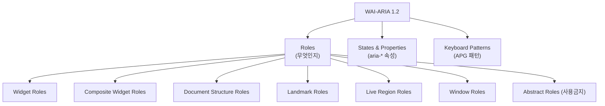

# WAI-ARIA Full Spec Reference — OS Pre-Implementation Map

## 1. 개요 (Overview)

ARIA (Accessible Rich Internet Applications)는 W3C가 정의한 웹 접근성 표준이다.
우리 OS의 컨셉은 **"모든 ARIA 인터랙션 패턴을 OS 레벨에서 미리 구현하여, 앱 개발자는 `role` 하나만 선언하면 올바른 키보드/포커스 동작이 자동 적용되는 것"**이다.

이 문서는 ARIA 스펙의 전체 구조를 정리하고, 각 개념이 우리 OS에서 어떻게 매핑되는지를 명시한다.

### 공식 문서 링크

| 문서 | URL | 용도 |
|------|-----|------|
| **WAI-ARIA 1.2 Spec** | https://www.w3.org/TR/wai-aria-1.2/ | 전체 스펙 (roles, states, properties 정의) |
| **ARIA APG (Patterns)** | https://www.w3.org/WAI/ARIA/apg/patterns/ | 실무 구현 가이드 (키보드 인터랙션 패턴) |
| **ARIA APG (Practices)** | https://www.w3.org/WAI/ARIA/apg/practices/ | 설계 원칙 (포커스 관리, 이름 지정 등) |
| **ARIA Class Diagram** | https://www.w3.org/WAI/ARIA/1.2/class-diagram/ | Role 상속 구조 시각화 |

---

## 2. ARIA의 3가지 축

ARIA는 크게 3가지로 구성된다:



---

## 3. 전체 Role 분류 (WAI-ARIA 1.2 §5.3)

### 3.1 Abstract Roles (사용 금지 — 상속 전용)

> 앱 코드에서 직접 사용 불가. 타 role의 부모 클래스 역할.

`command`, `composite`, `input`, `landmark`, `range`, `roletype`, `section`, `sectionhead`, `select`, `structure`, `widget`, `window`

### 3.2 Widget Roles (단독 위젯)

개별 UI 요소. 우리 OS에서 **Item/Trigger/Field**에 매핑.

| Role | 설명 | OS 매핑 |
|------|------|---------|
| `button` | 클릭/키 입력으로 동작 수행 | `<Trigger>` |
| `checkbox` | 토글 체크박스 | `<Item>` + `onToggle` |
| `gridcell` | 그리드 내 셀 | `<Item>` in grid Zone |
| `link` | 하이퍼링크 | `<Trigger>` or native `<a>` |
| `menuitem` | 메뉴 항목 | `<Item>` in menu Zone |
| `menuitemcheckbox` | 체크 가능 메뉴 항목 | `<Item>` + `onToggle` in menu |
| `menuitemradio` | 라디오 메뉴 항목 | `<Item>` in menu |
| `option` | 리스트박스/콤보박스 옵션 | `<Item>` in listbox Zone |
| `progressbar` | 진행률 표시 | Native HTML (OS 관여 없음) |
| `radio` | 라디오 버튼 | `<Item>` in radiogroup Zone |
| `scrollbar` | 스크롤바 | Native HTML |
| `searchbox` | 검색 입력 | `<Field>` |
| `separator` | 구분선 (포커스 가능 시 위젯) | Native HTML |
| `slider` | 슬라이더 | `<Field>` + range |
| `spinbutton` | 숫자 증감 | `<Field>` + range |
| `switch` | on/off 토글 | `<Item>` + `onToggle` |
| `tab` | 탭 | `<Item>` in tablist Zone |
| `tabpanel` | 탭 패널 | `<Zone>` or `<div>` |
| `textbox` | 텍스트 입력 | `<Field>` |
| `treeitem` | 트리 노드 | `<Item>` in tree Zone |

### 3.3 Composite Widget Roles (복합 위젯 — Zone에 매핑)

자식 위젯을 관리하는 **컨테이너**. 우리 OS에서 **Zone의 `role` prop**에 매핑.

| Role | 설명 | OS `ZoneRole` | 구현 상태 |
|------|------|---------------|----------|
| `combobox` | 입력 + 드롭다운 리스트 | ✅ `combobox` | ✅ |
| `grid` | 2D 테이블형 위젯 | ✅ `grid` | ✅ |
| `listbox` | 선택 가능한 목록 | ✅ `listbox` | ✅ |
| `menu` | 컨텍스트 메뉴 / 드롭다운 | ✅ `menu` | ✅ |
| `menubar` | 수평 메뉴바 | ✅ `menubar` | ✅ |
| `radiogroup` | 라디오 버튼 그룹 | ✅ `radiogroup` | ✅ |
| `tablist` | 탭 목록 | ✅ `tablist` | ✅ |
| `tree` | 계층 트리 뷰 | ✅ `tree` | ✅ |
| `treegrid` | 트리 + 그리드 혼합 | ✅ `treegrid` | ✅ |

### 3.4 Document Structure Roles (문서 구조)

콘텐츠의 구조를 설명. 대부분 **비인터랙티브**. HTML 시멘틱 태그로 처리.

| Role | HTML 대응 | OS 관여 |
|------|----------|---------|
| `application` | — | ✅ `ZoneRole` 등록됨 |
| `article` | `<article>` | ❌ HTML로 처리 |
| `blockquote` | `<blockquote>` | ❌ |
| `caption` | `<caption>` | ❌ |
| `cell` | `<td>` | ❌ |
| `columnheader` | `<th scope="col">` | ❌ |
| `definition` | `<dfn>` | ❌ |
| `deletion` | `<del>` | ❌ |
| `directory` | — (deprecated) | ❌ |
| `document` | `<body>` | ❌ |
| `emphasis` | `<em>` | ❌ |
| `feed` | — | ✅ `ZoneRole` 등록됨 |
| `figure` | `<figure>` | ❌ |
| `generic` | `<div>`, `<span>` | ❌ |
| `group` | `<fieldset>` | ✅ `ZoneRole` 등록됨 |
| `heading` | `<h1>`–`<h6>` | ❌ |
| `img` | `` | ❌ |
| `insertion` | `<ins>` | ❌ |
| `list` | `<ul>`, `<ol>` | ❌ |
| `listitem` | `<li>` | ❌ |
| `math` | `<math>` | ❌ |
| `meter` | `<meter>` | ❌ |
| `none` / `presentation` | — | ❌ |
| `note` | — | ❌ |
| `paragraph` | `<p>` | ❌ |
| `row` | `<tr>` | ❌ |
| `rowgroup` | `<tbody>` | ❌ |
| `rowheader` | `<th scope="row">` | ❌ |
| `separator` | `<hr>` | ❌ |
| `strong` | `<strong>` | ❌ |
| `subscript` | `<sub>` | ❌ |
| `superscript` | `<sup>` | ❌ |
| `table` | `<table>` | ❌ |
| `term` | `<dfn>` | ❌ |
| `time` | `<time>` | ❌ |
| `toolbar` | — | ✅ `ZoneRole` 등록됨 |
| `tooltip` | — | ❌ (향후 추가 가능) |

### 3.5 Landmark Roles (페이지 구조 랜드마크)

스크린리더가 페이지 구조를 파악하는 데 사용. **HTML5 태그로 대체**하는 것이 best practice.

| Role | HTML5 대응 | OS 관여 |
|------|----------|---------|
| `banner` | `<header>` | ❌ HTML로 처리 |
| `complementary` | `<aside>` | ❌ |
| `contentinfo` | `<footer>` | ❌ |
| `form` | `<form>` | ❌ |
| `main` | `<main>` | ❌ |
| `navigation` | `<nav>` | ❌ |
| `region` | `<section>` | ❌ |
| `search` | `<search>` (HTML5.2) | ❌ |

### 3.6 Live Region Roles

동적 콘텐츠 업데이트를 스크린리더에 알림. `aria-live` 속성과 연동.

| Role | 용도 | OS 관여 |
|------|------|---------|
| `alert` | 긴급 메시지 (assertive) | ❌ aria-live로 처리 |
| `log` | 로그 표시 | ❌ |
| `marquee` | 티커/슬라이드쇼 | ❌ |
| `status` | 상태 메시지 (polite) | ❌ |
| `timer` | 카운트다운/업 | ❌ |

### 3.7 Window Roles (오버레이)

| Role | 용도 | OS 관여 |
|------|------|---------|
| `dialog` | 모달 다이얼로그 | ✅ `ZoneRole` 등록됨 |
| `alertdialog` | 확인 모달 (강제 응답) | ✅ `ZoneRole` 등록됨 |

---

## 4. 전체 aria-* 속성 목록 (WAI-ARIA 1.2 §6)

### 4.1 Global States & Properties (모든 role에 적용)

| 속성 | 타입 | 용도 | OS 자동화 가능 |
|------|------|------|---------------|
| `aria-atomic` | property | live region 전체 읽기 여부 | ❌ |
| `aria-busy` | state | 업데이트 중 여부 | ❌ |
| `aria-controls` | property | 제어하는 요소 ID | 🔸 tab→tabpanel |
| `aria-current` | state | 현재 항목 (page, step, date 등) | ❌ |
| `aria-describedby` | property | 설명 요소 ID | ❌ |
| `aria-details` | property | 상세 정보 요소 ID | ❌ |
| `aria-disabled` | state | 비활성 상태 | 🔸 Item disabled |
| `aria-dropeffect` | property | 드래그 효과 (deprecated) | ❌ |
| `aria-errormessage` | property | 에러 메시지 ID | ❌ |
| `aria-flowto` | property | 다음 읽기 순서 | ❌ |
| `aria-grabbed` | state | 드래그 중 (deprecated) | ❌ |
| `aria-haspopup` | property | 팝업 존재 여부 | 🔸 menu trigger |
| `aria-hidden` | state | 접근성 트리에서 숨김 | ❌ |
| `aria-invalid` | state | 유효하지 않은 입력 | ❌ |
| `aria-keyshortcuts` | property | 키보드 단축키 설명 | 🔸 command binding |
| `aria-label` | property | 접근 가능한 이름 | ❌ |
| `aria-labelledby` | property | 이름 지정 요소 ID | ❌ |
| `aria-live` | property | live region 정책 | ❌ |
| `aria-owns` | property | DOM 외 소유 요소 | ❌ |
| `aria-relevant` | property | live region 변경 유형 | ❌ |
| `aria-roledescription` | property | 커스텀 role 설명 | ❌ |

### 4.2 Widget Attributes (위젯 전용)

| 속성 | 타입 | 용도 | OS 자동화 |
|------|------|------|----------|
| `aria-autocomplete` | property | 자동완성 유형 | 🔸 combobox |
| `aria-checked` | state | 체크 상태 | ✅ Item selected |
| `aria-disabled` | state | 비활성 | ✅ Item disabled |
| `aria-expanded` | state | 확장/축소 | ✅ Tree/Accordion |
| `aria-haspopup` | property | 팝업 유형 | 🔸 |
| `aria-hidden` | state | 숨김 | ❌ |
| `aria-invalid` | state | 유효성 | ❌ Field |
| `aria-label` | property | 이름 | ❌ |
| `aria-level` | property | 계층 레벨 | 🔸 Tree depth |
| `aria-modal` | property | 모달 여부 | ✅ dialog |
| `aria-multiline` | property | 여러 줄 입력 | ❌ Field |
| `aria-multiselectable` | property | 다중 선택 | ✅ select.mode |
| `aria-orientation` | property | 방향 (horizontal/vertical) | ✅ navigate.orientation |
| `aria-placeholder` | property | 플레이스홀더 | ❌ |
| `aria-pressed` | state | 토글 버튼 상태 | 🔸 |
| `aria-readonly` | property | 읽기 전용 | ❌ Field |
| `aria-required` | property | 필수 입력 | ❌ Field |
| `aria-selected` | state | 선택 상태 | ✅ select system |
| `aria-sort` | property | 정렬 방향 | ❌ |
| `aria-valuemax` | property | 최대값 | ❌ range |
| `aria-valuemin` | property | 최소값 | ❌ range |
| `aria-valuenow` | property | 현재값 | ❌ range |
| `aria-valuetext` | property | 값 텍스트 | ❌ range |

### 4.3 Relationship Attributes

| 속성 | 용도 | OS 자동화 |
|------|------|----------|
| `aria-activedescendant` | 가상 포커스 대상 | ✅ combobox virtualFocus |
| `aria-colcount` | 전체 열 수 | 🔸 grid |
| `aria-colindex` | 현재 열 인덱스 | 🔸 grid |
| `aria-colspan` | 열 병합 수 | ❌ |
| `aria-controls` | 제어 대상 | 🔸 tab→tabpanel |
| `aria-describedby` | 설명 대상 | ❌ |
| `aria-details` | 상세 정보 대상 | ❌ |
| `aria-errormessage` | 에러 메시지 대상 | ❌ |
| `aria-flowto` | 읽기 순서 대상 | ❌ |
| `aria-labelledby` | 이름 지정 대상 | ❌ |
| `aria-owns` | DOM 외 소유 | ❌ |
| `aria-posinset` | 세트 내 위치 | ✅ Item index |
| `aria-rowcount` | 전체 행 수 | 🔸 grid |
| `aria-rowindex` | 현재 행 인덱스 | 🔸 grid |
| `aria-rowspan` | 행 병합 수 | ❌ |
| `aria-setsize` | 세트 전체 크기 | ✅ Zone item count |

### 4.4 Live Region Attributes

| 속성 | 용도 | OS 관여 |
|------|------|---------|
| `aria-atomic` | 전체/부분 읽기 | ❌ |
| `aria-busy` | 업데이트 중 | ❌ |
| `aria-live` | 알림 정책 (off/polite/assertive) | ❌ |
| `aria-relevant` | 변경 유형 (additions/removals/text) | ❌ |

### 4.5 Drag-and-Drop Attributes (Deprecated)

| 속성 | 용도 | OS 관여 |
|------|------|---------|
| `aria-dropeffect` | 드롭 효과 | ❌ deprecated |
| `aria-grabbed` | 드래그 중 | ❌ deprecated |

---

## 5. APG 패턴 전체 목록 (키보드 인터랙션 가이드)

APG는 ARIA role을 **실제로 어떻게 구현하는지**의 가이드. 우리 OS의 핵심 참조 문서.

| APG 패턴 | ARIA Role | OS 매핑 | 키보드 동작 요약 |
|----------|-----------|---------|-----------------|
| Accordion | — (disclosure group) | `ZoneRole: accordion` | ↑↓ 이동, Enter/Space 토글 |
| Alert | `alert` | ❌ aria-live | 자동 읽기 |
| Alert Dialog | `alertdialog` | `ZoneRole: alertdialog` | 포커스 트랩, Escape 닫기 |
| Breadcrumb | `navigation` | ❌ HTML `<nav>` | Tab 이동 |
| Button | `button` | `<Trigger>` | Enter/Space 활성화 |
| Carousel | — | ❌ 미구현 | 이전/다음 슬라이드 |
| Checkbox | `checkbox` | `<Item>` + `onToggle` | Space 토글 |
| Combobox | `combobox` | `ZoneRole: combobox` | ↓ 열기, ↑↓ 이동, Enter 선택, Escape 닫기 |
| Dialog | `dialog` | `ZoneRole: dialog` | 포커스 트랩, Tab 순환, Escape 닫기 |
| Disclosure | — | `ZoneRole: disclosure` | Enter/Space 토글 |
| Feed | `feed` | `ZoneRole: feed` | PageUp/Down 스크롤 |
| Grid | `grid` | `ZoneRole: grid` | ↑↓←→ 2D 이동, Ctrl/Shift 선택 |
| Landmarks | 8종 | ❌ HTML5 태그 | 스크린리더 네비게이션 |
| Link | `link` | `<Trigger>` or `<a>` | Enter 활성화 |
| Listbox | `listbox` | `ZoneRole: listbox` | ↑↓ 이동, 포커스=선택 |
| Menu / Menubar | `menu` / `menubar` | `ZoneRole: menu/menubar` | ↑↓ (menu) / ←→ (menubar), Enter 활성화 |
| Menu Button | `button` + `menu` | `<Trigger>` + `<Zone role="menu">` | Enter/Space/↓ 열기 |
| Meter | `meter` | ❌ HTML `<meter>` | 비인터랙티브 |
| Radio Group | `radiogroup` | `ZoneRole: radiogroup` | ↑↓ 이동(=선택), loop |
| Slider | `slider` | ❌ (향후) | ←→ 값 변경 |
| Slider (Multi) | `slider` ×N | ❌ (향후) | ←→ 값 변경 |
| Spinbutton | `spinbutton` | ❌ (향후) | ↑↓ 값 증감 |
| Switch | `switch` | `<Item>` + `onToggle` | Space 토글 |
| Table | `table` | ❌ HTML `<table>` | 비인터랙티브 (grid와 다름) |
| Tabs | `tablist` | `ZoneRole: tablist` | ←→ 이동(=선택), loop |
| Toolbar | `toolbar` | `ZoneRole: toolbar` | ←→ 이동, Tab 진입/탈출 |
| Tooltip | `tooltip` | ❌ (향후) | hover/focus 시 표시 |
| Tree View | `tree` | `ZoneRole: tree` | ↑↓ 이동, ←→ 확장/축소 |
| Treegrid | `treegrid` | `ZoneRole: treegrid` | ↑↓←→ 2D + 확장/축소 |

---

## 6. OS Pre-Implementation 현황 요약

```
✅ 구현됨 (17 ZoneRoles):
   group, listbox, menu, menubar, radiogroup, tablist,
   toolbar, grid, treegrid, tree, dialog, alertdialog,
   combobox, feed, accordion, disclosure,
   builderBlock, application

🔸 부분적 — aria-* 속성 자동 설정:
   aria-selected, aria-orientation, aria-multiselectable,
   aria-activedescendant, aria-modal, aria-expanded,
   aria-posinset, aria-setsize

❌ OS 범위 밖 (HTML/브라우저 담당):
   Landmark roles → HTML5 태그
   Live region roles → aria-live 속성
   Document structure roles → 시멘틱 HTML
   Range widgets (slider, spinbutton) → 향후 확장 가능
```

---

## 7. 결론 (Conclusion)

### 우리 OS가 커버하는 영역

ARIA 스펙은 방대하지만, 우리 OS가 실제로 커버해야 하는 범위는 명확하다:

1. **Composite Widget Roles** (9개) — 모두 `ZoneRole`로 구현 완료
2. **Window Roles** (2개) — dialog, alertdialog 구현 완료
3. **키보드 인터랙션 패턴** — APG의 핵심. `roleRegistry.ts`에서 preset으로 관리
4. **aria-* 자동 설정** — 포커스/선택 상태에 맞는 aria 속성 자동 렌더링

### 우리 OS가 커버하지 않는 영역

1. **Landmark Roles** — HTML5 시멘틱 태그 (`<nav>`, `<main>`, `<aside>` 등)
2. **Live Region Roles** — `aria-live` 속성으로 직접 처리
3. **Document Structure Roles** — 대부분 HTML 태그 대응
4. **Standalone Widget Roles** — Item/Trigger/Field로 처리

### 향후 확장 제안

| 우선순위 | 항목 | 이유 |
|---------|------|------|
| 높음 | `tooltip` Zone preset | 거의 모든 앱에서 사용 |
| 높음 | `aria-expanded` 자동 관리 | tree/accordion에서 필수 |
| 중간 | `slider` / `spinbutton` Zone | range 위젯 패턴 |
| 낮음 | `carousel` Zone | 특수 패턴 |
