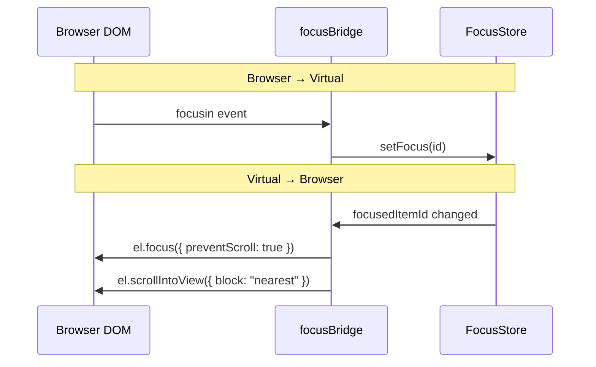

# Focus System Architecture

## Directory Structure

```
src/os/core/focus/
├── focusStore.ts           # Zustand Store 조합 + Public API
├── focusTypes.ts           # 통합 타입 정의
├── focusBridge.ts          # 브라우저 ↔ 가상 포커스 동기화
│
├── behavior/               # 6-Axis Behavior 정의
│   ├── behaviorTypes.ts    # Axis 타입 (Direction, Edge, Tab...)
│   ├── behaviorPresets.ts  # ARIA Role 기반 preset
│   └── behaviorResolver.ts # Base → Preset → Override 병합
│
├── store/                  # Atomic Zustand Slices
│   ├── zoneSlice.ts        # Zone 등록/관리, focusPath
│   ├── cursorSlice.ts      # 현재 포커스 위치
│   └── spatialSlice.ts     # Sticky 좌표 (Grid 내비용)
│
├── axes/                   # 축별 로직 모듈
│   ├── direction/          
│   │   ├── directionDispatcher.ts
│   │   ├── rovingNavigation.ts   # 1D (v/h)
│   │   └── spatialNavigation.ts  # 2D (grid)
│   ├── edge/               # loop/stop
│   ├── tab/                # loop/escape/flow
│   ├── entry/              # first/restore/selected
│   └── restore/            # 복귀 포인트 저장/복원
│
├── orchestrator.ts         # Pipeline Runner
└── utils/
    ├── domUtils.ts         # DOMRect 수집
    └── pathUtils.ts        # focusPath 계산
```

> [!NOTE]
> **No-Barrel Policy**: `index.ts` 배럴 파일 없이 명시적 경로로 import합니다.
> 순환 참조 방지 및 종속성 투명화 목적입니다.

---

## State Management (Slices)

### zoneSlice
Zone 등록 및 계층 관리

| State | Type | 설명 |
|-------|------|------|
| `activeZoneId` | `string` | 현재 활성 Zone |
| `zoneRegistry` | `Record<string, ZoneMetadata>` | 모든 Zone 메타데이터 |
| `focusPath` | `string[]` | Root → Leaf 경로 |

### cursorSlice
포커스 커서 위치 관리

| State | Type | 설명 |
|-------|------|------|
| `focusedItemId` | `string \| null` | 현재 포커스된 Item |
| `activeObject` | `FocusObject` | 포커스 상세 정보 |

### spatialSlice
2D Grid 내비게이션용 좌표 메모리

| State | Type | 설명 |
|-------|------|------|
| `stickyIndex` | `number` | 가상 인덱스 |
| `stickyX`, `stickyY` | `number` | 물리적 앵커 좌표 |

---

## Pipeline Architecture

### v7.0+ Orchestrator Pattern

기존 God Function 대신 **Stateless Pipeline Runner** 패턴을 채택합니다:

```typescript
// Simplified Pipeline
const pipeline = [restoreAxis, directionAxis, entryAxis];

function runPipeline(ctx: NavContext): NavContext | null {
  return pipeline.reduce((ctx, handler) => {
    if (!ctx) return null;
    return handler(ctx);
  }, ctx);
}
```

### Handler Signature
모든 Axis Handler는 동일한 시그니처를 따릅니다:

```typescript
type AxisHandler = (ctx: NavContext) => NavContext | null;
```

- `NavContext` 반환: 다음 단계로 전달
- `null` 반환: 파이프라인 중단 (이벤트 소비)

### Design Rules

| 규칙 | 설명 |
|------|------|
| **No God Function** | Orchestrator는 feature 로직 없이 파이프라인 실행만 담당 |
| **Unified Context** | 15개 인터페이스 → 4개로 통합 |
| **Bubbling in Handler** | 계층 순회는 orchestrator가 아닌 개별 axis에서 처리 |
| **Geometry Physics** | 앱은 인덱스 수학 금지, OS가 공간 알고리즘 담당 |

---

## Focus Bridge

브라우저 DOM과 가상 포커스의 양방향 동기화:



### Scroll Coordination

```typescript
// 포커스 이동 시 스크롤 동기화
el.focus({ preventScroll: true });  // 네이티브 점프 방지
el.scrollIntoView({ 
  block: "nearest",   // 최소 이동
  behavior: "smooth"  // 부드러운 전환
});
```

---

## Related Documents

- [Overview.md](./Overview.md) - 시스템 개요
- [6-Axis-Behavior.md](./6-Axis-Behavior.md) - Axis 명세
- [Patterns.md](./Patterns.md) - 구현 패턴
