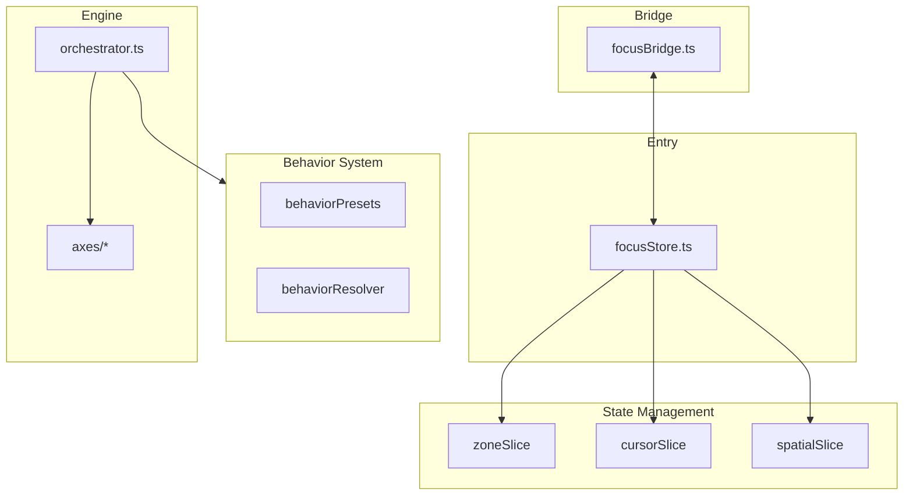

# Focus System Overview

## Introduction

Focus System은 Antigravity Interaction OS의 핵심 내비게이션 엔진입니다. 웹 브라우저의 기본 포커스 메커니즘(`tabIndex`, `activeElement`)을 완전히 대체하여, 운영체제 수준의 **결정론적 내비게이션(Deterministic Navigation)**을 구현합니다.

## Core Philosophy

### Virtual Focus 전략

> **"브라우저는 캔버스일 뿐, 물리학은 엔진이 담당한다."**

Interactive-OS는 웹 페이지가 아닌 **애플리케이션**입니다. 브라우저의 기본 동작은 "기능"이 아니라 "제약"으로 간주하며, 다음 전략을 채택합니다:

| 전략 | 설명 |
|------|------|
| **Black Hole** | 모든 Item에 `tabIndex="-1"` 적용, 브라우저 Tab Order에서 제거 |
| **Zone Strategy** | DOM 구조가 아닌 수학적 좌표로 다음 위치 계산 |
| **Input Sink** | Edit Mode 외에는 포커스를 컨테이너에 고정 |

---

## 6-Axis Behavior Model

Focus 시스템은 복잡한 ARIA 패턴을 **6개의 원자적 축(Atomic Axes)**으로 분해합니다:

| Axis | 값 | 설명 |
|------|-----|------|
| **Direction** | `none`, `v`, `h`, `grid` | Arrow 키 이동 방향 |
| **Edge** | `loop`, `stop` | 경계 도달 시 동작 |
| **Tab** | `loop`, `escape`, `flow` | Tab 키 동작 정책 |
| **Target** | `real`, `virtual` | 실제 DOM vs 가상 포커스 |
| **Entry** | `first`, `restore`, `selected` | Zone 진입 시 초기 위치 |
| **Restore** | `boolean` | Zone 탈출 시 복귀 여부 |

이 모델은 "Handler Hell"을 제거하고 예측 가능한 내비게이션을 보장합니다.

---

## System Components



| 레이어 | 책임 |
|--------|------|
| **Store** | Zone 등록, 커서 위치, Spatial Memory 관리 |
| **Behavior** | 6-Axis 타입 정의 및 ARIA Role 프리셋 |
| **Engine** | Pipeline 기반 내비게이션 실행 |
| **Bridge** | 브라우저 DOM ↔ 가상 포커스 양방향 동기화 |

---

## Quick Start

```tsx
import { OS } from '@/os';

function App() {
  return (
    <OS.Zone id="main" preset="listbox">
      <OS.Item id="item-1">First</OS.Item>
      <OS.Item id="item-2">Second</OS.Item>
      <OS.Item id="item-3">Third</OS.Item>
    </OS.Zone>
  );
}
```

`preset="listbox"`는 자동으로 다음 behavior를 적용합니다:
- `direction: "v"` - 위/아래 화살표로 이동
- `edge: "loop"` - 경계에서 순환
- `tab: "escape"` - Tab으로 Zone 탈출
- `entry: "selected"` - 선택된 항목으로 진입

---

## Related Documents

- [Architecture.md](./Architecture.md) - 상세 아키텍처
- [6-Axis-Behavior.md](./6-Axis-Behavior.md) - Axis 명세
- [Patterns.md](./Patterns.md) - 구현 패턴
