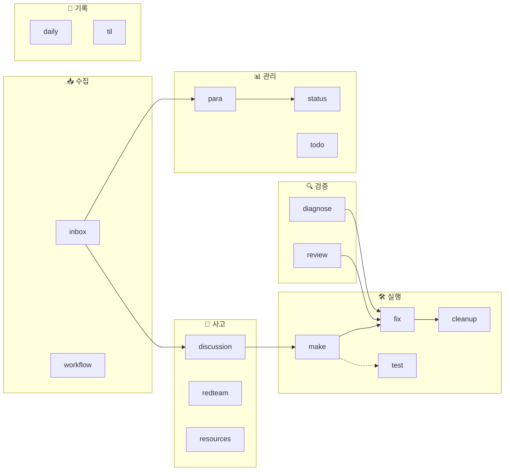

# 🔍 Workflow 품질 분석 보고서

> 날짜: 2026-02-12
> 대상: `.agent/workflows/` 내 17개 워크플로우 전수 조사

---

## 1. 개요 (Overview)

현재 `.agent/workflows/`에는 **17개의 워크플로우**가 정의되어 있다. 이 보고서는 각 워크플로우의 구조적 완성도, 명확성, 실용성을 평가하고, 전체 워크플로우 시스템의 성숙도를 분석한다.

---

## 2. 워크플로우 전체 지도

워크플로우를 **기능 영역**별로 분류하면 아래와 같다:

| 영역 | 워크플로우 | 설명 |
|------|-----------|------|
| 📥 **수집** | `inbox`, `workflow` | 정보 입수와 워크플로우 생성 |
| 🧠 **사고** | `discussion`, `redteam`, `resources` | 논증, 검증, 리서치 |
| 🛠️ **실행** | `make`, `fix`, `cleanup`, `test` | 빌드, 수정, 정리, 테스트 |
| 🔍 **검증** | `review`, `diagnose` | 코드 리뷰, 진단 |
| 📊 **관리** | `para`, `status`, `todo` | 문서 정리, 현황, TODO |
| 📝 **기록** | `daily`, `til` | 개발일지, TIL |
| ⚙️ **설정** | `rules` | 프로젝트 규칙 관리 |



---

## 3. 개별 워크플로우 평가

각 워크플로우를 **5가지 기준**으로 평가한다:

| 기준 | 설명 |
|------|------|
| **구조** | 단계가 논리적이고 순서가 명확한가 |
| **명확성** | 지시사항이 모호하지 않고 실행 가능한가 |
| **완결성** | 시작부터 종료까지 빈틈 없이 다루는가 |
| **재사용성** | 다양한 상황에서 유연하게 적용 가능한가 |
| **연계성** | 다른 워크플로우와 잘 이어지는가 |

> 등급: ⭐⭐⭐ 우수 / ⭐⭐ 양호 / ⭐ 개선 필요

---

### 🏆 Tier 1 — 우수 (⭐⭐⭐)

#### `/review` — 코드 리뷰
| 기준 | 점수 | 비고 |
|------|------|------|
| 구조 | ⭐⭐⭐ | 원칙 로드 → 대상 결정 → 검사 → 리포트 → 통보, 완벽한 흐름 |
| 명확성 | ⭐⭐⭐ | 프로젝트 고유 원칙(커맨드, 커널, 선언형)을 **구체적 안티패턴**과 함께 정의 |
| 완결성 | ⭐⭐⭐ | 철학 위반(🔴), 네이밍(🟡), 개선(🔵) 3단계 분류까지 완비 |
| 재사용성 | ⭐⭐⭐ | 범위 지정/자동 결정 모두 지원 |
| 연계성 | ⭐⭐⭐ | `rules.md` 참조, inbox에 리포트 저장, 수정 여부 확인까지 |

> **평가**: 프로젝트 철학을 가장 잘 반영한 워크플로우. 구체적인 코드 수준 검사 기준과 위반 분류 체계가 탁월하다.

---

#### `/resources` — 리소스 자동 생성
| 기준 | 점수 | 비고 |
|------|------|------|
| 구조 | ⭐⭐⭐ | 컨텍스트 파악 → 중복 체크 → 선정 → 수집 → 작성 → 역링크, 8단계 체계적 |
| 명확성 | ⭐⭐⭐ | 문서 템플릿이 매우 구체적 (frontmatter, 섹션별 가이드) |
| 완결성 | ⭐⭐⭐ | 중복 방지, 역링크 연결까지 고려 |
| 재사용성 | ⭐⭐⭐ | 자동 컨텍스트 분석으로 범용적 |
| 연계성 | ⭐⭐⭐ | PARA 구조(project/area)와 역링크로 강하게 결합 |

> **평가**: 단순 문서 생성을 넘어 지식 관리 시스템의 자동 큐레이션 역할. 역링크 연결은 특히 인상적.

---

#### `/discussion` — 소크라테스식 논증
| 기준 | 점수 | 비고 |
|------|------|------|
| 구조 | ⭐⭐⭐ | Toulmin 모델 기반 3단계 턴 구조 + 종료 산출물 2종 |
| 명확성 | ⭐⭐⭐ | 매 턴의 출력 형식이 정확히 정의됨 (Intent/Warrant/Gap) |
| 완결성 | ⭐⭐⭐ | 진행 중 문서화 요청, 종료 시그널, 산출물 2종까지 완비 |
| 재사용성 | ⭐⭐⭐ | 모든 주제에 적용 가능한 범용 사고 프레임워크 |
| 연계성 | ⭐⭐⭐ | inbox 연계, make workflow의 Phase 1으로 활용 |

> **평가**: AI 에이전트를 단순 Q&A가 아닌 **사고 파트너**로 활용하는 고급 워크플로우. Toulmin 모델 적용이 독창적.

---

#### `/diagnose` — 삽질 일지
| 기준 | 점수 | 비고 |
|------|------|------|
| 구조 | ⭐⭐⭐ | 실행 → 판단(통과/실패) → 분석 → 기록, 분기 로직 포함 |
| 명확성 | ⭐⭐⭐ | 수정 정책(명백한 실수 vs 읽기전용)이 정확히 정의 |
| 완결성 | ⭐⭐⭐ | 삽질 과정의 서술형 기록 + 확신도 + 다음 액션까지 |
| 재사용성 | ⭐⭐⭐ | 모든 테스트 실패에 범용 적용 가능 |
| 연계성 | ⭐⭐ | inbox에 저장하나, fix workflow와 명시적 연결 없음 |

> **평가**: "수정하지 않고 분석만" 하는 원칙이 핵심 차별점. 디버깅 사고 과정 자체를 자산화하는 메타 워크플로우.

---

### 👍 Tier 2 — 양호 (⭐⭐)

#### `/make` — 아이디어 → Spike
| 기준 | 점수 | 비고 |
|------|------|------|
| 구조 | ⭐⭐⭐ | 7단계 end-to-end 파이프라인, 기존 워크플로우 조립 |
| 명확성 | ⭐⭐ | Phase 4(구현) 단계가 상대적으로 추상적 |
| 완결성 | ⭐⭐ | Phase 4에서 "최소한의 동작하는 코드" → 기준이 모호 |
| 재사용성 | ⭐⭐ | TanStack Router 종속적 구현 단계 |
| 연계성 | ⭐⭐⭐ | discussion → inbox → fix → cleanup 체인이 명시적 |

> **개선 포인트**: Phase 4의 구현 범위와 완료 기준(Definition of Done)을 명확히 하면 완성도가 크게 올라감.

---

#### `/test` — E2E 테스트 자동 생성
| 기준 | 점수 | 비고 |
|------|------|------|
| 구조 | ⭐⭐⭐ | 대상 파악 → 패턴 참조 → 분석 → 생성 → 등록 → 검증 |
| 명확성 | ⭐⭐⭐ | 코드 템플릿, 금지 사항(❌)까지 구체적 |
| 완결성 | ⭐⭐ | TestBot 등록 단계가 프로젝트 구조 변경 시 깨질 수 있음 |
| 재사용성 | ⭐⭐ | Playwright + TestBot에 강하게 결합 |
| 연계성 | ⭐⭐ | fix workflow와 연계 가능하나 명시적이지 않음 |

> **개선 포인트**: 단위 테스트 vs E2E 선택 기준이 없음. E2E 전용이라면 그 이유를 설명하면 좋겠음.

---

#### `/fix` — 빌드/런타임 오류 수정
| 기준 | 점수 | 비고 |
|------|------|------|
| 구조 | ⭐⭐⭐ | Smoke → Type → Build → Full E2E, 단계별 에스컬레이션 |
| 명확성 | ⭐⭐⭐ | turbo-all로 자동 실행, 각 단계 역할 명확 |
| 완결성 | ⭐⭐ | "fix them" → 어떻게 고칠지 전략이 없음 |
| 재사용성 | ⭐⭐⭐ | 범용적 |
| 연계성 | ⭐⭐⭐ | make, cleanup 등 다수 워크플로우에서 참조 |

> **개선 포인트**: 수정 실패 시의 fallback 전략(예: diagnose로 전환)을 추가하면 더 robust.

---

#### `/cleanup` — 코드 정리
| 기준 | 점수 | 비고 |
|------|------|------|
| 구조 | ⭐⭐⭐ | 주석 → 타입/린트 → 미사용 → 빌드, 명확한 순서 |
| 명확성 | ⭐⭐⭐ | 구체적 키워드(나중에, TODO), 도구명(knip, biome) 지정 |
| 완결성 | ⭐⭐ | knip 결과의 오탐 처리가 간략 |
| 재사용성 | ⭐⭐⭐ | 범용적 |
| 연계성 | ⭐⭐ | make의 Phase 6으로 사용되나 독립 호출도 가능 |

> **평가**: 실용적이고 잘 정의됨. turbo 어노테이션 활용도 적절.

---

#### `/status` — 프로젝트 현황 리포트
| 기준 | 점수 | 비고 |
|------|------|------|
| 구조 | ⭐⭐ | 스캔 → 분석 → 리포트 → 통보, 간결 |
| 명확성 | ⭐⭐⭐ | RAG 판정 기준(70%/30%)이 수치로 명확 |
| 완결성 | ⭐⭐ | Area/Resource 현황은 "문서 수와 최근 갱신일"만으로 부족할 수 있음 |
| 재사용성 | ⭐⭐ | PARA 구조에 종속적 |
| 연계성 | ⭐⭐ | para workflow와 논리적 연결 |

---

#### `/para` — PARA 정리
| 기준 | 점수 | 비고 |
|------|------|------|
| 구조 | ⭐⭐⭐ | 4단계, PARA 원칙에 충실 |
| 명확성 | ⭐⭐⭐ | P/A/R/A 분류 기준이 명확 (목표+데드라인, 유지 표준 등) |
| 완결성 | ⭐⭐ | 아카이브 연도별 구조는 좋으나, 충돌 처리(같은 이름) 미정의 |
| 재사용성 | ⭐⭐ | PARA에 특화 |
| 연계성 | ⭐⭐ | inbox와 연결되나 status/todo와 명시적 체인 없음 |

---

#### `/todo` — TODO 리포트
| 기준 | 점수 | 비고 |
|------|------|------|
| 구조 | ⭐⭐ | 수집 → 분석 → 생성 → 확인 |
| 명확성 | ⭐⭐⭐ | Now/Next/Later + Blocker 포맷이 실용적 |
| 완결성 | ⭐⭐ | "분석 및 분류" 단계의 판단 기준이 부족 |
| 재사용성 | ⭐⭐⭐ | 범용적 |
| 연계성 | ⭐⭐ | status와 유사하지만 역할 구분이 모호 |

---

#### `/daily` — 개발일지
| 기준 | 점수 | 비고 |
|------|------|------|
| 구조 | ⭐⭐ | 수집 → 작성 → 저장, 단순하지만 충분 |
| 명확성 | ⭐⭐⭐ | 톤(AI 페르소나), 이모지, 템플릿이 구체적 |
| 완결성 | ⭐⭐ | git log만으로는 비코드 작업이 누락될 수 있음 |
| 재사용성 | ⭐⭐⭐ | 범용적 |
| 연계성 | ⭐⭐ | TIL과 연결 가능하나 명시되지 않음 |

---

#### `/til` — TIL
| 기준 | 점수 | 비고 |
|------|------|------|
| 구조 | ⭐⭐ | 수집 → 작성 → 저장 |
| 명확성 | ⭐⭐⭐ | Before/After(❌/✅) 코드 예시 + 교훈 패턴이 좋음 |
| 완결성 | ⭐⭐ | DevLog가 없는 날의 fallback이 미정의 |
| 재사용성 | ⭐⭐⭐ | 범용적 |
| 연계성 | ⭐⭐ | DevLog 참조하나 daily와 명시적 체인 없음 |

---

### 📌 Tier 3 — 개선 필요 (⭐)

#### `/inbox` — 인박스 보고서
| 기준 | 점수 | 비고 |
|------|------|------|
| 구조 | ⭐⭐ | 분석 → 작성 → 저장 → 통보 |
| 명확성 | ⭐⭐ | "adapt as needed"가 지나치게 유연 |
| 완결성 | ⭐ | 보고서 유형별 템플릿 분화 없음 (버그 vs 설계 vs 리서치가 같은 포맷) |
| 재사용성 | ⭐⭐⭐ | 범용적이나 그래서 오히려 품질이 들쑥날쑥 |
| 연계성 | ⭐⭐ | 다수 워크플로우의 기반이지만 이후 전달 경로 미정의 |

> **개선 포인트**: 가장 빈번하게 사용되는 게이트 워크플로우임에도 가장 느슨. 유형별 서브 템플릿을 도입하면 일관성이 크게 개선됨.

---

#### `/redteam` — 설계 검증
| 기준 | 점수 | 비고 |
|------|------|------|
| 구조 | ⭐⭐ | 5단계, 간결 |
| 명확성 | ⭐ | "토론과 논쟁 위주로 자유롭게" → 품질 편차 커짐 |
| 완결성 | ⭐ | 공격 관점의 체크리스트나 프레임워크 없음 |
| 재사용성 | ⭐⭐ | 범용적이나 가이드 부족 |
| 연계성 | ⭐ | 결과물의 후속 워크플로우 미정의 (fix? inbox?) |

> **개선 포인트**: 레드팀 분석의 관점 목록(성능, 확장성, 유지보수성, 보안, 대안 비용 등)을 제공하고, 블루팀 응답을 기본 포함시키면 훨씬 유용.

---

#### `/rules` — 규칙 관리
| 기준 | 점수 | 비고 |
|------|------|------|
| 구조 | ⭐⭐ | 분석 → 확인 → 적용 → 검증 |
| 명확성 | ⭐⭐ | 모호함 체크가 명시적 (좋음) |
| 완결성 | ⭐ | 규칙 간 충돌 검사, 카테고리 체계 미정의 |
| 재사용성 | ⭐⭐ | 범용적 |
| 연계성 | ⭐ | review workflow가 rules.md를 참조하나 양방향 연결 없음 |

> **개선 포인트**: 규칙 카테고리(네이밍, 아키텍처, 스타일 등) 체계와 기존 규칙 충돌 검사를 추가하면 좋음.

---

#### `/workflow` — 워크플로우 생성
| 기준 | 점수 | 비고 |
|------|------|------|
| 구조 | ⭐⭐ | 3단계, 최소한 |
| 명확성 | ⭐ | 좋은 워크플로우의 기준이나 품질 가이드라인 없음 |
| 완결성 | ⭐ | 기존 워크플로우와 중복 체크 없음, 네이밍 가이드 없음 |
| 재사용성 | ⭐⭐ | 범용적 |
| 연계성 | ⭐ | 만들어진 워크플로우의 테스트/검증 단계 없음 |

> **개선 포인트**: 메타 워크플로우로서 핵심 역할을 하기 때문에, 품질 체크리스트(단계 구체성, 산출물 정의, 연계성 등)를 포함해야 함.

---

## 4. 종합 진단

### 4.1 강점 ✅

| 강점 | 설명 |
|------|------|
| **PARA 통합** | 문서 관리 체계(inbox → project → area → resource → archive)가 워크플로우 전반에 일관 적용 |
| **워크플로우 체이닝** | `make`가 `discussion → inbox → fix → cleanup`을 조립하는 메타 워크플로우 패턴 |
| **turbo 어노테이션** | 자동 실행 가능 단계를 명시적으로 표시하는 독자적 시스템 |
| **프로젝트 도메인 반영** | `review`가 커맨드/커널/선언형 원칙이라는 프로젝트 고유 철학을 검사 기준으로 포함 |
| **사고 도구** | `discussion`(Toulmin), `diagnose`(삽질 일지)처럼 **코딩이 아닌 사고 과정**을 워크플로우화 |

### 4.2 약점 ⚠️

| 약점 | 영향 | 해당 워크플로우 |
|------|------|----------------|
| **에러 핸들링 부재** | 중간 단계 실패 시 행동 미정의 | `make`, `fix`, `cleanup` |
| **inbox 게이트 품질** | 가장 빈번한 입구점의 포맷이 느슨 | `inbox` |
| **todo ↔ status 역할 중복** | 비슷한 정보를 다른 포맷으로 생성 | `todo`, `status` |
| **daily ↔ til 중복 가능성** | 같은 날 실행 시 내용 겹침 | `daily`, `til` |
| **메타 워크플로우 품질** | workflow 생성 자체의 품질 보장 장치 없음 | `workflow` |
| **버전 관리 미정의** | 워크플로우 변경 이력, deprecation 절차 없음 | 전체 |

### 4.3 성숙도 등급

```
┌──────────────────────────────────────────────────────┐
│  Workflow Maturity Model                             │
│                                                      │
│  Level 1: Ad-hoc      — 비체계적, 개인 메모 수준     │
│  Level 2: Defined     — 단계 정의됨, 재사용 가능     │
│ ▶Level 3: Integrated  — 워크플로우 간 연계, 체이닝   │  ← 현재
│  Level 4: Managed     — 에러 처리, 메트릭, 피드백 루프│
│  Level 5: Optimized   — 자기 개선, A/B 테스트        │
└──────────────────────────────────────────────────────┘
```

**현재 수준: Level 3 (Integrated)** — 개별 워크플로우의 완성도가 높고, 워크플로우 간 체이닝이 이루어지고 있으나, 에러 핸들링과 피드백 루프가 부재.

---

## 5. 결론 및 제안

### 즉시 개선 (Quick Wins)

1. **`/inbox` 유형별 템플릿 도입** — Bug / Design / Research / Decision 분류로 품질 안정화
2. **`/redteam` 체크리스트 추가** — 분석 관점 목록(성능, 확장성, 유지보수성, 대안 비용) 제공
3. **`/workflow` 품질 가이드** — 좋은 워크플로우의 체크리스트(구체성, 산출물, 에러 처리, 연계)를 포함

### 구조적 개선 (Next)

4. **`/todo`와 `/status` 역할 정리** — todo는 개인 액션, status는 프로젝트 수준으로 명확히 분리하거나 통합
5. **에러/실패 프로토콜** — 모든 실행 계열 워크플로우에 "실패 시 → diagnose로 전환" 같은 fallback 경로 추가
6. **`/daily` + `/til` 통합 옵션** — 하루 끝에 한 번만 실행하는 `/eod` (End of Day) 워크플로우로 합치는 것도 고려

### 장기 과제 (Later)

7. **워크플로우 버전 관리** — frontmatter에 `version`, `last-updated` 추가
8. **실행 로그 / 메트릭** — 어떤 워크플로우를 얼마나 자주 쓰는지 추적 → 개선 우선순위 판단
9. **Self-review 루프** — `/workflow` 실행 시 기존 워크플로우 대비 중복/충돌 자동 검사
