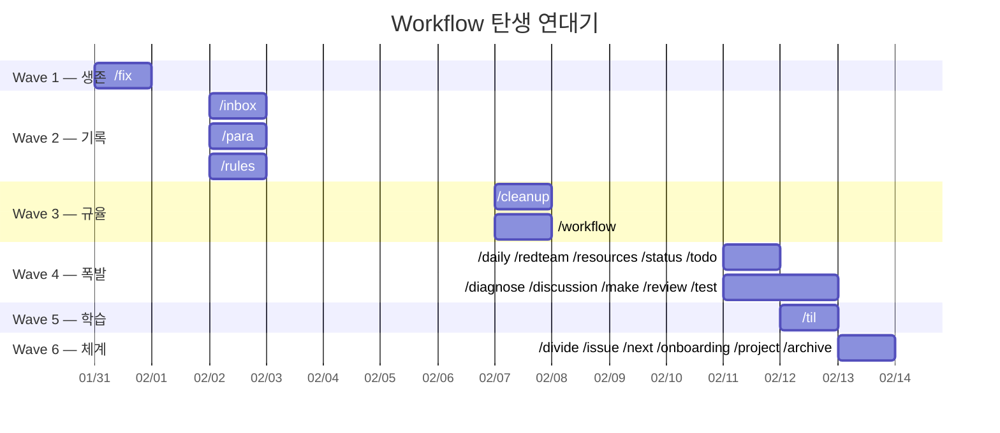

# 🧭 Workflow Manual — History, Why & Usage

| 항목 | 내용 |
|------|------|
| 원문 | 지금 내가 각 workflow들을 만들게 된 순서를 정리하고 왜 이런 workflow들을 만들게 되었는지 이걸 실제로 어떻게 쓰고 있는지를 알려주는 매뉴얼을 만들어봐 |
| 내(AI)가 추정한 의도 | workflow 시스템이 충분히 성숙해진 시점에서, 전체를 조감하고 자기 작업 스타일을 문서화해두려는 메타 정리 욕구 |
| 날짜 | 2026-02-13 |
| 상태 | active |

---

## 1. 개요 (Overview)

이 문서는 프로젝트에 존재하는 **23개 workflow**의 탄생 순서, 만들게 된 이유(Why), 그리고 실제 사용법(Usage)을 한 곳에 정리한 매뉴얼이다.

---

## 2. 연대기 — 6개의 파도

워크플로는 한 번에 전부 만들어진 게 아니다. **필요가 생길 때마다** 파도처럼 몰려왔다. Git 커밋 기록을 기준으로 6개의 파도를 식별할 수 있다.



---

### Wave 1: 생존 (Jan 31)

> "빌드가 깨지면 아무것도 못 한다."

| Workflow | 생성일 | Why |
|----------|--------|-----|
| `/fix` | 01-31 | smoke test → tsc → build 순서로 시스템 안정성을 확인하는 **생존 도구**. 개발 중 빌드가 깨질 때마다 수동으로 확인하던 과정을 자동화. |

**첫 번째 workflow가 `/fix`라는 사실이 모든 것을 말해준다.** 코드를 고치는 것보다 "지금 이게 돌아가긴 하는지"를 확인하는 게 먼저였다.

---

### Wave 2: 기록의 시작 (Feb 2)

> "생각한 걸 적어두지 않으면, AI와 나 사이에 컨텍스트가 소멸된다."

| Workflow | 생성일 | Why |
|----------|--------|-----|
| `/inbox` | 02-02 | 모든 요청을 **분석 보고서로 물질화**. 대화에서 사라지는 인사이트를 문서로 보존 |
| `/para` | 02-02 | PARA 분류 체계 도입. inbox에 쌓인 문서를 Project/Area/Resource/Archive로 분류 |
| `/rules` | 02-02 | 프로젝트 규칙을 `.agent/rules.md`에 명문화. AI가 매번 같은 실수를 반복하지 않도록 |

**패턴**: `/fix`만으로는 부족했다. "왜 깨졌는지", "다음에 뭘 해야 하는지"를 기록해야 했다. `/inbox`가 모든 문서화의 **입구**가 되었고, `/para`가 그 입구에 쌓인 것들을 정리하는 역할을 맡았다.

---

### Wave 3: 규율 (Feb 7)

> "기능은 돌아가는데, 코드가 점점 더러워진다."

| Workflow | 생성일 | Why |
|----------|--------|-----|
| `/cleanup` | 02-07 | 커밋 전 lazy comment 제거, tsc/biome/knip 점검. `/fix`가 돌아가게 하는 거라면, `/cleanup`은 **깨끗하게** 만드는 것 |
| `/workflow` | 02-07 | workflow 자체를 만드는 workflow. 사용자와 대화하며 intent → rationale → 절차를 정리. 이 시점에 "workflow를 체계적으로 만들어야겠다"는 자각이 생김 |

**패턴**: `/workflow`의 등장 = 메타 인지의 시작. "나는 workflow를 만들고 있다"는 인식이 생기면서 이후 workflow 생성이 폭발적으로 증가했다.

---

### Wave 4: 폭발 (Feb 11)

> "하루 만에 10개. 필요한 도구를 한꺼번에 깎아 만든 날."

| Workflow | 생성일 | Why |
|----------|--------|-----|
| `/daily` | 02-11 | 하루 개발을 AI 페르소나로 저널링. 감정과 맥락 보존 |
| `/redteam` | 02-11 | 내 설계를 스스로 공격. 레드팀/블루팀 토론 기반 검증 |
| `/resources` | 02-11 | 프로젝트 맥락에 맞는 레퍼런스를 자동 수집. 스터디 추천 포함 |
| `/status` | 02-11 | RAG + Kanban 하이브리드로 프로젝트 진척도 시각화 |
| `/todo` | 02-11 | Changelog(과거) + Now/Next/Later(미래) 리포트 |
| `/diagnose` | 02-11 | 테스트 실패 시 **코드를 수정하지 않고** 원인만 분석. 삽질 일지 작성 |
| `/discussion` | 02-11 | Toulmin 논증 모델 기반 소크라테스식 대화. Why/Intent/Warrant 누적 |
| `/make` | 02-11 | 아이디어 → discussion → PRD → 구현 → 검증 → 정리까지 end-to-end 파이프라인 |
| `/review` | 02-11 | 프로젝트 철학(커맨드 원칙, 100% 선언형 등) 준수 여부 코드 리뷰 |
| `/test` | 02-11 | Playwright spec 자동 생성 + TestBot 등록 |

**왜 한꺼번에?** Inspector UI 복원, dead code 제거(~750 LOC) 같은 대규모 리팩토링 작업 중에 "이런 도구가 있었으면…" 하는 순간들이 한꺼번에 터졌다. `/diagnose`는 테스트 실패를 분석하다가, `/discussion`은 설계 토론을 하다가, `/make`는 "대화만 하지 말고 만들자"는 순간에 생겼다.

---

### Wave 5: 학습 (Feb 12)

> "같은 삽질을 두 번 하기 싫다."

| Workflow | 생성일 | Why |
|----------|--------|-----|
| `/til` | 02-12 | Today I Learned. 디버깅 인사이트를 micro-lesson으로 추출 |

**패턴**: `/daily`가 "오늘 뭘 했는지"라면, `/til`은 "오늘 뭘 배웠는지". Mermaid 렌더링 문제, docs-viewer 리팩토링 중 얻은 기술적 교훈을 고정하기 위해 등장.

---

### Wave 6: 체계화 (Feb 13 — 오늘)

> "도구가 충분해졌다. 이제 조립할 차례."

| Workflow | 생성일 | Why |
|----------|--------|-----|
| `/divide` | 02-13 | 정답 유무 기준으로 문제를 분해. "코드를 다 고치는 게 목적이 아니라, 분석 보고서를 쓰는 게 목적" |
| `/issue` | 02-13 | 이슈의 전체 생애주기를 `/diagnose` → `/divide` → `/review` → `/fix` → `/test` → `/rules` → `/til`로 오케스트레이션 |
| `/next` | 02-13 | 다음 할 일 자동 탐지. tsc 에러 → E2E 실패 → inbox 미처리 → task.md 순서로 우선순위 판단 |
| `/onboarding` | 02-13 | 프로젝트 지도만 파악. 내용은 읽지 않는다. AI가 새 대화에서 빠르게 문맥을 잡도록 |
| `/project` | 02-13 | Discussion 결론을 프로젝트로 전환. WHY → WHAT → HOW → IF 순서의 표준 폴더 구조 |
| `/archive` | 02-13 | superseded 문서를 git archive 브랜치로 퇴출. AI 컨텍스트 노이즈 제거 |

**패턴**: 이 Wave의 특징은 **조합(composition)**. `/issue`는 기존 6개 workflow를 파이프라인으로 엮고, `/make`는 `/discussion` → `/inbox` → 구현 → `/fix` → `/cleanup`을 연결한다. 개별 도구가 아닌 **시스템**으로 진화했다.

---

## 3. Workflow 생태계 — 4개의 레이어

23개 workflow는 4개의 레이어로 분류할 수 있다:

```
┌─────────────────────────────────────────────────┐
│  Layer 4: 오케스트레이터 (다른 workflow를 조립)       │
│  /issue  /make  /next  /project  /para           │
├─────────────────────────────────────────────────┤
│  Layer 3: 사고 도구 (분석·토론·학습)                 │
│  /discussion  /divide  /diagnose  /redteam       │
├─────────────────────────────────────────────────┤
│  Layer 2: 기록 도구 (문서 생성·분류·정리)             │
│  /inbox  /daily  /til  /todo  /status            │
│  /resources  /review  /archive                   │
├─────────────────────────────────────────────────┤
│  Layer 1: 실행 도구 (코드 직접 조작)                 │
│  /fix  /cleanup  /test  /rules  /onboarding      │
│  /workflow                                       │
└─────────────────────────────────────────────────┘
```

- **Layer 1 (실행)**: 코드를 직접 건드리거나 시스템 상태를 변경한다.
- **Layer 2 (기록)**: 분석 결과, 학습, 현황을 문서로 남긴다.
- **Layer 3 (사고)**: 문제를 분해하고, 논증하고, 검증한다. 코드를 수정하지 않는다.
- **Layer 4 (오케스트레이터)**: 다른 workflow를 조합해서 end-to-end 흐름을 만든다.

---

## 4. 실전 사용 가이드

### 일상 루틴

| 상황 | 명령 | 기대 결과 |
|------|------|----------|
| 아침에 시작 | `/next` | 빌드 에러 → 실패 테스트 → inbox → task.md 순으로 다음 할 일 탐지 |
| 하루 끝 | `/daily` | 오늘 뭘 했는지 저널. 감정과 맥락 보존 |
| 뭔가 배웠을 때 | `/til` | micro-lesson으로 기술 교훈 고정 |
| 주간 정리 | `/todo` | Changelog + Now/Next/Later 리포트 |
| 월간 정리 | `/status` | 전체 프로젝트 RAG 현황판 |
| 문서 정리 | `/para` | inbox → Project/Area/Resource/Archive 분류 |

### 문제 해결

| 상황 | 명령 | 기대 결과 |
|------|------|----------|
| 빌드 깨짐 | `/fix` | smoke → tsc → build 순서로 자동 수복 |
| 테스트 실패 (원인 모름) | `/diagnose` | 코드 안 건드리고 원인 분석 → 삽질 일지 |
| 버그 접수 | `/issue` | 등록 → triage → diagnose → divide → review → fix → test → rules → til |
| 설계 결정 필요 | `/discussion` | Toulmin 기반 소크라테스식 대화. Warrant 누적 |
| 내 설계 검증 | `/redteam` | 레드팀이 약점 공격 |

### 기능 개발

| 상황 | 명령 | 기대 결과 |
|------|------|----------|
| 아이디어 → 구현 | `/make` | discussion → PRD → 개발계획서 → 구현 → 검증 → 정리 |
| 논의 → 프로젝트 전환 | `/project` | Discussion 결론을 표준 폴더 구조로 전환 |
| 테스트 작성 | `/test` | Playwright spec 자동 생성 + TestBot 등록 |
| 커밋 전 정리 | `/cleanup` | lazy comment 제거, tsc/biome/knip, 빌드 확인 |
| 코드 리뷰 | `/review` | 프로젝트 철학 위반 검사 → 리포트 |

### 지식 관리

| 상황 | 명령 | 기대 결과 |
|------|------|----------|
| 분석 요청 | `/inbox` | 구조화된 보고서. 해법 유형(Known/Constrained/Open) 판정 포함 |
| 레퍼런스 필요 | `/resources` | 프로젝트 맥락 기반 기술 에세이 자동 생성 |
| 규칙 추가 | `/rules` | `.agent/rules.md`에 명문화 |
| 낡은 문서 정리 | `/archive` | superseded 문서를 git archive 브랜치로 퇴출 |
| 새 workflow 필요 | `/workflow` | 대화하며 intent/rationale/절차 정의 후 등록 |
| 새 대화 시작 | `/onboarding` | rules + 구조 + workflow 목록만 훑기 |

---

## 5. 핵심 설계 철학 — 왜 이렇게 만들었는가

### "코드를 고치기 전에 생각하라"

- `/diagnose`: 코드를 **수정하지 않고** 원인만 분석
- `/divide`: 코드를 고치기 **전에** "정답인가?" 판단
- `/discussion`: 만들기 **전에** Why/Intent/Warrant를 발견
- **공통점**: 행동 전 사고를 강제하는 구조

### "기록하지 않으면 존재하지 않는다"

- `/inbox`가 모든 문서의 입구
- `/daily`, `/til`이 감정과 지식을 고정
- `/status`, `/todo`가 현황을 시각화
- **AI와의 협업에서 컨텍스트는 대화가 끝나면 사라진다.** 문서만이 남는다.

### "개별 도구가 아닌 시스템"

- `/issue`는 8개 workflow를 오케스트레이션
- `/make`는 6개 workflow를 파이프라인으로 연결
- `/next`는 상황을 자동 탐지하고 적절한 workflow로 라우팅
- **조합(composition)이 핵심이다.** Unix 철학과 같다.

---

## 6. 해법 유형 (Solution Landscape)

🟢 **Known** — 이 문서는 현재 시점의 사실 기록이며, "올바른 정리법"은 존재하지 않는다. 있는 그대로를 기록했다.

---

## 7. 인식 한계 (Epistemic Status)

- 이 분석은 **git 커밋 날짜 + 대화 히스토리 + workflow 파일 내용**에 기반한다.
- 각 Wave에서 "왜 이 workflow를 만들었는가"는 커밋 메시지, 대화 기록, 문서 내 Why 섹션에서 추론했으며, 사용자의 실제 심리 상태와 다를 수 있다.
- 사용 빈도(어떤 workflow가 가장 많이 호출되었는지)는 추적 데이터가 없어 정량적으로 확인하지 못했다.

---

## 8. 열린 질문 (Open Questions)

1. **사용 빈도 추적**: 어떤 workflow가 실제로 가장 많이/적게 쓰이는지 추적 메커니즘을 만들 것인가?
2. **폐기 기준**: 쓰지 않는 workflow를 언제 archive할 것인가?
3. **버전 관리**: workflow가 진화할 때 변경 이력을 어떻게 추적할 것인가? (현재는 git diff만 의존)

---

> **한줄요약**: 23개 workflow는 "빌드 깨짐 → 기록 필요 → 코드 위생 → 도구 폭발 → 학습 고정 → 시스템 조립" 순으로 6개 파도를 타고 탄생했으며, 핵심 철학은 **행동 전 사고, 기록의 물질화, Unix식 조합**이다.
