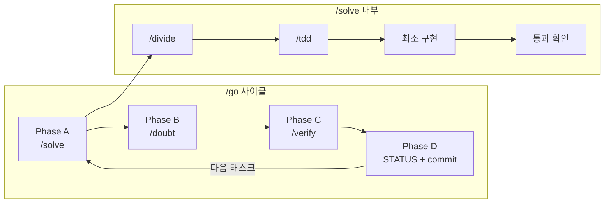

# 워크플로우 의존관계 분석

| 항목 | 값 |
|------|-----|
| 원문 | `전체 워크플로우의 의존관계를 머메이드로 그려봐` |
| 내(AI)가 추정한 의도 | 30개 워크플로우의 호출 관계를 시각화하여, 중복·순환·단절을 발견하고 생태계를 설계 수준에서 파악하고 싶다. |
| 날짜 | 2026-02-19 |
| 상태 | 📥 Inbox |

---

## 1. 개요

`.agent/workflows/` 30개 워크플로우 전체의 호출 관계를 분석하여 Mermaid 의존관계 그래프로 정리한다.

---

## 2. 의존관계 그래프

### 2-1. 전체 지도

```mermaid
graph TD
  subgraph "🎯 오케스트레이터 (자율/반자율 루프)"
    go["/go<br>자율 실행 루프"]
    project["/project<br>프로젝트 생애주기"]
    issue["/issue<br>8D 이슈 해결"]
    coverage["/coverage<br>커버리지 올리기"]
  end

  subgraph "🔧 실행 도구 (단일 책임)"
    solve["/solve<br>Complex 래더"]
    divide["/divide<br>Cynefin 분해"]
    tdd["/tdd<br>테스트 먼저"]
    test["/test<br>테스트 작성"]
    doubt["/doubt<br>자기의심"]
    verify["/verify<br>검증 게이트"]
    fix["/fix<br>형식 정정"]
    review["/review<br>코드 리뷰"]
    cleanup["/cleanup<br>코드 정리"]
    changelog["/changelog<br>커밋+기록"]
    diagnose["/diagnose<br>원인 분석"]
    perf["/perf<br>성능 진단"]
    refactor["/refactor<br>패턴 전환"]
    poc["/poc<br>PoC spike"]
  end

  subgraph "📝 사고 도구 (발산/수렴)"
    discussion["/discussion<br>논증 발견"]
    redteam["/redteam<br>레드팀 공격"]
    prd["/prd<br>요구사항 정의"]
    inbox["/inbox<br>보고서 작성"]
  end

  subgraph "🏗️ 인프라 (환경/문서/규칙)"
    ready["/ready<br>환경 준비"]
    status["/status<br>대시보드 갱신"]
    rules["/rules<br>규칙 추가"]
    routes["/routes<br>라우트 관리"]
    onboarding["/onboarding<br>프로젝트 파악"]
    resources["/resources<br>리소스 수집"]
    para["/para<br>PARA 정리"]
    archive["/archive<br>지식 환류"]
    retire["/retire<br>문서 퇴출"]
    retrospect["/retrospect<br>KPT 회고"]
  end

  %% ═══ /go 사이클 ═══
  go -->|"Phase A"| solve
  go -->|"Phase B"| doubt
  go -->|"Phase C"| verify
  go -->|"Phase D"| status
  go -->|"Phase D"| changelog
  go -->|"종료 후"| retrospect

  %% ═══ /solve 내부 ═══
  solve -->|"Step 1"| divide
  solve -->|"실행 프로토콜"| tdd

  %% ═══ /project 파이프라인 ═══
  project -->|"Phase 1"| onboarding
  project -->|"Phase 1"| discussion
  project -->|"Phase 2"| prd
  project -->|"Phase 3"| resources
  project -->|"Phase 3"| redteam
  project -->|"Phase 3"| review
  project -->|"Phase 4"| tdd
  project -->|"Phase 4"| divide
  project -->|"Phase 4"| review
  project -->|"Phase 4"| fix
  project -->|"Phase 4"| cleanup
  project -->|"Phase 4"| changelog
  project -->|"Phase 5"| doubt
  project -->|"Phase 5"| status
  project -->|"Phase 5"| retrospect
  project -->|"Phase 5"| archive

  %% ═══ /issue 파이프라인 ═══
  issue -->|"Step 3"| ready
  issue -->|"Step 4"| diagnose
  issue -->|"Step 5"| tdd
  issue -->|"Step 6"| divide
  issue -->|"Step 7"| review
  issue -->|"Step 8"| fix
  issue -->|"Step 9"| rules
  issue -->|"Step 10"| retrospect

  %% ═══ /coverage ═══
  coverage --> tdd
  coverage --> go

  %% ═══ /tdd → /test ═══
  tdd --> test
  tdd -.->|"PRD 참조"| prd

  %% ═══ /prd 내부 ═══
  prd --> redteam
  prd --> review

  %% ═══ /verify 내부 ═══
  verify -->|"Step 0"| ready

  %% ═══ /fix 내부 ═══
  fix --> verify

  %% ═══ /cleanup 내부 ═══
  cleanup --> doubt
  cleanup --> verify

  %% ═══ /refactor ═══
  refactor --> doubt
  refactor --> divide
  refactor --> review
  refactor --> fix
  refactor --> rules
  refactor --> retire
  refactor --> retrospect

  %% ═══ /poc ═══
  poc --> discussion
  poc --> inbox
  poc --> routes
  poc --> fix

  %% ═══ /perf ═══
  perf --> doubt
  perf --> verify

  %% ═══ /retrospect 내부 ═══
  retrospect --> review
  retrospect -.->|"Try 반영"| rules

  %% ═══ /para ═══
  para --> archive
  para --> retire

  %% ═══ /discussion → /inbox ═══
  discussion --> inbox
  discussion --> redteam

  %% ═══ /routes → /fix ═══
  routes --> fix
```

### 2-2. 핵심 사이클 (실행 루프)

---

## 3. 분석

### 허브 노드 (가장 많이 호출되는 워크플로우)

| Workflow | 호출 횟수 (in-degree) | 호출자 |
|----------|---------------------|--------|
| `/tdd` | 5 | /go→/solve, /project, /issue, /coverage, /divide |
| `/review` | 5 | /project×2, /issue, /refactor, /retrospect |
| `/verify` | 4 | /go, /fix, /cleanup, /perf |
| `/divide` | 4 | /solve, /project, /issue, /refactor |
| `/doubt` | 4 | /go, /project, /cleanup, /refactor, /perf |
| `/fix` | 4 | /project, /issue, /refactor, /poc, /routes |
| `/ready` | 2 | /verify, /issue |

### 리프 노드 (다른 것을 호출하지 않는 워크플로우)

| Workflow | 역할 |
|----------|------|
| `/test` | 테스트 작성 (실행 도구의 말단) |
| `/rules` | 규칙 파일 편집 |
| `/onboarding` | 프로젝트 파악 |
| `/status` | 대시보드 갱신 |
| `/resources` | 리소스 수집 |

### 고립 노드 (호출되지 않는 워크플로우)

| Workflow | 상태 |
|----------|------|
| `/design` | 독립 실행만 — 어떤 파이프라인에도 포함 안 됨 |
| `/workflow` | 메타 워크플로우 — 워크플로우를 만드는 워크플로우 |

---

## 4. Cynefin 도메인 판정

🟢 **Clear** — 워크플로우 파일에 호출 관계가 명시적으로 적혀 있으므로, 코드를 읽으면 그래프가 확정된다.

## 5. 인식 한계

- 이 그래프는 **문서에 명시된 호출 관계**만 반영한다. 실제 세션에서 사용자가 즉석으로 조합하는 경우는 포함하지 않았다.
- `/go`가 `/project` Phase 4 안에서 호출될 수 있는 암묵적 관계는 점선으로도 표현하지 않았다 (문서에 명시되지 않았기 때문).

## 6. 열린 질문

없음. Clear.

---

> **한줄요약**: 30개 워크플로우는 4개 오케스트레이터(/go, /project, /issue, /coverage)가 실행 도구를 조합하는 구조이며, `/tdd`와 `/review`가 가장 많이 호출되는 허브 노드다.
