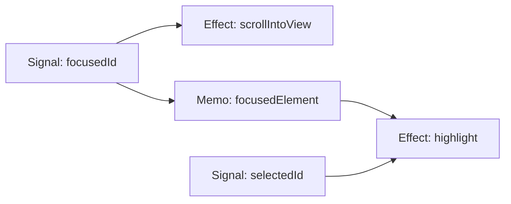
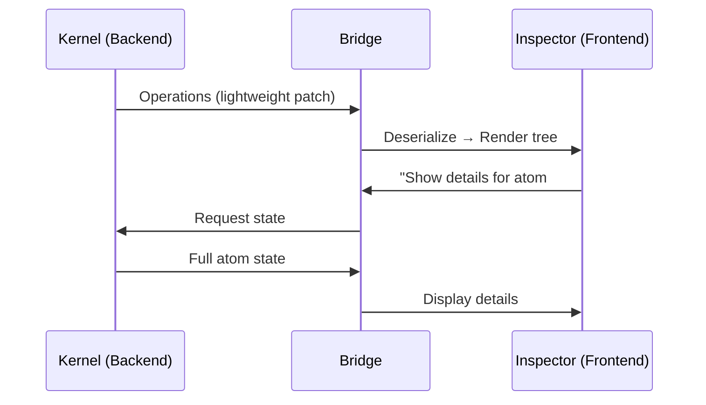

# DevTools 레퍼런스 카탈로그 — 빌려올 패턴들

> 7개 DevTools에서 stream-inspector에 차용할 수 있는 구체적 패턴과 구현 레퍼런스 정리

## 왜 이 주제인가
`stream-inspector`를 단순 로그 뷰어에서 프로페셔널한 디버깅 도구로 발전시키려면, 이미 검증된 DevTools의 UX/아키텍처 패턴을 적극적으로 참고해야 합니다. 이 문서는 "무엇을 가져올 수 있는가"에 초점을 맞춘 실용적 레퍼런스 카탈로그입니다.

## Background / Context
현대 프론트엔드 DevTools는 크게 3가지 축을 중심으로 진화해 왔습니다:
1. **State Inspection** — 컴포넌트/Atom/Signal의 현재 값 열람
2. **Time Travel** — 과거 상태 재현 및 Action Replay
3. **Performance Profiling** — 실행 시간 시각화 및 병목 탐지

각 도구는 이 축을 자신만의 방식으로 구현합니다.

---

## Core Concept: 패턴별 레퍼런스

### 1. 🔥 Flame Chart — Chrome DevTools Performance Panel

**패턴**: 시간 축 위에 Call Stack 깊이를 쌓아 시각화
**차용 포인트**: Kernel Transaction의 실행 시간과 중첩 관계를 Flame Chart로 표현

| 항목 | 설명 |
|---|---|
| X축 | 시간 (타임라인) |
| Y축 | Call Stack 깊이 (중첩된 호출) |
| 바 너비 | 해당 함수의 총 실행 시간 |
| 인터랙션 | 호버→하이라이트, 클릭→상세 정보 |

```
[──── Transaction #1 ────────────]
  [── atom.set("focus") ──]
  [── atom.set("selected") ──]
    [── effect: scroll ──]
```

**참고 코드**: [Chromium DevTools Frontend - FlameChart.ts](https://source.chromium.org/chromium/chromium/src/+/main:third_party/devtools-frontend/src/front_end/panels/timeline/FlameChart.ts)

---

### 2. 🧩 Plugin API — Vue DevTools

**패턴**: 외부에서 Inspector 패널과 Timeline 레이어를 등록하는 확장 API
**차용 포인트**: `InspectorRegistry`를 Vue DevTools의 Plugin API처럼 정규화

```typescript
// Vue DevTools Plugin API 핵심 구조
api.addTimelineLayer({
  id: 'kernel-tx',
  label: 'Kernel Transactions',
  color: 0xFF6B35
})

api.addTimelineEvent({
  layerId: 'kernel-tx',
  event: { time: Date.now(), data: { action: 'NAVIGATE' } }
})

api.addInspector({
  id: 'kernel-state',
  label: 'Kernel State',
  icon: 'storage',
  treeFilterPlaceholder: 'Search atoms...'
})
```

> **핵심 인사이트**: Vue DevTools는 `getInspectorTree`/`getInspectorState` 훅으로 트리 구조와 상세 데이터를 **온디맨드**로 요청합니다. 전체를 한번에 보내지 않습니다.

**참고**: [Vue DevTools Plugin API 공식 문서](https://devtools.vuejs.org/plugin/api-reference.html)

---

### 3. 🌳 Reactive Graph Visualization — Solid DevTools

**패턴**: Signal → Observer 의존성 그래프를 실시간 시각화
**차용 포인트**: Kernel Atom 간의 의존 관계를 그래프로 보여주기



| 기능 | 설명 |
|---|---|
| **Signal Tracker** | 시그널의 이름과 현재 값을 실시간 표시 |
| **Observer Dependencies** | 각 시그널을 구독하는 컴포넌트/이펙트를 시각화 |
| **Logger** | `debugSignal()` 등으로 특정 시그널만 콘솔에서 추적 |
| **Locator** | 클릭→IDE 소스 코드 점프 |

**참고**: [solid-devtools GitHub](https://github.com/thetarnav/solid-devtools)

---

### 4. ⏪ Deterministic Replay — Elm Debugger

**패턴**: 모든 Msg를 기록하고, 초기 상태에서 순차 Replay하여 임의 시점 복원
**차용 포인트**: Kernel의 순수 함수 구조와 궁합이 좋음

```
Model₀ → update(Msg₁) → Model₁ → update(Msg₂) → Model₂ → ...
                                    ↑
                              Jump here!
```

> **핵심 인사이트**: Elm은 부수효과가 런타임에 격리되어 있어 Replay가 100% 안전합니다. Kernel도 Effect를 분리하고 있으므로 동일한 패턴을 적용할 수 있습니다.

**참고**: [Elm Debug 공식 문서](https://elm-lang.org/news/the-perfect-bug-report)

---

### 5. 🔬 Atom Inspector + Component Graph — Jotai DevTools

**패턴**: Atom 단위 상태 검사 + 어떤 컴포넌트가 어떤 Atom을 구독하는지 시각화
**차용 포인트**: Kernel Atom의 값 변경 이력과 구독자 매핑

| 기능 | 설명 |
|---|---|
| **Atom Snapshot** | 현재 모든 Atom의 값을 JSON Tree로 표시 |
| **Diff Highlight** | 변경 전후 값을 addition/deletion으로 하이라이트 |
| **Component Graph** | `useAtom` 호출 위치를 컴포넌트 트리에 매핑 |
| **Debug Label** | `atom.debugLabel = 'focusStack'`으로 식별 |

> **핵심 인사이트**: `debugLabel`을 Babel/SWC 플러그인으로 자동 주입하는 패턴은 DX 측면에서 매우 효과적입니다.

**참고**: [jotai-devtools GitHub](https://github.com/jotaijs/jotai-devtools)

---

### 6. 🕰️ Retroactive Print Statements — Replay.io

**패턴**: 녹화 후에 `console.log`를 삽입하면 과거 실행에서의 출력을 볼 수 있음
**차용 포인트**: 이미 지나간 Transaction에 "조건부 필터"를 적용하여 재분석

| 기능 | 설명 |
|---|---|
| **Record & Replay** | 비결정적 입력(네트워크, 타이머)까지 캡처하여 완전 재현 |
| **Retroactive console.log** | 녹화 후 코드에 로그를 추가하면 과거 실행의 결과를 표시 |
| **Shared URL** | 디버깅 세션 자체를 URL로 공유 |

> **핵심 인사이트**: "실행을 일급 객체로 만든다"는 철학. Kernel Transaction 로그 자체를 export/import/share할 수 있는 가능성.

**참고**: [Replay.io 아키텍처 블로그](https://medium.com/replay-io/how-replay-works-5c9c29580c58)

---

### 7. 🌉 Bridge Architecture — React DevTools

**패턴**: Frontend ↔ Backend 간 경량 Operations 메시지로 통신
**차용 포인트**: Inspector UI와 Kernel 간의 통신 효율화



> **핵심 인사이트**: React DevTools v4 리라이트의 핵심은 **"구조만 먼저, 상세는 On-Demand"** 전략입니다. 트리 구조는 경량 Operations으로 보내고, Props/State는 선택 시에만 요청합니다.

**참고**: [React DevTools 개요 문서](https://github.com/facebook/react/blob/main/packages/react-devtools/OVERVIEW.md)

---

## Best Practice + Anti-Pattern

### ✅ 가져올 때의 원칙
- **On-Demand Data**: 전체 상태를 매번 보내지 말 것 (React DevTools v4의 교훈)
- **Plugin Architecture**: 코어는 얇게, 기능은 플러그인으로 (Vue DevTools 방식)
- **Deterministic Core**: 순수 함수 + Effect 분리가 Time Travel의 전제 (Elm 방식)
- **Debug Labels**: 자동 이름 주입으로 개발자 경험 향상 (Jotai 방식)

### ⛔ 피해야 할 것
- **Full State Dump**: 매 이벤트마다 전체 상태를 직렬화 → 성능 병목
- **Tight Coupling**: DevTools 로직이 앱 코드와 강결합 → Dev 모드 분리 필수
- **Over-visualization**: 모든 것을 그래프로 그리면 오히려 가독성 저하

## 흥미로운 이야기들

- **Elm Debugger의 기원**: Elm 창시자 Evan Czaplicki는 2013년 학위 논문에서 "Interactive programming"을 주장했고, 이것이 Redux의 Time Travel에 직접적인 영감을 주었습니다. Dan Abramov는 React Europe 2015에서 이를 공개적으로 인정했습니다.
- **Replay.io의 도전**: 브라우저 전체를 Deterministic하게 만들기 위해 약 400개의 `libc` 호출을 가로채야 했습니다. 이는 "프로그램 실행 자체를 데이터로 만들겠다"는 극단적 발상입니다.
- **Vue DevTools의 확장성 철학**: Pinia, Vue Router 등 모든 공식 라이브러리가 동일한 Plugin API를 통해 DevTools에 통합됩니다. 생태계 전체가 하나의 디버깅 경험으로 수렴하는 희귀한 사례입니다.

## 📚 스터디 추천

| 주제 | 이유 | 자료 | 난이도 | 시간 |
|---|---|---|---|---|
| Chrome DevTools Frontend 소스 | Flame Chart 렌더링 구현체 | [chromium/devtools-frontend](https://source.chromium.org/chromium/chromium/src/+/main:third_party/devtools-frontend/) | ⭐⭐⭐⭐⭐ | 4h+ |
| Vue DevTools Plugin API | 확장 가능한 Inspector 설계 | [devtools.vuejs.org/plugin](https://devtools.vuejs.org/plugin/api-reference.html) | ⭐⭐⭐ | 1h |
| Solid DevTools 소스 | Fine-grained 반응형 그래프 시각화 | [solid-devtools](https://github.com/thetarnav/solid-devtools) | ⭐⭐⭐⭐ | 2h |
| Replay.io 아키텍처 블로그 | Record/Replay의 극한 구현 | [replay.io/blog](https://replay.io/blog) | ⭐⭐⭐ | 1h |
| Elm "Perfect Bug Report" | Deterministic Replay 철학의 원류 | [elm-lang.org](https://elm-lang.org/news/the-perfect-bug-report) | ⭐⭐ | 30m |
