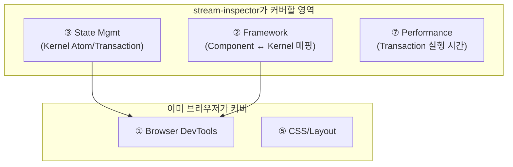

# FE Inspector 분류학 — 왜 이렇게 많은가

> 프론트엔드에 Inspector가 10종류나 존재하는 이유: 각 카테고리가 품고 있는 "고유한 복잡성"을 해부한다

## 왜 이 주제인가
`stream-inspector`가 어떤 종류의 도구인지, 어떤 복잡성을 해결하려는 것인지 정확히 위치를 잡기 위해서는 FE Inspector의 전체 지형을 이해해야 합니다. 도구가 존재한다는 건 **눈으로는 볼 수 없는 복잡성**이 있다는 뜻입니다.

## Background / Context
브라우저는 이미 강력한 DevTools를 내장하고 있습니다. 그런데도 React DevTools, Redux DevTools, Apollo DevTools… 왜 끝도 없이 생겨날까요?

**핵심 통찰**: 각 Inspector는 **서로 다른 추상화 레이어(Abstraction Layer)**를 검사합니다. 브라우저 DevTools는 "결과(DOM)"만 보여주고, 프레임워크 DevTools는 "의도(Component)"를, 상태 관리 DevTools는 "원인(Action)"을 보여줍니다. 추상화 경계를 넘어서면 기존 도구로는 보이지 않는 영역이 생기고, 그래서 새 Inspector가 탄생합니다.

## Core Concept

### 전체 지형도

```
   사용자 의도 (Intent)
        │
   ┌────▼────┐
   │ ⑩ Route │ ← "어떤 페이지인가"
   └────┬────┘
   ┌────▼──────────┐
   │ ② Framework   │ ← "어떤 컴포넌트 트리인가"
   │   Inspector   │
   └────┬──────────┘
   ┌────▼──────────┐    ┌──────────────┐
   │ ③ State Mgmt  │    │ ④ Data Fetch │
   │   Inspector   │    │   Inspector  │
   └────┬──────────┘    └──────┬───────┘
   ┌────▼──────────────────────▼───────┐
   │ ① Browser DevTools               │ ← "결과: DOM/CSS/Network"
   │   (Elements, Network, Console)    │
   └────┬──────────────────────────────┘
   ┌────▼──────────┐  ┌────────────────┐  ┌──────────────┐
   │ ⑦ Performance │  │ ⑧ Memory /     │  │ ⑥ A11y       │
   │   Profiler    │  │   Record&Replay│  │   Inspector  │
   └───────────────┘  └────────────────┘  └──────────────┘
   ┌──────────────────────────────────────────────────────┐
   │ ⑤ CSS/Layout  │  ⑨ Testing/Automation               │
   └──────────────────────────────────────────────────────┘
```

---

### ① Browser Built-in DevTools

| | |
|---|---|
| **왜** | 웹의 3대 기둥(HTML, CSS, JS)은 텍스트 파일로 전달되지만 **브라우저 엔진이 해석한 결과**는 파일과 전혀 다른 형태(DOM Tree, CSSOM, Call Stack) |
| **복잡성** | Parse → Style → Layout → Paint → Composite의 **렌더링 파이프라인**이 눈에 보이지 않음. "왜 이 요소가 여기에 그려졌는가"를 역추적하려면 모든 단계를 열어봐야 함 |
| **대표 도구** | Chrome DevTools, Firefox DevTools, Safari Web Inspector |

> 가장 낮은 추상화 레벨. 모든 것의 "결과"를 보여주지만 "원인(코드 의도)"은 보여주지 못합니다.

---

### ② Framework Inspector

| | |
|---|---|
| **왜** | React/Vue/Solid 등은 **Virtual DOM** 또는 **Reactive Graph**라는 중간 추상화를 도입. 실제 DOM에는 `<div>` 수십 개가 보이지만 개발자는 `<UserCard>` 하나를 작성했을 뿐 |
| **복잡성** | Component ↔ DOM 매핑이 1:1이 아님. 조건부 렌더링, Fragment, Portal, Suspense 등으로 **작성한 코드 구조 ≠ 실제 DOM 구조**. Props/State는 DOM에 존재하지 않는 순수 JS 개념 |
| **대표 도구** | React DevTools, Vue DevTools, Svelte DevTools, Solid DevTools, Angular DevTools |

> "내가 작성한 코드가 지금 어떤 상태인가"를 보는 도구. 핵심은 **Virtual ↔ Real 매핑**.

---

### ③ State Management Inspector

| | |
|---|---|
| **왜** | 컴포넌트 로컬 상태를 넘어서 **애플리케이션 전역 상태**가 생기면, "이 값이 왜 이러한가"의 원인이 코드 여러 곳에 분산됨 |
| **복잡성** | Action → Reducer → State → UI의 **인과 관계 체인**이 비동기와 결합되면 추적 불가. "어떤 액션이 어떤 상태를 변경했고, 그게 어떤 UI 변화를 일으켰는가"의 3단 추적이 필요 |
| **대표 도구** | Redux DevTools, MobX DevTools, Zustand DevTools, Jotai DevTools, XState Inspector |

> Time Travel이 가능한 유일한 카테고리. **인과 체인의 선형 기록**이 핵심 데이터.

---

### ④ Data Fetching Inspector

| | |
|---|---|
| **왜** | 서버 상태(Server State)는 클라이언트 상태와 근본적으로 다름. 캐시, 중복 요청 제거, 자동 갱신(stale-while-revalidate) 등 **눈에 보이지 않는 최적화 레이어** |
| **복잡성** | "이 데이터가 캐시에서 왔는가, 네트워크에서 왔는가?", "이 쿼리는 왜 다시 실행되었는가?", "stale/fresh/fetching 상태가 뭔가?" — Network 탭에서는 요청의 유무만 보이고 **캐시 전략의 결정 과정**은 보이지 않음 |
| **대표 도구** | React Query DevTools, SWR DevTools, Apollo DevTools, URQL DevTools |

> Network 탭의 상위 레이어. "왜 이 요청이 발생(또는 생략)되었는가"를 설명합니다.

---

### ⑤ CSS / Layout Inspector

| | |
|---|---|
| **왜** | CSS는 **선언적이고 전역적**. 어떤 스타일이 적용되었는지는 보이지만, "왜 이 레이아웃이 이렇게 되었는가"는 Grid/Flexbox의 암묵적 규칙 때문에 추론이 어려움 |
| **복잡성** | `auto` margin, `flex-grow` 비율, Grid의 `fr` 단위, `z-index` stacking context 등은 **계산된 결과만 DOM에 반영**되어 중간 과정이 숨겨짐. 어떤 규칙이 우선했는지는 cascade 전체를 추적해야 알 수 있음 |
| **대표 도구** | Firefox Grid/Flexbox Inspector, VisBug, Pesticide |

> 계산된 레이아웃의 "중간 과정"을 시각화하는 도구.

---

### ⑥ Accessibility Inspector

| | |
|---|---|
| **왜** | Accessibility Tree는 DOM Tree와 별개의 트리. 스크린 리더가 읽는 것은 DOM이 아니라 **브라우저가 구축한 A11y Tree** |
| **복잡성** | ARIA 속성, 암묵적 역할(implicit roles), focus 순서, 색상 대비 — 이 모든 것이 **시각적으로 정상이어도 접근성은 깨져 있을 수 있음**. 눈으로 검증 불가능한 영역 |
| **대표 도구** | axe DevTools, Chrome A11y Panel, WAVE, Accessibility Insights |

> "보이지 않는 사용자"의 관점에서 검사하는 도구. **시각적 정상 ≠ 접근성 정상**.

---

### ⑦ Performance / Profiling

| | |
|---|---|
| **왜** | "느리다"는 현상은 있지만 **원인의 위치가 불분명**. JS 실행인가, 렌더링인가, 레이아웃 재계산인가, GC인가? |
| **복잡성** | Main Thread에서 벌어지는 일은 **시간 차원의 복잡성**. 같은 코드도 실행 시점/빈도에 따라 병목이 되기도, 무해하기도 함. 샘플링 기반(= 매 1ms마다 스냅샷)이라 모든 것을 100% 캡처하지 못함 |
| **대표 도구** | Chrome Performance Panel, React Profiler, Lighthouse, Why Did You Render |

> 공간이 아닌 **시간** 차원의 복잡성. Flame Chart가 필요한 이유.

---

### ⑧ Record & Replay

| | |
|---|---|
| **왜** | 버그의 재현 자체가 불가능한 경우. "사용자 환경에서만 발생", "간헐적", "경쟁 조건" |
| **복잡성** | 웹 앱의 비결정성(Non-determinism): 네트워크 타이밍, `Math.random()`, `Date.now()`, Web Worker 스케줄링 등. 동일한 코드도 실행할 때마다 다른 결과가 나올 수 있음. 이 모든 비결정적 입력을 캡처하여 **결정적으로 재현**해야 함 |
| **대표 도구** | Replay.io, LogRocket, FullStory, SessionStack |

> "실행 자체를 데이터로 만든다"는 극단적 접근. 복잡성의 차원이 다릅니다.

---

### ⑨ Testing / Automation Inspector

| | |
|---|---|
| **왜** | 자동화된 테스트가 실패했을 때, "어느 시점에서 실제 UI가 기대와 달라졌는가"를 확인해야 함 |
| **복잡성** | 테스트 코드의 셀렉터가 가리키는 요소와 **실제 렌더링된 요소 사이의 타이밍 갭**(hydration, lazy loading, animation). "요소가 존재하지만 아직 인터랙션 가능하지 않음" 같은 상태가 문제 |
| **대표 도구** | Playwright Inspector, Cypress Runner, Storybook |

> 인간이 아닌 **자동화 봇의 관점**에서 UI를 검사하는 도구.

---

### ⑩ Routing / Navigation Inspector

| | |
|---|---|
| **왜** | SPA에서 URL ↔ UI의 매핑은 프레임워크 레이어에서 일어남. 브라우저의 주소창만으로는 "이 URL이 어떤 레이아웃과 데이터 로딩을 트리거하는가"를 알 수 없음 |
| **복잡성** | Nested routes, lazy loading, route guards, 매개변수 파싱, search params — **URL이라는 단순 문자열이 복잡한 상태 머신을 구동**. 어떤 라우트가 매칭되고, 어떤 로더가 실행되었는지의 흐름이 숨겨져 있음 |
| **대표 도구** | TanStack Router DevTools, React Router DevTools, Vue Router DevTools |

> URL → Route Match → Loader → Component의 **해석 과정**을 보여주는 도구.

---

## Usage: stream-inspector의 위치



Kernel의 `stream-inspector`는 주로 **③ State Management**에 해당하되, "Event → Command → Effect"라는 파이프라인 전체를 시각화한다는 점에서 **② Framework Inspector**의 성격도 가집니다. 장기적으로 Transaction 실행 시간을 Flame Chart로 보여주면 **⑦ Performance**까지 확장됩니다.

## Best Practice + Anti-Pattern

### ✅ Inspector를 만들 때의 원칙
- **한 가지 복잡성에 집중**: 모든 것을 보여주려 하면 아무것도 보여주지 못합니다
- **기존 도구와 보완 관계**: Browser DevTools가 이미 잘 하는 것(DOM, Network)은 다시 만들지 않기
- **추상화 경계에서 시작**: "코드에는 있지만 기존 도구에서 안 보이는 것"이 Inspector의 존재 이유

### ⛔ 피해야 할 것
- **Swiss Army Knife**: 10개 카테고리를 하나의 도구에 욱여넣기
- **DOM 중복**: Elements 탭이 이미 하는 일을 다시 구현
- **결과만 보여주기**: Inspector의 가치는 "결과"가 아니라 "결과에 이르는 과정"

## 흥미로운 이야기들

- **Chrome DevTools의 패널 수**: 2008년 첫 출시 때는 Elements, Resources, Scripts 3개뿐이었습니다. 웹의 복잡성이 증가하면서 지금은 10개 이상의 패널로 성장했습니다. 새 패널이 추가될 때마다 "왜 기존 패널에 넣으면 안 되는가"에 대한 결코 가벼울 수 없는 논의가 있었습니다.
- **React DevTools의 탄생 배경**: 2014년, React 팀은 "Virtual DOM이 있으면 DOM을 직접 볼 필요가 없다"고 생각했지만, 현실은 반대였습니다. Virtual DOM이 있기 때문에 오히려 **둘 다** 볼 수 있어야 했습니다.
- **Firefox의 선견지명**: CSS Grid Inspector를 브라우저에 네이티브로 내장한 최초의 브라우저. "레이아웃의 복잡성은 별도 도구가 필요하다"는 판단이 옳았습니다.

## 📚 스터디 추천

| 주제 | 이유 | 자료 | 난이도 | 시간 |
|---|---|---|---|---|
| Chrome DevTools 아키텍처 | 패널 분리 철학의 원류 | [Chrome DevTools Protocol](https://chromedevtools.github.io/devtools-protocol/) | ⭐⭐⭐⭐ | 2h |
| XState Inspector | State Machine 시각화의 정석 | [stately.ai/inspector](https://stately.ai/docs/inspector) | ⭐⭐⭐ | 1h |
| React Query DevTools 소스 | 캐시 상태 시각화 구현체 | [tanstack/query-devtools](https://github.com/TanStack/query/tree/main/packages/react-query-devtools) | ⭐⭐⭐ | 1h |
| axe-core 엔진 | A11y 자동 검사 규칙 구현 | [dequelabs/axe-core](https://github.com/dequelabs/axe-core) | ⭐⭐⭐⭐ | 2h |
