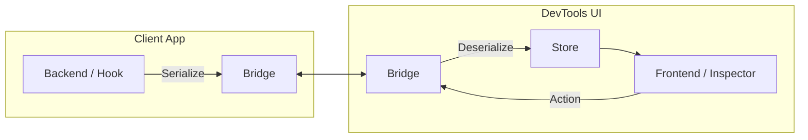

# Time Travel Debugging & Inspector Architecture

> 상태 관리 시스템을 위한 시각화 도구와 타임 트래블 디버깅 구현의 핵심 아키텍처 분석

## 왜 이 주제인가
현재 `kernel`의 Event Sourcing 구조와 이를 시각화하는 `stream-inspector`를 고도화하고 있습니다. Redux DevTools와 React DevTools의 내부 설계를 참고하여, 단순한 로그 뷰어를 넘어 **상태 제어(Time Travel)**와 **구조적 디버깅(Element Inspection)**이 가능한 강력한 도구로 발전시키기 위함입니다.

## Background / Context
복잡한 상태를 가진 애플리케이션에서 "무엇이, 언제, 왜 변했는가"를 추적하는 것은 매우 어렵습니다.
*   **Redux DevTools**: Flux 패턴의 예측 가능성을 이용해 "Action을 되돌리기(Undo/Redo)"와 "상태 건너뛰기(Jump to State)"를 구현했습니다.
*   **React DevTools**: Virtual DOM(Fiber)을 시각화하고, 컴포넌트 트리를 순회하며 Props/State를 실시간으로 수정하는 인터페이스를 제공합니다.

## Core Concept

### 1. Lifted State (승격된 상태)
Time Travel을 구현하기 위해서는 애플리케이션의 현재 상태(`present`)뿐만 아니라 과거(`past`)와 미래(`future`)의 상태 목록을 관리하는 상위 레벨의 상태가 필요합니다.
Redux DevTools는 이를 위해 원래의 Reducer를 감싸는 Higher-Order Reducer를 사용하여 상태를 '승격'시킵니다.

```typescript
type LiftedState<S, A> = {
  past: S[];
  present: S;
  future: S[];
  actionsById: Record<number, A>;
  stagedActionIds: number[];
  skippedActionIds: number[];
  committedState: S;
};
```

### 2. Event Sourcing & Replay
상태를 직접 저장하는 대신 **변경 사항(Event/Action)의 순서**를 저장합니다.
*   **Replay**: 특정 시점의 상태를 복원하려면, 초기 상태(`committedState`)에서 시작하여 해당 시점까지의 모든 Action을 순차적으로 Reducer에 통과시킵니다.
*   **Hot Reloading**: 코드가 변경되었을 때, 저장된 Action 로그를 새로운 Reducer 로직으로 다시 실행하여 상태를 유지한 채 로직만 교체합니다.

## Architecture

DevTools는 보통 **피검사체(Client App)**와 **검사 도구(DevTools UI)**가 분리되어 실행되며, 이들 사이를 **Bridge**가 연결합니다.



1.  **Backend (Instrumentation)**: 앱 내부에 주입되어 Store 구독, DOM 이벤트 감지 등을 수행합니다.
2.  **Bridge**: `window.postMessage`, `WebSocket`, 또는 브라우저 확장 프로그램의 메시징 API를 통해 데이터를 직렬화하여 주고받습니다.
3.  **Frontend**: 수신된 데이터를 바탕으로 상태 트리를 재구성하고 시각화합니다. 사용자의 조작(Time Travel, State 수정)을 Backend로 전송합니다.

## Usage: Key Implementation Details

### 1. Snapshotting (최적화)
모든 변경마다 처음부터 Replay하는 것은 비용이 큽니다. 중간 중간 상태 스냅샷을 저장하여 연산을 줄입니다.
```typescript
// 50개 액션마다 스냅샷 저장 예시
if (actionCount % 50 === 0) {
  saveSnapshot(currentState);
}
// Replay 시
const nearestSnapshot = findNearestSnapshot(targetActionId);
let state = nearestSnapshot.state;
for (const action of actionsAfterSnapshot) {
  state = reducer(state, action);
}
```

### 2. Element Selection Lock (Inspector)
화면상의 요소를 클릭하여 내부 상태를 검사하는 기능(React DevTools의 "Select an element")의 구현 원리입니다.

1.  **Overlay**: 마우스 호버 시 해당 요소의 위치(getBoundingClientRect)를 계산하여 투명한 Overlay(하이라이트 박스)를 그립니다.
2.  **Mapping**: DOM Node와 내부 모델(Fiber Node, Kernel Object) 간의 맵(`WeakMap`)을 유지합니다.
    *   `Map<DOMNode, InternalId>`
3.  **Event Blocking**: "Inspect Mode"에서는 캡처링 단계에서 이벤트를 가로채어 앱의 클릭 동작을 막고, 해당 요소의 ID를 DevTools로 전송합니다.

## Best Practice + Anti-Pattern

### ✅ Best Practice
*   **Immutable Data**: 상태 불변성을 엄격히 지켜야만 참조 비교(Reference Equality)를 통해 변경된 부분만 효율적으로 감지(Diffing)하고 리렌더링할 수 있습니다.
*   **Serializable Actions**: Action과 State는 직렬화 가능(JSON)해야 합니다. 함수나 클래스 인스턴스가 포함되면 Bridge를 통과할 때 유실됩니다.
*   **Lazy Serialization**: 데이터가 클 경우 전체를 매번 보내지 말고, 구조(ID 트리)만 먼저 보내고 상세 데이터는 요청 시 전송(On-Demand)합니다.

### ⛔ Anti-Pattern
*   **Side Effects in Reducer**: Reducer나 상태 계산 로직에 부수 효과(API 호출 등)가 있으면, Time Travel(재실행) 시 의도치 않은 중복 요청이 발생합니다.
*   **Over-Instrumentation**: 너무 많은 데이터를 훅킹하면 앱의 성능이 저하됩니다. Dev 모드에서만 활성화하거나, 필요한 데이터만 필터링해야 합니다.

## 📚 스터디 추천

| 주제 | 이유 | 자료 | 난이도 |
| --- | --- | --- | --- |
| **Redux DevTools Core** | Time Travel 로직의 정석 | [redux-devtools/src](https://github.com/reduxjs/redux-devtools/tree/master/packages/redux-devtools-instrument) | ⭐⭐⭐ |
| **React DevTools Backend** | DOM과 내부 모델 매핑, Bridge 구조 | [react/packages/react-devtools-shared](https://github.com/facebook/react/tree/main/packages/react-devtools-shared) | ⭐⭐⭐⭐⭐ |
| **Inspector Ring Overlay** | UI 요소 하이라이팅 구현체 | [React DevTools Overlay](https://github.com/facebook/react/blob/main/packages/react-devtools-shared/src/backend/views/Highlighter/Overlay.js) | ⭐⭐⭐ |
