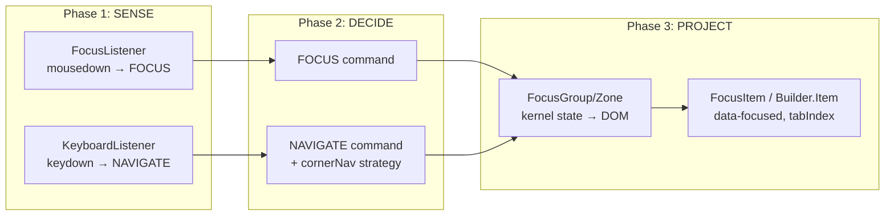

# 빌더 포커스/선택 기능 복원 분석

| 항목 | 내용 |
|------|------|
| 원문 | builder 키보드와 마우스로 포커스 이동이 있었는데 지금 사라졌어. 커널과 OS의 대대적인 리팩토링 덕분이지. 어떻게 하면 다시 빌더에 선택 기능을 붙일지 확인해서 분석 보고서를 작성해 |
| 내(AI)가 추정한 의도 | 리팩토링 후 끊어진 빌더 포커스 파이프라인의 정확한 단절 지점을 식별하고, 최소 작업으로 복원하는 방법을 찾고자 함 |
| 날짜 | 2026-02-12 |
| 상태 | 📥 Inbox |

---

## 1. 개요 (Overview)

Builder(비주얼 CMS 데모)는 원래 마우스 클릭과 Arrow 키로 블록/아이템 간 포커스 이동이 가능했다. 커널/OS 대규모 리팩토링(FocusData → ZoneRegistry/kernel 마이그레이션, Zone API 변경, FSD 구조 전환) 이후 이 기능이 사라졌다.

분석 결과, **파이프라인 컴포넌트들 자체는 모두 건재**하며, 단절 지점은 명확하다.

---

## 2. 분석 (Analysis)

### 2.1 포커스 파이프라인 아키텍처



### 2.2 현재 상태: 구성 요소별 점검

| 구성 요소 | 파일 | 상태 |
|-----------|------|------|
| `OS.Zone` (Facade → FocusGroup) | [Zone.tsx](file:///Users/user/Desktop/interactive-os/src/os-new/6-components/primitives/Zone.tsx) | ✅ 정상 작동 |
| `Builder.Section/Group/Item` | [Builder.tsx](file:///Users/user/Desktop/interactive-os/src/apps/builder/primitives/Builder.tsx) | ✅ 존재, `useFocusGroupContext()` 사용 |
| 블록 컴포넌트의 Builder 어노테이션 | [NCPHeroBlock.tsx](file:///Users/user/Desktop/interactive-os/src/pages/builder/NCPHeroBlock.tsx) 등 | ✅ 모든 블록이 `Builder.Section`/`Builder.Item` 사용 |
| `FocusListener` (mouse) | [FocusListener.tsx](file:///Users/user/Desktop/interactive-os/src/os-new/1-listeners/FocusListener.tsx) | ✅ `mousedown` → `FOCUS` + `SELECT` dispatch |
| `KeyboardListener` (keyboard) | [KeyboardListener.tsx](file:///Users/user/Desktop/interactive-os/src/os-new/1-listeners/KeyboardListener.tsx) | ✅ Arrow → `NAVIGATE` dispatch |
| `NAVIGATE` command (cornerNav) | [navigate/index.ts](file:///Users/user/Desktop/interactive-os/src/os-new/3-commands/navigate/index.ts) | ⚠️ `DOM_ITEMS`, `DOM_RECTS` 주입 필요 |
| `FocusDebugOverlay` | (삭제됨) | ❌ `a3c6bdf`에서 제거 |
| `PropertiesPanel` selection 연동 | [BuilderPage.tsx](file:///Users/user/Desktop/interactive-os/src/pages/BuilderPage.tsx) | ⚠️ kernel selection과 미연결, `useState`로 하드코딩 |

### 2.3 핵심 단절 지점

#### 🔴 단절 1: `DOM_ITEMS`와 `DOM_RECTS` Context Provider 누락

`NAVIGATE` 커맨드는 `[DOM_ITEMS, DOM_RECTS, ZONE_CONFIG]` 세 가지 context injection에 의존한다. 이 값들은 **Zone이 마운트될 때 해당 zone의 `[data-focus-item]` 요소들을 수집하여 주입**해야 한다.

```typescript
// navigate/index.ts 내부
export const NAVIGATE = kernel.defineCommand(
  "OS_NAVIGATE",
  [DOM_ITEMS, DOM_RECTS, ZONE_CONFIG],  // ← 이 3개가 반드시 제공되어야 함
  (ctx) => (payload) => {
    const items: string[] = ctx.inject(DOM_ITEMS);     // zone 내 [data-item-id] 목록
    const itemRects: Map<string, DOMRect> = ctx.inject(DOM_RECTS); // 각 아이템의 위치
    const config = ctx.inject(ZONE_CONFIG);  // navigate config
    // ...
  }
);
```

> [!CAUTION]
> 이것이 **가장 중요한 단절 지점**이다. context provider가 값을 제공하지 않으면, `NAVIGATE` 커맨드가 아무 동작도 하지 않는다.

#### 🟡 단절 2: `BuilderPage`의 선택 상태가 kernel과 분리됨

현재 `BuilderPage`에서 `selectedType`은 `useState<PropertyType>("text")`로 관리되고, 고정된 click zone(`<div onClick={() => setSelectedType("text")}>`)으로 변경된다. 이것은 kernel의 `selection` 상태와 완전히 분리되어 있다.

```tsx
// 현재: 하드코딩된 투명 클릭 영역
<div className="absolute top-32 left-10 w-1/2 h-32"
     onClick={() => setSelectedType("text")} />
```

이 구조는 Builder.Item이 제공하는 kernel 포커스/선택 흐름을 우회한다.

#### 🟡 단절 3: FocusDebugOverlay 제거

시각적 피드백(`data-focused` 기반 선택 박스 렌더링)이 제거되어 포커스 이동이 보이지 않는다. 하지만 이것은 CSS `data-*` 속성 스타일링으로 대체 가능하다.

### 2.4 Git 변경 내역

| 커밋 | 변경 내용 | 영향 |
|------|-----------|------|
| `a3c6bdf` | `os-new/core/` 삭제, FocusData → kernel/ZoneRegistry 마이그레이션 | FocusDebugOverlay 제거, Zone API 변경 |
| `e36bfbf` | Zone을 role 기반 config만 사용하도록 표준화 | 이전 `role="listbox"`, `tab="escape"`, `seamless` → 새 `options={}` API |
| `b0f51b5` | Phase 0 dead code 제거 | ~750 LOC 삭제 |
| `7925913` | store/lib 제거, consumer에 colocate | Builder 프리미티브 import 경로 변경 |

---

## 3. 결론 / 제안 (Proposal)

### 최소 복원 방안 (3단계)

#### Step 1: Context Provider 주입 확인/수정
`DOM_ITEMS`, `DOM_RECTS`, `ZONE_CONFIG` context가 Zone 마운트 시 올바르게 제공되는지 확인한다. 이 provider가 없으면 NAVIGATE가 작동하지 않는다.

- [2-contexts/index.ts](file:///Users/user/Desktop/interactive-os/src/os-new/2-contexts/index.ts)에서 provider 등록 확인
- FocusGroup 또는 OS.Root에서 이 값들을 zone별로 inject하는 로직 점검

#### Step 2: 투명 클릭 영역 제거 → Builder.Item 연동 복원
`BuilderPage.tsx`의 하드코딩된 클릭 영역을 제거하고, `selectedType`을 kernel의 `selection` 상태에서 파생시킨다.

```tsx
// Before: useState + 하드코딩 클릭 영역
const [selectedType, setSelectedType] = useState<PropertyType>("text");

// After: kernel focus state 구독
const focusedItemId = kernel.useComputed(
  (s) => s.os.focus.zones["builder-canvas"]?.focusedItemId
);
// focusedItemId에서 PropertyType을 파생 (Builder.Item의 data-level 참조)
```

#### Step 3: 선택 시각화 복원
CSS에서 `[data-focused="true"]`, `[data-selected="true"]` 속성을 사용하여 선택 하이라이트를 적용한다. 각 블록 컴포넌트에 이미 이런 스타일이 부분적으로 존재한다:

```css
/* NCPHeroBlock 내 Field에 이미 적용된 패턴 */
data-[focused=true]:bg-slate-100
data-[focused=true]:ring-2
data-[focused=true]:ring-slate-300
```

### E2E 테스트

기존 [builder-spatial.spec.ts](file:///Users/user/Desktop/interactive-os/e2e/builder/builder-spatial.spec.ts)에 10개의 spatial navigation 테스트가 이미 존재한다. 복원 후 이 테스트를 실행하여 검증할 수 있다.

---

## 4. 해법 유형 (Solution Landscape)

🟡 **Constrained** — 파이프라인 구조는 확정되어 있고, 단절 지점이 명확하다. 트레이드오프는 "context provider 주입 방식"과 "선택 상태 파생 로직"에서 발생하지만, 선택지가 좁다.

---

## 5. 인식 한계 (Epistemic Status)

- 이 분석은 **코드 정적 분석에 기반**하며, 실제 런타임에서 `DOM_ITEMS`/`DOM_RECTS` provider가 어떻게 동작하는지는 확인하지 못했다.
- `cornerNav` 알고리즘이 Builder의 복잡한 레이아웃(중첩된 그리드, 가변 높이 섹션)에서 정상 작동하는지는 E2E 테스트 실행이 필요하다.
- Builder 프리미티브의 `Slot` 패턴이 리팩토링 후에도 올바르게 props를 merge하는지 실제 마운트가 필요하다.

---

## 6. 열린 질문 (Open Questions)

1. **Context Provider 위치**: `DOM_ITEMS`/`DOM_RECTS`를 Zone(FocusGroup) 내부에서 자동 수집할 것인가, 아니면 별도 HOC/Provider로 외부에서 주입할 것인가?
2. **PropertiesPanel 연동 수준**: `selectedType`을 kernel selection에서 파생시킬 때, Builder.Item의 `data-level`을 기준으로 할 것인가, 아니면 별도 메타데이터 레지스트리를 둘 것인가?
3. **우선순위**: 이 복원 작업을 지금 진행할 것인가, 아니면 현재 진행 중인 커널 리팩토링이 안정화된 후에 진행할 것인가?

---

**한줄요약**: Builder 포커스는 파이프라인이 모두 건재하나, `NAVIGATE` 커맨드에 필요한 `DOM_ITEMS`/`DOM_RECTS` context 주입이 끊어져 작동하지 않으며, `BuilderPage`의 선택 상태가 kernel과 분리된 것이 핵심 문제다.
