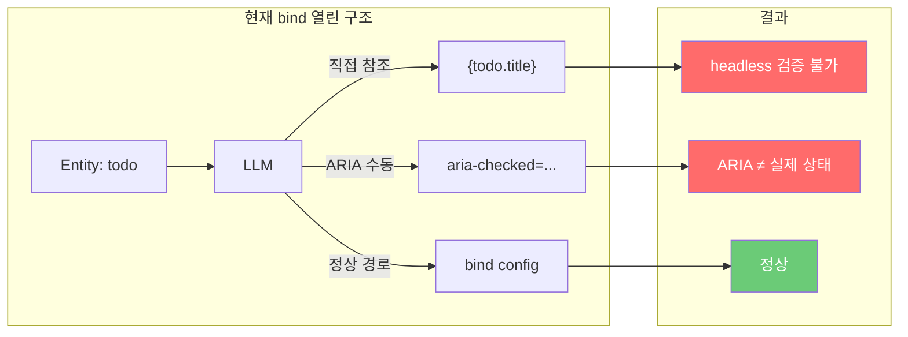
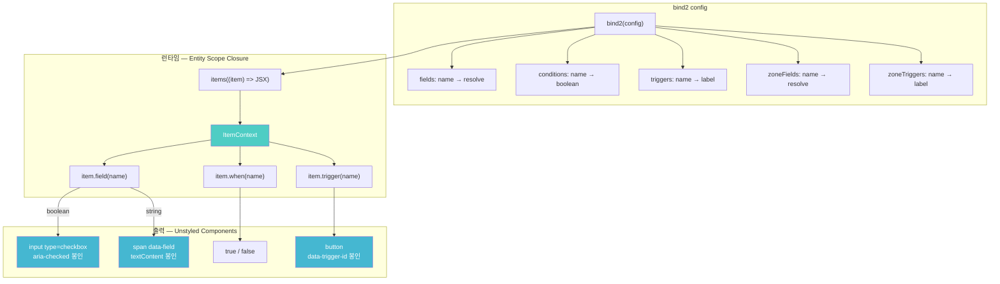
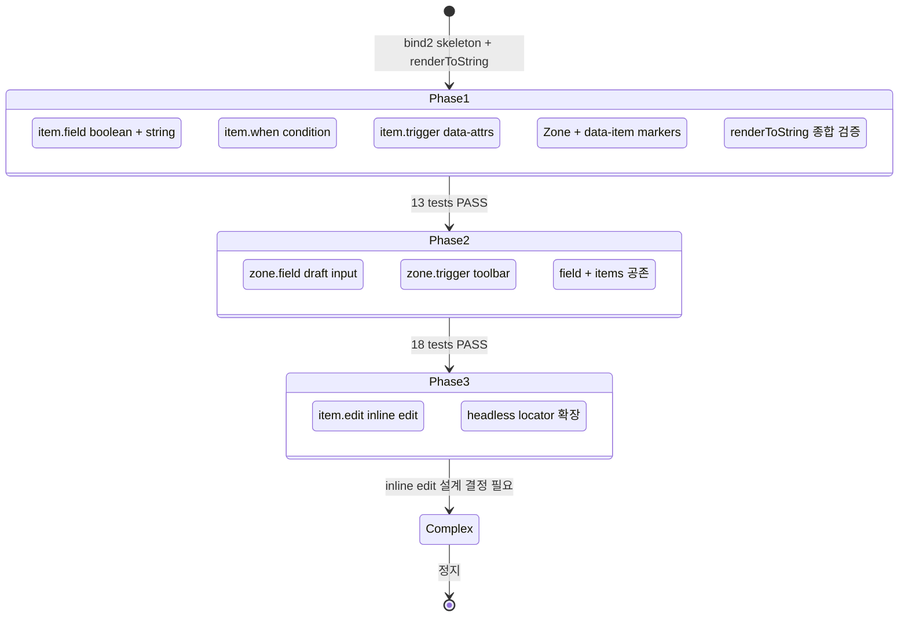
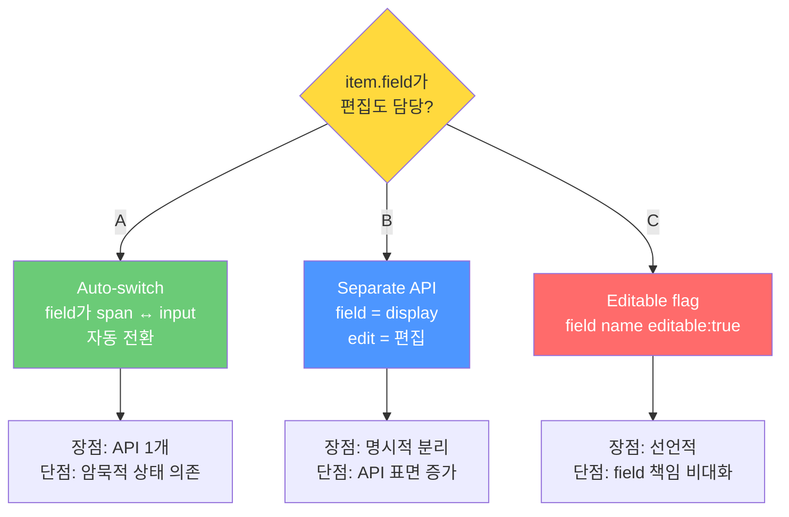

# bind2 Spike Discussion — Entity Scope Closure 설계 검증 중간 보고

> 작성일: 2026-03-12
> 맥락: bind2 spike Phase 1+2 완료(18 tests PASS), Phase 3(inline edit)에서 Complex 정지. 현재 설계 결정 대기 중.

---

## Why — 왜 bind()를 재설계하는가?

### LLM이 소비자인 프레임워크의 근본 문제

Interactive OS의 소비자는 LLM이다. 현재 `bind()` API는 entity 직접 참조(`{todo.title}`), ARIA 수동 동기화, 데이터 경로 이중화를 **허용**한다. LLM의 pre-trained habit과 공명하여 환각(hallucination)을 유발하는 구조다.

| 문제 | 원인 | 증거 |
|------|------|------|
| ARIA 환각 | LLM이 `aria-checked`를 직접 씀 → 상태 불일치 | bind()가 71회/41파일, 12+ 결정 지점 |
| Entity 직접 참조 | `{todo.title}` 경로가 열려있음 | OS가 데이터 흐름을 모름 |
| 데이터 이중화 | bind config의 resolve()와 JSX 직접 참조 공존 | headless에서 콘텐츠 검증 불가 |

### 4 불변 전제

이 전제가 깨지면 재설계의 근거도 사라진다:

| # | 전제 | 의미 |
|---|------|------|
| P1 | headless = E2E 100% 대체 | 브라우저 없이 모든 행동 검증 |
| P2 | headless에서 renderToString 사용 | HTML 문자열이 검증의 단일 소스 |
| P3 | React = 디자인 + 배치만 | 데이터·행동은 React 밖에서 해결 |
| P4 | 프레임워크 소비자 = LLM | API 최적화 대상이 인간이 아님 |

> **핵심 질문**: "올바르게 쓰기 쉬운 API"에서 **"틀리게 쓰기 어려운 API"**로 전환할 수 있는가?

---

## How — Entity Scope Closure + 3축 데이터 출구

### 메커니즘: 데이터 출구를 물리적으로 제한

`zone.items((item) => JSX)` 콜백 안에서 `item`이 유일한 데이터 접근 경로다. raw entity는 스코프에 존재하지 않는다.

| 축 | API | 반환 | LLM이 건드리는 것 |
|----|-----|------|-----------------|
| **Display** | `item.field(name)` | unstyled component | className, 배치 |
| **Condition** | `item.when(name)` | boolean | 조건부 스타일 |
| **Action** | `item.trigger(name)` | unstyled button | children, className |
| **Zone Display** | `zone.field(name)` | unstyled input | placeholder, className |
| **Zone Action** | `zone.trigger(name)` | unstyled button | children, className |

### Prior Art 비교

| 프레임워크 | 접근 | bind2와의 차이 |
|-----------|------|---------------|
| AG Grid | god-object props | 너무 많은 데이터 출구 |
| Radix/Ark UI | data-* 자동 주입 | ARIA는 자동, 콘텐츠는 개발자 책임 |
| React Aria | render props + 상호작용 상태 | 가장 유사하나 entity 접근 미차단 |
| **SwiftUI** | **Compiler-enforced binding** | **가장 가까움**. bind2는 런타임에서 동일 효과 |

bind2의 고유점: **Entity Scope Closure로 데이터 출구를 물리적으로 차단**. 다른 프레임워크는 "올바르게 쓰기 쉽게", bind2는 "틀리게 쓰기 어렵게".

---

## What — Spike 실행 결과

### Phase 구조와 진행 상태

### 정량 결과

| 지표 | 값 |
|------|-----|
| 커밋 | 2개 (`4061ff8c`, `6827b82e`) |
| 테스트 | 18개 ALL PASS |
| 소스 | 3파일 346행 (bind2.tsx 246, TodoListV2.tsx 65, state.ts 35) |
| 테스트 | 1파일 256행 |
| 기존 코드 수정 | **0행** (Spike 격리 원칙 준수) |

### Usage 시나리오 검증 (문서 33)

spike 코드와 별도로, usage 문서에서 10개 패턴의 이상적 API를 설계했다:

| # | 패턴 | 핵심 API | 상태 |
|---|------|---------|------|
| 1 | 기본 리스트 | `item.field` + `item.trigger` | spike 검증 완료 |
| 2 | 인라인 편집 | `item.edit("text")` | **Complex — 미결** |
| 3 | 사이드바 | `item.field("count")` 파생 데이터 | 설계 완료 |
| 4 | 툴바 | `zone.trigger()` | spike 검증 완료 |
| 5 | Draft 입력 | `zone.field("DRAFT")` | spike 검증 완료 |
| 6 | 검색 | `zone.field` + `trigger: "change"` | 설계 완료 |
| 7 | 삭제 Dialog | `dialog.dismiss()` + `dialog.confirm()` | 설계 완료 |
| 8 | Bulk Actions | `selection.trigger()` | 설계 완료 |
| 9 | Board View | 같은 Zone, 다른 배치 | 설계 완료 |
| 10 | 드래그 | `item.dragHandle()` + `item.dropIndicator()` | 설계 완료 |

### renderToString이 핵심인 이유

모든 테스트가 `renderToString(<Component />)` → HTML 문자열 검사로 동작한다:
- ARIA = HTML 속성 → `aria-checked="true"` 문자열 존재
- 콘텐츠 = textContent → `"Buy milk"` 문자열 존재
- Trigger = data-attr → `data-trigger-id="Delete"` 문자열 존재

bind2가 생성하는 HTML에 **검증에 필요한 모든 정보**가 포함. DOM 불필요.

---

## If — Phase 3 Complex 결정과 향후 방향

### Complex 정지 지점: inline edit

`item.field("text")`가 display만 담당하는 현재 구조에서, 편집 모드 전환 API가 결정되지 않았다.

| Option | 핵심 | Usage 문서의 선택 |
|--------|------|-----------------|
| A: Auto-switch | `field("text")` 하나로 모두 | — |
| **B: Separate edit()** | `field()` = display, `edit()` = 편집 | **Usage 2에서 `item.edit("text")`로 채택** |
| C: Editable flag | `field("text", {editable: true})` | — |

Usage 문서(33)는 Option B(`item.edit()`)를 이상적 API로 설계했다. 그러나 spike 코드에서의 검증은 아직 없다.

### Unresolved 5건

| # | 질문 | 상태 |
|---|------|------|
| 1 | 타입→프리미티브 매핑 | 부분 해소 (boolean→checkbox, string→span) |
| 2 | zone.field vs zone.items 경계 | 부분 해소 (공존 증명, combobox 미검증) |
| 3 | item.when의 파생 데이터 범위 | 미해소 |
| 4 | render props → zone.items 마이그레이션 경로 | 미해소 |
| 5 | headless locator textContent API | 미해소 |

### Spike → Production 전환 판단 기준

| 기준 | 현재 | 필요 |
|------|------|------|
| Usage scenarios | 10개 설계, 3개 spike 검증 | 10개 spike 검증 |
| headless 연동 | renderToString 증명 | 기존 page API 통합 |
| 마이그레이션 비용 | 미평가 | 25+ showcase 전환 비용 분석 |
| 디자인 자유도 | className/children 열림 | 실제 앱 적용 검증 |

---

## 부록: 코드 위치

| 파일 | 역할 |
|------|------|
| `src/spike/pit-of-success/bind2.tsx` | 핵심 구현 (246행) |
| `src/spike/pit-of-success/TodoListV2.tsx` | 데모 컴포넌트 (65행) |
| `src/spike/pit-of-success/state.ts` | 테스트용 상태 (35행) |
| `tests/spike/pit-of-success/pit-of-success.test.tsx` | 18 tests (256행) |
| `docs/1-project/os/projection/pit-of-success/BOARD.md` | 프로젝트 보드 |
| `docs/.../discussions/33-[usage]projection-next-api.md` | 10개 usage 시나리오 |
| `docs/.../sdk-role-factory/discussions/bind-pit-of-success.md` | bind() 문제 분석 원본 |
