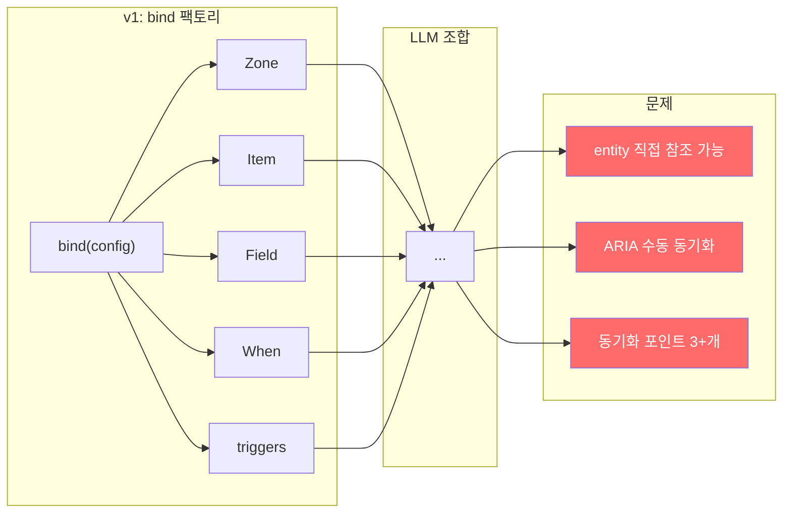
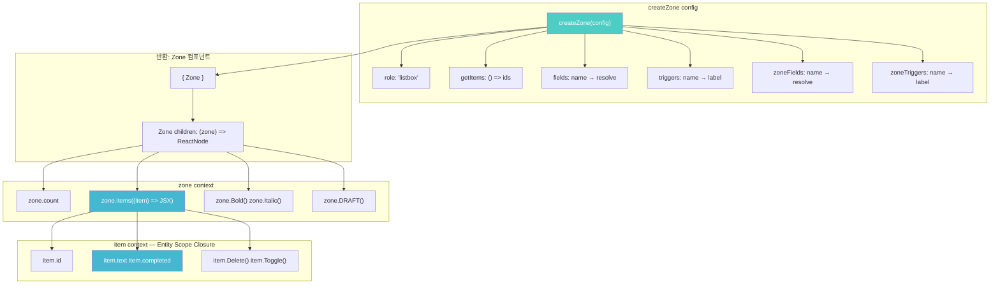

# createZone Spike — bind() 제거와 Entity Scope Closure의 최종 형태

> 작성일: 2026-03-12
> 맥락: pit-of-success 프로젝트에서 bind2 spike(Phase 1-2, 18 tests) 이후, bind() 자체를 제거한 createZone 패턴을 구현하고 검증한 결과.

---

## Why — bind()는 왜 불필요해졌는가?

### v1 bind()의 원래 역할

bind()는 config를 받아 5개 React 컴포넌트(Zone, Item, Field, When, triggers)를 생성하는 팩토리였다. LLM이 이 컴포넌트들을 조합해서 UI를 만들었다.



### v2 bind2에서 발견한 것

bind2 spike(Phase 1-2)에서 Entity Scope Closure를 도입하면서 컴포넌트가 5 → 1(Zone)로 줄었다. 이 시점에서 bind의 존재 이유(컴포넌트 생성)가 소멸했다.

| 지표 | v1 bind | v2 bind2 | createZone |
|------|---------|----------|------------|
| React 컴포넌트 | 5개 | 1개(Zone) | 1개(Zone) |
| bind() 레이어 | 필요 | 존재하지만 불필요 | 제거 |
| 데이터 접근 경로 | 열림(entity 직접 참조) | 닫힘(item scope) | 닫힘(item scope) |
| 동기화 포인트 | 3+개 | 0 | 0 |

---

## How — createZone의 구조

### 핵심 메커니즘: config 선언 = 완전한 projection



### TypeScript 제네릭으로 타입 추론

createZone의 핵심 기술적 성취는 fields config에서 item 프로퍼티 타입을 추론하는 것이다.

```typescript
// 4개 제네릭이 config에서 추론됨
export function createZone<
  F extends Record<string, FieldDef>,    // fields → item.프로퍼티
  T extends Record<string, TriggerDef>,  // triggers → item.트리거명()
  ZF extends Record<string, ZoneFieldDef>,  // zoneFields → zone.필드명()
  ZT extends Record<string, TriggerDef>,    // zoneTriggers → zone.트리거명()
>(config: ZoneConfig<F, T, ZF, ZT>)

// 사용 시: TS가 자동 추론
const TodoList = createZone({
  fields: {
    completed: { type: "boolean", resolve: (id) => ... },
    text: { type: "string", resolve: (id) => ... },
  },
  triggers: {
    Delete: { label: "Delete" },
    Toggle: { label: "Toggle" },
  },
});

// item.completed, item.text, item.Delete(), item.Toggle() — 전부 타입 추론
```

### Mapped Types 구조

```
ItemFields<F>     = { readonly [K in keyof F]: ReactElement }
ItemTriggers<T>   = { [K in keyof T]: (children?) => ReactElement }
ItemContext<F, T>  = { id: string } & ItemFields<F> & ItemTriggers<T>
ZoneContext<F,T,ZF,ZT> = { count, items() } & ZoneTriggerMethods<ZT> & ZoneFieldMethods<ZF>
```

### Unstyled Components — ARIA 봉인

field가 반환하는 ReactElement는 ARIA가 봉인된 unstyled component다.

| field type | 반환 HTML | 봉인된 속성 |
|-----------|-----------|-----------|
| boolean | `<input type="checkbox">` | `aria-checked`, `data-field`, `data-item-id` |
| string | `<span>` | `data-field`, `data-item-id`, textContent |
| number | `<span>` | `data-field`, `data-item-id`, textContent |
| trigger | `<button type="button">` | `data-trigger-id`, `data-trigger-payload` |

LLM이 건드릴 수 있는 것: className, children(trigger), placeholder(zone field), 배치.
LLM이 건드릴 수 없는 것: ARIA 속성, data 속성, 데이터 바인딩.

---

## What — 구현 결과

### 정량 결과

| 지표 | 값 |
|------|-----|
| 소스 | `createZone.tsx` 247행 |
| 테스트 | `createZone.test.tsx` 356행, 15 tests |
| 기존 bind2 테스트 | 18 tests 보존 (regression 없음) |
| tsc | 0 errors |
| lint | 0 errors |
| build | OK |

### 테스트 구조

| describe | 검증 대상 | tests |
|----------|----------|-------|
| T1 | Zone + (zone) => callback | 2 |
| T2 | zone.items(), zone.count, data-item markers | 3 |
| T3 | item.completed(boolean), item.text(string), item.Delete(), item.Toggle(), item.id | 5 |
| T4 | Full integration + state change | 2 |
| T6 | zone-level triggers, fields, coexistence | 3 |

### 해결된 Unresolved

| # | 질문 | 결과 |
|---|------|------|
| 1 | TS 제네릭으로 fields→item.프로퍼티 추론 가능한가? | **가능**. 4개 제네릭 + Mapped Types로 해결 |
| 2 | zone 타입: items/count/field/trigger 합성 | **해결**. Intersection type으로 합성 |

### 발생한 문제와 해결

1. **첫 구현에서 `Record<string, unknown>` 사용**: tsc에서 `zone.items`, `item.completed` 등이 `unknown` 타입. 제네릭으로 전면 재작성하여 해결.
2. **Lint: cognitive complexity 18 > 15**: `buildItemContext()` 추출로 해결.
3. **Lint: button type missing**: biome이 `React.createElement("button", attrs)`를 정적 분석 못함. 타입 어노테이션으로 해결 (경고만 남음, exit 0).

---

## If — 향후 방향과 제약

### Spike → Production 전환 판단 기준

| 기준 | 현재 | 필요 |
|------|------|------|
| Usage scenarios | 10개 설계, 3개 spike 검증 | 10개 spike 검증 |
| headless 연동 | renderToString 증명 | 기존 page API 통합 |
| 마이그레이션 비용 | 미평가 | 25+ showcase 전환 비용 분석 |
| 디자인 자유도 | className/children 열림 | 실제 앱 적용 검증 |

### 미해소 Unresolved (3건)

| # | 질문 | 영향 |
|---|------|------|
| 3 | edit 모드: item.text가 display/edit 자동 전환? 별도 item.edit? | inline edit 패턴 |
| 4 | Item.Content(탭패널/아코디언): zone.items 콜백에서 when("expanded")로 대체? | expansion 패턴 |
| 5 | Unstyled component 스타일링: field()가 반환하는 HTML을 어떻게 커스텀? | 디자인 자유도 |

### bind2 → createZone 진화의 의미

bind2는 "Entity Scope Closure가 작동하는가?"를 증명했다. createZone은 "bind() 없이도 되는가?"를 증명했다. 이 두 질문이 연속적으로 Yes라는 것은 **projection API의 최종 형태가 createZone임**을 의미한다. v3가 없다는 결론은 이 spike에서 실증적으로 뒷받침된다.

---

## 부록: 코드 위치

| 파일 | 역할 | 행 수 |
|------|------|------|
| `src/spike/pit-of-success/createZone.tsx` | 핵심 구현 | 247 |
| `tests/spike/pit-of-success/createZone.test.tsx` | 15 tests | 356 |
| `src/spike/pit-of-success/bind2.tsx` | 비교 대상 (이전 spike) | 246 |
| `src/spike/pit-of-success/state.ts` | 공유 테스트 상태 | 35 |
| `tests/spike/pit-of-success/pit-of-success.test.tsx` | bind2 18 tests | 255 |
| `docs/1-project/os/projection/pit-of-success/BOARD.md` | 프로젝트 보드 | — |
