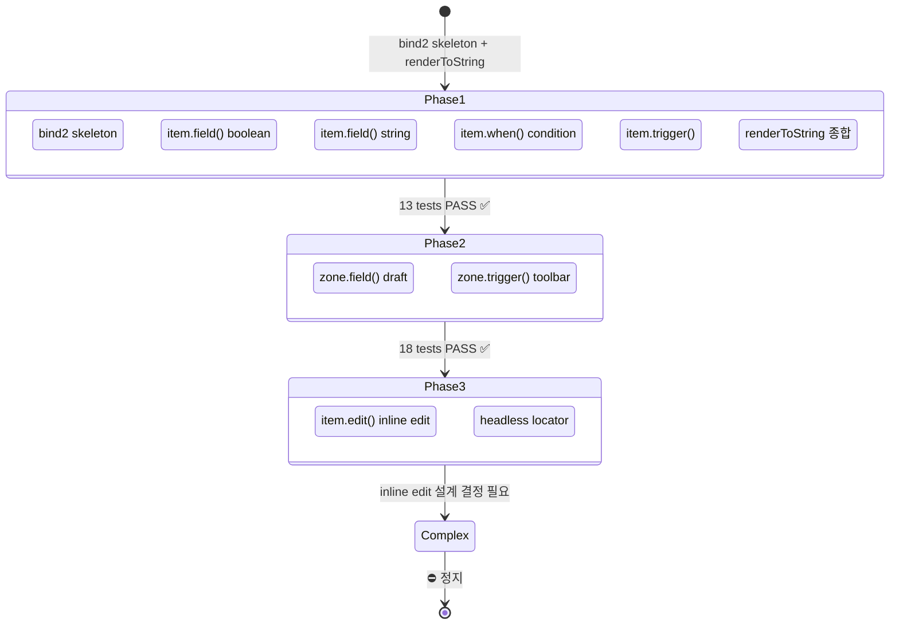
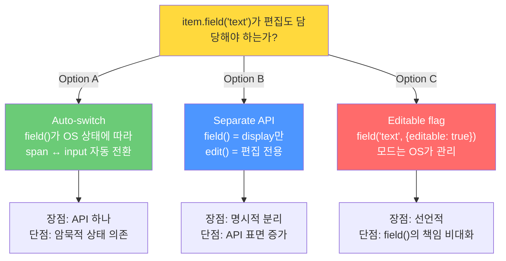

# Projection Pit of Success — LLM이 ARIA를 틀릴 수 없는 투영 구조

> 작성일: 2026-03-12
> 맥락: bind2 Spike Phase 1+2 완료, Phase 3(inline edit) Complex에서 정지. 설계 검증 중간 보고.

---

## Why — 왜 Projection을 재설계하는가?

### 문제의 핵심

Interactive OS의 소비자는 **LLM**이다. LLM은 pre-trained habit이 있어 `{todo.title}` 같은 직접 참조, `aria-checked`를 빠뜨리는 실수, 데이터 경로 이중화를 반복한다. 현재 `bind()` API는 이것을 **허용**한다 — LLM이 올바르게 쓰기도 쉽지만, 틀리게 쓰기도 쉽다.

```mermaid
flowchart LR
    subgraph "현재 bind() — 열린 구조"
        E[Entity: todo] --> LLM
        LLM -->|"직접 참조 {todo.title}"| JSX1["<span>{todo.title}</span>"]
        LLM -->|"ARIA 수동"| JSX2["<input aria-checked=.../>"]
        LLM -->|"정상 경로"| JSX3["bind config 사용"]
    end

    subgraph "문제"
        JSX1 -->|"ARIA 누락"| F1["headless 검증 불가"]
        JSX2 -->|"동기화 실패"| F2["aria-checked ≠ 실제 상태"]
    end

    style F1 fill:#ff6b6b,color:#fff
    style F2 fill:#ff6b6b,color:#fff
```



| 문제 | 현재 구조에서 발생하는 이유 |
|------|-------------------------|
| ARIA 환각 | LLM이 `aria-checked`를 직접 쓰므로, 상태와 불일치 가능 |
| Entity 직접 참조 | `{todo.title}` 경로가 열려있어 OS가 데이터를 모름 |
| 데이터 이중화 | bind config의 resolve()와 JSX의 직접 참조가 공존 |
| headless 검증 불가 | entity가 OS를 경유하지 않으면 renderToString에 콘텐츠 없음 |

### 4 불변 전제

이 재설계의 근거가 되는 전제:

| # | 전제 | 의미 |
|---|------|------|
| P1 | headless = E2E 100% 대체 | 브라우저 없이 모든 행동 검증 |
| P2 | headless에서 renderToString 사용 | HTML 문자열이 검증의 단일 소스 |
| P3 | React = 디자인 + 배치만 | 데이터·행동은 React 밖에서 해결 |
| P4 | 프레임워크 소비자 = LLM | API 설계의 최적화 대상이 인간이 아님 |

---

## How — Entity Scope Closure + Unstyled Component

### 핵심 메커니즘: 데이터 출구를 3개로 제한

```mermaid
flowchart TD
    subgraph "bind2 — 닫힌 구조"
        B2["bind2(config)"] --> Zone
        B2 --> Items["items((item) => JSX)"]
        B2 --> ZF["field(name) — zone-level"]
        B2 --> ZT["trigger(name) — zone-level"]

        Items --> IC["ItemContext"]
        IC --> F["item.field(name)"]
        IC --> W["item.when(name)"]
        IC --> T["item.trigger(name)"]
    end

    subgraph "출력 — Unstyled Components"
        F -->|"boolean"| CB["<input type=checkbox aria-checked=... />"]
        F -->|"string"| SP["<span data-field=name>value</span>"]
        W -->|"boolean"| BOOL["true / false"]
        T --> BTN["<button data-trigger-id=... />"]
        ZF --> INP["<input type=text data-zone-field=... />"]
        ZT --> ZBTN["<button data-trigger-id=... />"]
    end

    style IC fill:#4ecdc4,color:#fff
    style F fill:#45b7d1,color:#fff
    style W fill:#45b7d1,color:#fff
    style T fill:#45b7d1,color:#fff
```



| 축 | API | 반환 | 역할 |
|----|-----|------|------|
| **보이는 것** | `item.field(name)` | unstyled component | 데이터 + ARIA 봉인 |
| **조건** | `item.when(name)` | boolean | 조건부 스타일/렌더링 |
| **행동** | `item.trigger(name)` | unstyled button | 사용자 액션 발동 |

### Entity Scope Closure — 잠금 메커니즘

`zone.items((item) => JSX)` 콜백 안에서 `item`이 **유일한 데이터 접근 경로**다. raw entity(`todo`, `todo.title`)는 스코프에 존재하지 않는다.

```typescript
// ✅ 올바른 사용 — entity 접근 불가, item만 사용
const { Zone, items } = bind2(config);
<Zone>
  {items((item) => (
    <div>
      {item.field("completed")}  {/* → <input type="checkbox" aria-checked="true" /> */}
      {item.field("text")}        {/* → <span data-field="text">Buy milk</span> */}
      {item.trigger("Delete")}    {/* → <button data-trigger-id="Delete"> */}
    </div>
  ))}
</Zone>

// ❌ 불가능 — todo는 스코프에 없음
{items((item) => <span>{todo.title}</span>)}  // ReferenceError
```

이 구조에서 LLM이 ARIA를 틀리려면 `bind2` 자체를 수정해야 한다. bind2 config의 `resolve()`가 ARIA를 자동 생성하므로, LLM은 배치와 디자인만 담당한다.

### Zone-Level API — Item 없는 Zone도 지원

Phase 2에서 추가된 zone-level API:

| API | 용도 | 예시 |
|-----|------|------|
| `zone.field(name)` | Zone 전체의 입력 필드 | draft input, 검색창 |
| `zone.trigger(name)` | Zone 전체의 액션 버튼 | toolbar 버튼 (Bold, Italic) |

```typescript
// Toolbar — Item 없이 zone.trigger만 사용
const { Zone, trigger } = bind2({
  role: "toolbar",
  zoneTriggers: { Bold: { label: "Bold" }, Italic: { label: "Italic" } },
});

<Zone>
  {trigger("Bold", "B")}    {/* → <button data-trigger-id="Bold">B</button> */}
  {trigger("Italic", "I")}  {/* → <button data-trigger-id="Italic">I</button> */}
</Zone>
```

---

## What — Spike 실행 결과

### Phase 구조와 진행 상태



### 정량 결과

| 지표 | 값 |
|------|-----|
| 커밋 | 2개 (`4061ff8c`, `6827b82e`) |
| 테스트 | 18개 ALL PASS |
| 소스 파일 | 3개 (bind2.tsx 246행, TodoListV2.tsx 65행, state.ts 35행) |
| 테스트 파일 | 1개 (pit-of-success.test.tsx 256행) |
| 기존 코드 수정 | 0행 (Spike 격리 원칙 준수) |

### 파일 구조

```
src/spike/pit-of-success/
  bind2.tsx         ← 핵심 구현 (246행)
  TodoListV2.tsx    ← 데모 컴포넌트 (65행)
  state.ts          ← 테스트용 가변 상태 (35행)

tests/spike/pit-of-success/
  pit-of-success.test.tsx  ← 18 tests (256행)
```

### 테스트 커버리지 상세

**Phase 1 (13 tests) — Item Context API 검증**:

| # | 검증 대상 | 방법 |
|---|----------|------|
| P1 | `item.field("completed")` ARIA | `aria-checked="false"`, `aria-checked="true"` |
| P2 | `item.field("text")` 콘텐츠 | `"Buy milk"`, `"Write tests"` textContent |
| P3 | `item.when("isCompleted")` 조건 | `line-through` style |
| P4 | `item.trigger("Delete")` 속성 | `data-trigger-id`, `data-trigger-payload` |
| P5 | Zone 구조 | `role="listbox"`, `data-item`, `id` |
| P6 | renderToString 종합 | 단일 HTML에서 모든 항목 검증 |
| P7 | 상태 변경 반영 | `resetState()` 후 재렌더링 |

**Phase 2 (5 tests) — Zone-Level API 검증**:

| # | 검증 대상 | 방법 |
|---|----------|------|
| Z1 | `zone.field("draft")` placeholder | `data-zone-field`, `placeholder` |
| Z2 | `zone.field("draft")` 값 반영 | `value="Buy groceries"` |
| Z3 | zone.field + items 공존 | 같은 Zone에서 둘 다 렌더링 |
| Z4 | `zone.trigger()` toolbar | `data-trigger-id="Bold"` 등 |
| Z5 | zone trigger에 payload 없음 | `not.toContain("data-trigger-payload")` |

### renderToString이 핵심인 이유

모든 테스트는 `renderToString(<Component />)` → HTML 문자열 검사로 동작한다. 이것이 가능한 이유:

1. **ARIA는 HTML 속성**이다 → `aria-checked="true"`가 문자열에 존재
2. **콘텐츠는 textContent**이다 → `"Buy milk"`이 문자열에 존재
3. **Trigger는 data-attr**이다 → `data-trigger-id="Delete"`이 문자열에 존재

즉, bind2가 생성하는 HTML에는 **검증에 필요한 모든 정보**가 포함되어 있다. DOM이 불필요하다.

### Unresolved 해소 현황

| # | 질문 | 상태 | Spike에서 드러난 것 |
|---|------|------|-------------------|
| 1 | 타입→프리미티브 매핑 | 부분 해소 | boolean→checkbox, string→span, number→span. Zone string→text input |
| 2 | zone.field vs zone.items 경계 | 부분 해소 | 공존 가능 (테스트 증명). combobox는 미검증 |
| 3 | item.when의 파생 데이터 범위 | 미해소 | item-level condition은 동작. index/prev 접근은 미검증 |
| 4 | render props → zone.items 마이그레이션 | 미해소 | 설계 검증 단계이므로 미착수 |
| 5 | headless locator textContent API | 미해소 | T10에 해당, Phase 3에서 예정 |

---

## If — 다음 단계와 설계 결정 지점

### Complex 정지 지점: inline edit

Phase 3의 첫 태스크 T8(inline edit)에서 Complex가 발견되어 정지했다. `item.field("text")`가 **표시(display)**만 담당하는 현재 구조에서, **편집(edit)** 모드로 전환할 때 어떤 API가 적절한가?



| Option | 핵심 | 트레이드오프 |
|--------|------|-------------|
| **A: Auto-switch** | `item.field("text")` 하나로 display/edit 모두 | OS 상태에 따른 암묵적 전환. LLM이 모드 전환 시점을 이해 못할 수 있음 |
| **B: Separate edit()** | `item.field()` = display, `item.edit()` = edit | 명시적이지만 API 표면 증가. `item.when("isEditing")`으로 조건부 렌더링 |
| **C: Editable flag** | `item.field("text", { editable: true })` | 선언적이지만 field()가 너무 많은 일을 함 |

이 결정이 내려져야 Phase 3을 진행할 수 있다.

### Spike → Production 전환 판단 기준

Spike가 모든 Phase를 완료하면, 기존 `bind()` API 교체 여부를 판단해야 한다:

| 기준 | 충족 조건 |
|------|----------|
| 10 usage scenarios | draft, edit, sidebar, toolbar, dialog 등 10개 패턴이 bind2로 표현 가능 |
| headless 연동 | renderToString 기반 검증이 기존 headless page와 통합 가능 |
| 마이그레이션 비용 | 25+ showcase 앱의 전환 비용 대비 이익 평가 |
| 디자인 자유도 | unstyled component가 실제 앱에서 충분한 유연성 제공 |

### 현재 코드 위치 참조

| 파일 | 역할 |
|------|------|
| `src/spike/pit-of-success/bind2.tsx` | 핵심 구현 (246행) |
| `src/spike/pit-of-success/TodoListV2.tsx` | 데모 컴포넌트 |
| `src/spike/pit-of-success/state.ts` | 테스트용 상태 |
| `tests/spike/pit-of-success/pit-of-success.test.tsx` | 18 tests |
| `docs/1-project/os/projection/pit-of-success/BOARD.md` | 프로젝트 보드 |

---

## 부록: Prior Art 비교

| 프레임워크 | 접근 | 차이 |
|-----------|------|------|
| AG Grid | `data` + `node` + `api` god-object props | 너무 많은 출구. LLM 환각 유발 |
| Radix/Ark UI | `data-*` attr 자동 주입 | ARIA는 자동이지만 콘텐츠는 여전히 개발자 책임 |
| React Aria Components | render props로 상호작용 상태 전달 | 가장 유사하나, entity 접근을 차단하지 않음 |
| **SwiftUI** | **Compiler-enforced binding** | **가장 가까움**. bind2는 runtime에서 같은 효과 |
| Redux | child가 store에서 자체 resolve | LLM이 selector를 환각하는 anti-pattern |

bind2의 고유한 점: **Entity Scope Closure로 데이터 출구를 물리적으로 차단**한다. 다른 프레임워크들은 "올바르게 쓰기 쉽게" 하지만, bind2는 "틀리게 쓰기 어렵게" 한다. 이것이 Pit of Success의 본질이다.
