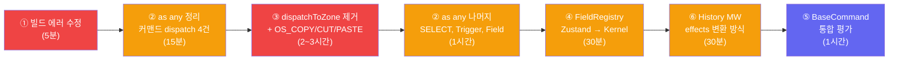

# 레거시 부채 정리 제안서

> **작성일**: 2026-02-12  
> **현재 빌드 상태**: TS 에러 2건 (`__root.tsx` — index signature 접근 방식)

---

## 1. 개요

Phase 1~3을 통해 `core/command/` 폴더, `CommandEngineStore`, `createEngine` 등 핵심 레거시가 제거되었다.

이 제안서는 **현재 코드베이스에 남아있는 실제 레거시 부채**를 스캔하고, 우선순위별로 정리 작업을 제안한다.

### 현재 부채 요약

| 카테고리 | 건수 | 위험도 | 예상 공수 |
|---|---|---|---|
| ① TS 빌드 에러 | 2건 | 🔴 즉시 | 5분 |
| ② `as any` 캐스트 | 21건 | 🟡 중간 | 1~2시간 |
| ③ `dispatchToZone` 계층 위반 | 10건 참조 | 🔴 구조적 | 2~3시간 |
| ④ `FieldRegistry` Zustand | 1파일 | 🟡 중간 | 30분 |
| ⑤ `BaseCommand` / `AnyCommand` 이중 체계 | 전역 | 🟡 설계 | 1시간 |
| ⑥ History MW 안전성 | 1파일 | 🟡 잠재 | 30분 |

**총 추정**: ~5~7시간 (점진적 실행 가능)

---

## 2. 상세 분석

### ① TS 빌드 에러 (2건) — 즉시 해결

```
src/routes/__root.tsx:38 — TS2532: Object is possibly 'undefined'
src/routes/__root.tsx:39 — TS4111: Property 'isAppShell' must be accessed with ['isAppShell']
```

**수정**: optional chaining + bracket notation으로 해결.

```diff
-const sd = matches[i].staticData as Record<string, unknown> | undefined;
-if (sd?.isAppShell) return true;
+const sd = matches[i]?.staticData as Record<string, unknown> | undefined;
+if (sd?.['isAppShell']) return true;
```

---

### ② `as any` 캐스트 정리 (21건)

| 분류 | 파일 | 건수 | 해결 방향 |
|---|---|---|---|
| **커맨드 dispatch** | `activate.ts`, `select.ts`, `navigate/index.ts` | 4 | `AnyCommand` 도입으로 캐스트 제거 가능 (이미 타입 변경됨) |
| **SELECT 커맨드** | `FocusListener.tsx` | 3 | `SELECT` 커맨드 팩토리의 payload 타입 명시 |
| **dispatchToZone** | `dispatchToZone.ts` | 1 | ③에서 파일 자체 제거로 해결 |
| **Ref 처리** | `FocusItem.tsx` | 2 | React 19 ref callback 패턴으로 교체 |
| **Trigger** | `Trigger.tsx` | 6 | `BaseCommand → AnyCommand` 전환 + props 타입 강화 |
| **Field** | `Field.tsx` | 3 | ref union 타입 + rest spread 타입 정리 |
| **Dialog** | `Dialog.tsx` | 1 | `child.type` 비교 → displayName 패턴 |
| **Rule** | `Rule.ts` | 1 | 제네릭 constraint 추가 |

> [!TIP]
> 커맨드 dispatch 관련 4건은 `TypedEffectMap.dispatch`가 이미 `AnyCommand`로 변경되었으므로, **캐스트를 단순 삭제**하면 된다.

---

### ③ `dispatchToZone` 제거 — 구조적 리팩토링

**현재**: `ClipboardListener`와 `TodoBot`이 `dispatchToZone`으로 ZoneRegistry를 직접 탐색해 앱 커맨드를 꺼내 dispatch.

**문제**:
- `(entry as any)[propName]` — 타입 안전성 깨짐
- 커널 바깥에서 커맨드 라우팅 수행 (계층 위반)

**제안**: Effect 기반 시스템 콜 모델로 전환 (이미 상세 설계 완료: [Effect_Syscall_Model.md](file:///Users/user/Desktop/interactive-os/docs/0-inbox/2026-02-12_0200_Effect_Syscall_Model.md))

| 변경 대상 | Before | After |
|---|---|---|
| `ClipboardListener.tsx` | `dispatchToZone("copyCommand")` | `kernel.dispatch(OS_COPY())` |
| `dispatchToZone.ts` | 존재 | **삭제** |
| `TodoBot.tsx` | `dispatchToZone("copyCommand")` | `kernel.dispatch(OS_COPY())` |
| OS commands (신규) | — | `OS_COPY`, `OS_CUT`, `OS_PASTE` 커맨드 정의 |

---

### ④ `FieldRegistry` Zustand → Kernel State

**현재**: `FieldRegistry.ts`가 Zustand `create()`로 독립 스토어 운영.

```typescript
// src/os-new/6-components/primitives/FieldRegistry.ts:1
import { create } from "zustand";
```

**제안**: `kernel.defineContext`로 전환하여 OS 코어에서 Zustand 의존성 완전 제거.

> [!NOTE]
> Inspector의 5개 Zustand 스토어는 OS 코어와 무관한 DevTool이므로 이 단계에서는 대상 외.

---

### ⑤ `BaseCommand` / `AnyCommand` 통합 검토

**현재 이중 체계**:

| 타입 | 위치 | 브랜드 | 용도 |
|---|---|---|---|
| `BaseCommand` | `src/os-new/schema/` | ❌ | Zone props 외부 API |
| `AnyCommand` | `@kernel` | ✅ | 커널 내부 저장/전달 |

**제안**: `Trigger.tsx`의 `BaseCommand → AnyCommand` 전환 가능여부 평가.
- Zone/Component 계층이 이미 `@kernel` import를 사용하고 있다면 → `BaseCommand` 제거 가능
- 독립 패키지로 분리 계획이 있다면 → `BaseCommand` 유지

---

### ⑥ History MW `after` State 변경 안전성

**현재 위험**: `after`에서 `ctx.state`를 변경해도 `executeEffects`가 handler의 원래 `effects.state`로 덮어쓸 수 있음 (이미 분석 완료: [History_MW_Safety.md](file:///Users/user/Desktop/interactive-os/docs/0-inbox/2026-02-11_1714_Gap5_History_MW_Safety.md))

**제안**: `ctx.state` 대신 `ctx.effects.state`를 변환하는 방식으로 수정.

```diff
-return { ...ctx, state: { ...ctx.state, apps: { [appId]: withHistory } } };
+return { ...ctx, effects: { ...ctx.effects, state: withHistory } };
```

---

## 3. 실행 순서 제안



| Phase | 작업 | 리스크 | 검증 |
|---|---|---|---|
| **Phase A** (즉시) | ①② 빌드 에러 + 커맨드 `as any` | 낮음 | `tsc -b` 클린 빌드 |
| **Phase B** (핵심) | ③ dispatchToZone → Effect 시스템 콜 | 중간 | Clipboard E2E + TodoBot |
| **Phase C** (정리) | ②나머지 + ④⑤⑥ | 낮음 | `tsc -b` + E2E 전체 |

---

## 4. 결론

> **Phase A**부터 시작하면 빌드를 즉시 클린 상태로 만들 수 있고, `as any` 4건을 무비용으로 제거할 수 있다.

> **Phase B**가 이 제안서의 핵심이다. `dispatchToZone` 제거는 단순 코드 삭제가 아니라 OS의 I/O 모델을 **Effect 기반 시스템 콜**로 확립하는 전환점이다. 이미 상세 설계가 완료되어 있으므로 실행만 하면 된다.

> **Phase C**는 Phase B 이후 자연스럽게 정리되는 후속 작업들이다.

### 관련 문서

| 문서 | 링크 |
|---|---|
| OS Legacy Audit | [OS_Legacy_Audit.md](file:///Users/user/Desktop/interactive-os/docs/0-inbox/2026-02-12_OS_Legacy_Audit.md) |
| Kernel Migration Gaps | [Kernel_App_Migration_Gaps.md](file:///Users/user/Desktop/interactive-os/docs/0-inbox/2026-02-11_Kernel_App_Migration_Gaps.md) |
| AnyCommand Type | [AnyCommand_Type.md](file:///Users/user/Desktop/interactive-os/docs/0-inbox/2026-02-11_AnyCommand_Type.md) |
| Effect Syscall Model | [Effect_Syscall_Model.md](file:///Users/user/Desktop/interactive-os/docs/0-inbox/2026-02-12_0200_Effect_Syscall_Model.md) |
| History MW Safety | [Gap5_History_MW_Safety.md](file:///Users/user/Desktop/interactive-os/docs/0-inbox/2026-02-11_1714_Gap5_History_MW_Safety.md) |
