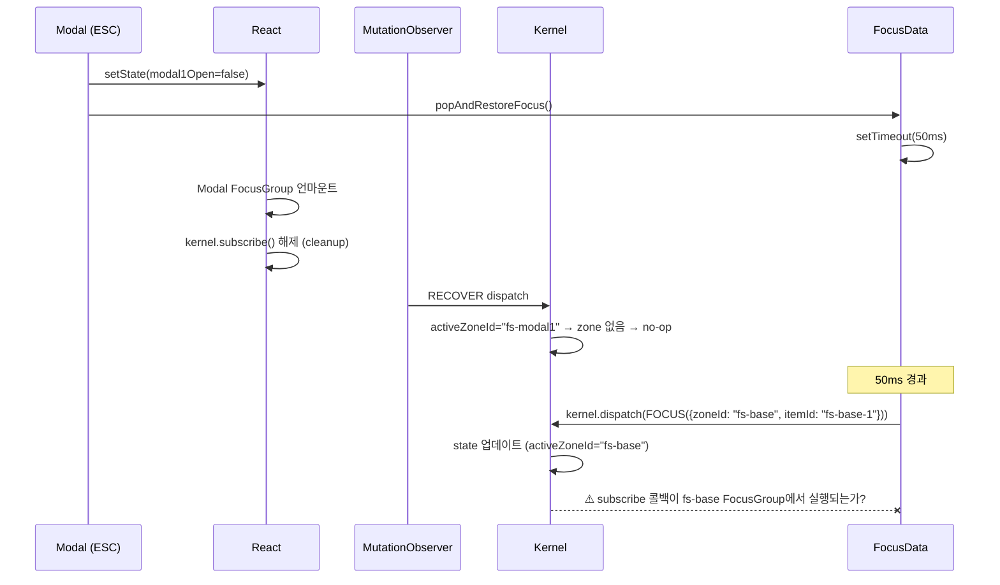

# Focus Stack Restore — `aria-current` 미복원 버그

## 1. 개요

`focus-showcase` E2E 테스트 13개 중 **12개 통과**, 1개 실패:
- ✅ **Expand: Tree Toggle** — 수정 완료
- ❌ **Focus Stack: Restore** — 모달 닫힌 후 `aria-current="true"`가 base 아이템에 복원되지 않음

## 2. 분석

### 테스트 시나리오
```
1. #fs-base-1 클릭 → base zone 포커스
2. #fs-open-modal 클릭 → pushFocusStack() → 모달 열림
3. 모달 내 ArrowDown → #fs-modal1-2 포커스
4. ESC → handleClose() → popAndRestoreFocus() → 모달 닫힘
5. 기대: #fs-base-1에 aria-current="true" 복원
6. 실제: aria-current="" (빈 문자열)
```

### 핵심 원인: `activeZoneId` 동기화 실패

`popAndRestoreFocus()`가 50ms 후 kernel `FOCUS` 커맨드를 dispatch하면:

```
kernel state 변경 → kernel.subscribe() 콜백 → FocusData.setActiveZone() → FocusItem 리렌더
```

이 체인에서 **kernel → FocusData 동기화**가 끊어지고 있음.

### 증거: DOM 상태 분석

```html
<div id="fs-base-1"
     data-anchor="true"      ← isFocused=true, isGroupActive=false
     tabindex="-1"           ← 포커스 안 받고 있음
     aria-selected="true"    ← 선택은 유지
>
```

- `data-anchor="true"` = Zustand store에 `focusedItemId === "fs-base-1"` ✅
- `isGroupActive=false` = `FocusData.getActiveZoneId() !== "fs-base"` ❌
- `aria-current` 미설정 = `isGroupActive`가 false이므로 `aria-current`도 빈 값

### 의심 원인: 모달 FocusGroup 언마운트 타이밍



**문제 지점**: 모달 FocusGroup 언마운트 시 `kernel.subscribe()` cleanup이 실행됨. 하지만 **base FocusGroup의 subscribe는 여전히 살아있어야 함**. base FocusGroup의 subscriber가 `activeZoneId` 변경을 감지하고 `FocusData.setActiveZone()`을 호출해야 하는데, 이 동기화가 실패하는 것으로 보임.

가능한 세부 원인:
1. **`activeZoneGuard` (FrequencyGuard)** — 모달 언마운트 과정에서 이미 zone 변경이 여러 번 발생하여 rate limit에 도달
2. **Zustand store 변경 감지 실패** — kernel state는 변경됐지만 `FocusData.getActiveZoneId()`와의 비교에서 이미 동일하다고 판단
3. **Base FocusGroup의 subscriber가 자기 zone만 감시** — `activeZoneId` 변경은 모든 zone의 subscriber에서 감지해야 하지만, 구현이 자기 zone 데이터 변경만 체크

## 3. 제안

### 즉시 조사 필요
1. `FocusGroup.tsx`의 `kernel.subscribe()` 콜백에 로깅 추가 → 50ms 후 FOCUS dispatch 시 실제로 콜백이 호출되는지 확인
2. `FocusData.setActiveZone()`의 `activeZoneGuard.check()` 반환값 확인
3. Base FocusGroup의 subscriber가 activeZoneId 변경을 감지하는지 확인

### 수정 방향
- **Option A**: `popAndRestoreFocus()`에서 kernel dispatch 후 직접 `FocusData.setActiveZone()` 호출 (bridge 우회)
- **Option B**: FOCUS 커맨드의 effect에서 직접 `FocusData.setActiveZone()` 설정
- **Option C**: 타이밍 문제라면 `setTimeout` 대신 requestAnimationFrame 또는 더 긴 딜레이 사용
