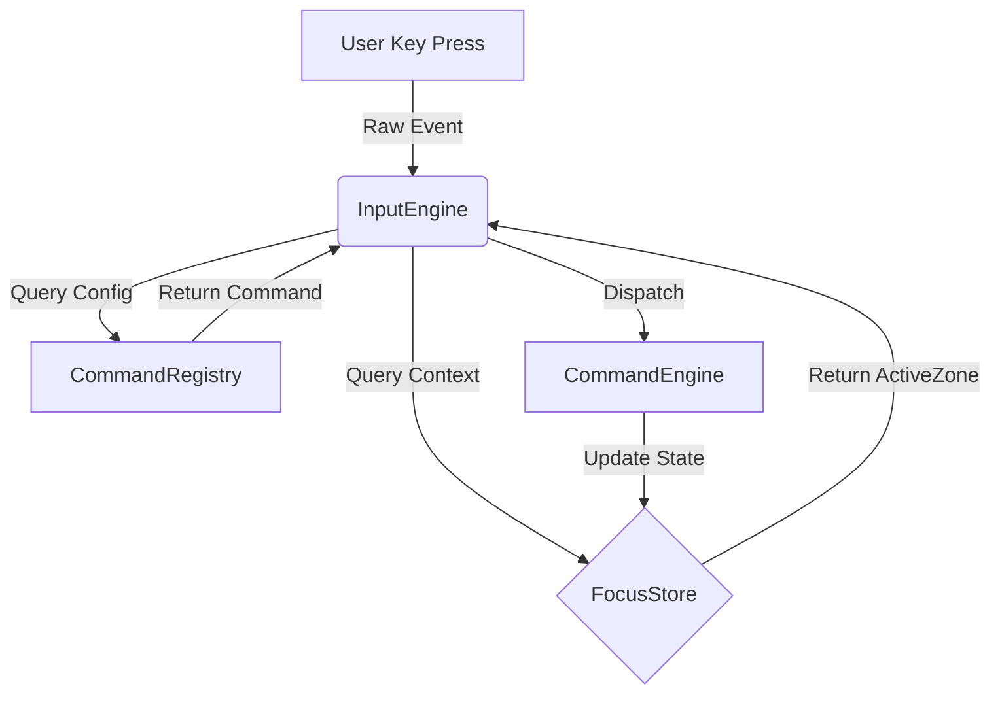

# App vs OS Separation Analysis

## 1. 질문 (The Question)
> "지금 코드에서 App과 OS간의 책임 분리가 필요한 영역을 찾아봐. 커맨드에는 UI가 없어야 하는데 말이지."

## 2. 발견된 위반 사례 (Violations Found)

### A. Keybinding Coupling (키바인딩의 결합)
- **Code**: `todo_commands.ts`의 `kb: ['Meta+z']` 등.
- **Problem**: 키바인딩은 **OS(Input/Platform)의 영역**입니다.
    - App(Command)은 "무엇(Logic)을 할지"만 정의해야 합니다.
    - "무슨 키를 눌렀을 때 실행할지"는 설정(User Config)이나 플랫폼(Web vs Mobile)에 따라 달라질 수 있어야 합니다.
    - 지금은 커맨드 정의 안에 단축키가 하드코딩되어 있어, 키 설정을 변경하거나 플랫폼별로 다르게 가져가기 어렵습니다.

### B. View-Specific Guard Clauses (뷰 종속적 가드)
- **Code**: `JumpToSidebar`의 `when: '!isFieldFocused || cursorAtStart'` (Line 282).
- **Problem**: `cursorAtStart`는 지극히 **DOM/View 상태**입니다.
    - Headless 환경에서는 커서 개념이 없거나 다를 수 있습니다.
    - 이 조건은 커맨드 실행 조건(Logic)이라기보다는, **"이벤트 디스패치 조건(Event Dispatch Condition)"**에 가깝습니다.
    - 즉, OS 계층(이벤트 핸들러)에서 "커서가 앞일 때만 이 커맨드를 발동시켜"라고 판단해야지, 커맨드 자체가 "난 커서가 앞일 때만 실행돼"라고 아는 것은 부자연스럽습니다.

## 3. 제안 (Proposal)

### Step 1: Keybinding Externalization (키바인딩 분리)
`todo_commands.ts`에서 `kb` 필드를 제거하고, 별도의 `keymap.ts` (OS Layer)로 옮깁니다.

```typescript
// src/os/keymap.ts
export const DEFAULT_KEYMAP = {
    'Meta+z': 'UNDO',
    'ArrowUp': 'MOVE_FOCUS_UP',
    // ...
};
```

### Step 2: Context-Only Guards (컨텍스트 기반 가드)
`cursorAtStart` 같은 DOM 종속적 조건 대신, 컨텍스트에 필요한 정보를 명시합니다.
(혹은, UI 이벤트 핸들러 단계에서 필터링 후 커맨드 호출)

## 4. 요약
현재 가장 큰 문제는 **"입력 트리거(Key)"와 "실행 로직(Command)"이 한 객체에 정의되어 있다는 점**입니다. 이 둘을 찢어내는 것이 책임 분리의 첫걸음입니다.
# Architecture Review: TodoEngine Coupling

**Date:** 2026-02-02
**Status:** Review
**Source:** User Request (`/inbox @[src/lib/todoEngine.tsx]`)

## Problem Statement
The file `src/lib/todoEngine.tsx` currently acts as a "God Object" for the application instance. It indiscriminately mixes:
1.  **OS-Layer Concerns:** Focus Registry registration, Context bridging, generic Undo/Redo physics.
2.  **App-Layer Concerns:** `INITIAL_STATE`, `loadState`/`saveState`, specific Navigation Logic (`PREV`/`NEXT` implementation), `TodoContext` mapping.

This makes the "Engine" (OS) non-reusable and the "App" (Todo) hard to test in isolation.

## Analysis of `todoEngine.tsx`

| Segment | Responsibility | Layer | Issue |
| :--- | :--- | :--- | :--- |
| `ENGINE_REGISTRY` | Registers specific Keymaps/Commands | App | Hardware/OS should be initialized separately from App definitions. |
| `focusRegistry.register(...)` | Defines how to find IDs (strategies) | Bridge | Strategies are defined inline, coupled to `AppState` shape. Should be injected modules. |
| `loadState`/`saveState` | Persistence | App | Business logic inside the engine file. |
| `useTodoStore` | State Container | App | Contains a massive `onStateChange` middleware that implements specific navigation physics (`PREV`, `NEXT`). |
| `state.ui.focusRequest` | Signaling | Bridge | The "Protocol" `focusRequest` is handled by ad-hoc procedural logic inside the store updates. |

## Proposed Refactoring Strategy

### 1. Extract Persistence
Move state loading/saving to a unified data layer.
- `src/lib/todo/persistence.ts`

### 2. Extract Focus Strategies
Move `listStrategy`, `boardStrategy`, `sidebarStrategy` to a dedicated strategy module.
- `src/lib/todo/focusStrategies.ts`

### 3. Extract Navigation Physics
The complex `onStateChange` logic that calculates `targetId` based on `PREV`/`NEXT` is effectively the "Physics Engine" for this specific app.
- `src/lib/todo/navigationPhysics.ts`
- Should export a function `resolveFocusRequest(state, request) -> targetId`

### 4. Thin Down `todoEngine.tsx`
The file should ideally only be the **Integration Point**:
```tsx
// Theoretical thinner implementation
export function useTodoEngine() {
  // 1. Hook up Store
  const store = useTodoStore(); 
  
  // 2. Hook up OS
  useFocusBridge(store, todoFocusStrategies);
  
  // 3. Hook up Context
  useContextBridge(store, mapStateToContext);
  
  return store;
}
```

## Next Steps
- [ ] Move persistence logic to `src/lib/logic/persistence.ts`
- [ ] Refactor `onStateChange` into a testable pure function `processFocusRequest(state)`.
- [ ] Define `FocusStrategy` interface clearly in OS primitives.
# Declarative Zone & Item 명세 (Specification)

이 문서는 Interactive OS의 핵심 네비게이션을 선언적(Declarative)으로 처리하기 위한 **Zone**과 **Item** 컴포넌트의 인터페이스 및 사용법을 정의합니다.

---

## 1. Core Concept: Focus Topology & Layout
하드코딩된 키 이벤트 핸들러(`handleKeyDown`) 대신, 컴포넌트의 **배치(Topology)**와 **내부 구조(Layout)**를 정의하여 이동 로직을 OS에 위임합니다.

### A. Macro Topology (Zone 간 이동)
- **Neighbors**: 현재 Zone의 상하좌우에 어떤 Zone이 있는지 정의합니다.
- 예: "내 왼쪽엔 사이드바가 있다" -> `ArrowLeft` 입력 시 사이드바의 마지막 포커스 지점으로 이동.

### B. Micro Topology (Item 간 이동)
- **Layout**: Zone 내부 아이템들의 배열 방식 (수직 리스트, 수평 그리드 등).
- 예: `layout="row"` -> `ArrowRight/Left`로 아이템 이동.

---

## 2. Interface Definitions

### `Zone` Primitive
Zone은 포커스 컨텍스트의 경계(Boundary)이자 네비게이션의 단위입니다.

```typescript
type Direction = 'up' | 'down' | 'left' | 'right';

interface ZoneNeighbors {
  up?: string;    // Zone ID
  down?: string;
  left?: string;
  right?: string;
}

interface ZoneProps {
  /** 고유 식별자 (필수) */
  id: string;
  
  /** 
   * Zone 간 이동 규칙 정의 (Macro Topology)
   * 정의되지 않은 방향은 이동 불가 (Bump Effect)
   */
  neighbors?: ZoneNeighbors;

  /**
   * Zone 내부 아이템 배치 방식 (Micro Topology)
   * - 'column': 수직 리스트 (ArrowUp/Down) - Default
   * - 'row': 수평 리스트 (ArrowLeft/Right) - Kanban Columns 등
   * - 'grid': 2D 격자 (All Arrows)
   */
  layout?: 'column' | 'row' | 'grid';

  /** 
   * Grid 레이아웃일 경우 한 행의 아이템 수 
   * (layout='grid' 일 때만 유효)
   */
  gridColumns?: number;

  /** 기본 포커스 아이템 ID (Zone 진입 시) */
  defaultFocusId?: string;

  children: React.ReactNode;
}
```

### `Item` Primitive
Item은 실제 포커스를 받을 수 있는 최소 단위입니다.

```typescript
interface ItemProps {
  /** 고유 식별자 (필수) */
  id: string | number;

  /** 
   * 순서 강제 지정 (옵션)
   * 생략 시 DOM 렌더링 순서 또는 Virtual List 인덱스를 따름
   */
  index?: number;

  /** 포커스/액티브 상태에 따른 스타일링을 위한 헬퍼 */
  className?: string;

  children: React.ReactNode;
}
```

---

## 3. Usage Examples

### Case 1: Standard Layout (Sidebar + List)

사이드바는 왼쪽에 고정, 투두 리스트는 오른쪽에 위치하며 수직스크롤됩니다.

```tsx
// App.tsx Layout
<div className="flex">
  
  {/* Sidebar Zone */}
  <Zone 
    id="sidebar" 
    neighbors={{ right: 'todoList' }} // 오른쪽으로 가면 투두리스트
    layout="column"
  >
    <Item id="inbox">Inbox</Item>
    <Item id="today">Today</Item>
  </Zone>

  {/* Todo List Zone */}
  <Zone 
    id="todoList" 
    neighbors={{ left: 'sidebar' }} // 왼쪽으로 가면 사이드바
    layout="column"
  >
    {todos.map(todo => (
      <Item id={todo.id}>{todo.text}</Item>
    ))}
  </Zone>

</div>
```

### Case 2: Kanban Board (Nested Zones)

칸반 보드는 **가로로 배치된 컬럼들(Zones)**의 집합입니다.
Top-level Zone이 'Row' 레이아웃을 가지고, 각 컬럼은 'Column' 레이아웃을 가집니다.

```tsx
<Zone 
  id="boardBoard" 
  neighbors={{ left: 'sidebar' }}
  layout="row" // 내부 아이템(여기서는 카테고리 컬럼)들이 가로로 배치됨
>
  {categories.map(category => (
    // 각 컬럼 자체가 하나의 중첩된 Zone (Nested Zone)
    <Zone 
      key={category.id}
      id={`col_${category.id}`}
      layout="column" // 컬럼 내부는 수직 리스트
      className="w-80"
    >
      {/* Header Item (컬럼 자체 선택 가능 시) */}
      <Item id={`header_${category.id}`}>{category.title}</Item>
      
      {/* Task Items */}
      {category.todos.map(todo => (
        <Item id={todo.id}>{todo.text}</Item>
      ))}
    </Zone>
  ))}
</Zone>
```

### Case 3: Grid (App Grid / Gallery)

```tsx
<Zone 
  id="appGrid" 
  neighbors={{ left: 'sidebar' }}
  layout="grid" 
  gridColumns={4} // 4열 그리드
>
  {apps.map((app, idx) => (
    <Item id={app.id} index={idx}>
      <AppIcon icon={app.icon} />
    </Item>
  ))}
</Zone>
```

---

## 4. Implementation Strategy

이 구조를 구현하기 위해 `useZoneNavigation` 훅을 개발하여 `Zone` 컴포넌트에 주입합니다.

1.  **Registry**: 모든 활성 Zone과 그들의 `neighbors` 정보를 중앙(Context/Store)에서 관리하지 않고, **Event Bubbling** 또는 **Local Hook Logic**으로 처리하여 결합도를 낮춥니다.
2.  **Direction Resolution**:
    - `ArrowRight` 이벤트 발생.
    - 현재 Zone의 `layout` 확인.
        - `column`이면 내부 이동 무시(또는 상위로 위임).
        - `row`이면 다음 형제 Item으로 이동.
    - 내부 이동이 불가능하거나 끝에 도달했으면, `neighbors.right` 확인.
    - `neighbors.right`가 존재하면 해당 Zone ID로 `SET_FOCUS` 디스패치.

이 방식은 코드를 획기적으로 줄여주며, "무엇을 할지(Imperative)"가 아니라 **"구조가 어떻게 생겼는지(Declarative)"**에 집중하게 합니다.
# DELETE_TODO와 Focus 로직의 결합도 분석 (Coupling Analysis)

## 1. 맥락 (Context)
사용자 지적: `DELETE_TODO` 커맨드가 데이터 삭제(`data.todos`)뿐만 아니라 다음 포커스 계산(`ui.focusId`)까지 동시에 수행하고 있습니다.
이는 **단일 책임 원칙(SRP)**을 위반하며, 데이터 제어 로직과 UI 제어 로직이 뒤섞여 있어 테스트와 유지보수를 어렵게 합니다.

## 2. 현황 분석 (Current Status)
`src/lib/todo_commands.ts`의 `DeleteTodo` 구현을 보면:

```typescript
run: (state, payload) => {
    // 1. 데이터 삭제 로직
    const remaining = state.data.todos.filter(...)

    // 2. UI 포커스 계산 로직 (상당히 복잡함)
    let nextFocus = state.ui.focusId;
    if (...) {
        // 다음/이전 아이템 찾기 로직...
        nextFocus = ...
    }

    // 3. 동시에 반환
    return {
        ...state,
        data: { ...state.data, todos: remaining },
        ui: { ...state.ui, focusId: nextFocus }
    };
}
```

### 문제점
1. **재사용성 저하**: 포커스 이동 없이 조용히 삭제만 하고 싶을 때(예: 백그라운드 정리) 이 커맨드를 사용할 수 없음.
2. **복잡도 증가**: 삭제 로직보다 포커스 계산 로직이 더 길어서 본질이 흐려짐.
3. **테스트 난이도**: "데이터가 잘 지워졌는가?"를 테스트하려면 포커스 상태까지 모킹해야 함.

## 3. 제안 (Proposal)
이 문제를 해결하기 위해 **Command Composition (커맨드 합성)** 패턴 도입을 제안합니다.

### 3.1. Atomic Commands 분리
1. `DELETE_TODO_DATA`: 순수하게 데이터만 삭제. (UI 상태 변경 없음 혹은 최소화)
2. `CALCULATE_NEXT_FOCUS`: 현재 포커스 아이템이 사라졌을 때 갈 곳을 계산하여 `SET_FOCUS`.

### 3.2. Composite Command (Macro)
이 두 가지를 묶어서 실행하는 상위 개념을 정의합니다.

```typescript
// Pseudo Code
export const DeleteItem = defineCompositeCommand({
    id: 'DELETE_ITEM',
    kb: ['Delete'],
    sequence: [
        // 1. 삭제 전 포커스 계산 (Pre-calculation) 혹은 삭제 후 보정?
        // 삭제 후에는 아이템을 찾을 수 없으므로, 삭제 전에 "삭제될 놈 다음 놈"을 기억해야 함.
        (state) => ({ type: 'STORE_NEXT_FOCUS_TARGET', payload: ... }),
        (state) => ({ type: 'DELETE_TODO_DATA', payload: ... }),
        (state) => ({ type: 'RESTORE_FOCUS', payload: ... })
    ]
});
```
또는, 리듀서 내에서 체이닝을 허용하는 구조로 개선이 필요합니다.

### 3.3. Immediate Action Plan
당장은 구조를 크게 뜯기 부담스럽다면, **Logic Extraction**부터 수행해야 합니다.
`findNextFocusId(todos, currentId)` 같은 순수 함수로 포커스 계산 로직을 분리하여 `DeleteTodo`의 `run` 함수 본문을 경량화하는 것이 1단계입니다.
# 2026-02-02 프로젝트 아키텍처 개선 로드맵

현재 프로젝트 상태와 분석 문서를 기반으로 수립한 아키텍처 개선 및 기능 고도화 로드맵입니다.

## 🚀 Phase 1: 아키텍처 위생 관리 (App/OS 분리)
기술 부채를 해결하고, 시스템의 유연성을 확보하기 위한 구조적 개선입니다.

- [x] **키바인딩 분리 (Keybinding Separation)**
    - `todo_commands.ts` 등 커맨드 정의 파일에서 하드코딩된 `kb` 속성 제거
    - `src/lib/todo_keys.ts`를 `KeybindingItem[]` 기반의 Source of Truth로 리팩토링 완료
    - 커맨드는 '무엇을 할지'만 정의, OS가 '언제 실행할지' 결정하도록 분리

- [x] **View 종속 가드 제거 (Logic/View Decoupling)**
    - `cursorAtStart`와 같은 DOM 종속적 조건을 커맨드 정의(`when` 절)에서 제거
    - `src/lib/todo_keys.ts`의 Keybinding 조건(`when`)으로 이동하여 OS Layer에서 처리

## 🛠 Phase 2: 표준 시스템 고도화 (History & Clipboard)
사용자 경험(UX)과 직결되는 필수 표준 기능을 구현합니다.

- [ ] **History 트랜잭션 (Unified Undo/Redo)**
    - [x] **History Flooding 방지**: `log: false` 커맨드(예: `SYNC_DRAFT`)가 히스토리를 오염시키지 않도록 엔진 레벨에서 필터링 적용
    - [x] **Transaction Support**: `groupId` 필드를 통해 연관된 여러 커맨드를 한 번에 Undo 하는 기능 구현 완료 (`todo_engine.tsx`)

- [x] **클립보드 시스템 (Clipboard Interop)**
    - [x] **ClipboardManager 컴포넌트**: Native `Copy`/`Paste` 이벤트를 가로채어 엔진과 연동하는 Headless 컴포넌트 구현 (`src/os/ClipboardManager.tsx`)
    - [x] **ImportTodos 커맨드**: 외부 텍스트나 JSON 데이터를 대량으로 삽입하는 로직 구현 (` IMPORT_TODOS`)
    - [x] **Serialization**: Todo 아이템을 JSON 및 Plain Text로 직렬화하여 클립보드에 복사

## 🧹 Phase 3: 레지스트리 및 문법 정비
코드 베이스의 일관성과 유지보수성을 높입니다.

- [x] **Registry 리팩토링**
    - `CONSTITUTION`, `SIDEBAR` 등으로 파편화된 리지스트리를 `UNIFIED_TODO_REGISTRY`로 통합
    - `todo_engine.tsx`에서 단일 레지스트리를 참조하도록 변경하여 초기화 로직 단순화
    - 단일 진실 공급원(Single Source of Truth) 확보

- [x] **Logic Expect 문법 표준화**
    - 테스트와 비즈니스 로직 정의에 사용되는 `expect` 문법 통일 (`Expect('isEditing').toBeFalsy()` 등)
    - `todo_commands.ts`의 주요 커맨드에 적용 완료
# SaaS Todo App Requirements Checklist

To evolve our "Reference Implementation" into a complete "Commercial SaaS Product" (like Todoist, Things 3, Linear), we need to address the following functional and non-functional requirements.

## 1. Core Data & Hierarchy (The "Noun" Layer)
- [ ] **Nested Tasks (Subtasks)**
    - Infinite or multi-level depth (Task > Subtask > Substep).
    - Progress roll-up (Parent completes when children complete?).
- [ ] **Smart Recurring Tasks**
    - "Every Monday", "Last day of month", "3 days after completion".
    - Logic for handling "overdue" recurring instances.
- [ ] **Rich Descriptions & Attachments**
    - Markdown support in notes.
    - File attachments/images.
    - URL preview expansions.
- [ ] **Multi-Select & Bulk Actions**
    - Shift-click selection.
    - Bulk move, complete, delete, rescheduling.

## 2. Organization & Workflow (The "Adjective" Layer)
- [ ] **Flexible Tagging / Labels**
    - Many-to-many relationship.
    - Color coding.
- [ ] **Filtering & Smart Views**
    - "Today", "Upcoming", "Someday/Maybe".
    - Custom Query Language (e.g., `(due:today | (p1 & !tag:waiting))`).
- [ ] **Workspaces / Projects / Areas**
    - Separation of "Work" vs "Personal" contexts (Data Isolation).
    - Shared vs Private lists.

## 3. Interaction & Views (The "Verb" Layer)
- [ ] **Multiple View Layouts**
    - **List View**: Standard vertical list.
    - **Kanban Board**: Status/Category columns.
    - **Calendar View**: Monthly/Weekly grid.
    - **Gantt/Timeline**: Dependency visualization.
- [ ] **Quick Add (Global Capture)**
    - System-wide hotkey to capture task without switching context.
    - NLP Parsing ("Buy milk tomorrow at 5pm #personal").
- [ ] **Drag & Drop Reordering**
    - Cross-list dragging.
    - Indent/Outdent via drag.

## 4. Collaboration (The "Social" Layer)
- [ ] **Real-time Sync**
    - CRDT (Conflict-free Replicated Data Types) or Optimistic UI.
    - Presence indicators (Who is looking at this list?).
- [ ] **Comments & Activity Log**
    - Audit trail (Who changed due date?).
    - @Mentions and notifications.
- [ ] **Sharing Permissions**
    - Viewer / Editor / Admin roles.

## 5. Intelligence & Automation
- [ ] **Reminders & Notifications**
    - Push notifications, Email digests.
    - Location-based reminders.
- [ ] **Automations**
    - "When task added to 'Bug', assign to @engineer".
    - "Archive completed tasks after 7 days".

## 6. Technical Engineering Mandates (Antigravity Standards)
- [ ] **Offline-First (Local-First)**
    - App must work perfectly with 0 network.
    - Background sync when online.
- [ ] **Performance Budget**
    - Lists with 10,000 items must scroll at 60fps (Virtualization).
    - < 100ms interaction latency for any local action.
- [ ] **Keyboard-First Navigation**
    - Every single action must be accessible via keyboard (current strength).
    - Palette Command interface (`Cmd+K`).
# 주요 표준 시스템 누락 보고서 (Key Standards Gap Analysis)

## 1. 개요 (Overview)
사용자의 지적에 따라, "보편적인 프로덕트"로서 갖춰야 할 핵심 시스템(History, Clipboard, Focus)의 현재 상태를 점검하고 누락된 표준 기능들을 식별했습니다.

## 2. 상세 분석 (Detailed Analysis)

### 2.1. History System (Undo/Redo)
- **현재 상황**: `AppState.history`에 단순히 과거의 명령과 결과 상태를 `push`만 하고 있음.
- **누락된 표준**:
    - **Undo/Redo Stack**: 현재 `pointer`가 없고 스택을 앞뒤로 이동할 수 없음.
    - **Transaction Support**: 여러 명령을 하나의 Undo 단위로 묶는 기능 부재.
    - **Limit Management**: 히스토리가 무한정 쌓여 메모리 누수 가능성 존재.

### 2.2. Clipboard System (Copy/Paste)
- **현재 상황**: 구현 전무.
- **누락된 표준**:
    - **Object Serialization**: Todo 아이템이나 카테고리를 JSON/Text로 직렬화하여 클립보드에 복사하는 기능.
    - **Paste Handling**: 외부 텍스트나 내부 객체 붙여넣기 시 스마트한 파싱 및 생성 로직.
    - **Cross-App Support**: 다른 앱(예: 메모장)에서 텍스트 복사 시 Todo로 변환.

### 2.3. Focus System (Accessibility & Navigation)
- **현재 상황**: `FocusContext`와 `Zone`을 통한 내부적인 키보드 네비게이션은 구축됨.
- **누락된 표준**:
    - **ARIA Standards**: `aria-activedescendant` 미사용. 스크린 리더 호환성 낮음.
    - **Tab Order**: 기본 `Tab` 키를 통한 Zone 간 이동이 명시적으로 관리되지 않음(Interactive OS 특성상 의도적일 수 있으나, 접근성 표준 위배).
    - **Focus Trap**: 모달이나 특정 구역 내 포커스 가두기 기능 부재.

## 3. 제안 (Proposal)

이 위크플로는 단순 보고서 작성에 그치지 않고, 후속 작업으로 가장 시급한 **History(Undo/Redo)** 기능을 우선 구현할 것을 제안합니다.

1. **Phase 1**: History System 고도화 (Undo/Redo 도입)
2. **Phase 2**: Clipboard System 도입 (Copy/Paste)
3. **Phase 3**: Accessibility(ARIA) 표준 적용

현재 가장 치명적일 수 있는 사용성 결함은 실수를 되돌릴 수 없는 **Undo 기능의 부재**입니다.
# [Research] Environment Removal & FOCUS Injection in Commands

## 1. 개요 (Overview)
커맨드 실행 시 주입되던 `env` (OSEnvironment)를 제거하고, OS 계층에서 관리하는 **`FOCUS` 객체(FocusObject)**를 커맨드 페이로드에 직접 주입하는 아키텍처 변경안을 분석합니다.

## 2. 분석 (Details)

### 현재 상태 (Context Receiver Pattern)
- 커맨드는 `(state, payload, env)` 3개의 인자를 받음.
- `env`는 `dispatch` 시점에 `config.getEnv()`를 통해 암시적으로 주입됨.
- 예: `const targetId = payload.id !== undefined ? payload.id : Number(env.focusId);`

### 제안 모델 (Payload Injection Pattern)
- 커맨드는 `(state, payload)` 2개의 인자만 받음.
- `env` 객체는 완전 제거됨.
- OS의 `activeObject` (ID, Index, Payload, Zone 정보 포함)가 페이로드의 특정 필드(예: `focus`)로 주입됨.

### 기술적 구현 방안
1. **Store Dispatcher 수정**: `os/core/command/store.tsx`의 `dispatch` 함수 내에서 명령 실행 전 OS Focus Store의 `activeObject`를 가져와 페이로드에 병합.
2. **CommandDefinition 수정**: `run: (state, payload: P & { focus?: FocusObject }) => S` 형태로 타입 정의 변경.
3. **인터셉터 활용**: `onDispatch` 시점에 `injectFocus` 플래그가 있는 커맨드에 대해 자동으로 페이로드를 가공.

### 기대 효과
- **Simpler Signature**: 커맨드 정의가 더 단순해지고 `env`라는 모호한 객체에 의존하지 않게 됨.
- **Rich Context**: 단순 `id`뿐만 아니라 해당 객체의 `index`, `payload`, `zone` 메타데이터까지 커맨드 내에서 즉시 활용 가능.
- **Explicit Flow**: 데이터 흐름이 페이로드 하나로 통합되어 디버깅 및 로깅 시 가독성 향상.

## 3. 결론 (Conclusion)
`env` 제거는 커맨드 시스템을 더 "Pure"하게 만들며, OS가 제공하는 풍부한 포커스 컨텍스트를 커맨드 로직에서 직접 활용할 수 있게 합니다. 이는 Antigravity의 'Zero-Boilerplate' 철학에 부합하는 변경입니다.

---
**Report generated by Antigravity (2026-02-03)**
# [Research] Selection and Focus Responsibility Delegation

## 1. 개요 (Overview)
본 보고서는 `Zone`과 `Item` 컴포넌트를 통해 **Selection(선택)** 및 **Focus(포커스)** 상태 관리 책임을 서비스(App Service) 계층에서 OS(Interactive-OS) 계층으로 완전히 이관하는 계획에 대한 레드팀 및 블루팀의 아키텍처 의견을 분석합니다.

## 2. 분석 (Analysis)

### 현재 상태
- `focusId`는 이미 OS Layer (`useFocusStore`)로 이동됨.
- `selectedCategoryId`, `editingId` 등은 여전히 `AppState` (Service Layer)에 잔류 중.
- Service는 `useFocusStore`를 구독하여 `OSEnvironment`를 통해 포커스 정보를 주입받고 있으나, 여전히 스스로 선택 상태를 일부 소유하고 있음.

### 블루팀 (Delegate to OS): "Architecture Purity & Performance"
- **책임의 분리 (SoC)**: "무엇이 강조되었는가"는 UI의 물리적 상태이며, OS 엔진이 `data-item-id`를 통해 이를 관리하는 것이 자연스러움. 서비스 로직은 비즈니스 데이터(Todos, Categories)에만 집중해야 함.
- **성능 최적화**: 서비스 계층의 상태 변경은 전체 앱의 Re-render를 유발할 수 있으나, 포커스/선택이 OS 레벨에서 처리되면 해당 Item 컴포넌트만 구독(Selector)을 통해 국소적으로 업데이트될 수 있음.
- **Zero-Config Interaction**: 서비스 개발자는 `Item`에 `id`만 부여하면 'Focus'와 'Selection' 기능을 공짜로 얻게 됨. 복잡한 `onSelect` 핸들러 지옥(Handler Hell)에서 해방됨.

### 레드팀 (Retain in Service): "Domain Logic & Stability"
- **도메인 의미의 상실**: `selectedCategoryId`는 단순 포커스가 아니라 "현재 조회 중인 컨텍스트"라는 비즈니스 의미를 가짐. 이를 OS 포커스에만 의존하면, 사이드바에서 다른 곳으로 포커스가 나갔을 때 "현재 선택된 카테고리"를 잃어버리는 현상을 방지하기 위해 복잡한 'Selection Memory' 로직이 OS에 추가되어야 함.
- **Headless 테스트 복잡성**: 비즈니스 로직(Service)만 따로 떼어서 테스트할 때, OS의 `useFocusStore` 상태에 의존하게 되면 순수 로직 테스트가 어려워짐.
- **확장성 제약**: 다중 선택(Multi-selection), 범위 선택(Shift+Click) 등의 특화 기능을 일반적인 OS `Zone/Item` 계층에서 모두 수용하기 어려울 수 있으며, 결국 서비스 계층으로 책임이 다시 넘어올 위험이 있음.

## 3. 결론 및 제안 (Proposal)
완전한 이관을 위해서는 **'Focus Memory'** 기술의 고도화가 필요합니다.

1. **Focus == Selection (Primary)**: 포커스된 객체가 항상 '가장 최근에 선택된' 객체임을 보장.
2. **Persistence Layer in OS**: Zone Metadata 내에 `lastFocusedId` 또는 `activeSelectionId`를 강화하여, 포커스가 해당 영역을 이탈하더라도 '선택'의 맥락을 OS가 유지.
3. **Implicit Sync**: 서비스는 상태를 직접 소유하지 않고, 명령(Command) 실행 시 OS에서 주입해주는 `env.focusId`를 현재 타겟으로 신뢰하도록 리팩토링할 것을 권장.

---
**Report generated by Antigravity (2026-02-03)**
# OS-Native Focus System: Completion Checklist
**Date**: 2026-02-03
**Status**: Implementation Complete

We have rebuilt the Focus System from a "Zero Base" to ensure an app-native experience.

## I. Core Architecture (Zero Base)
The foundation of the "Virtual Focus" physics.

- [x] **Zone 2.0 (The Event Sink)**
  - [x] **MutationObserver Sync**: Automatically detects DOM children and updates `zoneRegistry.items`. No manual `items` prop needed.
  - [x] **Black Hole Strategy**: Enforces `tabIndex={0}` on Container, trapping browser focus.
  - [x] **Focus Recovery**: If focus drops to `body`, Zone immediately reclaims it.
  - [x] **Simplified Event Loop**: Pure event delegation without complex conditional trees.

- [x] **Item 2.0 (The Virtual Beacon)**
  - [x] **Stateless Projection**: No internal `isActive` state; pure reflection of `focusStore`.
  - [x] **Payload Beacon**: `useLayoutEffect` automatically transmits `payload` + `zoneId` to Store on activation.
  - [x] **Native Focus Rejection**: `tabIndex={-1}` and `mousedown.preventDefault()` to stop browser focus stealing.
  - [x] **Explicit Activation**: Clicking an item explicitly calls `setActiveZone()` to ensure Jurisdiction update.

- [x] **Field (The Mode Switch)**
  - [x] **View Mode**: Renders as `<span>` (pointer-events-none) when inactive. invisible to browser focus.
  - [x] **Edit Mode**: Renders as `<input active autoFocus>` only when requested by Command.
  - [x] **Input Isolation**: Trap navigation keys, but allow `Escape` to cancel and `Enter` to commit.

- [x] **Focus Store (The Brain)**
  - [x] **updateZoneItems**: New Action to allow Zones to sync their DOM state to the Registry.
  - [x] **Normalized State**: Focus State (`focusedItemId`) is the Single Source of Truth.

## II. Interaction Patterns
The specific "Feel" of the OS.

- [x] **"App-Like" Click Behavior**
  - [x] Clicking an item strictly updates Virtual Focus.
  - [x] Clicking empty space in a Zone focuses the Zone (Background Click).
  - [x] No "Blue Outline" on items (Native focus suppressed).

- [x] **"App-Like" Editing**
  - [x] **Hover Actions**: Edit/Delete buttons appear on hover (`group-hover:opacity-100`).
  - [x] **Mode Transition**: "Start Edit" command transforms Span -> Input instantly.
  - [x] **Focus Restoration**: Finishing edit (Enter/Esc) returns Virtual Focus to the Item.

- [x] **"App-Like" Navigation**
  - [x] **Sidebar**: `wrap` navigation mode (Rolling).
  - [x] **Board View**: 
    - [x] **Spatial**: Left/Right moves between Columns.
    - [x] **Roving**: Up/Down moves between Cards.
  - [x] **Keyboard Trap**: Focus cannot visually "leave" the app window (it stays in the active Zone).

## III. Verification Status
Verified against the codebase.

| Component | Status | Notes |
| :--- | :--- | :--- |
| `src/os/ui/Zone.tsx` | **DONE** | Zero-base rewrite complete. |
| `src/os/ui/Item.tsx` | **DONE** | Zero-base rewrite complete. |
| `src/os/ui/Field.tsx` | **DONE** | Mode Switch implemented. |
| `BoardView.tsx` | **DONE** | Verified compatibility with new Zone/Item. |
| `Sidebar.tsx` | **DONE** | Verified compatibility with new Zone/Item. |
| `TodoPanel.tsx` | **DONE** | Verified Hover Actions & Edit Flow. |

---
**Conclusion**: The "OS-Native Focus" refactoring is complete. The system now behaves like a compiled native application rather than a web page document.
# [Architecture] "Global Sink" Input Architecture Proposal: Zero-Base Zone

## 1. 개요 (Executive Summary)

### 1.1. 현황 (As-Is)
- **위임형 싱크(Delegated Sink)**: `Zone` 컴포넌트가 React 합성 이벤트 (`onKeyDown`)를 직접 수신하여 처리.
- **문제점**:
    - **모호한 책임**: UI 컴포넌트(`Zone`)가 "입력 정책(Physics)"과 "영역 정의(Topology)"를 동시에 담당.
    - **파편화된 제어**: 키보드 입력 흐름을 추적하려면 Zone별 핸들러를 모두 확인해야 함.
    - **브라우저 의존**: DOM 포커스 상태에 따라 로직 실행 여부가 결정되어, 순수한 논리적 제어(Headless Control)가 어려움.

### 1.2. 제안 (To-Be)
- **중앙 집중형 싱크(Global Sink)**: `InputEngine`이 `window` 레벨에서 유일한 청취자(Listener)로 동작.
- **원칙**: "Zone은 선언하고, Engine이 집행한다."

---

## 2. 아키텍처 구성 요소 (MECE Breakdown)

시스템을 **역할(Role)**, **상태(State)**, **동작(Action)**의 3가지 축으로 상호 배제적이고 전체 포괄적(MECE)으로 분해합니다.

### 2.1. The Declarator (선언자): `Zone.tsx`
*UI 레이어 - "나는 여기에 존재한다"*

-   **책임 (R)**: 공간적 경계(Boundary)와 정체성(Identity) 정의.
-   **포함 (In)**:
    -   `id`, `area` 등록.
    -   DOM 아이템 리스트 동기화 (`MutationObserver`).
    -   시각적 활성 상태 표현 (CSS).
-   **배제 (Out)**:
    -   **모든 키보드 이벤트 핸들러 (`onKeyDown` 제거).**
    -   네비게이션 계산 로직.

### 2.2. The Mediator (중재자): `FocusStore`
*State 레이어 - "누가 주인공인가"*

-   **책임 (R)**: 관할권(Jurisdiction)의 상태 유지.
-   **포함 (In)**:
    -   `activeZoneId`: 현재 활성화된 관할 구역 ID.
    -   `zoneRegistry`: 각 Zone의 메타데이터 및 정책(Strategy) 저장소.
    -   `focusedItemId`: 물리적 커서 위치.
-   **배제 (Out)**:
    -   실제 키 입력 감지.
    -   명령 실행.

### 2.3. The Executor (집행자): `InputEngine`
*Physics 레이어 - "무슨 일이 일어났는가"*

-   **책임 (R)**: 입력 감지, 규칙 해석, 명령 발송.
-   **포함 (In)**:
    -   `window.addEventListener('keydown')`: 유일한 물리적 접점.
    -   **Context Resolver**: 현재 `activeZoneId`와 `isInput` 상태 조합.
    -   **Registry Matcher**: 키 입력과 매핑되는 명령(Intent) 탐색.
    -   **Physics Fallback**: 매핑된 명령이 없을 경우 기본 물리 법칙(화살표 이동 등) 수행.
-   **배제 (Out)**:
    -   UI 렌더링.

---

## 3. 데이터 흐름 (Data Flow)



1.  **Input Phase**: User presses `ArrowDown`.
2.  **Capture Phase**: `InputEngine` traps the event globally.
3.  **Jurisdiction Phase**: Engine checks `FocusStore.activeZoneId`. Let's say it's `"sidebar"`.
4.  **Resolution Phase**: Engine checks `todoKeys.ts` for `"sidebar" + "ArrowDown"`.
    -   If found: Dispatch `Command`.
    -   If not found: Execute `Default Zone Physics` (e.g., Spatial Nav).
5.  **Execution Phase**: Command updates `FocusStore`.

---

## 4. 구현 및 마이그레이션 계획

### 4.1. Step 1: `InputEngine` 신설
- `InputEngine` 컴포넌트(Hook 기반)를 생성하여 `App.tsx` 최상단에 배치.
- 초기에는 로그만 출력하며 이벤트 수신 확인.

### 4.2. Step 2: `Zone`의 핸들러 제거 (Empty State)
- `Zone.tsx`에서 `onKeyDown` 로직을 완전히 삭제.
- `metadata` 등록(`registerZone`) 기능만 남김.

### 4.3. Step 3: `Engine` 로직 이식
- 기존 `Zone`에 있던 `getCanonicalKey`, `registry.find`, `strategy` 로직을 `InputEngine`으로 이동.
- `activeZoneId`를 기준으로 분기 처리.

---

## 5. 기대 효과 (Benefits)

1.  **완벽한 제어권 (Total Control)**
    -   특정 모달이 떴을 때 배경 입력을 차단하거나, 전역 단축키를 오버라이드하는 로직을 단 한 곳(`InputEngine`)에서 관리 가능.
2.  **성능 최적화 (Performance)**
    -   수십 개의 `Zone`이 있어도 이벤트 리스너는 단 1개.
3.  **디버깅 용이성 (Debuggability)**
    -   "어떤 키가 눌렸고, 왜 무시되었는가?"를 `InputEngine`에서 100% 추적 가능.

## 6. 결론
이 제안은 Antigravity OS의 설계를 **"Event-Driven Component"**에서 **"Centralized Input System"**으로 진화시키는 핵심 단계입니다. 승인 시 즉시 리팩토링을 시작할 수 있습니다.
