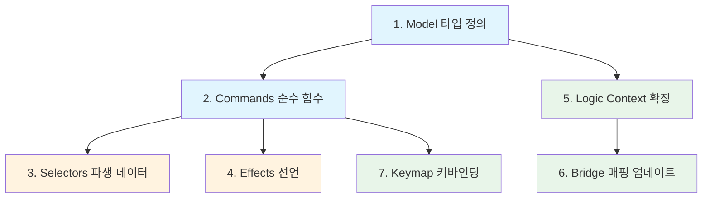

# Todo Headless Layer PRD — 개밥먹기 v2

| 항목 | 내용 |
| :--- | :--- |
| **원문** | Todo로 다시 개밥먹기를 할거야. OS와 kernel을 통해 todo의 뷰와 관계없이 작성할 수 있는 모든 headless를 먼저 작성해볼건데 PRD를 작성해줘 |
| **내(AI)가 추정한 의도** | 리팩토링된 커널/OS 위에서 View 없이 동작하는 Todo headless 레이어를 순수 로직 단위로 분리·정의하여, 커널 프리미티브의 실용성을 검증(dogfooding)하려는 것 |
| **날짜** | 2026-02-12 |
| **상태** | Draft |

---

## 1. 개요 (Overview)

OS core 리팩토링이 일단락된 시점에서, 리팩토링된 커널 프리미티브가 실제 앱을 지탱할 수 있는지 **개밥먹기(dogfooding)**로 검증한다. 대상은 기존 Todo 앱이며, 이번에는 **View(React 컴포넌트)를 제외한 Headless 레이어만** 먼저 작성한다.

**Headless Layer** = View에 의존하지 않고, 커널과 OS 프리미티브만으로 완전히 정의할 수 있는 코드 전체.

### 왜 Headless First인가?

1. **관심사 분리 검증** — 커널이 진짜 "뷰-무관"하게 앱 로직을 표현할 수 있는지 증명
2. **테스트 가능성** — DOM 없이 단위 테스트 가능한 범위를 극대화
3. **재사용성** — 동일 headless 위에 ListView, BoardView, MobileView 등 다양한 View를 올릴 수 있음
4. **커널 API 피드백** — 실전 사용에서 불편한 API 서페이스를 조기 발견

---

## 2. 현행 분석 (As-Is)

현재 Todo 앱(`src/apps/todo/`)의 headless 관련 코드:

| 레이어 | 파일 | 역할 | 뷰 의존 |
| :--- | :--- | :--- | :--- |
| **App Registration** | `app.ts` | `registerAppSlice("todo", ...)` | ❌ 없음 |
| **Model** | `model/appState.ts` | `DataState`, `UIState`, `HistoryState`, `AppEffect` | ❌ 없음 |
| **Model** | `model/types.ts` | `TodoCommand`, `TodoCommandId` re-export | ❌ 없음 |
| **Commands** | `features/commands/list.ts` | CRUD + 편집 (9개 커맨드) | ❌ 없음 |
| **Commands** | `features/commands/clipboard.ts` | Copy/Cut/Paste/Duplicate (4개) | ⚠️ `navigator.clipboard` 직접 호출 |
| **Commands** | `features/commands/history.ts` | Undo/Redo (2개) | ❌ 없음 |
| **Commands** | `features/commands/MoveCategoryUp.ts` | 카테고리 순서/선택 (3개) | ❌ 없음 |
| **Commands** | `features/commands/ToggleView.ts` | 뷰 모드 전환 (1개) | ❌ 없음 |
| **Keymap** | `features/todoKeys.ts` | 키바인딩 + `when` 가드 정의 | ❌ 없음 |
| **Logic** | `logic/schema.ts` | `TodoContext` (evaluation context) | ❌ 없음 |
| **Bridge** | `bridge/mapStateToContext.ts` | AppState → ContextState 변환 | ❌ 없음 |

### 현행 문제점

1. **clipboard.ts가 `navigator.clipboard`를 직접 호출** — 커맨드 핸들러 안에서 side effect 발생. 이펙트 시스템으로 분리해야 함
2. **`clipboardData`가 모듈 글로벌 변수** — 커널 상태 바깥에 숨겨진 상태. 직렬화/테스트 불가
3. **`GenericCommand` 임시 타입** — `HistoryEntry.command`가 `any` 기반
4. **카테고리 CRUD 미구현** — 카테고리 추가/삭제/이름변경이 없음 (초기 데이터 하드코딩)
5. **효과 큐(`effects`)가 AppState에 인라인** — 커널의 이펙트 시스템과 이중 구조
6. **ID 생성이 `Date.now()`** — 동시 생성 시 충돌, 테스트 비결정적

---

## 3. Headless 레이어 범위 정의 (Scope)

뷰 없이 작성 가능한 모든 것을 **7개 유닛**으로 분류한다.

```
┌─────────────────────────────────────────────────┐
│                 Headless Layer                   │
│                                                  │
│  ┌──────────┐  ┌──────────┐  ┌──────────┐       │
│  │  Model   │  │ Commands │  │  Keymap  │       │
│  │ (State)  │  │ (Reducer)│  │ (Intent) │       │
│  └────┬─────┘  └────┬─────┘  └────┬─────┘       │
│       │              │             │              │
│  ┌────┴─────┐  ┌────┴─────┐  ┌───┴──────┐      │
│  │  Logic   │  │ Effects  │  │  Bridge  │      │
│  │(Context) │  │(Side Fx) │  │(Mapping) │      │
│  └──────────┘  └──────────┘  └──────────┘       │
│                                                  │
│  ┌──────────────────────────────────────┐       │
│  │   App Slice (Registration + Config)  │       │
│  └──────────────────────────────────────┘       │
└─────────────────────────────────────────────────┘
         ▼  ▼  ▼ (consumed by View) ▼  ▼  ▼
```

---

## 4. 상세 스펙 (Detailed Spec)

### 4.1 Model — 상태 타입 정의

> 📍 `model/types.ts`, `model/state.ts`

#### 4.1.1 엔티티

```typescript
interface Todo {
  id: string           // UUID (Date.now → nanoid/uuid로 교체)
  text: string
  completed: boolean
  categoryId: string
  createdAt: number
  updatedAt: number
  priority?: 'p1' | 'p2' | 'p3' | 'p4'
  dueDate?: number
}

interface Category {
  id: string
  text: string
  color?: string
  icon?: string
}
```

#### 4.1.2 Normalized State

```typescript
interface DataState {
  categories: Record<string, Category>
  todos: Record<string, Todo>       // key 타입을 string으로 통일
  categoryOrder: string[]
  todoOrder: string[]               // 전역 정렬. 카테고리별 필터는 selector
}
```

#### 4.1.3 UI State (View-agnostic)

> View-agnostic이지만 View가 소비하는 UI 상태. Headless에 포함하는 이유: 커맨드 핸들러가 이 값을 읽고 쓰기 때문.

```typescript
interface UIState {
  selectedCategoryId: string
  draft: string
  editingId: string | null
  editDraft: string
  viewMode: 'list' | 'board'
  isInspectorOpen: boolean
}
```

#### 4.1.4 앱 내부 클립보드

```typescript
interface ClipboardState {
  todo: Todo | null
  isCut: boolean
}
```

> `navigator.clipboard` 호출은 Effect로 이동. 앱 내부 클립보드는 상태로 관리.

#### 4.1.5 전체 AppState

```typescript
interface AppState {
  data: DataState
  ui: UIState
  clipboard: ClipboardState
}
```

> `effects`와 `history`는 커널 미들웨어에서 관리하므로 AppState에서 **제거**.

---

### 4.2 Commands — 순수 상태 변환

> 📍 `commands/` 디렉토리

모든 커맨드는 `todoSlice.group.defineCommand`로 정의한다. **순수 함수**이며 side effect를 포함하지 않는다.

#### Todo CRUD

| Command | Payload | 설명 |
| :--- | :--- | :--- |
| `ADD_TODO` | `{ text?: string }` | draft 또는 payload.text로 생성 |
| `DELETE_TODO` | `{ id: string }` | 삭제 + todoOrder에서 제거 |
| `TOGGLE_TODO` | `{ id: string }` | completed 토글 |
| `UPDATE_TODO_TEXT` | `{ id: string, text: string }` | 텍스트 수정 확정 |
| `CLEAR_COMPLETED` | — | 완료된 todo 일괄 삭제 |

#### Todo 편집 흐름

| Command | Payload | 설명 |
| :--- | :--- | :--- |
| `START_EDIT` | `{ id: string }` | editingId 설정 + editDraft 초기화 |
| `SYNC_EDIT_DRAFT` | `{ text: string }` | editDraft 업데이트 |
| `CANCEL_EDIT` | — | editingId = null, editDraft = '' |
| `COMMIT_EDIT` | — | editDraft → todo.text 반영 + 편집 종료 |

#### Todo 순서

| Command | Payload | 설명 |
| :--- | :--- | :--- |
| `MOVE_ITEM_UP` | `{ id: string }` | 카테고리 내 시각 순서에서 위로 |
| `MOVE_ITEM_DOWN` | `{ id: string }` | 카테고리 내 시각 순서에서 아래로 |

#### Todo 클립보드

| Command | Payload | 설명 |
| :--- | :--- | :--- |
| `COPY_TODO` | `{ id: string }` | clipboard state에 복사 (순수) |
| `CUT_TODO` | `{ id: string }` | clipboard state에 복사 + 원본 삭제 (순수) |
| `PASTE_TODO` | `{ afterId?: string }` | clipboard에서 꺼내 생성 |
| `DUPLICATE_TODO` | `{ id: string }` | 바로 복제 (clipboard 미사용) |

#### 카테고리

| Command | Payload | 설명 |
| :--- | :--- | :--- |
| `ADD_CATEGORY` | `{ text: string }` | 🆕 카테고리 추가 |
| `DELETE_CATEGORY` | `{ id: string }` | 🆕 카테고리 삭제 (소속 todo 처리 정책 필요) |
| `RENAME_CATEGORY` | `{ id: string, text: string }` | 🆕 카테고리 이름 변경 |
| `SELECT_CATEGORY` | `{ id: string }` | 선택된 카테고리 변경 |
| `MOVE_CATEGORY_UP` | — | selectedCategory 기준 위로 |
| `MOVE_CATEGORY_DOWN` | — | selectedCategory 기준 아래로 |

#### Draft

| Command | Payload | 설명 |
| :--- | :--- | :--- |
| `SYNC_DRAFT` | `{ text: string }` | draft 텍스트 동기화 |

#### View

| Command | Payload | 설명 |
| :--- | :--- | :--- |
| `TOGGLE_VIEW` | — | list ↔ board 전환 |
| `TOGGLE_INSPECTOR` | — | 🆕 inspector 패널 토글 |

---

### 4.3 Selectors — 파생 데이터

> 📍 `selectors.ts`

순수 함수. View에서 `todoSlice.useComputed(selector)`로 소비.

```typescript
// 선택된 카테고리의 todo 목록 (정렬 유지)
selectVisibleTodos(state: AppState): Todo[]

// 카테고리 목록 (정렬 유지)
selectCategories(state: AppState): Category[]

// 통계
selectStats(state: AppState): {
  total: number
  completed: number
  active: number
}

// 현재 편집 중인 todo
selectEditingTodo(state: AppState): Todo | null

// 보드 뷰용: 카테고리별 그룹핑
selectTodosByCategory(state: AppState): Map<string, Todo[]>
```

---

### 4.4 Effects — 부수 효과 선언

> 📍 `effects.ts`

커널 이펙트 시스템을 사용하여 커맨드 결과로 발생하는 side effect를 선언적으로 처리한다.

| Effect | 트리거 | 설명 |
| :--- | :--- | :--- |
| `FOCUS_ITEM` | AddTodo, PasteTodo, DuplicateTodo, CancelEdit, CommitEdit | 생성/복제/편집완료 후 해당 아이템으로 포커스 |
| `WRITE_CLIPBOARD` | CopyTodo, CutTodo | `navigator.clipboard`에 쓰기 (시스템 클립보드 연동) |
| `SCROLL_INTO_VIEW` | 포커스 이동 후 | 스크롤 동기화 (OS 내장 가능) |

> **핵심 변경**: 기존 `effects: AppEffect[]` 인라인 큐 → 커널 이펙트 시스템(`TypedEffectMap`)으로 마이그레이션

---

### 4.5 Keymap — 키 바인딩 선언

> 📍 `keymap.ts`

기존 `todoKeys.ts`의 구조를 유지하되: 

1. **커맨드 직접 참조** (문자열 ID X, 커맨드 팩토리 객체 참조)
2. **when 가드**: `Rule` + `Expect<TodoContext>` 조합
3. **3계층 구조**: `global` / `zones.sidebar` / `zones.listView` / `zones.boardView`

변경사항:
- 새로운 카테고리 커맨드 바인딩 추가
- `OS.FOCUS` 매직 값으로 현재 포커스된 아이템 ID 자동 주입
- 하드코딩된 `focusId` → `id`로 payload 키 통일

---

### 4.6 Logic — 컨텍스트 평가

> 📍 `logic/schema.ts`

```typescript
interface TodoContext {
  activeZone: 'sidebar' | 'listView' | 'boardView' | null
  focusPath?: string[]
  isEditing: boolean
  isDraftFocused: boolean
  hasSelection: boolean        // 🆕 다중 선택 여부
  clipboardHasItem: boolean    // 🆕 클립보드 비어있지 않은지
}
```

---

### 4.7 Bridge — 상태→컨텍스트 매핑

> 📍 `bridge/mapStateToContext.ts`

AppState + OS focus 정보 → TodoContext 변환. 뷰에 독립적이며, 키맵 `when` 가드를 평가하기 위해 사용.

---

### 4.8 App Slice — 등록 및 설정

> 📍 `app.ts`

```typescript
export const todoSlice = registerAppSlice<AppState>('todo', {
  initialState: INITIAL_STATE,
  persistence: { key: 'todo-app-v6', debounceMs: 250 },
  history: true,
})
```

변경사항:
- `history`가 `true`이면 커널 미들웨어가 Undo/Redo를 자동 처리 → 기존 `history.ts`의 수동 구현 제거 가능 여부 검토
- persistence key 버전 업 (스키마 변경 시)

---

## 5. 구현 순서 (Implementation Order)



| Phase | 유닛 | 파일 | 뷰 의존 | 커널 의존 |
| :--- | :--- | :--- | :--- | :--- |
| **Phase 1** | Model | `model/types.ts`, `model/state.ts` | ❌ | ❌ |
| **Phase 2** | Commands | `commands/*.ts` | ❌ | `defineCommand` |
| **Phase 3** | Selectors | `selectors.ts` | ❌ | ❌ (순수 함수) |
| **Phase 4** | Effects | `effects.ts` | ❌ | 이펙트 시스템 |
| **Phase 5** | Logic + Bridge | `logic/`, `bridge/` | ❌ | `LogicNode`, `Rule` |
| **Phase 6** | Keymap | `keymap.ts` | ❌ | `KeymapConfig` |
| **Phase 7** | App Slice | `app.ts` | ❌ | `registerAppSlice` |

---

## 6. 결론 및 제안 (Conclusion / Proposal)

### 핵심 제안

1. **현존 코드의 약 80%가 이미 headless** — 대부분의 커맨드, 키맵, 로직은 뷰에 의존하지 않음. 재작성보다는 **정리(cleanup)**와 **분리(extraction)** 중심.

2. **즉시 착수 가능한 3가지 개선**:
   - `clipboard.ts`의 `navigator.clipboard` 호출을 이펙트로 분리
   - `clipboardData` 모듈 변수를 `AppState.clipboard`로 이동
   - `effects: AppEffect[]` 인라인 큐를 커널 이펙트 시스템으로 마이그레이션

3. **🆕 신규 headless 코드**:
   - 카테고리 CRUD 커맨드 (AddCategory, DeleteCategory, RenameCategory)
   - Selectors 모듈 (현재 View에 흩어져 있는 파생 로직 통합)
   - TodoContext 확장 (hasSelection, clipboardHasItem)

---

## 7. 해법 유형 (Solution Landscape)

🟢 **Known** — headless/view 분리는 업계 표준 패턴(headless UI, TanStack, Zag.js 등). 커널 프리미티브(`defineCommand`, `registerAppSlice`)가 이미 이 패턴을 위해 설계됨. 구조적 의사결정은 거의 자명.

---

## 8. 인식 한계 (Epistemic Status)

- 커널의 history 미들웨어가 현재 `history.ts`의 수동 Undo/Redo를 완전 대체할 수 있는지 **런타임 검증 필요**
- `registerAppSlice`의 `history: true` 옵션이 snapshot 기반인지 command replay 기반인지 확인 필요
- 이펙트 시스템(`TypedEffectMap`)의 API가 이 PRD에서 가정하는 대로 동작하는지 실제 구현 확인 필요

---

## 9. 열린 질문 (Open Questions)

1. **카테고리 삭제 시 소속 todo 처리 정책**: 함께 삭제 vs. "미분류"로 이동 vs. 삭제 방지?
2. **ID 생성 전략**: `Date.now()` → `nanoid`로 교체할 것인가? (번들 크기 vs. 안전성 트레이드오프)
3. **기존 `effects` 큐 마이그레이션 타이밍**: headless 작성과 동시에 할지, View 연결 시 할지?
4. **history 미들웨어 vs. 수동 Undo/Redo**: 커널 미들웨어만으로 충분한지, 하이브리드가 필요한지?

---

**한줄요약**: Todo 앱의 headless 레이어를 Model → Commands → Selectors → Effects → Logic → Keymap → AppSlice 7개 유닛으로 분리 정의하며, 기존 코드의 80%는 이미 headless이므로 clipboard 이펙트 분리와 카테고리 CRUD 추가가 핵심 작업이다.
