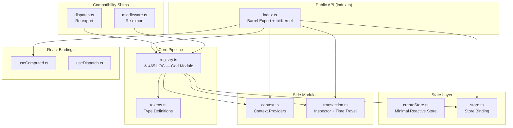
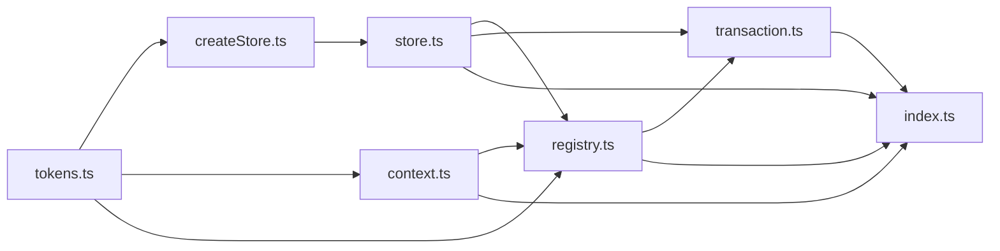

# [kernel] 파일별 책임 분석 (Responsibility Analysis)

**작성일**: 2026-02-09  
**대상**: `packages/kernel/src/` (11 files, ~900 LOC)

---

## 1. 아키텍처 개요



---

## 2. 파일별 상세 분석

### 핵심 파일 (Core)

| 파일 | LOC | 책임 | SRP 준수 |
|------|-----|------|----------|
| **registry.ts** | 465 | ⚠ **8가지 책임** (아래 상세) | ❌ 위반 |
| **tokens.ts** | 113 | 타입 정의 (Brand Types, Utility Types) | ✅ |
| **index.ts** | 92 | Barrel Export + `initKernel` + `resetKernel` | ✅ |

### 상태 레이어 (State)

| 파일 | LOC | 책임 | SRP 준수 |
|------|-----|------|----------|
| **createStore.ts** | 40 | 미니멀 반응형 스토어 (getState/setState/subscribe) | ✅ |
| **store.ts** | 58 | 커널 ↔ 스토어 바인딩 (bindStore/getState/resetState) | ✅ |

### 사이드 모듈 (Side)

| 파일 | LOC | 책임 | SRP 준수 |
|------|-----|------|----------|
| **context.ts** | 52 | Context Provider 등록/해석 | ✅ |
| **transaction.ts** | 137 | 트랜잭션 로그 + 타임트래블 + State Diff | ⚠ (2~3개) |

### 호환 Shim

| 파일 | LOC | 책임 | SRP 준수 |
|------|-----|------|----------|
| **dispatch.ts** | 9 | `registry.dispatch` Re-export | ✅ (삭제 후보) |
| **middleware.ts** | 12 | `registry.Middleware` Re-export | ✅ (삭제 후보) |

### React Bindings

| 파일 | LOC | 책임 | SRP 준수 |
|------|-----|------|----------|
| **useComputed.ts** | ~30 | `useSyncExternalStore` 기반 셀렉터 | ✅ |
| **useDispatch.ts** | ~15 | `dispatch` 래핑 훅 | ✅ |

---

## 3. `registry.ts` 책임 분해 (⚠ God Module)

**465 LOC에 8가지 책임이 혼재**:

| # | 책임 | 라인 범위 | 분리 가능? |
|---|------|----------|-----------|
| 1 | Internal Types | 33–54 | → `tokens.ts`로 이동 가능 |
| 2 | Registry Storage (Maps) | 56–67 | → 별도 `registries.ts` |
| 3 | `defineScope` + `state()` | 69–87 | → `tokens.ts` or `scope.ts` |
| 4 | `createKernel` (Entry Point) | 91–108 | 유지 |
| 5 | `createGroup` (Factory) | 112–243 | → `group.ts` |
| 6 | Middleware Registry | 249–265 | → `middleware.ts` (실제 구현) |
| 7 | `dispatch` + `processCommand` | 275–398 | → `dispatch.ts` (실제 구현) |
| 8 | `executeEffects` | 400–442 | → `effects.ts` |

### 분리 제안 (Proposed Split)

```
packages/kernel/src/
├── tokens.ts          (타입 + 브랜드)         ← 유지
├── createStore.ts     (스토어)                ← 유지
├── store.ts           (바인딩)                ← 유지
├── context.ts         (컨텍스트)              ← 유지
├── transaction.ts     (트랜잭션)              ← 유지
├── registry.ts        (Map 저장소 + 조회)     ← 축소 (~80 LOC)
├── group.ts           (createGroup Factory)   ← NEW
├── dispatch.ts        (dispatch + process)    ← 실제 구현으로 교체
├── effects.ts         (executeEffects)        ← NEW
├── middleware.ts      (register + apply)      ← 실제 구현으로 교체
├── kernel.ts          (createKernel entry)    ← NEW
└── index.ts           (barrel)                ← 유지
```

---

## 4. 의존성 흐름 (Dependency Flow)



> **순환 의존성**: 없음 ✅  
> **핵심 허브**: `registry.ts` (모든 모듈이 의존하거나 의존받음)

---

## 5. 결론

### 강점
- **타입 시스템** (`tokens.ts`): 깔끔한 브랜드 타입 + 유틸리티 타입 분리
- **상태 레이어** (`createStore.ts` + `store.ts`): 최소한의 책임, 0 의존성
- **컨텍스트** (`context.ts`): 단일 책임, 명확한 API

### 약점
- **`registry.ts` God Module**: 465 LOC, 8가지 책임. 리팩토링 1순위
- **Shim 파일** (`dispatch.ts`, `middleware.ts`): Re-export만 하는 파일. 소비자 마이그레이션 후 삭제 가능
- **`transaction.ts`**: StateDiff 계산 로직이 Inspector와 섞여 있음 (minor)

### 권장 액션
1. `registry.ts` → 5개 파일로 분리 (group, dispatch, effects, middleware, registries)
2. Shim 파일 삭제 후 `index.ts`에서 직접 export
3. `transaction.ts`에서 `computeChanges`를 별도 유틸로 분리 (optional)
