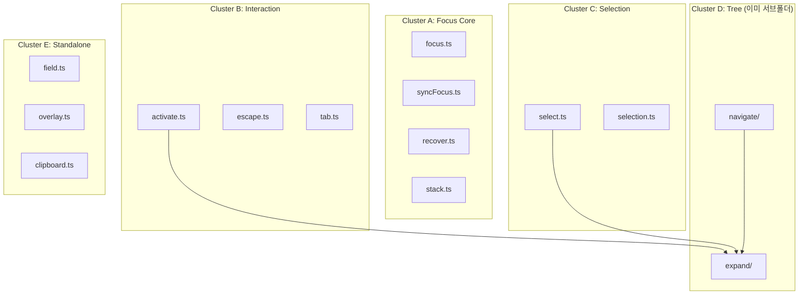

# 3-Commands 서브폴더 리팩토링 제안

| 항목 | 내용 |
|---|---|
| 원문 | `@3-commands`도 응집도 기준으로 서브폴더링 제안서 |
| 내(AI)가 추정한 의도 | 3-commands 내부 파일 21개가 flat하게 나열되어 있어 관심사별로 묶어 구조적으로 정리하고 싶다 |
| 날짜 | 2026-02-12 |
| 상태 | 제안 |

---

## 1. 개요

`os-new/3-commands/` 디렉토리는 현재 21개 파일(root 13 + navigate/ 6 + expand/ 2)로 구성되어 있다. `navigate/`와 `expand/`는 이미 서브폴더로 분리되어 있으나, **나머지 13개 root 파일은 flat하게 나열**되어 있다.

응집도 분석 결과 전체 cohesion 37% (63개 import 중 23개만 내부). 파일들 사이 import 패턴을 분석하면 **명확한 클러스터**가 보인다.

## 2. 분석

### 2.1 파일별 의존성 매트릭스

각 파일이 import하는 **외부 레이어**(../kernel, ../state, ../2-contexts, ../schema)와 **내부 cross-reference**를 정리:

| 파일 | kernel | state/utils | 2-contexts | schema | 내부 cross-ref |
|---|---|---|---|---|---|
| `focus.ts` | ✓ | ✓ | - | - | - |
| `syncFocus.ts` | ✓ | ✓ | - | - | - |
| `recover.ts` | ✓ | ✓ | DOM_ITEMS | - | - |
| `stack.ts` | ✓ | ✓ | - | - | - |
| `activate.ts` | ✓ | - | - | - | → expand |
| `escape.ts` | ✓ | ✓ | ZONE_CONFIG, ZoneRegistry | - | - |
| `tab.ts` | ✓ | ✓ | DOM_ITEMS, ZONE_CONFIG | - | - |
| `select.ts` | ✓ | ✓ | DOM_ITEMS, ZONE_CONFIG | - | → expand |
| `selection.ts` | ✓ | ✓ | - | - | - |
| `field.ts` | ✓ | - | - | - | - |
| `overlay.ts` | ✓ | - | - | OverlayEntry | - |
| `clipboard.ts` | ✓ | - | ZoneRegistry | - | - |
| `navigate/` | ✓ | ✓ | DOM_ITEMS,RECTS,CONFIG,Registry | FocusDirection, NavigateConfig | → expand |
| `expand/` | ✓ | ✓ | - | - | (자급자족) |

### 2.2 발견된 클러스터

import 패턴과 도메인 책임으로 **5개 클러스터**가 명확하게 드러난다:



### 2.3 클러스터 근거

| 클러스터 | 파일 수 | 공통점 | 응집 근거 |
|---|---|---|---|
| **A. Focus Core** | 4 | 모두 `state.os.focus` + `ensureZone` 사용. activeZoneId → zone → focusedItemId 패턴 동일. 외부 의존 없이 state만 변경. | 같은 state slice, 같은 util, 같은 패턴 |
| **B. Interaction** | 3 | 키보드 이벤트(Enter/Escape/Tab) 처리. 모두 Zone의 config나 registry를 참조. | 입력 이벤트 → 행동 결정 |
| **C. Selection** | 2 | 선택 상태(selection[], selectionAnchor) 전담. select는 키보드 트리거, selection은 프로그래틱 API. | 같은 state slice 전담 |
| **D. Tree** | 2 dirs | 이미 서브폴더. navigate ↔ expand 상호 참조. pure resolver 포함. | 유지 |
| **E. Standalone** | 3 | 각각 독립된 도메인 (필드 편집, 오버레이 스택, 클립보드). 서로 참조 없음. | 단일 책임, 2+파일이 되면 그때 폴더화 |

### 2.4 외부 소비자 분석

누가 `3-commands`를 import하는지도 구조 결정에 중요한 단서:

| 소비자 | import 대상 |
|---|---|
| `keymaps/osDefaults.ts` | ACTIVATE, ESCAPE, FIELD_*, NAVIGATE, SELECT, TAB |
| `1-listeners/FocusListener` | EXPAND, FOCUS, RECOVER, SELECT, SYNC_FOCUS |
| `1-listeners/ClipboardListener` | OS_COPY, OS_CUT, OS_PASTE |
| `6-components/FocusGroup` | FOCUS, STACK_POP, STACK_PUSH |
| `6-components/Trigger` | OVERLAY_OPEN, OVERLAY_CLOSE |
| `6-components/Dialog` | OVERLAY_CLOSE |
| `apps/todo/tests/TodoBot` | OS_COPY, OS_CUT, OS_PASTE |

> [!NOTE]
> 소비자들이 이미 **클러스터 단위**로 import하고 있다. keymaps는 Interaction 클러스터를, FocusListener는 Focus Core + Selection을, FocusGroup은 Focus Core를 가져온다.

---

## 3. 제안

### Option A: 서브폴더 분리 (권장)

```
3-commands/
├── focus/              ← Cluster A: Focus Core
│   ├── index.ts        (re-export)
│   ├── focus.ts
│   ├── syncFocus.ts
│   ├── recover.ts
│   └── stack.ts
├── interaction/        ← Cluster B: Interaction
│   ├── index.ts        (re-export)
│   ├── activate.ts
│   ├── escape.ts
│   └── tab.ts
├── selection/          ← Cluster C: Selection
│   ├── index.ts        (re-export)
│   ├── select.ts
│   └── selection.ts
├── navigate/           ← Cluster D (유지)
│   └── ...
├── expand/             ← Cluster D (유지)
│   └── ...
├── field.ts            ← Standalone (그대로)
├── overlay.ts          ← Standalone (그대로)
├── clipboard.ts        ← Standalone (그대로)
└── index.ts            ← barrel export
```

**장점:**
- 클러스터별 index.ts가 public API 역할 → 소비자는 `from "@os/3-commands/focus"`
- Standalone 파일 3개는 충분히 작으므로 폴더 없이 유지 (YAGNI)
- navigate/expand 기존 구조 그대로 보존

**단점:**
- 파일 이동 필요 → import 경로 업데이트 (영향 범위: keymaps, listeners, 6-components 약 8파일)

### Option B: 현상 유지 + index.ts 그루핑 주석

서브폴더를 만들지 않고 `index.ts`의 주석 그루핑만 유지. 현재 이미 이렇게 되어 있음:

```ts
// Activation
export { ACTIVATE } from "./activate";
export { ESCAPE } from "./escape";
// Focus
export { FOCUS } from "./focus";
// Navigation
...
```

**장점:** 변경 없음
**단점:** 21개 파일이 flat — 파일 탐색 시 인지 부하

### 추천: Option A

> [!IMPORTANT]
> 현재 root 파일 13개 중 상호 cross-reference는 `activate→expand`, `select→expand` 2건뿐이다. 이건 서브폴더 분리를 해도 import 경로가 `../expand`로 바뀌는 수준이라 부담이 없다.

---

## 자기 평가

- 점수: **B**
- Evidence: 21개 파일 전수 조사로 import 매트릭스를 정확히 작성했고, 외부 소비자 패턴까지 분석하여 클러스터 근거를 뒷받침했다. 다만 실제 이동 시 발생하는 import 경로 변경 diff를 구체적으로 제시하지 않았고, Option A 외의 대안(예: navigate+expand를 tree/로 합치는 방안)에 대한 분석이 부족하다.

---

**한줄요약:** `3-commands` 21개 파일을 import 패턴 기준으로 focus/interaction/selection 3개 서브폴더로 분리하면 응집도와 탐색성이 개선된다.
